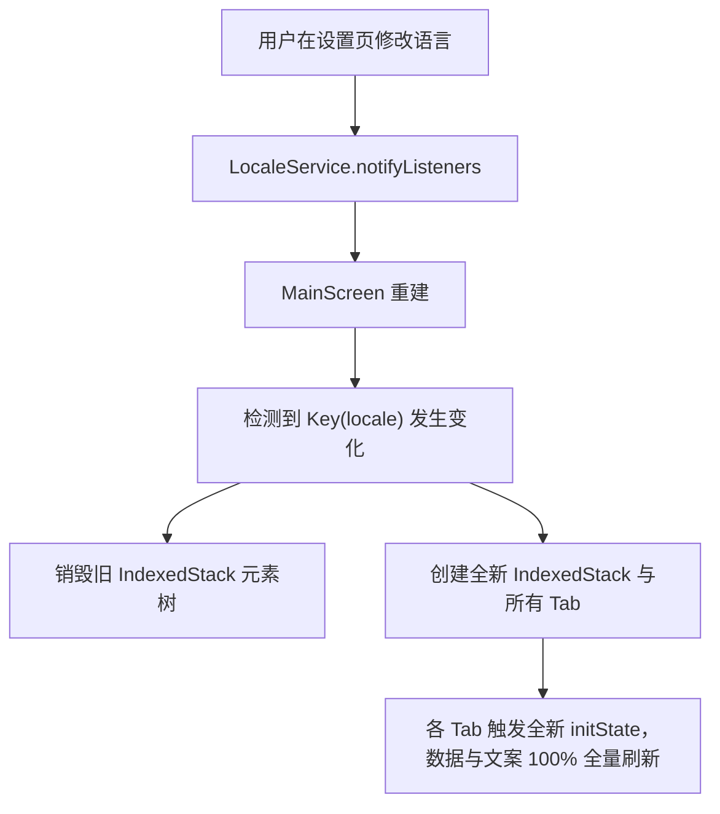
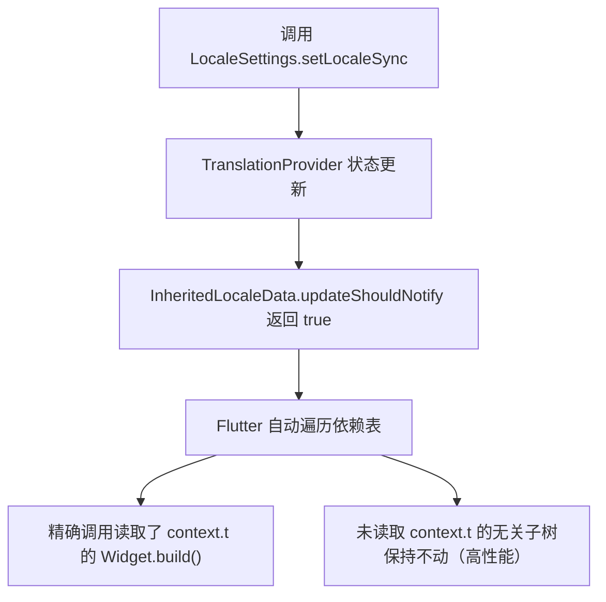

# Flutter i18n 响应式刷新与多语言状态管理架构指南

> 文档归档日期：2026-09-07  
> 适用技术栈：Flutter 3.x / Dart 3.x / slang / easy_localization / 状态管理

---

## 1. 背景与问题复盘

### 1.1 问题现象
在应用设置页由一种语言（如英文）切换至另一种语言（如中文）后，返回主页面时出现：
- **主页 Tab**：语言能实时更新；
- **每日挑战 Tab**：除 AppBar 标题更新外，页面内部的日期、关卡挑战横幅、按钮状态、连胜等所有内容均未更新；
- **图集 Tab**：除 AppBar 外，下方的图集卡片、操作状态、空态提示均未更新；
- **必须退后台再进或杀死重启后**，才能看到语言生效。

### 1.2 根因三层解构
1. **渲染树层面（const 阻断）**：
   在 `MainScreen` 的 `IndexedStack` 中，`DailyTabView` 和 `CollectionsTabView` 被声明为 `const DailyTabView()` 与 `const CollectionsTabView()`。Flutter 的元素树（Element Tree）对编译期常量采用指针缓存优化（`identical(oldWidget, newWidget) == true`）。当父组件 `MainScreen` 重建时，检测到子组件指针未变且其内部没有挂载到本次变化的 `InheritedWidget`，**强制跳过对该子组件 State 的 `build()` 执行**。
2. **国际化订阅层面（静态读取 vs 响应式依赖）**：
   代码全量使用了全局静态变量 `t.xxx`（slang Method A），没有使用 `context.t`（slang Method B）。静态 `t` 脱离了 Flutter 的 `BuildContext` 和 `InheritedWidget` 依赖收集网络，底层语言字典即使切换，Flutter 也无法感知哪些组件读取了该文案。
3. **数据层层面（静态内存缓存未失效）**：
   部分业务数据（如「我的」Tab 中的关卡目录与来源标签）在进入页面时被一次性读取并缓存在静态单例 `UnifiedCatalogIndex._cached` 中。国际化框架的通知机制通常只覆盖 UI Widget 树，管不到数据层的静态内存变量，导致缓存数据滞后。

---

## 2. slang 与 easy_localization 的底层机制对比

| 维度 | easy_localization | slang (Method A: 全局 `t`) | slang (Method B: `context.t`) |
| :--- | :--- | :--- | :--- |
| **核心机制** | 根级 `_EasyLocalizationProvider` (`InheritedWidget`) | 顶级静态 Getter：`LocaleSettings.instance.currentTranslations` | 根级 `TranslationProvider` (`InheritedWidget`) |
| **依赖收集** | 调用 `context.tr()` 或 `tr()` 时注入依赖 | **无依赖收集**（无 `BuildContext`） | 调用 `context.t` 时自动调用 `dependOnInheritedWidgetOfExactType` |
| **切换语言时的行为** | 触发根级或依赖节点的 rebuild | 静态数据更新，**但不会主动通知任何 Widget 重绘** | 自动通知所有读取过 `context.t` 的 Widget 执行 `build()` |
| **非 Widget 场景支持** | 较弱，后台 isolate 或纯模型中需繁琐桥接 | **极佳**，任何模型、工具类、无 context 处均可直接调用 | 必须通过全局实例辅助读取 |
| **零 Page 监听？** | 是（默认依赖上下文） | 否（若不用特殊方案，需页面手动感知） | **是（全自动响应式刷新，零 Listener）** |

---

## 3. 架构方案详解

针对想要达到类似 easy_localization 般“页面零注册（Zero Page Listener）”的效果，有以下两种不同层级的实现方案。

---

### 方案一：`ValueKey(locale)` 声明式容器级重建（最简单粗暴、零 Page 侵入）

#### 1. 原理说明
Flutter 的 Widget 树对比机制规定：**当同级节点的 `Key` 发生改变时，Flutter 认为旧节点已销毁，必须卸载旧 State 并挂载一个全新的 State 实例**。
利用这一机制，我们可以在主容器（如 `MainScreen` 的 `IndexedStack` 或外层 `Scaffold`）绑定语言 Key。语言发生变化时，整棵主页树直接热替换重建。



#### 2. 代码用法范例
在 `MainScreen`（或任何多 Tab 宿主页面）中：
```dart
class _MainScreenState extends State<MainScreen> {
  int _currentIndex = 0;

  @override
  Widget build(BuildContext context) {
    // 1. 监听语言变化 (可以通过 ListenableBuilder 或 AnimatedBuilder)
    return ListenableBuilder(
      listenable: LocaleService.instance,
      builder: (context, _) {
        final currentLocale = LocaleService.instance.effectiveLocale;

        return Scaffold(
          appBar: AppBar(title: Text(_appBarTitle(context))),
          body: IndexedStack(
            // 关键：将语言代码作为 Key 绑定到 IndexedStack 上
            key: ValueKey('main_stack_${currentLocale.name}'),
            index: _currentIndex,
            children: [
              HomeTabView(onSwitchToDaily: () => setState(() => _currentIndex = 1)),
              const DailyTabView(),       // 此时即使写 const 也会被完整重置
              const CollectionsTabView(), // 此时即使写 const 也会被完整重置
              MyCenterTabView(isActive: _currentIndex == 3),
            ],
          ),
          bottomNavigationBar: _GameBottomNav(...),
        );
      },
    );
  }
}
```

#### 3. 方案一评估
- **优势**：
  - **零 Page 侵入**：各 Tab 页面（`DailyTabView`、`CollectionsTabView` 等）**一个 listener 都不用写**，完全移除 `initState` / `dispose` 中的多语言监听代码。
  - **彻底清除脏缓存**：各 Tab 的 `initState()` 会被重新执行，私有列表变量（如 `_inProgressList` 等）会自然随初始化重走数据装配。
- **代价与边界**：
  - **局部临时状态重置**：由于是 State 级重建，各 Tab 临时的未持久化状态（例如 CustomScrollView 滚动到的具体 offset、未提交的输入框内容）会被重置回初始位置。

---

### 方案二：slang 原生响应式 `context.t`（官方推荐的标准最佳实践）

#### 1. 原理说明
利用 slang 已经生成的 `InheritedLocaleData`。在 `lib/l10n/gen/strings.g.dart` 中，生成器已为 `BuildContext` 拓展了快捷属性：
```dart
extension BuildContextTranslationsExtension on BuildContext {
  Translations get t => TranslationProvider.of(this).translations;
}
```
当你在任何 Widget 的 `build` 方法中调用 `context.t` 时，Flutter 就会在当前 Element 和上层的 `TranslationProvider` 之间登记依赖关系。
当调用 `LocaleSettings.setLocaleSync` 时，`TranslationProvider` 会触发依赖通知，**由 Flutter 自动将调用过 `context.t` 的 Widget 标记为 dirty 并触发下一帧重绘**。



#### 2. 代码用法范例
确保 `main.dart` 根部包裹了 `TranslationProvider`（目前工程已有），然后在 Widget 中将 `t.xxx` 替换为 `context.t.xxx`：

```dart
// 改造前：依赖全局静态变量，切换语言不通知
@override
Widget build(BuildContext context) {
  return Text(t.daily.todayTitle); 
}

// 改造后：响应式绑定，切换语言全自动刷新
@override
Widget build(BuildContext context) {
  return Text(context.t.daily.todayTitle); 
}
```

注意：必须同时将 `IndexedStack` 中的子组件 **去掉 `const`**：
```dart
// 错误：const 导致子树直接跳过
children: [
  const DailyTabView(),
]

// 正确：允许父组件更新时向子树传递更新机会
children: [
  DailyTabView(),
]
```

#### 3. 方案二评估
- **优势**：
  - **状态完美保留**：页面不会被重建（State 实例始终存活），滚动的 offset、输入状态、折叠展开状态丝毫不受影响，只有文字就地刷新。
  - **精细化渲染开销**：仅重绘包含文案的 Widget，渲染性能最高。
  - **代码整洁规范**：符合 Flutter 标准响应式设计理念，无需手动注销监听器，杜绝内存泄漏。
- **代价与边界**：
  - 必须有 `BuildContext`：在非 Widget 处（如异步加载函数、纯逻辑服务、静态数据类）无法直接用 `context.t`，仍需搭配 `t` 或回调处理。
  - 数据层缓存失效仍需配合：如果 State 内部把文案转存在了数据模型中（如 `List<PuzzleModel>`），单纯触发 `build()` 可能不足以更新模型字段，仍需配合数据更新。

---

## 4. 方案选型与演化指南

| 场景特点 | 推荐采用方案 | 理由 |
| :--- | :--- | :--- |
| **展示型 Tab/页面**（如每日挑战、图集列表、排行榜） | **方案二 (`context.t`)** | 纯 UI 渲染，只要改用 `context.t` 即可零 listener 实时响应，滚动位置完美保留。 |
| **混合复杂缓存的 Tab**（如「我的」中心，涉及静态统一目录+异步加载） | **方案一 (`ValueKey`) 或 方案二 + 监听失效** | 包含数据层私有状态缓存，语言切换时需重刷底层数据。 |
| **未来新页面开发** | **方案二 (`context.t`)** | 遵循最佳实践，养成使用 `context.t` 的习惯，避免写无谓的 `addListener`。 |

---

## 5. 开发避坑守则（黄金三原则）

1. **绝对不要在有动态国际化切换诉求的容器中使用 `const SubWidget()`**：
   `const` 修饰符会向 Flutter 传达“本子树及其依赖终身不可变”的信号，极易在 `IndexedStack`、`PageStorage` 中导致状态冻结。
2. **UI 展现层与数据实体层分离**：
   - 数据模型（Model）中尽量只存储原始字段或稳定标识（如枚举、ID）；
   - 展示文案应通过动态 Getter 推导（例如 `String get displayTitle => ...`），不要在构造函数中用 `t` 将多语言文案固化为死字符串字段。
3. **全局数据缓存必须提供失效通道**：
   任何类似 `UnifiedCatalogIndex` 的单例内存缓存，若其中含有本地化文案，必须在底层监听 `LocaleService` 或暴露 `invalidate()` 机制，确保数据源与 UI 层步调一致。
