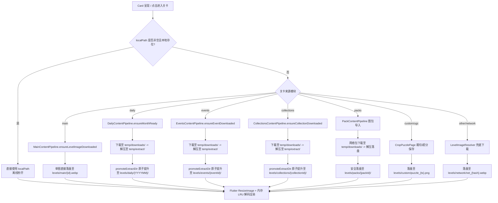

# JigsawFox 存储与目录结构规范文档

> **版本**：v1.1.0  
> **更新日期**：2026-09-12  
> **适用平台**：Windows / Android / iOS / macOS  
> **基准目录**：`getApplicationSupportDirectory()`

---

## 1. 设计背景与核心原则

在早期的开发迭代中，关卡图片、网络兜底缓存、解压图包及用户自制拼图散落在 `getApplicationDocumentsDirectory()`、`getApplicationSupportDirectory()` 以及各自定义子目录下（如 `network_levels`、`custom_puzzles` 等）。这种分散不仅使得文件清理与数据备份难以收敛，也容易引发跨平台沙盒路径与权限问题。此外，直接在正式关卡目录下进行流式下载与解压，也容易导致网络异常中断或强杀时遗留 `.part` 或未完成的临时目录碎片。

**统一收拢与隔离原则**：
1. **单一基准根目录**：应用所有非临时持久化文件（数据、关卡图片、缓存、日志等）一律存放在各平台的 **Application Support Directory** 内部，不再占用用户系统的 `Documents`（文档）目录。
2. **关卡原图统一收敛 (`levels/`)**：所有可玩的正式拼图关卡原图（主线、每日、活动、图集、扩展包、自制 UGC、网络懒加载）必须统一收敛在 `{appSupport}/levels/` 及其分类子目录下。
3. **暂存区绝对物理隔离 (`temp/`)**：所有网络整包下载中的临时流式文件（`*.zip`、`*.part`）与解压校验中的临时目录（`extract_*`）必须严格隔离在 `{appSupport}/temp/` 独立暂存区，严禁直接在 `levels/` 内产生临时碎片。只有在图片白名单校验通过后，方可通过同卷原子移动（`promoteExtractDir`）一次性提升入库。
4. **见缩略必可玩**：关卡图片在卡片展示或显式下载时一次性落盘，本地存在原图后驱动游戏玩法。缩略图采用 Flutter 框架级图片缓存体系（`ResizeImage` + `AppCachedImageProvider`）按需高效解码与下采样，避免在磁盘额外维护冗余脆弱的二级磁盘缓存。
5. **清晰的生命周期与红线防护**：
   - **红线 R1 严格守住**：禁止删除已下载完成的正式业务关卡资产。服务端内容下架（delisted）或禁用（disabled）仅在元数据中更新状态标记，绝不物理删盘，确保已下载内容永久离线可玩；
   - **运行时 0 GC 风险**：应用运行期间不执行全局物理文件扫描与清理，下载中的 `.part` 文件绝对安全；
   - **冷启动启动清理（Startup GC）与自愈**：在启动最早期单线程、零网络并发状态下清空 `temp/` 暂存区，并一并自愈扫描清理历史遗留在 `levels/` 下的 `temp_*` 和 `*.part` / `*.tmp` 遗留碎片。

---

## 2. 平台根路径映射

| 平台 | 物理路径规范 | 说明 |
| :--- | :--- | :--- |
| **Windows** | `C:\Users\<username>\AppData\Roaming\com.mcxiaoke\JigsawFox\` | 消费级事实标准应用支持目录 |
| **Android** | `/data/user/0/com.mcxiaoke.jigsawpuzzle/files/` | 内部私有存储目录（卸载自动清理） |
| **iOS / macOS** | `~/Library/Application Support/com.mcxiaoke.JigsawFox/` | 苹果标准应用支持沙盒 |

*下文统一用 `{appSupport}` 代表上述根路径。*

---

## 3. 完整目录拓扑结构树

```text
{appSupport}/
├── temp/                                  # 【下载与解压专用暂存区（冷启动全清）】
│   ├── downloads/                         # 在途流式下载临时文件与断点碎片 (*.part, *.zip)
│   │   ├── col_collection-001_1789207622920.zip.part
│   │   └── ...
│   └── extract/                           # 后台解压与格式完整性校验临时目录 (extract_*)
│       ├── extract_col_collection-001_1789207622920/ # 校验通过后同卷原子移动至 levels/
│       └── ...
│
├── levels/                                # 【关卡原图统一正式根目录（红线 R1 保护）】
│   ├── main/                              # 首页主线关卡原图
│   │   ├── main_101.webp
│   │   └── ...
│   ├── daily/                             # 每日挑战按月归档关卡
│   │   ├── 202608/                        # 月度子目录 (YYYYMM)
│   │   │   ├── 20260801.webp
│   │   │   └── ...
│   │   └── 202609/
│   │       └── ...
│   ├── events/                            # 活动专题整包解压关卡
│   │   ├── halloween2026/                 # 活动 ID 子目录
│   │   │   ├── 01.webp
│   │   │   └── ...
│   │   └── ...
│   ├── collections/                       # 官方主题图集解压关卡
│   │   ├── masterpieces_v1/               # 图集 ID 子目录
│   │   │   ├── 01.webp
│   │   │   └── ...
│   │   └── ...
│   ├── packs/                             # 用户导入的外部扩展图包
│   │   ├── pack_1787548651000_3a1b/       # 扩展包唯一 ID 目录
│   │   │   ├── pack.json                  # 图包元数据
│   │   │   ├── cover.webp                 # 封面图
│   │   │   ├── level_01.webp              # 关卡原图
│   │   │   └── ...
│   │   └── ...
│   ├── custom/                            # 用户自制 UGC 拼图原图
│   │   ├── puzzle_1787548651000.png       # 裁剪/超分后的拼图原图
│   │   └── ...
│   └── network/                           # 通用网络关卡懒下载兜底落地
│       ├── net_a1b2c3d4e5f60718.webp      # 按 URL FNV-1a 哈希命名
│       └── ...
│
├── download_cache/                        # 【用户素材箱临时下载与导入】
│   ├── img_1.jpg                          # 在线图片拾取器下载的原图
│   ├── mat_1787548651000.png              # 本地相册多选批量导入的原图
│   └── ...
│
├── hive_data/                             # 【Hive CE 嵌入式持久化数据】
│   ├── app-state-v1.hive                  # 应用全局状态 (引导、版本、标记)
│   ├── game-progress-v1.hive              # 关卡进度 (星级、用时、已拼步数)
│   ├── game-collections-v1.hive           # 自定义关卡元数据 (CustomPuzzleItem)
│   ├── favorites-v1.hive                  # 收藏夹列表
│   ├── economy-v1.hive                    # 虚拟经济 (金币、提示券)
│   ├── achievements-v1.hive               # 成就系统解锁状态
│   └── *.lock                             # 进程文件锁 (并发保护)
│
├── hive_backups/                          # 【数据写前快照自动备份】
│   ├── backup-2026-09-11T10-30-00/        # 轮替保留最近 3 份历史快照
│   └── ...
│
├── snapshots/                             # 【游戏中途盘面存档快照】
│   ├── snap_main_101_d25.json             # 未拼完盘面状态 (位置、吸附群组、旋转)
│   └── ...
│
├── logs/                                  # 【系统滚动运行日志】
│   ├── app_2026-09-11.log                 # 当日主日志
│   ├── app_2026-09-11_1.log               # 超过 2MB 轮转分卷
│   └── ...
│
├── inappwebview_env/                      # 【Windows WebView2 运行时环境数据】
├── webview_data/                          # 【WebView 网页缓存与 Cookie】
│
└── *_cache.json                           # 【根目录模块清单与索引缓存】
    ├── manifest_cache.json                # Root Manifest 远端同步缓存
    ├── main_levels_cache.json             # 首页主线关卡清单与版本信息
    ├── events_cache.json                  # 活动中心列表清单缓存
    ├── collections_cache.json             # 官方图集列表清单缓存
    ├── daily_index_cache.json             # 每日挑战月份 ZIP 与镜像映射缓存
    └── shared_preferences.json            # 简单设置项存储 (Windows desktop)
```

---

## 4. 各分类目录与负责模块详述

### 4.1 专用暂存区目录 (`temp/`)

所有涉及网络下载流式写入、临时压缩包与后台 Isolate 解压校验的临时文件，统一由 `TempStorageManager` 进行物理路径分配与全流程隔离，严禁直接在 `levels/` 下产生临时碎片：

| 子目录 | 负责类 / 规则来源 | 命名与文件格式 | 生命周期与安全机制 |
| :--- | :--- | :--- | :--- |
| `temp/downloads/` | `TempStorageManager`<br>`createTempDownloadPath` | `{module}_{id}_{ts}.zip`<br>流式写入中带 `.part` | **下载在途暂存区**。<br>• 仅用于 `httpClient.downloadFile` 流式写入；<br>• 下载成功并解压完毕后即刻物理删除；<br>• 若因强杀或网络超时中断，残留文件等待冷启动一次性清空。 |
| `temp/extract/` | `TempStorageManager`<br>`createTempExtractDir` | `extract_{module}_{id}_{ts}/`<br>解压后散装图片 | **解压校验暂存区**。<br>• Isolate 解压产物先在此落地；<br>• 执行格式正则白名单过滤与空包校验（`imageCount > 0`）；<br>• 校验合格后调用 `promoteExtractDir` 原子移入正式目录；若失败直接整体删除。 |

### 4.2 关卡原图目录 (`levels/`)

所有属于正式拼图关卡本体的高清原图，全部收敛在 `levels/` 的对应子目录中。整包模块均经由 `temp/` 暂存校验通过后，以微秒级同卷原子移动（`promoteExtractDir`）提升入库：

| 子目录 | 关卡来源类别 | 负责人 / 管线类 | 命名与文件格式 | 触发落盘时机 |
| :--- | :--- | :--- | :--- | :--- |
| `levels/main/` | 首页主线 | `MainContentPipeline` | `{canonicalId}.webp` (如 `main_101.webp`) | 首启预载前 N 关；玩家点击卡片时懒加载单图落地 |
| `levels/daily/` | 每日挑战 | `DailyContentPipeline` | `{YYYYMM}/{YYYYMMDD}.webp` | 按月经 `temp/` 下载校验后原子提升至正式月度目录 |
| `levels/events/` | 活动中心专题 | `EventsContentPipeline` | `{eventId}/{filename}.webp` | 经 `temp/` 整包下载解压校验后原子提升至活动 ID 目录 |
| `levels/collections/` | 官方精选图集 | `CollectionsContentPipeline` | `{collectionId}/{filename}.webp` | 经 `temp/` 整包下载解压校验后原子提升至图集 ID 目录 |
| `levels/packs/` | 用户扩展图包 | `PackContentPipeline` | `{packId}/{filename}.webp` | 网络图包经 `temp/downloads/` 下载后解压落盘；本地 ZIP 直接解压落盘 |
| `levels/custom/` | UGC 用户自制 | `CropPuzzlePage` / `GameRepository` | `puzzle_{timestamp}.png` | 玩家通过“素材箱”裁切或超分完成自制拼图时保存 |
| `levels/network/` | 通用网络兜底 | `LevelImageResolver` | `net_{urlHash}.{ext}` | 浏览无显式包体的网络卡片时（见缩略必可玩）懒下载单图落地 |

### 4.3 素材箱目录 (`download_cache/`) 与图片缓存体系

| 目录 / 机制 | 负责类 | 格式与生命周期 | 作用与清理策略 |
| :--- | :--- | :--- | :--- |
| `download_cache/` | `DownloadManager` | `img_{id}.jpg`<br>`mat_{id}.png` | **素材箱专属目录**。<br>• 用户在线搜索下载或相册批量导入的高清壁纸/素材；<br>• 未被制作成关卡时在此驻留；<br>• 用户可在“我的”页面素材抽屉中点击「清空素材箱」进行物理删除。 |
| **Flutter 原生内存图片缓存体系**<br>*(无额外磁盘目录)* | `AppCachedImageProvider`<br>`ResizeImage`<br>`imageCache` | 纯内存位图<br>按卡片尺寸阶梯下采样 | **取代原二级磁盘缩略图目录**。<br>• 旧版独立的 `thumbnail_cache/` 磁盘目录与 `ImageCacheManager` 已彻底废弃移除，杜绝磁盘碎片与冗余写入；<br>• 由 Flutter 原生图片缓存统一管理，在解码期利用 `ResizeImage` 按卡片大小进行高效下采样并驻留内存 LRU；<br>• 本地原图已存在时直读本地文件解码，兼具秒开性能与零磁盘垃圾。 |

### 4.4 数据与备份目录

| 目录 | 负责类 | 作用与安全保障机制 |
| :--- | :--- | :--- |
| `hive_data/` | `StorageManager` | 生产级 Hive CE 嵌入式键值数据库，存放成就、收藏、金币、已拼关卡记录与进度等。使用独立 `.lock` 保护并发写入。 |
| `hive_backups/` | `StorageManager` | 每次核心数据写入前对 `hive_data/` 执行快照备份，采用原子临时目录创建并重命名，自动轮替保留最新 3 份历史快照，防闪退损坏。 |
| `snapshots/` | `SnapshotStore` | 拼图过程中途退出的盘面状态恢复存档（JSON 格式）。恢复并拼通关或主动放弃时由系统自动删除。 |

### 4.5 诊断与运行时环境

| 目录 / 文件 | 负责类 | 作用与生命周期 |
| :--- | :--- | :--- |
| `logs/` | `AppLogger` | 应用运行时诊断日志。单文件达到 2MB 时触发分卷滚动（`_1.log`），按天切换并自动清理 7 天以前的过期日志。 |
| `inappwebview_env/` | `WebViewService` | Windows 平台 Microsoft Edge WebView2 环境缓存与运行时独立隔离沙盒。 |
| `webview_data/` | `WebViewService` | WebView 网页缓存与 Cookie。 |
| `*_cache.json` | 各 Content Pipeline | 存放元数据清单、ETag 及版本号。包含 `manifest_cache.json`、`main_levels_cache.json`、`events_cache.json`、`collections_cache.json`、`daily_index_cache.json`（每日挑战月份 ZIP 索引）。离线秒级拉起，在线轻量比对。 |

---

## 5. 生命周期与操作清理矩阵

| 触发操作 | 作用目标与清理规则 | 受保护（绝对保留）项目 | 备注与机制 |
| :--- | :--- | :--- | :--- |
| **冷启动启动清理<br>(Startup GC & Self-Healing)** | • 清空整个 `temp/` 暂存区（清理残留的 `temp/downloads/` 与 `temp/extract/`）；<br>• 扫描 `levels/` 下 5 个业务子目录，自愈删除历史遗留的 `temp_*` 和 `*.part` / `*.tmp` 遗留碎片。 | • `levels/` 下的所有正式关卡原图（**红线 R1**）<br>• `download_cache/` 素材箱原图<br>• `hive_data/` 用户游戏进度 | 在 `ContentManager.initialize()` 启动最早期、前后台尚未发起任何网络请求时执行。零网络并发竞态，100% 安全。 |
| **素材箱：一键清空素材** | • 清空 `download_cache/` 物理素材原图 | • 已制作完成的 `levels/custom/` 自制拼图关卡<br>• 所有官方与扩展关卡 | 用户在“我的”页面素材箱抽屉显式点击触发。 |
| **用户删除扩展包** | • 物理删除对应 `levels/packs/{packId}/` 整个目录<br>• 清除图包清单索引并广播通知 UI | • 其他已导入的扩展图包<br>• 所有官方关卡 | 用户在图包管理界面显式点击删除触发。 |
| **服务端活动 / 图集下架同步<br>(Delist Sync)** | • 当服务端同步判定某活动或图集被下架（delisted）或禁用（disabled）时，**仅在内存与清单缓存中更新标记，绝不删除本地磁盘已下载内容** | • **所有已下载的 `levels/events/{id}/` 与 `levels/collections/{id}/` 关卡资产** | **严格遵循红线 R1**。旧文档中关于“Auto-GC 自动物理删除 disabled 活动”的描述已被废除并修正。已下载内容玩家永久可玩。 |
| **底层开发与测试重置<br>(GameRepository.resetAllData)** | • 清空所有 `hive_data/` 数据库<br>• 清空 `snapshots/` 盘面存档<br>• 清空 `download_cache/` 素材箱<br>• 重新注入 Starter 资产（金币 100 / 券 5） | • `levels/` 下所有已就绪的官方关卡原图（避免重连网络大流量重复下载）<br>• 用户设置项（SharedPreferences 保留） | **仅供底层自动化测试使用**。根据架构决策，应用内设置页已彻底移除重置按钮，系统清理统一由系统级“清除数据”或重装管理。 |

---

## 6. 核心消费与加载路由规范

为了确保“见缩略必可玩”以及离线可用性，上层卡片与游戏引擎使用统一的路径解析与落盘提升流：



---

## 7. 维护与开发准则

1. **单一根目录铁律**：严禁向系统的 `getApplicationDocumentsDirectory()` 写入游戏私有资源，所有应用数据严格收敛于 `getApplicationSupportDirectory()`；
2. **关卡原图统一收敛**：所有新建管线或新增关卡类型，均应在 `levels/` 下新增具名子目录（如 `levels/<module_name>/`）；
3. **暂存隔离与原子提升规范**：
   - 凡涉及网络整包 ZIP 下载与解压的业务模块，**必须通过 `TempStorageManager`** 获取 `temp/downloads/` 下带时间戳的独立下载路径以及 `temp/extract/` 下的独立解压目录；
   - **严禁直接在 `levels/` 及其子目录下创建 `temp_`、`*.part` 或临时文件**；
   - 解压后必须进行格式白名单匹配与有效图片数量校验（`imageCount > 0`），校验通过后调用 `promoteExtractDir` 原子移入正式业务目录。
4. **红线 R1 数据绝对保留**：严禁在运行时代码中自发物理删除已就绪的正式关卡资产；服务端下架（delisted）或禁用（disabled）仅能更新内存与缓存中的状态字段，保留本地离线游玩权；
5. **测试环境沙盒隔离**：测试代码在模拟沙盒环境时，统一在测试临时目录下建立 `support/...` 结构进行测试与断言，禁止直接向真实用户应用支持目录写测试垃圾。
