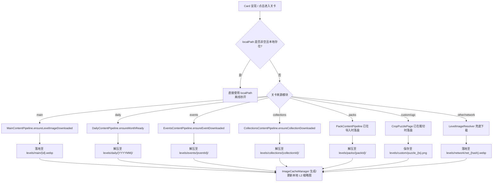

# JigsawFox 存储与目录结构规范文档

> **版本**：v1.0.0  
> **更新日期**：2026-09-11  
> **适用平台**：Windows / Android / iOS / macOS  
> **基准目录**：`getApplicationSupportDirectory()`

---

## 1. 设计背景与核心原则

在早期的开发迭代中，关卡图片、网络兜底缓存、解压图包及用户自制拼图散落在 `getApplicationDocumentsDirectory()`、`getApplicationSupportDirectory()` 以及各自定义子目录下（如 `network_levels`、`custom_puzzles` 等）。这种分散不仅使得文件清理与数据备份难以收敛，也容易引发跨平台沙盒路径与权限问题。

**统一收拢原则**：
1. **单一基准根目录**：应用所有非临时持久化文件（数据、关卡图片、缓存、日志等）一律存放在各平台的 **Application Support Directory** 内部，不再占用用户系统的 `Documents`（文档）目录。
2. **关卡原图统一收敛 (`levels/`)**：所有可玩的拼图关卡原图（主线、每日、活动、图集、扩展包、自制 UGC、网络懒加载）必须统一收敛在 `{appSupport}/levels/` 及其分类子目录下。
3. **见缩略必可玩**：关卡图片在卡片展示或显式下载时一次性落盘，本地存在原图后驱动游戏玩法与本地 L2 缩略图生成，离线状态下完全闭环。
4. **清晰的生命周期与清理边界**：各目录归属明确，设置页的“清理缓存”、“重置游戏数据”以及“活动 Auto-GC”拥有清晰、安全的作用范围，绝不误删用户数据与核心资产。

---

## 2. 平台根路径映射

| 平台 | 物理路径规范 | 说明 |
| :--- | :--- | :--- |
| **Windows** | `C:\Users\<username>\AppData\Roaming\com.mcxiaoke\JigsawFox\` | 消费级事实标准应用支持目录 |
| **Android** | `/data/user/0/com.mcxiaoke.jigsawpuzzle/files/` | 内部私有存储目录（卸载自动清理） |
| **iOS / macOS** | `~/Library/Application Support/com.mcxiaoke.JigsawFox/` | 苹果标准应用支持沙盒 |

*下文统一用 `{appSupport}` 代表上述根路径。*

---

## 3. 完整目录拓扑结构树

```text
{appSupport}/
├── levels/                                # 【关卡原图统一根目录】
│   ├── main/                              # 首页主线关卡原图
│   │   ├── main_101.webp
│   │   └── ...
│   ├── daily/                             # 每日挑战按月归档关卡
│   │   ├── 202608/                        # 月度子目录 (YYYYMM)
│   │   │   ├── 20260801.webp
│   │   │   └── ...
│   │   └── 202609/
│   │       └── ...
│   ├── events/                            # 活动专题整包解压关卡
│   │   ├── halloween2026/                 # 活动 ID 子目录
│   │   │   ├── 01.webp
│   │   │   └── ...
│   │   └── ...
│   ├── collections/                       # 官方主题图集解压关卡
│   │   ├── masterpieces_v1/               # 图集 ID 子目录
│   │   │   ├── 01.webp
│   │   │   └── ...
│   │   └── ...
│   ├── packs/                             # 用户导入的外部扩展图包
│   │   ├── pack_1787548651000_3a1b/       # 扩展包唯一 ID 目录
│   │   │   ├── pack.json                  # 图包元数据
│   │   │   ├── cover.webp                 # 封面图
│   │   │   ├── level_01.webp              # 关卡原图
│   │   │   └── ...
│   │   └── ...
│   ├── custom/                            # 用户自制 UGC 拼图原图
│   │   ├── puzzle_1787548651000.png       # 裁剪/超分后的拼图原图
│   │   └── ...
│   └── network/                           # 通用网络关卡懒下载兜底落地
│       ├── net_a1b2c3d4e5f60718.webp      # 按 URL FNV-1a 哈希命名
│       └── ...
│
├── thumbnail_cache/                       # 【L2 缩略图磁盘缓存】
│   ├── thumb_0a1b2c3d4e5f6789.jpg         # 720/360 解码期降采样缩略图
│   └── ...
│
├── download_cache/                        # 【用户素材箱临时下载与导入】
│   ├── img_1.jpg                          # 在线图片拾取器下载的原图
│   ├── mat_1787548651000.png              # 本地相册多选批量导入的原图
│   └── ...
│
├── hive_data/                             # 【Hive CE 嵌入式持久化数据】
│   ├── app-state-v1.hive                  # 应用全局状态 (引导、版本、标记)
│   ├── game-progress-v1.hive              # 关卡进度 (星级、用时、已拼步数)
│   ├── game-collections-v1.hive           # 自定义关卡元数据 (CustomPuzzleItem)
│   ├── favorites-v1.hive                  # 收藏夹列表
│   ├── economy-v1.hive                    # 虚拟经济 (金币、提示券)
│   ├── achievements-v1.hive               # 成就系统解锁状态
│   └── *.lock                             # 进程文件锁 (并发保护)
│
├── hive_backups/                          # 【数据写前快照自动备份】
│   ├── backup-2026-09-11T10-30-00/        # 轮替保留最近 3 份历史快照
│   └── ...
│
├── snapshots/                             # 【游戏中途盘面存档快照】
│   ├── snap_main_101_d25.json             # 未拼完盘面状态 (位置、吸附群组、旋转)
│   └── ...
│
├── logs/                                  # 【系统滚动运行日志】
│   ├── app_2026-09-11.log                 # 当日主日志
│   ├── app_2026-09-11_1.log               # 超过 2MB 轮转分卷
│   └── ...
│
├── inappwebview_env/                      # 【Windows WebView2 运行时环境数据】
├── webview_data/                          # 【WebView 网页缓存与 Cookie】
│
└── *_cache.json                           # 【根目录模块清单与索引缓存】
    ├── manifest_cache.json                # Root Manifest 远端同步缓存
    ├── main_levels_cache.json             # 首页主线关卡清单与版本信息
    ├── events_cache.json                  # 活动中心列表清单缓存
    ├── collections_cache.json             # 官方图集列表清单缓存
    └── shared_preferences.json            # 简单设置项存储 (Windows desktop)
```

---

## 4. 各分类目录与负责模块详述

### 4.1 关卡原图目录 (`levels/`)

所有属于拼图关卡本体的完整图片资产，全部存放在 `levels/` 的对应子目录中：

| 子目录 | 关卡来源类别 | 负责人 / 管线类 | 命名与文件格式 | 触发落盘时机 |
| :--- | :--- | :--- | :--- | :--- |
| `levels/main/` | 首页主线 | `MainContentPipeline` | `{canonicalId}.webp` (如 `main_101.webp`) | 首启预载前 N 关；玩家点击卡片时懒加载下载 |
| `levels/daily/` | 每日挑战 | `DailyContentPipeline` | `{YYYYMM}/{YYYYMMDD}.webp` | 按月下载 ZIP 成功后 Isolate 解压落盘 |
| `levels/events/` | 活动中心专题 | `EventsContentPipeline` | `{eventId}/{filename}.webp` | 点击进入活动时下载 ZIP 并解压落盘 |
| `levels/collections/` | 官方精选图集 | `CollectionsContentPipeline` | `{collectionId}/{filename}.webp` | 玩家解锁/下载图集时下载 ZIP 并解压落盘 |
| `levels/packs/` | 用户扩展图包 | `PackContentPipeline` | `{packId}/{filename}.webp` | 玩家从本地选择 ZIP 或网络 URL 导入图包时解压落盘 |
| `levels/custom/` | UGC 用户自制 | `CropPuzzlePage` / `GameRepository` | `puzzle_{timestamp}.png` | 玩家通过“素材箱”裁切或超分完成自制拼图时保存 |
| `levels/network/` | 通用网络兜底 | `LevelImageResolver` | `net_{urlHash}.{ext}` | 浏览无显式包体的网络卡片时（见缩略必可玩）懒下载 |

### 4.2 缓存与素材目录

| 目录 | 负责类 | 格式与生命周期 | 作用与清理策略 |
| :--- | :--- | :--- | :--- |
| `thumbnail_cache/` | `ImageCacheManager` | `thumb_{hash}.jpg`<br>质量 85%，最大边 720/360 | **L2 缩略图磁盘缓存**。<br>• 内存索引加速，启动时异步恢复。<br>• 受 500MB 高水位限制，超标触发 LRU 自动清理。<br>• 用户可在设置页点击「清理缓存」主动全额清空。 |
| `download_cache/` | `DownloadManager` | `img_{id}.jpg`<br>`mat_{id}.png` | **素材箱专属目录**。<br>• 用户在线搜索下载或相册批量导入的高清壁纸/素材。<br>• 未被制作成关卡时仅在此驻留。<br>• 用户可在素材抽屉中点击「清空素材箱」进行物理删除。 |

### 4.3 数据与备份目录

| 目录 | 负责类 | 作用与安全保障机制 |
| :--- | :--- | :--- |
| `hive_data/` | `StorageManager` | 生产级 Hive CE 键值数据库存储，存放所有游戏成就、收藏、金币、已过关卡步数与时间等。使用独立 `.lock` 保护并发写入。 |
| `hive_backups/` | `StorageManager` | 每次核心数据写入前先对 `hive_data/` 执行快照备份，采用原子临时目录创建并重命名，自动轮替保留最新 3 份历史快照，防闪退损坏。 |
| `snapshots/` | `SnapshotStore` | 拼图过程中途退出的盘面状态恢复存档（JSON 格式）。恢复并拼通关或主动放弃时由系统自动删除。 |

### 4.4 诊断与运行时环境

| 目录 | 负责类 | 作用与生命周期 |
| :--- | :--- | :--- |
| `logs/` | `AppLogger` | 应用运行时诊断日志。单文件达到 2MB 时触发分卷滚动（`_1.log`），按天切换并自动清理 7 天以前的过期日志。 |
| `inappwebview_env/` | `WebViewService` | Windows 平台 Microsoft Edge WebView2 环境缓存与运行时独立隔离沙盒。 |
| `*_cache.json` | 各 Content Pipeline | 存放元数据清单、ETag 及版本号。离线秒级拉起，在线轻量比对。 |

---

## 5. 生命周期与操作清理矩阵

| 触发操作 | 作用目标与清理规则 | 受保护（绝对保留）项目 |
| :--- | :--- | :--- |
| **设置页：清理图片缓存** | • 清空 `thumbnail_cache/`（缩略图全清）<br>• 重置内存 LRU 队列 | • `levels/` 下的所有关卡原图<br>• `download_cache/` 素材箱原图<br>• `hive_data/` 用户游戏进度 |
| **素材箱：一键清空素材** | • 清空 `download_cache/` 物理原图<br>• 级联移除其对应在 `thumbnail_cache/` 的缩略图 | • 已制作完成的 `levels/custom/` 自制拼图关卡<br>• 所有官方关卡 |
| **活动自动 GC (Auto-GC)** | • 当服务端同步判定某活动已被标记为 disabled 时，自动物理删除对应 `levels/events/{eventId}/` | • 处于 active 状态的有效活动<br>• 其他模块资产 |
| **用户删除扩展包** | • 物理删除对应 `levels/packs/{packId}/` 整个目录<br>• 清除图包清单索引并广播通知 UI | • 其他已导入的扩展图包 |
| **设置页：重置所有数据** | • 清空所有 `hive_data/` 用户存档并重置金币/成就<br>• 清空 `download_cache/` 素材箱<br>• 清空 `snapshots/` 盘面存档 | • `levels/main/`、`levels/daily/` 等已就绪的官方关卡原图（避免用户重连网络大流量重复下载） |

---

## 6. 核心消费与加载路由规范

为了确保“见缩略必可玩”以及离线可用性，上层卡片与游戏引擎使用统一的路径解析流：



---

## 7. 维护指南

1. **禁止向 `getApplicationDocumentsDirectory()` 写入游戏私有资源**；
2. **所有新建管线或新增关卡类型**，均应在 `levels/` 下新增具名子目录（如 `levels/<module_name>/`）；
3. **测试代码**在模拟沙盒环境时，统一在沙盒根目录下建立 `support/levels/...` 结构进行断言，禁止直接向真实用户目录写测试垃圾。
