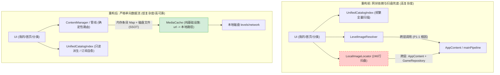

# 架构债务消除与系统简化重构方案 v2（2026-09-12）

> 日期：2026-09-12（GMT+8）
> 目标：承接 `docs/code-review-and-fix-plan-20260912.md` §7（架构债务溯源与后续重构路线），在 v1（`docs/architecture-debt-refactor-roadmap-20260912.md`）基础上**按实际代码逐条核验后修订**，给出高可靠、低复杂度、以做减法为主的渐进式落地方案。
> 状态：规划 / 待实施
> 替代关系：本文件替代 v1。v1 的四大抓手方向保留，但 Step 划分、前置条件、验收指标已按代码实况重写；v1 保留原样不予修改，以便对照。

---

## 〇、v2 修订说明（相对 v1 的关键修正）

v1 中以下论断经逐条对照源码后**不成立或严重低估**，v2 已修正。每条均附代码证据。

| # | v1 表述 | 代码实况 | 修正 |
|---|---|---|---|
| 1 | 「现有 `contentUpdateNotifier` 已完成各管线通知的 microtask 聚合」 | `app_content.dart:154-156` **只挂 events / collections / pack 三条**；`mainPipeline`、`dailyPipeline` 既无 updateNotifier 也未挂载；main/daily 仅靠 `syncAll` 成功后手动 bump（`:301`、`:317`），游戏内单关懒下载（`ensureLevelImageDownloaded`）**不 bump** | 列为 Step 3 的**硬前置**：先补 main/daily 信号源 |
| 2 | 页面只需监听 `contentUpdateNotifier` 即可自愈 | 实际有 **3 类** 置脏信号源，其中 2 类不走该 notifier：UGC 增删走 `GameRepository.customPuzzlesNotifier`（`my_center_tab_view.dart:71-73`）、Locale 切换走 `LocaleService`（`catalog_index.dart:66-71` + 页面 `:75/79`） | 新增「索引信号源清单」作为 Step 3 的交付物 |
| 3 | `_reloadSeq` 属 P2-1，可随 Index 代次一并退场 | `_reloadSeq` 是**页面装配级**并发保护：`_loadAllData` 在 `current()` 之后还有 2 个 await（`:128`、`:130`），且进度/收藏变化会经 300ms debounce 再次触发 `_loadAllData`，两个装配流程可交错 | `_reloadSeq` **保留**，或在 `_loadAllData` 上做串行化；不得直接删除 |
| 4 | 在 `ContentManager` 加 `resolveLevel` 即可 O(1) 路由 | 示例调用的 6 个方法**全部不存在**（`getLevelById` / `getLevel`×3 / `getLevelByDate` / `getCustomPuzzleLevel`）；现有 4 个取列表方法全是 `listSync()` 扫盘 | 卖点改为**确定性路由**；Step 2 显式列出需新增的方法与「内存索引 vs 每次扫盘」的取舍 |
| 5 | 删除 resolver 的 main 分支即可解耦 | 4 个真实调用方（`home_tab_view:142`、`event_levels_page:146`、`collection_levels_page:131`、`lazy_level_image:87`），其中 home 走 main 关卡，当前依赖 resolver 内部 `ensureMainLevelDownloaded` 完成**下载 + 回灌 `_levelsMap` + fileSizeBytes 校验（P0-6 防线）**；resolver 的 main-cache probe（`:184-199`）正是为防 `levels/main/` 与 `levels/network/` 双副本 | Step 1 增加**调用方迁移表**，先定 main 下载出口 |
| 6 | 可彻底废弃 `'default_level'` | `puzzle_state.dart:210` 的 `fromJson` 兼容链是**历史快照读取路径**，`game_page.dart:399-402` 注释明确按红线 R2 保留；`puzzle_engine.dart:34` 是引擎层兜底 | 区分**写路径去默认**与**读路径兼容保留**，不可一刀切 |
| 7 | `JigsawPuzzleGame` 的 canonicalId「设为必传」 | 该构造函数**根本没有 canonicalId 参数**（`jigsaw_puzzle_game.dart:97-112`）；`exportSnapshotJson`（`:2142`）经 `_boardState.toJson()` 输出，而 `PuzzleBoardState.toJson` 已写 `effectiveCanonicalId`（`puzzle_state.dart:380`） | 措辞改为「**新增**必传参数」；改造面为引擎构造 + 默认值 + 快照注入 + 读兼容四层 |
| 8 | 「我的」页 P0-5 fallback「收敛为 2 级」 | 实为「主链路 4 级（本地 → URL 缓存 → 单飞下载 → 失败 Toast）」+「孤儿链路 2 级」。且删除 Locator 后孤儿链路回落 `_resolveImageBytes`，其内部**含 URL 下载** | 明确「收敛」指的是**去掉模糊扫盘**，不是去掉网络下载 |
| 9 | `local_image_locator.dart` 247 行 | 实为 **246 行** | 修正 |
| 10 | 测试基线「348 项全绿」 | `docs/CHANGES-20260912.md` 记录 348 通过 / 8 跳过；`code-review-and-fix-plan` 记录 342 条（332/8/2）；`grep -c "test("` 口径另计 | 统一口径为「以 `flutter test` 实跑输出为准」，文档不写死数字 |

**v1 中核对属实、v2 完全保留的部分**：P1-1 双重守卫确实存在（`level_image_resolver.dart:205-207`）且管线侧有防呆（`main_content_pipeline.dart:414-422`）；管线 `_levelsMap` 全仓库无删除调用，SSOT 论断成立；`contentUpdateNotifier` 的 microtask 聚合机制本身已正确实现（`app_content.dart:159-166`）；Index 的 Single-Flight（`:56`）与失效代次（`:61`）机制已落地，保留判断成立；`atomic_replace.dart` 已是唯一写盘入口。

---

## 一、背景与核心理念：做减法而非做加法

### 1.1 现状复盘
在 `docs/code-review-and-fix-plan-20260912.md` 的 P0~P3 修复中，系统成功落地了设计红线 R1~R5（不误删数据、孤儿卡可玩、不静默卡死）。但为了「止血」，引入了若干**过渡性防御补丁**（详见原计划 §7.3）：

- **`LocalImageLocator`（246 行）**：按 canonicalId 前缀遍历各管线目录、`GameRepository` 进行扫盘，是 `lib/logic/cache/` 下两处跨层 import 之一（`:6`）。
- **P1-1 双重守卫 + 管线内侧防呆**：只为防御 `LevelImageResolver` 误调 `mainPipeline` 导致的数据污染。
- **P0-3 页面级 `invalidate()`**：每次进入「我的」Tab 强制废弃并全量重建索引，继而引发 Single-Flight、构建代次比对、防旧数据覆盖代次（P2-1）等一整串防御补丁。

### 1.2 警惕「过度设计」带来的新复杂度
1. **SSOT 不等于「再建一个全局本地资产数据库」**：在 SQLite/Hive 中额外搞一套中心化本地资产表，会引入双写一致性、版本迁移、性能损耗，对单机客户端复杂度过高。
2. **事件流不等于「引入重量级 Stream/EventBus 框架」**：容易引入生命周期泄漏与时序调试困难。
3. **重构核心原则**：
   - **做减法**：删代码多于写代码，用**清晰单向契约**消除防御补丁；
   - **职责纯粹**：基础设施（下载/缓存）与业务领域（关卡元数据/管线）彻底解耦；
   - **平滑演进**：分步落地，步步可测，不搞大爆炸式重写；
   - **新增即新增**：**任何「新增」的方法、索引、参数都必须显式登记在工作量中**，不得表述为「补齐」或「接线」而掩盖成本。

---

## 二、架构目标与依赖拓扑

### 2.1 依赖关系对比



> v1 图中把 `LocalImageLocator` 画成「跨层依赖 5 条管线 / Resolver」，**实为夸大**：其 import 仅 `app_content.dart`、`data/game_repository.dart`、`level_image_resolver.dart`、`canonical_id.dart` 等（`local_image_locator.dart:1-9`），未直接 import 任何单条 pipeline 文件。真实跨层点只有 **2 处** `import app_content.dart`：`level_image_resolver.dart:6`、`local_image_locator.dart:6`。

### 2.2 核心重构目标
1. **跨层调用归零**：`lib/logic/cache/**` 彻底不 import 业务管线与 `AppContent`。
2. **技术债退场**：删除 `LocalImageLocator`（净减 246 行），消除 P1-1 双重守卫与 P0-5 孤儿卡模糊扫盘。
3. **SSOT 收敛**：管线内存 Map + 文件系统即为权威来源，通过 `CanonicalId` 契约提供**确定性路由**（见 §3.2 对「O(1)」的措辞修正）。
4. **单向通知闭环**：管线变更由 `AppContent` 聚合通知索引置脏，UI 纯只读消费，移除页面手动 `invalidate`。

---

## 三、四大核心抓手（详细技术方案）

### 抓手 1：净化媒体缓存器（解耦病灶 1，消除 P1-1，指标 1 归零）

#### 现存问题
`level_image_resolver.dart:6` 引入 `import '.../content/app_content.dart'`，在 `resolveLevelLocalPath`（`:167-252`）内：
- **main-cache probe**（`:184-199`）：查 `AppContent.instance.manager.mainPipeline.levels` 避免与 `levels/main/` 重复落盘；
- **P1-1 双重守卫**（`:205-207`）`isMainLevel = sourceModule == prefixMain && id.startsWith('main:')`；
- 命中后 `await AppContent.instance.manager.ensureMainLevelDownloaded(level)`（`:208-226`），失败回落通用目录。

#### 重构方案
1. **职责回归纯粹**：`LevelImageResolver` 退化为通用 `ContentMediaCache`（或就地保留名称）：
   - **输入**：只有 `String url`；**输出**：`Future<String> localPath`（单飞下载、URL Hash 命名、原子替换落盘 `levels/network/`）；
   - **移除**：`resolveLevelLocalPath` 的 main 分支与 main-cache probe；移除对 `AppContent` 的 import。
2. **业务管线自主管理**：`MainContentPipeline` 需要网络关卡原图时，自行调用 `LevelImageResolver.instance.resolveUrlLocalPath(url)`，落盘后自行维护 `_levelsMap[id].localPath`。
3. **退场与简化**：
   - 移除 P1-1 双重守卫与 `main_content_pipeline.dart:414-422` 的入口防呆；
   - `lib/logic/cache/` 对 `app_content.dart` 的跨层 import 归零。

#### ⚠️ 连带问题（v1 缺失，必须处理）
`resolveLevelLocalPath` 的 main 分支承担了 **4 件事**，删掉后必须有承接者：

| 职责 | 现状位置 | 删除后风险 |
|---|---|---|
| 下载 main 关卡原图 | resolver `:208-226` → pipeline | 若改走通用目录，main 关关卡将落 `levels/network/net_<hash>.<ext>` |
| 回灌 `_levelsMap`（内存 SSOT 同步） | `main_content_pipeline.dart:436-458` | 不同步则索引/首页拿不到 `localPath` |
| **fileSizeBytes 校验（P0-6 防半包防线）** | `main_content_pipeline.dart:436-455` | resolver 的通用路径只校验 `length > 0`，**校验强度下降** |
| 防 `levels/main/` 与 `levels/network/` **双副本** | resolver `:184-199` main-cache probe | 同一关卡出现两份图，磁盘浪费 + 状态分叉 |

> **main 的磁盘布局实证**：`content_manager.dart:31` 定义 `imagesStorageDir = <support>/levels/main`；`main_content_pipeline.dart:555-571` 的 `_getLocalImagePath` 返回 `'$imagesStorageDir/${id.replaceAll(':', '_')}$ext'`。而 resolver 的通用目录是 `<support>/levels/network`（`level_image_resolver.dart:51-60`）。**两套目录确实不同**，双副本风险成立。

#### 推荐处置（二选一，Step 1 前必须拍板）
- **方案 A（推荐）**：**保留 resolver 的 main-cache probe 作为只读检查**（去掉 ensure 调用，只查 `mainPipeline.levels` 中是否已有 `localPath` 且文件存在）。代价：`lib/logic/cache/` 仍保留 1 处 `app_content` import，指标 1 无法完全归零——但与「删除 Locator」后仅剩这 1 处，可另行决策。
- **方案 B**：**删除 probe，接受双副本**，把去重责任上移到调用方（页面/管线先查自身 `localPath` 再调 resolver）。代价：需要审计全部调用方是否都做了前置检查。
- **不推荐**：裸删 probe 且不做任何前置检查 —— 会同时引入**双副本**与**校验降级**两个回归。

---

### 抓手 2：以管线 Map 为 SSOT，按 CanonicalId 契约建立**确定性路由**（解耦病灶 2，淘汰 LocalImageLocator）

#### 现存问题
`local_image_locator.dart` 按 canonicalId 前缀去各管线目录、`_collectionsMap`、`_eventsMap`、`GameRepository` 扫盘探测图片。
- **后果**：246 行冗余代码、跨层依赖；且 Array 模式网络图（`net_<urlHash>.<ext>`，hash 仅由 URL 决定）**无法仅凭 canonicalId 反推**（注释见 `local_image_locator.dart:17-20`）。

#### 重构方案

**1. 轻量化 SSOT 契约**
遵从红线 R1/P0-2：管线内条目**永久不删**（远端下架仅标记 `isDelisted`，本地已下载条目永久驻留内存 Map 与 JSON 缓存）。因此**管线内存 Map + 本地目录本身就是权威 SSOT**，无需新建资产数据库。

**2. 在 `ContentManager` 建立路由契约**

```dart
/// 根据 canonicalId 反查关卡元数据条目（确定性路由，不再盲目扫盘）
PuzzleLevelItem? resolveLevel(String canonicalId) {
  final info = CanonicalId.parse(canonicalId);
  return switch (info.module) {
    CanonicalId.prefixMain       => mainPipeline.getLevelById(canonicalId),
    CanonicalId.prefixCollection => collectionsPipeline.getLevel(info.context ?? '', info.name),
    CanonicalId.prefixEvent      => eventsPipeline.getLevel(info.context ?? '', info.name),
    CanonicalId.prefixDaily      => dailyPipeline.getLevelByDate(info.name),
    CanonicalId.prefixPack       => packPipeline.getLevel(info.context ?? '', info.name),
    CanonicalId.prefixUgc        => GameRepository.instance.getCustomPuzzleLevel(canonicalId),
    _ => null,
  };
}
```

**3. ⚠️ 必须新增的方法（v1 未登记的工作量）**

`grep -rn "getLevelById\|getLevelByDate\|getCustomPuzzleLevel" lib/ test/` → **零命中**。上述示例依赖的 6 个方法**全部不存在**：

| 需新增方法 | 所在类 | 现状 |
|---|---|---|
| `getLevelById(String id)` | `MainContentPipeline` | 有 `_levelsMap`（`:69`），**可直接 O(1)**，成本低 |
| `getLevel(context, name)` | `CollectionsContentPipeline` | 仅有 `getLevelsForCollection`（`:483`，**每次 `listSync()` 扫盘**） |
| `getLevel(context, name)` | `EventsContentPipeline` | 仅有 `getLevelsForEvent`（`:437`，**扫盘**） |
| `getLevelByDate(name)` | `DailyContentPipeline` | 仅有 `getLevelsForMonth`（`:172`，**扫盘**） |
| `getLevel(context, name)` | `PackContentPipeline` | 仅有 `getPackLevels`（`:380`，**扫盘**） |
| `getCustomPuzzleLevel(cid)` | `GameRepository` | 仅有 `canonicalForCustom`（`:133`）+ `customPuzzles` getter（`:67`），需遍历 |

**4. 关于「O(1)」的措辞修正**

v1 宣称「O(1) 确定性路由」。事实是：只有 main（`_levelsMap` 是 Map）真正 O(1)；**collections / events / pack / daily 现有取关方法均为 `listSync()` 扫盘派生**，若新增方法沿用同一实现，仍是磁盘 I/O。

- **取舍（必须明确）**：
  - **选项 ①「确定性路由，不承诺 O(1)」**：新增方法内部复用现有扫盘逻辑，但由 `CanonicalId` 精确判定目标，**不再盲目遍历多来源**。单图集规模 ≤ 数十条，线性扫描可接受。**改动小，与「做减法」一致。**
  - **选项 ②「真 O(1)，各管线维护 `Map<canonicalId, PuzzleLevelItem>`」**：需在管线内新增并维护一份二级索引，并保证与扫盘结果一致（zip 解压、远端增量、条目删除时都要同步）。**这是新增的同步职责，与「做减法」有张力。**
  - **v2 建议**：采用 **选项 ①** 作为 Step 2 目标，把选项 ② 列为可选的后续优化，避免在「降复杂度」的重构中引入新的不一致源。

**5. 退场与简化**
- 管线持有条目即可直接取 `localPath` 或已落盘 URL，无需运行时扫盘；
- **删除 `lib/logic/cache/local_image_locator.dart`（净减 246 行）**；
- 「我的」页取图链路简化为：`索引解析 → 条目解析 → 命中本地图（进入关卡） / 否则 Toast`。

#### ⚠️ 新增风险：UGC 关卡的路由可行性
`GameRepository.customPuzzles`（`:67`）返回的是 `CustomPuzzleItem`，**不是 `PuzzleLevelItem`**；检索确认**不存在** `PuzzleLevelItem` ← `CustomPuzzleItem` 的转换工厂。因此 `resolveLevel` 的 ugc 分支需要**新增一个适配方法**（`CustomPuzzleItem` → `PuzzleLevelItem`，至少补齐 `id/url/localPath/isLocalFile/sourceModule/difficulty`），否则该分支无法编译。

#### ⚠️ 既有测试的迁移（不可直接删除）
删除 Locator 会连带删除两处测试，**必须迁移而非删除**：

| 测试 | 位置 | 处置 |
|---|---|---|
| `group('P0-7: LocalImageLocator is read-only')` | `test/logic/redline_retention_test.dart:432-462` | 这是 **P0-7 只读红线**的唯一守护。迁移为对新的 `resolveLevel` 路由路径断言「只读、不删数据、未知 id 返回 null」 |
| `test('resolveLevelLocalPath does not write into main pipeline')` | `test/logic/redline_retention_test.dart:304-323` | 该测试断言的是 main 分支**不污染** `mainPipeline.levels`。删 main 分支后此语义仍应保留，迁移为对 `resolveUrlLocalPath` 的断言 |

---

### 抓手 3：收敛单向通知流与索引自主置脏（解耦病灶 2，退场 P0-3 强制刷新）

#### 现存问题
当前页面在 `_loadAllData()` 入口强行 `UnifiedCatalogIndex.invalidate()`（`my_center_tab_view.dart:125`），导致频繁全量扫描，迫使系统增加 Single-Flight、失效代次、microtask 延迟去重。

#### ⚠️ v1 的关键错误：信号源不完整
v1 称「现有 `contentUpdateNotifier` 已完成各管线通知聚合」并据此设计自愈闭环。**代码实况与之不符**：

**（a）`_attachPipelineForwarding()` 只挂 3 条**（`app_content.dart:151-157`）：
```dart
m.eventsPipeline.updateNotifier.addListener(_bumpContentUpdate);
m.collectionsPipeline.updateNotifier.addListener(_bumpContentUpdate);
m.packPipeline.packsNotifier.addListener(_bumpContentUpdate);
```
`mainPipeline` 与 `dailyPipeline` **既无 updateNotifier 也未挂载**（`grep "updateNotifier" pipelines/main_content_pipeline.dart daily_content_pipeline.dart` → 零命中）。main/daily 仅靠 `syncAll` 成功后手动 bump（`app_content.dart:301`、`:317`）。

**（b）游戏内单关懒下载不 bump**：`ensureLevelImageDownloaded` 完成后不触发任何通知。当前被页面每次 `_loadAllData` 强制 invalidate 掩盖；Step 3 移除页面 invalidate 后，用户进 main 关卡触发懒下载 → 回「我的」页索引不重建 → 卡片仍显示旧 URL。

**（c）UGC 与 Locale 完全不走该 notifier**：
- UGC 增删：`my_center_tab_view.dart:71-73` 监听 `GameRepository.customPuzzlesNotifier`（`game_repository.dart:63`）→ `_onContentChanged` → `invalidate()`。该 notifier 与 `AppContent` **完全无关**。
- Locale 切换：`catalog_index.dart:66-71` 已静态监听 `LocaleService`，页面 `:75/79` 另有一层双保险。

> 若按 v1 移除页面 `invalidate()` 而只监听 `contentUpdateNotifier`：**用户新建/删除自制关卡后索引永不复位**，`catalog_index.dart:194-215` 的 UGC 段扫不到新卡，新建自制关卡在进度/收藏装配时被 `unified_puzzle_resolver.dart` 判成孤儿卡（`isOrphan: true`，灰色展示）。这直接违背本方案自己的「孤儿卡 0 发生率」指标。

#### 修订后的重构方案
1. **补齐信号源（硬前置）**：
   - 为 `MainContentPipeline` / `DailyContentPipeline` 增加 `updateNotifier`，或在其状态变更点显式回调 `AppContent`；纳入 `_attachPipelineForwarding()`；
   - `ensureLevelImageDownloaded` 成功后必须触发一次内容更新通知；
   - `GameRepository.customPuzzlesNotifier` 需接入索引置脏（可与 `contentUpdateNotifier` 并列监听，交由 `UnifiedCatalogIndex` 内部统一处理）。
2. **索引内部自愈（内闭环）**：
   - `UnifiedCatalogIndex` 内部监听上述**全部**信号源，收到通知仅置 `_dirty = true`，**不立即扫描**（惰性计算）。
3. **UI 纯只读消费**：
   - `MyCenterTabView` 等页面不再主动 `invalidate()`，只调 `UnifiedCatalogIndex.current()`：`_dirty == false` 时 0ms 返回快照；`_dirty == true` 时触发一次重建并复位。
4. **保留而非删除 `_reloadSeq`**（见下）。

#### ⚠️ `_reloadSeq` 不得按 v1 直接删除
v1 把 `_reloadSeq` 归入 P2-1 一并退场。**实况**：它是**页面装配级**并发保护，不属索引代次体系。

`_loadAllData()`（`my_center_tab_view.dart:122-216`）的时序：
```
seq = ++_reloadSeq
invalidate()
await UnifiedCatalogIndex.current()   ← :126
if (seq != _reloadSeq) return
await ProgressStore.loadAllProgress()  ← :128
if (seq != _reloadSeq) return
await FavoriteStore.favoritesSortedByTime() ← :130
if (seq != _reloadSeq) return
... 装配 ...
setState(...)  ← :208 前再次比对
```
且进度/收藏变化经 `_onExternalChanged` → 300ms debounce → 再次触发 `_loadAllData`，两个装配流程**必然可交错**。

> v1 声称「单向只读查询，不再有写回覆盖竞态」——这对**索引**成立，对**页面列表**不成立。删除 `_reloadSeq` 会让 P2-1 以另一形态回归（旧列表覆盖新列表）。

**处置**：二选一。
- **保留 `_reloadSeq`**（推荐，改动最小，语义仍准确）；
- 或把 `_loadAllData` 改为**串行化**（链式队列 / 最新代次 token），完成后才允许下一次介入。

---

### 抓手 4：强引用贯通与事务写盘固化（收口病灶 4、5、6）

#### 4.1 游戏引擎显式贯通 `canonicalId`（针对病灶 6 / P1-4）

**现状链路实证**：

| 环节 | 现状 | 文件:行 |
|---|---|---|
| `GamePage.canonicalId` | **nullable**（`final String? canonicalId`） | `game_page.dart:50` |
| `GamePage` → `JigsawPuzzleGame` | **未传** canonicalId / levelId | `game_page.dart:302-315` |
| `JigsawPuzzleGame` 构造函数 | **无 canonicalId 参数** | `jigsaw_puzzle_game.dart:97-112` |
| `PuzzleEngine.createInitialState` | `levelId = 'default_level'` 兜底 | `puzzle_engine.dart:34` |
| `PuzzleBoardState` | `levelId = 'default_level'`、`canonicalId = ''` | `puzzle_state.dart:149-154` |
| `exportSnapshotJson` | 经 `_boardState.toJson()` 输出 | `jigsaw_puzzle_game.dart:2168-2183` |
| `PuzzleBoardState.toJson` | **已写** `effectiveCanonicalId` | `puzzle_state.dart:380` |
| `effectiveCanonicalId` | `canonicalId.isNotEmpty ? canonicalId : levelId` | `puzzle_state.dart:338-339` |
| `_flushSync` 注入 | **事后** `state.copyWith(canonicalId:)` | `game_page.dart:399-414` |
| `_canonicalIdForSave()` | 末值 `return '';`（可返回空串） | `game_page.dart:428-445` |
| `fromJson` 读兼容 | `canonicalId ?? levelId ?? 'default_level'` | `puzzle_state.dart:210` |

**重构方案（分两步，不可合并）**：

- **Step 4a「引擎持有」**：为 `JigsawPuzzleGame` **新增**可空 `canonicalId` 参数 → 透传至 `createInitialState(levelId:)` → 使 `_boardState.canonicalId` 在构造期即有值。`GamePage` 构造 `JigsawPuzzleGame` 时传入 `_canonicalIdForSave()` 的结果（可能为空，此时行为与现状一致）。
- **Step 4b「收紧必传」**：在 4a 稳定后，将 `GamePage.canonicalId` 收为 `required String`，并消除 `_canonicalIdForSave()` 的 `return '';` 分支（改为断言或显式错误）。

**⚠️ 红线约束（不可违反）**：
- `puzzle_state.dart:210` 的 `fromJson` 兼容链**必须保留**——它是**读路径**（历史快照兼容），`game_page.dart:399-402` 注释明确按 **红线 R2** 保留。方案应明确表述为「**写路径去默认，读路径兼容保留**」。
- `puzzle_engine.dart:34` 的 `levelId = 'default_level'` 是引擎层兜底，即使上层全部收紧，它仍能产出 `default_level` 键。**要么同步改造，要么在方案中显式声明它作为防御性兜底保留**。
- `game_page.dart:495/613` 的 daily 路径靠 `canonicalForDaily` 派生，收紧时需覆盖该分支。

#### 4.2 固化产物验收与原子写盘（针对病灶 4、5）
- 继续统一使用 `lib/logic/content/pipelines/atomic_replace.dart` 作为唯一更新替换入口（`swapDirectoryAtomically` / `swapFileAtomically`）；
- 所有解压与更新路径强制前置断言 `validImageCount > 0`，否则当场回滚并报错，杜绝「空包标记已下载」（P1-7）。

---

## 四、技术债退场对照表

| 过渡性补丁 | 当前状态 | 重构后处理 | 收益 |
|---|---|---|---|
| **P0-7 `LocalImageLocator`** | 246 行，跨层（`app_content` + `game_repository`） | **整文件删除**（测试迁移） | 净减 246 行，消除最大扫盘源 |
| **P1-1 双重守卫 + 管线防呆** | 守卫 `LevelImageResolver` | **彻底移除** | 见 §3 抓手 1 的 probe 取舍 |
| **P0-3 入口强制 `invalidate()`** | 页面进入即强制置脏 | **移除**（前置：补齐信号源） | 索引按需重建 |
| **P0-5 多级取图 fallback** | 主链路 4 级 + 孤儿链路 2 级 | **孤儿链路去掉模糊扫盘**（网络下载层级保留） | 无模糊扫盘 |
| **P2-1 代次标记 (`_reloadSeq`)** | 页面装配防交错 | **保留**（或改为串行化） | 见 §3 抓手 3 修正 |
| **P1-4 `default_level` 默认值** | 写路径依赖事后注入 | **写路径去默认；读路径兼容保留** | 新存档全链路显式 |
| **P2-10 Single-Flight** | 索引构建去重 | **保留** | 健康防御设施 |

**技术债退场率：以「实际删除的补丁数 / 登记总数」核算，不预设百分比。**

---

## 五、分步实施计划与验证标准

重构采取**渐进式 6 步演进**，每一步独立提交、独立验证。**顺序已按依赖关系重排**（v1 的 Step 1→4 顺序会踩坑）。

### Step 1：定 main 下载出口（前置决策 + 调用方迁移）
> **为什么先做这一步**：它决定后续所有取图路径的形态，且涉及 P0-6 校验强度与磁盘去重，不能与解耦同时进行。

1. **决策**：在 §3 抓手 1 的「方案 A（保留只读 probe）」与「方案 B（接受双副本 + 调用方前置检查）」之间拍板。
2. **调用方迁移表**（必须逐项落实）：

| 调用方 | 位置 | 当前行为 | 迁移动作 |
|---|---|---|---|
| 首页关卡 | `home_tab_view.dart:142` | main 关卡，依赖 resolver 内 ensure + 校验 | 显式改调 `manager.ensureMainLevelDownloaded(level)`；管线内下载/校验/回灌全保留，无跨层 |
| 活动关卡页 | `event_levels_page.dart:146` | 走通用目录 | 改调 `resolveUrlLocalPath(level.url)` 或保持 `resolveLevelLocalPath` 的通用路径 |
| 图集关卡页 | `collection_levels_page.dart:131` | 走通用目录 | 同上 |
| 懒加载缩略 | `lazy_level_image.dart:87` | 走通用目录 | 同上 |
| 「我的」页 | `my_center_tab_view.dart:242/262` | 已走 `getUrlLocalPathIfAvailable` + `resolveUrlLocalPath` | 无需改动 |

3. **改动**：删除 `resolveLevelLocalPath` 的 main 分支与 `ensureMainLevelDownloaded` 调用；按决策处理 main-cache probe；移除 P1-1 守卫与管线入口防呆。
4. **验证**：
   - `flutter analyze` 0 error / 0 warning；
   - `test/logic/level_image_resolver_test.dart` 补全纯 URL 缓存单测（注意：现有末例 `'Network level delegates to single-flight...'` 使用 `PuzzleLevelItem(id: 'remote:100', ...)`，前缀非 `main`，与 `isMainLevel` 守卫为 false 一致，改造后需同步调整）；
   - `test/logic/redline_retention_test.dart:304-323` 的「不写入 main pipeline」语义迁移后仍通过；
   - **main 关卡实机验证**：进首页关卡 → 图片落 `levels/main/`、`fileSizeBytes` 校验生效、无 `levels/network/` 副本。

### Step 2：建立确定性路由并删除 `LocalImageLocator`
1. **改动**：
   - 新增 `ContentManager.resolveLevel(canonicalId)`（按 §3 抓手 2 的示例）；
   - **新增 5 个管线查询方法 + 1 个 `GameRepository` 方法 + 1 个 UGC 适配方法**（§3 抓手 2 表格，共 7 项，全部为新增工作量）；
   - 修改 `MyCenterTabView`，孤儿卡取图改用 `resolveLevel`；
   - 删除 `lib/logic/cache/local_image_locator.dart`。
2. **测试迁移（不可直接删）**：
   - `redline_retention_test.dart:432-462` 的 P0-7 只读性 group → 迁移到新路由路径；
   - `redline_retention_test.dart:304-323` → 在 Step 1 已迁移。
3. **验证**：
   - 全量单测通过；
   - 「我的」页各模块（main / collection / event / daily / pack / ugc）进度与收藏正常显示缩略图并可进入游戏；
   - **专项验证「未被收藏的进行中关卡」**：`local_image_locator.dart:14-19` 注释明确其覆盖场景是「索引仍解析不到的孤儿场景（如**未被收藏的进行中关卡**）」。而 `UnifiedPuzzleResolver` 的孤儿兜底依赖 `FavoriteEntry` 快照（`unified_puzzle_resolver.dart:146-155`，`fallbackImage = favoriteEntry?.imageSnapshot ?? ''`）——**两条路径的补集不完全重合**。必须构造「未收藏 + 有进度 + 索引未命中」用例，确认仍能取到图，否则回归图裂（P0 级）。

### Step 3：索引信号源清单 + 自愈闭环
1. **前置（不可跳过）**：
   - 补齐 `mainPipeline` / `dailyPipeline` 的通知（新增 updateNotifier 或显式回调）；
   - `ensureLevelImageDownloaded` 成功后触发内容更新通知；
   - 将 `GameRepository.customPuzzlesNotifier` 接入索引置脏。
2. **改动**：
   - `UnifiedCatalogIndex` 内部监听**全部信号源**（`contentUpdateNotifier` ∪ `customPuzzlesNotifier` ∪ `LocaleService`），置 `_dirty = true`；
   - 移除 `MyCenterTabView` 的 3 处 `invalidate()`（`:79`、`:85`、`:125`）；
   - **保留 `_reloadSeq`**，或改为 `_loadAllData` 串行化。
3. **交付物**：一张「索引信号源清单」文档，逐一登记来源、触发场景、是否已在索引内监听。
4. **验证**：
   - 新增测试：触发各信号源后，断言 `UnifiedCatalogIndex.current()` 返回最新数据（**必须覆盖 UGC 新建/删除与 Locale 切换**）；
   - 快速连续切换 Tab，验证无并发异常与卡顿；
   - **实机验证**：进 main 关卡触发懒下载 → 返回「我的」页 → 卡片缩略图已更新。

### Step 4a：引擎持有 `canonicalId`
1. **改动**：`JigsawPuzzleGame` 新增可空 `canonicalId` → 透传 `createInitialState(levelId:)`；`GamePage:302` 传入 `_canonicalIdForSave()`；`exportSnapshotJson` 的输出改由引擎侧持有值驱动，`_flushSync` 的注入保留为兼容。
2. **验证**：`flutter build windows --debug` 编译通过；快照 JSON 的 `canonicalId` 字段值符合预期（非 `default_level`）。

### Step 4b：收紧为必传 + 写路径去默认
1. **改动**：`GamePage.canonicalId` 收为 `required String`；消除 `_canonicalIdForSave()` 的 `return '';`；评估 `createInitialState` 的 `levelId` 默认值与 `PuzzleBoardState.levelId` 默认值的去留。
2. **红线约束**：`puzzle_state.dart:210` 的 `fromJson` 兼容链**保留不动**（R2 历史快照可读）。
3. **验证**：
   - 单测覆盖断网、切后台快照保存，断言快照文件键名始终为标准 canonicalId；
   - **回归验证**：历史 `default_level_*` 快照仍可正常读取进入游戏。

### Step 4c：写盘事务与空包防线（可与 4a/4b 并行）
1. **改动**：统一 `atomic_replace.dart` 入口；解压/更新路径前置断言 `validImageCount > 0`。
2. **验证**：构造空包上传场景，断言当场回滚且不标记「已下载」。

---

## 六、验收指标与成果核验

| 指标项 | 目标 | 核验方法 | 备注 |
|---|---|---|---|
| **跨层调用** | 仅剩 1 处（或 0 处） | `grep -rn "import .*app_content" lib/logic/cache/` | **当前命中 2 处**（`level_image_resolver.dart:6`、`local_image_locator.dart:6`）。删除 Locator 后剩 1 处；是否归零取决于 Step 1 的 probe 决策（方案 B 才为 0）。`thumbnail_generator.dart` 无该 import，已核实 |
| **冗余代码** | 净减 ≥ 246 行 | 删除 `local_image_locator.dart` + 守卫 + probe | **不预设 ~300 行**——因为 Step 2 需新增 7 个方法，净减额取决于实现方式（选项 ① 扫盘复用则净减明显；选项 ② 内存索引则净减缩水） |
| **远端驱动删除** | 0 处（维持现状） | 静态检查白名单 5 处（用户显式操作或失败回滚） | — |
| **孤儿卡与图裂** | 0 发生率 | 管线 Map 权威持有 + 确定性路由直达 | **前提**：Step 2 的「未收藏进行中关卡」专项验证通过 |
| **测试基线** | 全绿 | `flutter test` 与 `integration_test/app_test.dart` 100% 通过 | **不写死条数**；以实跑输出为准（历史口径 342/348 不一，见 §0 表 #10） |

---

## 七、执行顺序总览（对照 v1 的变化）

```
v1:  Step1 净化 resolver → Step2 删 Locator → Step3 索引自愈 → Step4 引擎必传
                              ↑ 直接踩坑        ↑ 信号源缺失      ↑ 低估改造面

v2:  Step1 定 main 下载出口（含调用方迁移表）
      ↓
     Step2 新增 7 个查询方法 → 确定性路由 → 删 Locator（含 2 处测试迁移 + 孤儿补集验证）
      ↓
     Step3 补齐信号源（main/daily/UGC/Locale）→ 自愈闭环（保留 _reloadSeq）
      ↓
     Step4a 引擎持有 → Step4b 收紧必传（读兼容保留）
                        Step4c 写盘事务与空包防线（可并行）
```

**核心原则**：先定出口（Step 1），再补能力（Step 2 的新增方法），最后才拆防御（Step 3/4）。**每一步的「新增」都显式登记，不以「补齐」「接线」等措辞掩盖工作量。**
