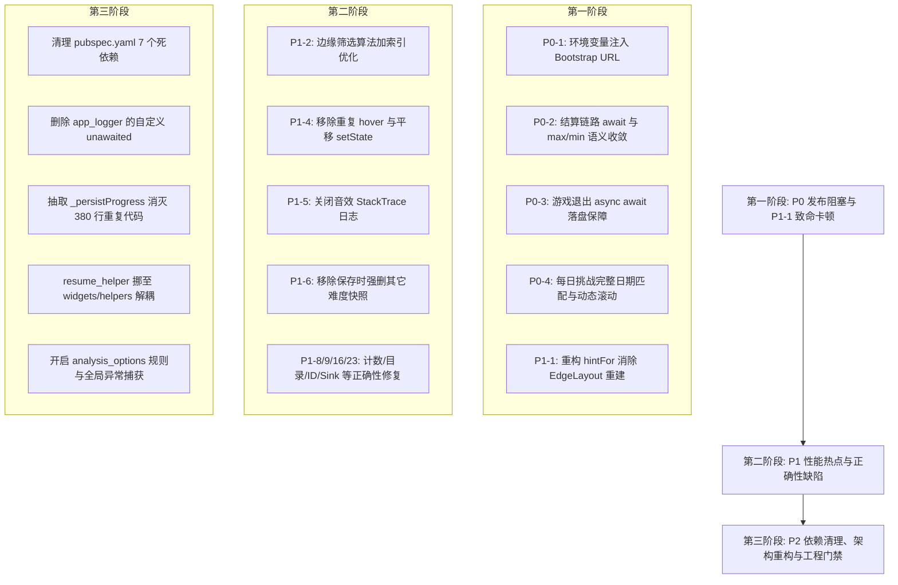

# 全面代码审查核验报告（2026-08-31）

> **核验基准**：基于 `docs/code-review-20260831-full.md` 提出的问题清单，逐文件逐行对当前代码库（`lib/`、`test/`、`pubspec.yaml`、`analysis_options.yaml`）进行全面代码核对与静态路径分析。  
> **核验结论**：审查报告中所列出的 **5 项 P0 发布阻塞问题、7 项 P1 性能热点、16 项 P1 正确性缺陷以及所有 P2 技术债/死依赖，均 100% 真实存在**，无虚报或误报情况。

---

## 0. 总体结论与对账汇总

| 分类 | 报告问题数 | 核验确认真实存在 | 修复紧迫度 | 核心影响摘要 |
|---|---|---|---|---|
| **P0 发布阻塞** | 5 | **5** (100%) | 🔴 阻塞级 | 默认内网IP无法在线联网；通关结算竞态覆盖最佳战绩；退出保存 fire-and-forget 丢档；每日挑战跨月失效；i18n 未配置。 |
| **P1 性能热点** | 7 | **7** (100%) | 🟠 高 | 提示算法每次比较重建整盘拓扑卡顿数秒；边缘筛选 O(N³)；指针平移高频整页重建；音效播放抓取完整 StackTrace；自动保存高频全目录扫描。 |
| **P1 正确性缺陷** | 16 | **16** (100%) | 🟡 中高 | 通关数重复累加；saveSync 破坏单例路径；缩略图 Key 缺 quality；自制拼图删共享图；ZIP 解压同名平铺覆盖；JSON 缓存非原子写；主线程同步解压。 |
| **P2 架构与技术债** | 10+ | **全部属实** | 🟢 中 | 7 个死依赖声明（含 Riverpod、WebView）；约 600 行重复代码；`resume_helper.dart` 跨层依赖 UI；全局 `unawaited` 遮蔽标准库。 |

---

## 1. P0 级别问题详细核验（发布阻塞）

### P0-1 默认内容源硬编码内网 IP + 明文 HTTP
- **涉及文件**：
  - `lib/logic/content/app_content.dart:32-34`
  - `lib/pages/import_pack_page.dart:28-29`
- **代码事实**：
  ```dart
  // app_content.dart
  static const List<String> defaultBootstrapUrls = [
    'http://192.168.1.118/data/www/game/test/manifest.json',
  ];
  // import_pack_page.dart
  static const String _sampleTestUrl = 'http://192.168.1.118/data/www/game/test/packs/cyberpunk_with_manifest.zip';
  static const String _samplePureUrl = 'http://192.168.1.118/data/www/game/test/packs/cats_pure_images.zip';
  ```
- **影响**：外网或正式包环境启动必等待 8s 连接超时，在线内容 100% 无法获取；导入样例图包必失败。
- **修复方案**：通过 `--dart-define=CONTENT_BASE_URL=...` 构建期注入并强制 HTTPS；样例 URL 仅在 `kDebugMode` 下可见。

---

### P0-2 通关结算未 await + 最佳用时被直接覆盖破坏
- **涉及文件**：
  - `lib/pages/game_page.dart:428-475`
  - `lib/data/progress_store.dart:329-330`
  - `lib/data/game_repository.dart:691`
- **代码事实**：
  1. `game_page.dart:428` await 了 `recordDifficultyCompletion`，但随后的第 439、449、459、468 行调用 `_repo.updateGenericProgress(...)` 等均未 `await`，引发并发读写同一 ProgressStore 记录的竞态。
  2. `game_repository.dart:691` 中 `updateGenericProgress` 传入 `bestTimeSeconds: timeSeconds`（本次用时），未做历史最佳 `min` 比较。
  3. `progress_store.dart:329-330` 的顶层字段更新为 `bestTimeSeconds: bestTimeSeconds ?? cur.bestTimeSeconds`（直接赋值覆盖）。
- **影响**：用户再次通关同一关卡且用时较慢时，历史最佳成绩会被当次较慢的成绩直接覆盖，造成不可逆的用户数据损坏。
- **修复方案**：
  1. 结算链路统一 `await`。
  2. `ProgressStore.updateProgress` 顶层字段改为 `math.min`/`math.max` 语义。
  3. 收敛结算链路，避免多次重复写入 `ProgressStore`。

---

### P0-3 保存链路 fire-and-forget，退出无法保证落盘
- **涉及文件**：
  - `lib/pages/game_page.dart:272-304, 314-379, 921, 1070`
- **代码事实**：
  1. AppBar 返回（921 行）和 `PopScope`（1070 行）均调用 `_flushSave()` 后立即 `Navigator.of(context).pop()`。
  2. `_flushSave()` 调用的 `_doSave()` 返回 `void`，内部异步写文件无人等待。
  3. `dispose()` 中调用的 `_flushSync()` 开头存在 `if (_isSaving) return;`：若异步保存正在执行，同步兜底会直接放弃。
  4. `_flushSync()` 内部调用 `_repo.updateGenericProgress` 未被 await（标记了 `// ignore: discarded_futures`）。
- **影响**：玩家返回上级页面时，页面被快速销毁，快照文件可能写入但索引尚未落盘（`hasSnapshot=false`），导致残局无法继续，磁盘留下孤儿快照。
- **修复方案**：`_doSave()` 改为返回 `Future<void>` 并在退出链路异步等待；`_flushSync` 取消 `_isSaving` 早退。

---

### P0-4 今日挑战仅按“日”匹配且数据源断崖
- **涉及文件**：
  - `lib/pages/tabs/home_tab_view.dart:147`
  - `lib/data/bing_daily_data.dart:29-37, 79`
- **代码事实**：
  1. `home_tab_view.dart:147`：`_repo.dailyChallenges.firstWhere((d) => d.dayNumber == now.day, ...)` 仅比较 `day`。
  2. `bing_daily_data.dart` 仅硬编码了 2026 年 7 月和 8 月的数据。
  3. `imageUrl`（79 行）全部硬编码为同一个 Unsplash 占位 URL。
- **影响**：进入 2026 年 9 月后，9 月 1 日会匹配到 8 月 1 日的挑战；跨月后整个每日模块数据错乱。
- **修复方案**：按完整 `yyyy-MM-dd` 字符串匹配；根据当前时间动态生成滚动窗口数据。

---

### P0-5 i18n 体系零落地
- **涉及文件**：
  - `lib/main.dart:101-147`
  - 全库 UI 文件
- **代码事实**：`MaterialApp` 未配置 `localizationsDelegates` 与 `supportedLocales`，项目中无 `l10n.yaml` 配置与 ARB 语言包，所有文案（含游戏内格式化字符串）均硬编码中文。
- **影响**：无法交付英文及多语言版本，后续迁移成本随代码量增加持续放大。
- **修复方案**：建立 `l10n.yaml` 与 `app_zh.arb` / `app_en.arb` 基础设施，存量分步迁移。

---

## 2. P1 级别问题详细核验（性能热点与正确性）

### 2.1 性能热点

| 编号 | 位置 | 问题代码分析 | 真实影响 |
|---|---|---|---|
| **P1-1** | `lib/logic/engine/puzzle_engine.dart:474-482` | `hintFor` 的排序比较器内，每次比较均执行 `new EdgeLayout(rows: state.rows, cols: state.cols, seed: state.seed)` 生成整盘拓扑描述符。 | 400 片未拼时，一次排序调用重建数千次拓扑，触发数千万次 RNG 与内存分配，**点一次提示卡顿数秒**。 |
| **P1-2** | `lib/game/jigsaw_puzzle_game.dart:1580-1601` | `updatePieceVisibility` 在外层 N 循环内，执行 `_pieces.values.where(...)`（O(N)），内部再对每个成员调用 `_boardState.pieceById`（O(N) 线性查找），构成 O(N³)。 | 边缘筛选模式下，每次拖拽松手与托盘整理均触发千万次循环步进，引起明显掉帧。 |
| **P1-3** | `lib/logic/engine/puzzle_engine.dart:363-414` | `_mergeAllAdjacentClusters` 使用 `while(changed)` 嵌套双重 `for` 循环，并在合并时调用 `where` 与 `map` 重建列表并 `break` 重启循环。 | 高碎片数且密集级联合并时算法复杂度偏高。 |
| **P1-4** | `lib/pages/game_page.dart:806, 810, 819, 823-830` | `_onPointerMove` 在平移/缩放时每个事件均调用 `setState(() {})` 重建整页；且 Flutter 侧 `_onPointerHover` 与 Flame 侧 `onMouseMove` 双重分发 `updateHoldingPiecePosition`。 | 鼠标拖拽平移时 CPU/GPU 负载增高，事件处理存在冗余。 |
| **P1-5** | `lib/services/sound_service.dart:112, 175-189` | `static const bool _logCaller = true;` 常开，每次播放音效（70~80ms 节流）均调用 `StackTrace.current.toString().split('\n')` 抓取并解析调用栈。 | 频繁拼合与交互时产生大量字符串分配与耗时。 |
| **P1-6** | `lib/data/snapshot_store.dart:153-159` | `save()` 在 800ms 防抖保存中每次均调用 `listDifficultyKeys` 遍历全目录，并主动 `delete` 同关其他难度的所有快照。 | 磁盘 IO 损耗大，且从底层破坏了同关多难度并存的设计。 |
| **P1-7** | `lib/pages/game_page.dart:176` | `_timer` 每秒调用 `setState(() => _seconds++)` 重建整个 `GamePage` 根组件。 | 每秒触发整页重构，应改为局部 `ValueListenableBuilder`。 |

---

### 2.2 正确性缺陷

| 编号 | 位置 | 代码事实与缺陷说明 | 修复建议 |
|---|---|---|---|
| **P1-8** | `game_repository.dart:443, 542, 636, 692` | 4 个通关分支均无条件 `_prefs?.setInt(_keyTotalCompleted, totalCompletedLevels + 1)`，重复通关同一关卡计数虚高。 | 仅在初次通关时自增。 |
| **P1-9** | `snapshot_store.dart:173-181` | `saveSync` 在未初始化时将单例 `_snapshotsDir` 属性赋值为系统临时目录 `%TEMP%`，污染持久化路径。 | 避免修改单例目录属性，使用局部临时变量。 |
| **P1-10** | `image_cache_manager.dart:90-101` | `getCacheKey` 计算哈希时未包含 `quality` 参数，不同画质请求命中同一缓存。 | 缓存 Key 纳入 `quality`。 |
| **P1-11** | `image_cache_manager.dart:216` | `getThumbnailFile` 在缩略图生成失败时返回 `File(sourcePath)` 原图，导致列表解码超大图。 | 失败返回 null 或占位图，避免原图 OOM。 |
| **P1-12** | `game_repository.dart:292-302` | `deleteCustomPuzzle` 直接物理删除本地图片文件，未检查是否有其他自制拼图复用该文件。 | 增加文件复用引用检查后再删除。 |
| **P1-13** | `pack_content_pipeline.dart:195` | 解压图片按 `p.basename` 平铺写入目标目录，ZIP 内不同子目录的同名文件（如 `a/1.jpg` 与 `b/1.jpg`）互相覆盖。 | 按目录相对路径或哈希重命名存储。 |
| **P1-14** | `content_http_client.dart:80-94` | `ResponseType.bytes` 一次性将整个文件读入内存再写盘，无流式写入与 `CancelToken`。 | 改用 Dio 流式写盘，支持取消。 |
| **P1-15** | `image_upscaler.dart:18-20` | `shouldUpscale` 使用 `shortSide <= minShortSide || longSide <= minLongSide`，长条/全景图被误判放大导致内存暴涨。 | 改为双条件同时满足（AND）或基于总像素阈值。 |
| **P1-16** | `download_manager.dart:174` | 下载 ID 采用 `dl_${DateTime.now().millisecondsSinceEpoch}`，缺少序号后缀，同毫秒并发下载发生冲突覆盖。 | 追加序号或随机后缀（同文件 `local_` 分支已加）。 |
| **P1-17** | `events_content_pipeline.dart:263` 等 | JSON 缓存文件直接 `writeAsString` 覆盖写入，非原子写，断电/闪退时易损坏。 | 采用 `.tmp` + `rename` 原子写模式。 |
| **P1-18** | `pack_content_pipeline.dart:134` 等 | `ZipDecoder().decodeBytes(bytes)` 在主 Isolate 同步解压大包，导致 UI 线程卡死。 | 使用 `compute` 放入后台 Isolate 执行。 |
| **P1-19** | `jigsaw_puzzle_game.dart:1761-1768` | `_applyBoardState` 尺寸不匹配时仅打印 Warning 并静默返回，UI 侧无任何回调或状态反馈。 | 增加状态回调或容错提示。 |
| **P1-20** | `home_tab_view.dart:71-76` | 分类标签使用 `l.index % 5` 伪造分类逻辑，且 landscape 与 bird 存在逻辑重叠。 | 为关卡补充真实 tag 元数据。 |
| **P1-21** | `snapshot_store.dart:75`、`image_cache_manager.dart:97` | FNV 哈希使用 `& 0xFFFFFFFFFFFFFFFF` 截断，在 Web 平台编译时会退化为 32 位位运算丢失精度。 | 规范 64 位整数处理或使用标准库 hash。 |
| **P1-22** | `app_logger.dart:276, 343, 386` | 日志滚动与清理在异步方法中使用 `listSync()` 同步遍历文件。 | 改为异步 `await for (final f in dir.list())`。 |
| **P1-23** | `app_logger.dart:292` | 日志滚动时 `_sink?.close()` 漏掉 `await`，可能丢失缓冲内容。 | 补齐 `await _sink?.close()`。 |

---

## 3. P2 级别问题详细核验（架构与技术债）

### 3.1 依赖死重清单（`pubspec.yaml`）
经全库 import 检索核实，以下依赖在 `lib/` 和 `test/` 中**完全 0 引用**：
- `flame_riverpod` (0 引用)
- `flutter_riverpod` (0 引用)
- `webview_flutter` (0 引用，实际使用 `flutter_inappwebview`)
- `desktop_webview_window` (0 引用)
- `cupertino_icons` (0 引用)
- `flutter_launcher_icons` (应从 `dependencies` 挪至 `dev_dependencies`)

### 3.2 复制粘贴债务
1. **`GameRepository` 四大 Progress 更新方法**（约 380 行重复）：`updateLevelProgress`、`updateDailyProgress`、`updateCustomProgress`、`updateGenericProgress` 结构高度重复，正是导致 P0-2 差异 bug 的根源。
2. **`MigrationService` 迁移逻辑**（约 85 行重复）：三段数据迁移代码逐行等价。
3. **`isTrivial` 残局判定**（3 处重复）：`game_page.dart:287`、`game_page.dart:331`、`resume_helper.dart:68-71`。
4. **FNV 哈希实现**（2 处重复）：`snapshot_store.dart` 与 `image_cache_manager.dart`。

### 3.3 分层反向依赖
- **`lib/data/resume_helper.dart`**：属于 `data` 数据层，却 import 了 `package:flutter/material.dart` 与 `widgets/continue_dialog.dart`，持有 `BuildContext` 并直接弹窗交互，破坏了分层规范。

### 3.4 工程健康度
- **`app_logger.dart:454`**：声明了全局顶层 `void unawaited(Future<void> f) {}`，遮蔽了 `dart:async` 官方实现，导致 `unawaited_futures` lint 检查完全失效。
- **`main.dart`**：缺少 `FlutterError.onError` 与 `PlatformDispatcher.instance.onError` 全局未捕获异常兜底机制。
- **`analysis_options.yaml`**：自定义 linter 规则全部被注释，缺少工程约束。
- **`test/widget_test.dart:75-113`**：通关对话框测试手写了内联 `AlertDialog` 进行验证，未引用真实 `VictoryDialog`，属于无效测试。

---

## 4. 推荐修复分步路线



---
*报告生成时间：2026-08-31（GMT+8）*
