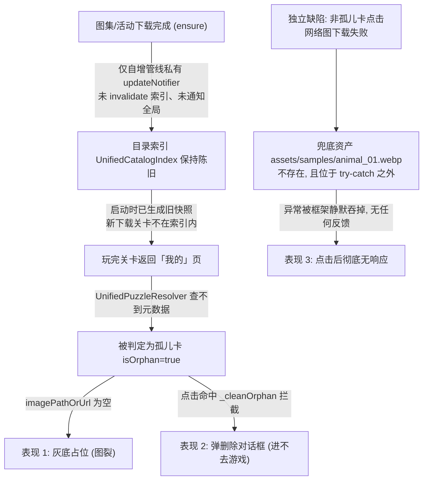
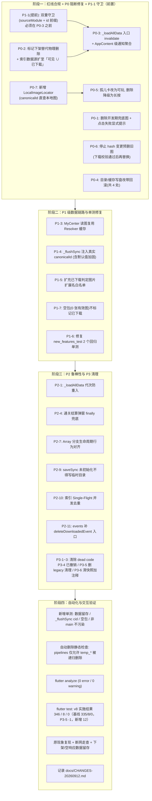

# Flutter 代码审查综合分析与修复实施计划

> 日期：2026-09-12 09:42（GMT+8）
> 修订：v9 — v8 复审修正（2026-09-12 13:09 GMT+8）：修 ①hash 延迟推进 ②有界并发刷新 ③i18n 硬编码 ⑤冗余 HttpClient (a)`.bak` 清理 (b)共享扩展名 (c)索引代次 (e)消除最后 2 处删图路径；见文末 §9
> 历史：v8 实施完毕（阶段一~三，见 §8 实施勘误）；v7 补入架构债务溯源（§7）；v6 并入第三轮审查（P0-2 索引数据源改造、P0-3 改为 AppContent 级通知聚合、P0-5 删除「快照图」表述、新增 P0-6 / P0-7、P0-4 与 P1-5 扩范围）
> 状态：已实施并复审收口（P2-2/P2-3 体验优化转后续，见 §9.3）
> 范围：`lib/` 全量代码 + 关联审查文档综合核验
> 关联文档（路径已核实，其中 4 份实际位于 `temp/`，不在 `docs/`）：
> - `temp/code-review-20260911-verified-audit.md`
> - `temp/code-review-20260911-image-cache-and-progress-issues.md`
> - `temp/flutter-code-review-20260911.md`
> - `temp/REVIEW-flutter-code-20260911.md`
> - `docs/image-cache-native-refactor-plan-20260911.md`
>
> **核验基线（2026-09-12 实测）**
> - `flutter test` 全量：**332 通过 / 8 跳过 / 2 失败**（共 342 条）
> - `git status` 干净；图片缓存原生化重构已合入（`9747e5f`）
> - `main_levels_cache.json`：**180 条全部为 `main:` 前缀，当前无既成污染**（详见 P1-1）
> - 删除行为审计：全仓库 **38 处** `deleteSync` / `delete(recursive:)` 站点已完成分级（§1.2）
> - 决策后单测预期：**333 通过 / 8 跳过**（P3-5 会移除 1 个 legacy 用例，由 334 净减 1）
> - 第三轮独立审查结论核验：**10 项主张全部成立**（其中"纯货架条目清理"一项的落地方式需按分层约束调整，见 §5.2-4）；另修正本版此前的计数误判（通知链路实测 **2/5 走代理、3/5 直连 pipeline**，Tab 页全部直连），详见 §6.1

---

## 一、综合评估与背景

近期项目完成了图片缓存体系的原生化重构（删除了 1500+ 行自研软解与 Isolate 队列，转由 Flutter 原生 C++ 硬件解码器等比下采样与引擎 ImageCache 托管）。该方向大幅简化了架构，且核心链路已经合入主分支。

通过对相关审查报告及代码库的**逐条实证核验**（文件、行号、调用链、本机缓存数据、删除站点均已复核），确认当前代码库中存在若干实质性缺陷。其中「索引陈旧 → 孤儿卡」两环相扣，构成用户反馈的 **「图集关卡玩完后，在「我的 → 进行中」记录图裂、且点击无反应」** 的完整根因链；此外还有 2 个独立缺陷与 5 个数据一致性隐患（见 §3）。

### 1.1 设计红线（不可协商的前置约束）

> 本节是本计划所有修复方案的**约束条件**：若某条修复方案与红线冲突，以红线为准并重新设计方案。

- **R1 — 本地已下载的关卡图片数据，任何自动路径都不得删除。**
  网络故障、CDN 返回空/错误内容、接口字段变更、JSON 解析失败、内容下架/禁用、索引重建、孤儿判定异常——**一律不得触发删除**。没有任何理由因为"网络出问题"去删用户已经下载到手的数据。
- **R2 — 进度、存档（残局快照）、收藏记录，任何自动路径都不得删除。**
  即使对应关卡已下架、已删除、已成为孤儿数据，也**不删**。这类记录体积以 KB 计，为省这点空间牺牲用户数据是明显的负收益；孤儿数据只做**只读展示/标记**。
- **R3 — 允许的删除仅限三类**：
  1. **本次运行产物**：`temp_*` 临时目录/文件、`.part` 下载中间文件、`.tmp`/`.bak` 原子写残留；
  2. **失败回滚**：删除"本次刚创建且未完成的"产物（如解压出 0 张有效图的新目录）；
  3. **用户显式操作**：用户点击删除下载 / 删除图包 / 删除记录，且必须有二次确认。
- **R4 — 需要"隐藏"时只改状态标记，不动磁盘。** 下架/禁用只影响列表可见性与状态展示。
- **R5 — 每条删除路径必须"结果可解释"**：能说清"删的是本次产物 or 用户要求删的"。说不清的删除路径一律整改。

### 1.2 删除行为分级与全仓库审计（2026-09-12 实测）

全仓库共 38 处 `deleteSync` / `delete(recursive: true)` 站点，按下表分级：

| 触发类别 | 站点 | 判定 | 处理 |
|---|---|---|---|
| **① 远端状态/内容变更驱动** | `events_content_pipeline.dart:196`（差集清理）<br>`collections_content_pipeline.dart:209`（差集清理）<br>`events_content_pipeline.dart:233`（Auto-GC）<br>**v6 新增** `main_content_pipeline.dart:262-283`（远端 hash/url 变更即删本地旧图） | **违反 R1 / R3-②**：触发条件完全来自远端状态或内容变更，却删正式数据（解压目录 / 已下载图片） | **P0-2** 移除前三处；**P0-6** 整改 hash 预删 |
| **② 更新替换路径** | `collections_content_pipeline.dart:351`<br>`events_content_pipeline.dart:336`<br>`daily_content_pipeline.dart:133`<br>**v6 新增** `main_content_pipeline.dart:575-578`（缓存 JSON 写盘） | 先删后改名，rename 失败即丢数据（无回滚）。⚠️ 前 3 处丢的是**用户已下载图片**（严重）；`main:575-578` 丢的是**可重建的派生缓存**（`main_levels_cache.json`），严重度较低但属同一模式 | **P0-4**：统一改造为「改名备份 + 失败回滚」 |
| **③ 本次运行产物**（允许） | `tempExtractDir`：collections:335/392、events:322/361、daily:113/154<br>临时 zip：collections:357/398、events:342/367、daily:139/160<br>`.part`：`content_http_client.dart:104/134/149/165`<br>`.bak/.tmp`：`snapshot_store.dart:242/250/271`<br>`.backup-*.tmp`：`storage_manager.dart:527`<br>空包回滚：`pack_content_pipeline.dart:287` | 删的是本次创建/半成品（`pack:287` 是"无有效图片时删本次新建目录"，正是 P1-7 应有的范式） | 保留 |
| **④ 用户显式操作**（允许，须二次确认） | `collections_content_pipeline.dart:418`（deleteDownloadedCollection）<br>`pack_content_pipeline.dart:368`（deletePack）<br>`download_manager.dart:400/426`（deleteItem/clearAll）<br>`my_center_tab_view.dart:367-369`（_cleanOrphan）<br>`game_repository.dart:383/392`（删自制关卡）<br>`resume_helper.dart:121`（放弃残局） | 用户主动删除 | 保留；P0-5 要求 `_cleanOrphan` 只能由用户显式操作触发 |
| **⑤ 校验失败删本次下载物**（允许） | `download_manager.dart:351/360` | 删本次下载的无效/过小图片 | 保留 |
| **⑥ 已决策** | `storage_manager.dart:545`（备份轮转超限删旧备份）<br>`level_image_resolver.dart:53`（删旧版 `thumbnail_cache` 目录）<br>`pack_content_pipeline.dart:212`（新建目录前删同名目录）<br>`game_page.dart:653`、`game_repository.dart:481-517/683-717/803-833`（通关/重开清快照） | 非远端驱动，但属"自动删除既有数据" | **2026-09-12 已逐条决策，见下表** |

**⑥ 组四项决策（2026-09-12）**

| 站点 | 决策 | 落地动作 |
|---|---|---|
| `storage_manager.dart:541-548` Hive 备份轮转 | **保留现状** | 自动备份不能无限增长，维持 `kMaxBackups = 5`（`storage_manager.dart:21`）上限；若后续要更保守，只调小该常量，**不引入"只增不删"** |
| `level_image_resolver.dart:48-59` `cleanLegacyThumbnailCache()` | **直接去掉** | 项目尚未发版，不存在旧版遗留 `thumbnail_cache` 目录 → 删除该方法（48-59）、`main.dart:161` 的调用、以及 `test/logic/level_image_resolver_test.dart:129-142` 的对应用例（见 P3-5） |
| `pack_content_pipeline.dart:212` 新建目录前删同名 | **不改** | packId 为"时间戳 + 随机后缀"，碰撞概率可忽略；纳入静态检查白名单（§4 实施原则 6） |
| 通关后清残局快照（`game_page.dart:651-658`、`game_repository.dart` clearSnapshot 系列） | **保留 + 加注释** | 行为不变，补注释写明红线边界：仅在"关卡已通关"或"用户显式重新开始/放弃残局"时执行，**不得**由网络/内容状态变化触发（见 P3-6） |

### 1.3 本计划的定位与边界（v7 明确）

- **本计划是"止血 + 守红线"，不是架构重构**：在既有五条管线（Main / Daily / Events / Collections / Packs）与既存用户数据之上，优先保证「不再误删用户数据（R1/R2）」与「不再静默卡死」，为此接受若干**过渡性补丁**（前缀守卫、`LocalImageLocator`、多级取图、代次编号等）；
- **这些补丁被显式登记为技术债**，每项都写明**退场条件**（§7.3），避免永久留驻、避免"补丁之上再打补丁"；
- **架构层面的根因与后续重构路线见 §7**（本轮不实施，但本计划暴露的缺陷即为重构的输入清单）；
- **本计划不新增任何"以默认值/假数据掩盖失败"的逻辑**——这条同时也是红线 R5 的延伸要求。

---

## 二、核心现象与根因还原

### 2.1 现象描述

玩家在会话内下载图集（Collection）或活动（Event）并游玩关卡后，返回「我的」Tab：

1. 「进行中 / 已完成 / 收藏」列表中的对应记录缩略图呈现灰底占位（图裂）；
2. 点击卡片无法进入游戏关卡（要么弹出“是否删除记录”对话框，要么点击彻底无反应）。

### 2.2 根因链（两环相扣）与独立缺陷



> 上图仅覆盖用户反馈的现象。其余确凿缺陷（main 管线污染、更新路径非原子替换、空包误标已下载、Auto-GC 标记失真、幽灵存档等）见 §3。
> 注：环 2 与独立缺陷均**不涉及删除**；真正违反 §1.1 红线的是 P0-2（远端驱动删本地关卡）与 P0-5（诱导用户删记录）。

### 2.3 逐环说明

1. **环 1（索引失效断点）**
   - 图集/活动下载成功后（`ensureCollectionDownloaded` / `ensureEventDownloaded`），仅自增各自管线的 `updateNotifier`，从未调用 `UnifiedCatalogIndex.invalidate()`，也未 bump 全局 `AppContent.contentUpdateNotifier`；
   - 全仓库 `UnifiedCatalogIndex.invalidate()` 仅有 `MyCenterTabView` 的两处调用（`_onLocaleChanged` / `_onContentChanged`）；`MyCenterTabView.didUpdateWidget` 在 Tab 激活时只调 `_loadAllData()`，**不带 invalidate**；
   - `MyCenterTabView` 缺少对 `collections.updateNotifier` 和 `events.updateNotifier` 的监听（`collections_tab_view.dart:40-41` 已有同款写法可参照）；
   - 导致本会话新下载的关卡元数据无法注入常驻单例索引 `UnifiedCatalogIndex._cached`。
2. **环 2（识别为孤儿与图裂）**
   - 游玩后进度保存到了 `ProgressStore`；回到「我的」页，`_loadAllData()` 拿到的依然是旧快照索引；
   - `UnifiedPuzzleResolver.resolve` 匹配不到条目，将其构造为 `isOrphan: true` 且 `imagePathOrUrl: ''` 的孤儿卡；
   - `_buildCardImage`（`my_center_tab_view.dart:958-970`）对空路径回退为灰底占位容器，形成“图裂”。
3. **独立缺陷（点击链路兜底图）**
   - 该缺陷**不属于上述根因链**：孤儿卡在 `_handleCardClick`（line 268-271）已 `return`，不会走到 `_resolveImageBytes`；
   - 它作用于**非孤儿卡**：网络图下载失败/断网时，`_resolveImageBytes` 落入末尾兜底 `rootBundle.load('assets/samples/animal_01.webp')`；
   - 该资源与目录**根本不存在**（`assets/` 下仅 `audio/bg/icons/images/levels/temp`），且该行位于方法内 try-catch **之外**，`_handleCardClick` 亦无 try-catch；
   - 实际表现是**异步异常被框架静默吞掉、点击后什么都不发生**（不会冻结 UI 线程）；且该兜底本就是**初期开发测试遗留下来的代码**，即便换成一个真实存在的示例图也不应保留——那会让用户在“图拿不到”时**用错图进入关卡**。

---

## 三、待修改缺陷清单（按优先级）

### 3.1 P0 级缺陷（必修 · 阻断性 Bug / 违反设计红线 / 数据误删 / 静默无响应）

#### 【P0-1】删除开发期遗留兜底图；点击失败必须显式提示，禁止静默与错图兜底

- **文件与行号**：
  - `lib/pages/tabs/my_center_tab_view.dart:205-261`（`_resolveImageBytes`，兜底在 259-260）
  - `lib/pages/tabs/my_center_tab_view.dart:263-344`（`_handleCardClick`）
- **违反红线**：R5（删除路径需可解释）的镜像问题——此处是"以假数据掩盖失败"，同属不可解释行为。
- **问题细节**：
  1. 兜底资产 `assets/samples/animal_01.webp` **不存在**（pubspec 仅声明 `assets/images/`、`icons/`、`bg/`、`audio/`），该行在方法内 try-catch **之外**，外层点击方法也无 try-catch；
  2. 该兜底是**初期开发测试遗留代码**，不具备生产语义：即便换成真实存在的图，也会在图片不可用时**用示例图误导用户进入关卡**；
  3. 结果是点击卡片后无任何反馈（静默），用户感知为“点了没反应”。
- **修改方案（彻底移除兜底，不再替换为其它路径）**：
  1. **删除** 259-260 两行兜底加载；`_resolveImageBytes` 返回类型改为 `Future<Uint8List?>`，所有失败分支 `return null`（不再抛异常、不再返回替代图）；
  2. `_handleCardClick` 拿到 `null` 时**不进入游戏**：以 `GameToast.show(... type: GameToastType.warning)` 提示用户（如“图片未就绪，请联网后重试”），并 `return`；
  3. `_handleCardClick` 补**整体 try-catch**，捕获后同样以 Toast 提示 + 记录 `AppLogger.ui.warning`，严禁静默中断；
  4. 已确认 `_resolveImageBytes` 全仓库仅 273 行一处调用（`grep` 实证），改签名为可空类型不影响下游——`GamePage` / `ChooseDifficultySheet` / `ResumeHelper` 的 `imageBytes` 均为非空 `Uint8List`，在 `null` 早返回后不会被触达；
  5. **禁止**再引入任何“示例图 / 占位图 / 素材库首图”作为图片不可用时的替代，卡片渲染层（`_buildCardImage`）保留灰底占位即可。
- **验收**：断网状态下点击一个网络来源的「进行中」卡片，出现明确 Toast 提示且**不进入游戏**；恢复网络后可正常进入；测试环境无未捕获异常日志。

#### 【P0-2】取消以远端状态为触发的本地数据删除（差集清理 + Auto-GC）——落实红线 R1

- **文件与行号**：
  - `lib/logic/content/pipelines/events_content_pipeline.dart:185-210`（差集清理）
  - `lib/logic/content/pipelines/events_content_pipeline.dart:225-243`（Auto-GC 物理删除）
  - `lib/logic/content/pipelines/collections_content_pipeline.dart:198-223`（差集清理）
- **违反红线**：**R1**（网络/远端状态变化不得删除已下载关卡数据）。
- **问题细节**：两处清理的触发条件**完全来自远端状态**（远端 id 全集为空或变小、或条目被标 `disabled`），却执行 `deleteSync(recursive: true)` 删除用户已下载的关卡目录。远端返回 `{"items": []}`、CDN 故障、接口字段变更、批量下架——任一情况都会（或在熔断失效时）导致本地内容被批量删除。
- **影响**：内容被迫重下 + 对应 `ProgressStore` 记录变孤儿卡（图裂 + 删除对话框）。
- **v3 方案的不足（本版修正）**：v3 提出的"空列表守卫 + 50% 熔断"只是**降低概率**，本质仍是"以远端状态为理由删本地数据"；一次真实的批量下架依然会删光本地已下载内容。按红线 R1，应**彻底移除**该删除行为，而不是给它加护栏。
- **修改方案（v6 重写：标记下架 + 同步改造索引数据源）**：
  1. **移除物理删除**：删除 `events_content_pipeline.dart:185-210` 与 `collections_content_pipeline.dart:198-223` 的差集清理块（含 `deleteSync`），以及 Auto-GC 的物理删除（events:225-243）——`performAutoGc` 改为**只统计不删除**，确需清理时只清理 `temp_*` 残留目录；
  2. **下架 = 标记**：为 `PuzzleEventItem` / `PuzzleCollectionItem` 增加 `isDelisted`（或复用 `isDisabled`）；`syncWithRemote` 对"本轮远端缺失的 id"**只置标记、不删条目、不删磁盘**（重新上架时自动清除标记）；
  3. ⚠️ **必须同步改造 `UnifiedCatalogIndex.build()` 的数据源（v6 新增，第三轮审查发现的设计矛盾，本版已核实成立）**：`catalog_index.dart:230 / 260` 当前用的是 `eventsPipeline.visibleEvents` / `collectionsPipeline.visibleCollections`。**若只把下架项从 visible 中过滤掉，索引同样扫不到它们**，进度/收藏依然是孤儿卡，本方案的收益归零（v5 在此自相矛盾）。索引数据源必须改为「可见 ∪ 本地已下载」：
     ```dart
     // 伪代码：可见条目 ∪ 本地已下载条目（含已下架）
     final events = allEvents.where(
       (e) => (!e.isDisabled && !e.isDelisted) || _isEventLocalDownloaded(e),
     );
     ```
     collections 同理（`allCollections` + `isCollectionLocalDownloaded`）。这是 P0-2 的**阻塞性前置改造**，不可省略；
  4. **纯货架死链的处理（第三轮审查提出；本版收敛为"标记 + 禁下载"）**：远端彻底下架、本地从未下载、也无进度的条目，若一并从 `_eventsMap` 移除可保持列表干净，但"是否有进度/收藏"需要读 `ProgressStore` / `FavoriteStore`，而 **pipelines 目前不 import `lib/data/`（已实测：pipelines 目录下无任何 data 层 import）**，在管线内查库会破坏分层。因此：
     - **推荐**：不删任何条目，改由 UI 层处理——`isDelisted` 条目在货架列表中显示为「已下架」并**禁用下载按钮**，从而**不会出现"点了就 404"**；本地已有数据者仍可玩，也不存在诱导误点；
     - **可选增强**：确需清理时，由 `ContentManager` / `AppContent`（可读 store）在 `syncWithRemote` 之后做一次"候选清理"——仅移除 `!isLocalDownloaded && 无进度 && 无收藏` 的条目；pipeline 只暴露"远端缺失的 id 列表"，由上层决定是否 `remove`，保持 pipelines 对 data 层零依赖；
  5. 顺带说明：v3 的"空列表守卫 / 熔断"需求随删除行为移除而**消失**；原 P2-8（Auto-GC 删目录后 `isLocalDownloaded` 标记失真）**自然消解**（不再删目录 → 标记不再与磁盘失配）；
  6. 释放磁盘空间的**用户主动入口**：`deleteDownloadedCollection`（collections:409-442）、`deletePack`（pack:361+）已有；**events 缺失对等入口** → 见 P2-11。
- **验收**：
  - 远端返回 `{"items": []}`、大量下架、断网重试后：本地解压目录全部保留、`_eventsMap` / `_collectionsMap` 条目不减、已下载关卡**仍可进入**；
  - **索引数据源回归（v6 新增）**：把一个**已下载**的图集标记为 `isDelisted` 后，「我的」页对应进度卡片**不再是孤儿卡**（缩略图正常、点击可进）；把一个**未下载且无进度**的图集标记为 `isDelisted` 后，货架显示「已下架」且下载按钮禁用；
  - 连续多次 `syncWithRemote` 不产生任何正式目录删除；
  - 静态检查（§4 实施原则 6）通过：pipelines 内不再对正式目标目录调用递归删除。

#### 【P0-3】统一目录索引陈旧 +「我的」Tab 漏监听图集/活动通知

- **文件与行号**：
  - `lib/logic/catalog_index.dart:66-79`（`invalidate` / `current`）
  - `lib/pages/tabs/my_center_tab_view.dart:60-72, 80-104, 115`
  - `lib/logic/content/pipelines/collections_content_pipeline.dart:360-378`
  - `lib/logic/content/pipelines/events_content_pipeline.dart:346-352`
  - `lib/logic/unified_puzzle_resolver.dart:144-185`（孤儿兜底）
- **问题细节**：`ensureCollectionDownloaded` / `ensureEventDownloaded` 成功后不通知全局索引失效；`MyCenterTabView` 未监听管线更新，导致本会话游玩的新关卡在进度列表中变为孤儿卡。
- **修改方案（重排：先做代价低、无依赖环的方案）**：
  1. **主方案**：在 `_loadAllData()` 开头显式调用 `UnifiedCatalogIndex.invalidate()`。索引重建自述约 5ms（6000 条），代价可接受，可让 **Tab 切换 / 下拉刷新 / 外部通知** 三条路径统一自愈，不依赖任何新通知链路；
  2. **补充（v6 重写）**：全局通知**统一在 `AppContent` 初始化时挂载**——监听各 pipeline 自身的 `updateNotifier`（`events` / `collections` / 视需要加 `main` / `daily` / `pack`），回调内自增 `contentUpdateNotifier`。方向是"外层单向监听内层"，**无依赖环且覆盖所有入口**；
     - 依据（v6 实测下载调用点全景，共 5 处）：**走 `ContentManager` 代理的 2 处**——`collection_levels_page.dart:61`（`_content = AppContent.instance.manager`，line 46）、`event_levels_page.dart:68`（同上，line 40）；**直连 pipeline 实例的 3 处**——`collections_tab_view.dart:66`、`collections_tab_view.dart:111`（该页 `_content = AppContent.instance`，line 35，取的是 `.events` / `.collections` 管线）、`home_tab_view.dart:474`。因此**在代理层自增通知器会漏掉 3/5 的入口**——第三轮审查的"漏斗"判断**成立**（v5 的写法由此修正）。注意两个 **Tab 页**（用户点下载的主要入口）**全部是直连**，另有核验结论：`AppContent` 本身**未暴露** `ensure*` 代理方法，故不能靠它兜住；
     - `MyCenterTabView.initState` 也可以顺手监听这两个 pipeline notifier（写法参照 `collections_tab_view.dart:40-51`），但**不必依赖它**——第 1 点主方案已能自愈；
  3. ⚠️ **不要在 pipeline 内反向调用 `AppContent` / `UnifiedCatalogIndex`**。已核实 pipelines 目前**不 import** `app_content`，而 `catalog_index.dart` 反向 import 了 `app_content`，既有依赖方向为 `pipeline → content_manager → app_content`；在管线里回调会形成依赖环。AppContent 侧"监听 pipeline notifier"是相反方向，安全；
  4. ⚠️ **孤儿兜底找图路径修正（v6）**：v5 写的"回落至本地**残局快照图**"是**错误表述**——已实测 `PuzzleBoardState`（`puzzle_state.dart:140-157`）与 `SnapshotStore` 只存碎片行列/坐标/旋转的 JSON 状态，**不生成也不存储任何图片**。正确做法：`imageSnapshot` 为空时，优先由扩展后的索引（P0-2 第 3 点）解析出真实本地路径，其次用 `LocalImageLocator`（P0-7）按 canonicalId 探测本地已下载图片；确实找不到时保持灰底占位——**不伪造图、不删数据**；
  5. ⚠️ **与 P1-1 存在耦合，实施顺序必须先 P1-1 后 P0-3**：本方案会让 `_loadAllData` 每次都重建索引，而 `catalog_index.dart:96-116` 会扫描 `mainPipeline.levels`。若此时 main 管线已被污染，重建会把 `collection:` / `event:` 条目以 `source = main` 写入统一目录，等于**把污染扩散到「我的」页**。见 P1-1。

#### 【P0-4】解压替换目录「先删后改名」非原子，rename 失败即丢失已下载内容

- **文件与行号（v6 扩至 4 处）**：
  - **用户图片目录（严重）**：`collections_content_pipeline.dart:349-353`、`events_content_pipeline.dart:334-338`、`daily_content_pipeline.dart:131-135`
  - **派生缓存文件（v6 新增，严重度较低）**：`main_content_pipeline.dart:575-578`——`_persistToCache` 写 `main_levels_cache.json` 亦为先删后改名：`await tmpFile.writeAsString(...)` → `if (await file.exists()) await file.delete();` → `await tmpFile.rename(file.path)`
- **违反红线**：**R3-②**（删除"既有数据"以换取更新，却不具备失败回滚能力）。
- **问题细节**：四处更新路径均为同一模式——`if (targetDir.existsSync()) targetDir.deleteSync(recursive: true);`（或 `if (await file.exists()) await file.delete();`）成功后 `rename`。若 `rename` 失败（Windows 文件占用、杀软扫描、权限、跨卷），原有内容**已被删除且无备份**（目录场景只剩一个孤立的 `temp_extract_*`）。
- **严重度甄别（v6）**：前 3 处丢的是**用户已下载的关卡图片**，后果与 P0-2 同级（被迫重下 + `ProgressStore` 记录变孤儿卡）；`main:575-578` 丢的是**可重建的派生缓存**（该 JSON 仅存 id/hash/url/order/tags/addedAt，不含图片本体，可由远端重建），故同一模式但**单列降级**处理。
- **修改方案（改为带回滚的替换）**：
  1. 先把旧目录/旧文件改名为备份：`targetDir` → `targetDir.bak_<ts>`（文件同理 `file.bak_<ts>`），而非直接删除；
  2. 再执行 `rename` 落位；
  3. 成功后再删除 `.bak`（删除失败仅告警，不视为错误）；
  4. 若 rename 失败：回滚（把 `.bak` 改回原名）并抛出，让外层 catch 走既有失败分支（含临时目录清理）；
  5. 四处（collections / events / daily / main-cache）统一改为同一工具方法，避免再次漂移。

#### 【P0-5】孤儿卡交互违反红线 R2：主点击即弹删除，必须改为「先可玩、删除降级」

- **文件与行号**：
  - `lib/pages/tabs/my_center_tab_view.dart:263-271`（主点击的孤儿分支）
  - `lib/pages/tabs/my_center_tab_view.dart:346-372`（`_cleanOrphan`）
  - `lib/pages/tabs/my_center_tab_view.dart:811-813`（`onLongPress`）
  - `lib/pages/tabs/my_center_tab_view.dart:958-970`（`_buildCardImage`）
- **违反红线**：**R2**（进度/存档/收藏不得被自动删除）+ R5（删除路径需可解释）。
- **问题细节**：
  1. `_handleCardClick` 一旦 `card.isOrphan` 就**立即弹"是否删除记录"对话框并 return**——把一个"数据状态显示问题"直接变成"诱导用户删除自己进度与存档"的入口；
  2. 而孤儿判定恰恰是最易误判的状态（P0-3 的索引陈旧就会把**正常可玩**的关卡误判为孤儿，随后用户点一下就删掉了自己的进度/存档/收藏）；
  3. 孤儿卡完全无法游玩——**已下载的本地图片其实还在**（红线 R2 要求保留的数据），却没被利用；而残局快照只是 JSON 状态（v6 修正：它**不含图片**，只有图片在手才有意义）；
  4. **v6 补充（第三轮审查发现的关键断裂）**：仅靠"索引解析"无法覆盖所有孤儿场景——未被收藏的进行中关卡，`UnifiedPuzzleResolver` 的 `fallbackImage` 恒为 `''`（`favoriteEntry?.imageSnapshot ?? ''`）。因此**必须新增按 canonicalId 直查本地图片的能力**（P0-7），否则"先可玩"落不了地。
- **修改方案（v6 重写）**：
  1. 主点击**不再走删除分支**，改为按如下顺序取图后进入正常卡片流程（难度选择 / 残局续玩）：
     ① **索引解析**（依赖 P0-2 第 3 点的索引数据源扩展：可见 ∪ 本地已下载）；→ ② **`LocalImageLocator` 按 canonicalId 直查本地已下载图片**（P0-7，覆盖索引仍解析不到的孤儿场景）；→ ③ `LevelImageResolver` 的 URL→本地缓存（P1-3）；→ ④ 全部落空才提示；
  2. 仅当"本地确实无图且无法获取"时才以 Toast 提示，且仍**不**弹删除对话框；
  3. 删除记录入口**收敛为长按**（811-813 已有 `onLongPress` 钩子）：文案明确"仅删除本地记录，不影响已下载图片"，并保留二次确认；
  4. `_cleanOrphan` 语义收敛为"用户主动清理该条记录"，**禁止**在任何自动路径（含初始化、同步、索引重建）中调用；
  5. 孤儿卡的视觉降级（`Opacity 0.5`、灰显角标）可保留作为状态提示，但**不再阻断进入游戏**；
- **验收**：构造"索引陈旧"场景（下载图集后不触发 invalidate）→ 「我的」页点击该卡片**能进入游戏**（走本地图 + 残局快照），全程**不出现删除对话框**；长按仍可主动清理记录。

#### 【P0-6】main 管线在远端 hash/url 变更时**先删本地旧图**再下载新图——违反红线 R1（v6 新增）

- **文件与行号**：`lib/logic/content/pipelines/main_content_pipeline.dart:262-283`
- **违反红线**：**R1 / R3-②**。
- **问题细节**：`syncWithRemote` 检测到 `level.hash != existing.hash || level.url != existing.url` 时，**立即 `await oldFile.delete()`**，并把 `_levelsMap[level.id]` 重置为 `clearLocalPath: true, isLocalFile: false`。等于说：**远端内容一更新，本地已下载的旧图在新图尚未到手前就被删掉了**。若此刻断网、新图 404 或下载失败，玩家既无新图也无旧图，该关卡**瞬间不可玩**——而旧图对"继续玩自己已下载的关卡"完全有效。
- **与前几轮的关系**：属第三轮审查新增，与 P0-2 / P0-4 同族（"以远端状态为由删本地数据"），但**危险性更高**：它不是清理下架内容，而是**每次内容更新都会触发**，且直接作用于主线关卡（用户最常玩的入口）。
- **修改方案**：
  1. **停止预删**：hash/url 变更时只记录"有新版本"，**不删旧图**、不重置 `localPath`（保持 `isLocalFile: true`，仍可用旧图进入关卡）；
  2. 新图先下到**临时路径**（`<target>.new` 或 `temp_*`），下载完成并通过校验（`fileSizeBytes` / sha256 两套实现均已存在，可直接复用）后，再走 P0-4 的「改名备份 → 原子替换 → 删备份」流程落位；
  3. 新图获取失败 → **保留旧图**并记录日志（可选：置 `hasPendingUpdate` 标记供后续重试），**不得**删除旧图；
  4. 若产品需要"强制刷新到新图"，也必须在下载成功后再切换，绝不允许出现"新旧都没有"的中间态。
- **验收**：
  - hash 变更 + 断网：本地旧图**仍在**，关卡可玩；
  - hash 变更 + 正常网络：新图落位后旧图才被清理，磁盘与 `main_levels_cache.json` 一致；
  - 单测：hash 变更后立即断言旧文件 `existsSync() == true`（下载完成前）。

#### 【P0-7】新增 `LocalImageLocator`：按 canonicalId 直查本地已下载图片（P0-5 的落地依赖，v6 新增）

- **新增文件**：`lib/logic/cache/local_image_locator.dart`
- **背景**：P0-5 要求"孤儿卡先可玩"，但以下三件事共同导致"拿不到图"，必须补一个定位器：
  1. 快照**不含图片**（`puzzle_state.dart:140-157`、`snapshot_store.dart` 内无任何 image/bytes 字段）；
  2. 未被收藏的进行中卡，`fallbackImage` 恒为 `''`（`unified_puzzle_resolver.dart:145-150`）；
  3. P0-1 会让空图直接返回 `null` 并拦截点击。
- **实现方案（按模块分派、逐级探测，只读不写、绝不删除）**：
  1. ~~先补 `CanonicalId.parse(id)`~~ **实施勘误（§8-1）**：`CanonicalId.parse` 在实施前已存在（`canonical_id.dart:79`），直接复用，不再新增；
  2. 按模块探测（顺序即优先级）：
     - `collection:` → `collectionsStorageBaseDir/<collectionId>/<fileName>`（zip 解压目录）；未命中且条目仍在 `_collectionsMap` 时，用 `getLevelsForCollection(col)` 取 `PuzzleLevelItem`（`localPath` 直接用；仅为远端 `url` 时再走 `LevelImageResolver.getUrlLocalPathIfAvailable(url)` / `resolveUrlLocalPath(url)`）；
     - `event:` → `eventsStorageBaseDir/<eventId>/<fileName>`，同上（`getLevelsForEvent`）；
     - `main:` → main 管线 `levels` 中按 id 命中 `localPath`；未命中则按 main 的路径约定探测 `<imagesStorageDir>/<sanitizedId>.{webp,jpg,jpeg,png}`（id 不含扩展名，需逐个试）；
     - `daily:` → daily 月份目录内按文件名匹配；`pack:` → pack 目录内按文件名匹配；
     - `ugc:` → `GameRepository.instance.customPuzzles` 中取 `imagePathOrUrl`；
  3. 全部落空返回 `null`（调用方按 P0-5 走 Toast 提示）——**不得**回落示例图，**不得**删除任何数据。
- **必须写明的限制（避免实施者产生不实预期）**：
  - **Array 模式**的图集/活动关卡，图片落在 `levels/network/net_<urlHash>.<ext>`，**hash 由 URL 决定**，无法仅凭 canonicalId 反推；该场景依赖"条目仍在 `_collectionsMap` / `_eventsMap`"（这正是 P0-2 不删条目的价值）。条目若已彻底消失，只能按文件名在本地目录做模糊扫描，命中率不保证；
  - 该定位器是**最后兜底**：正常路径仍是"索引解析"（P0-2 第 3 点 + P0-3），不要把兜底逻辑塞进主流程。
- **验收**：单测覆盖各模块前缀（zip 已解压 / Array 已缓存 URL / main 已下载 / 未命中返回 `null`），并断言定位过程**不产生任何写操作或删除**。

### 3.2 P1 级缺陷（核心功能异常 / 数据污染 / 阻断性测试）

> 说明（编号保持不变以便与前期审查文档对照）：
> - 原 **P1-2 经核验降级至 P2-7**；
> - **P1-1 建议提前至阶段一实施**（原因见该条与 P0-3 第 5 点）。

#### 【P1-1】`LevelImageResolver` 对非 main 关卡误调 main 管线，污染首页关卡列表 ⚠️建议提前至阶段一

- **文件与行号**：
  - 根因：`lib/logic/cache/level_image_resolver.dart:212-231`
  - 传递链路：`content_manager.dart:456-459` → `main_content_pipeline.dart:391-472`（实现中**无任何 sourceModule 校验**）
  - 读取端：`main_content_pipeline.dart:78-92`（`levels` / `availableTags` 均不过滤）
- **问题细节**：只要关卡 URL 是 http 且 `AppContent.isInitialized`，就无条件调用 `ensureMainLevelDownloaded(level)`，把图集/活动关卡（id 形如 `collection:xxx:01`）写入 main 管线的 `_levelsMap`；`syncWithRemote` 成功末尾的 `_persistToCache()`（line 360）会把整个 `_levelsMap` 落盘到 `main_levels_cache.json`，污染跨重启持久化并出现在首页关卡与分类标签中。
- **触发面（v3 修正：比 v2 表述宽得多，无需进入游戏即可触发）**：
  - `LazyLevelImage` 在关卡网格缩略图中即被使用——`collection_levels_page.dart:458`、`event_levels_page.dart:271`；
  - 其 `initState` 无条件调用 `_resolve()`（`lazy_level_image.dart:44-45`），进而 `resolveLevelLocalPath`（`lazy_level_image.dart:89`）走进上述污染路径；
  - **结论：仅「浏览」Array 类型图集/活动的关卡列表页（缩略图懒加载），就会把关卡写进 main 管线**，不需要点进关卡游玩；
  - 补充核验：`pack_levels_page.dart:406` 使用同一组件，但 pack 关卡恒为 `isLocalFile: true` 且带 `localPath`（`pack_content_pipeline.dart:398-406`），会在 `level_image_resolver.dart:179-185` 提前返回，**不触发污染**；`home_tab_view.dart:899` 用的是 main 关卡，属正常路径。
- **与 P0-3 的耦合（v3 新增）**：P0-3 主方案每次 `_loadAllData` 重建索引，`catalog_index.dart:96-116` 会扫描 main 管线并把污染条目以 `sourceLabel: 'main'` / `sourceModule: prefixMain` 引入统一目录 → 污染扩散到「我的」页。因此 **P1-1 必须先于 P0-3 落地**。
- **本机现状（实测）**：`main_levels_cache.json` 当前 **180 条全为 `main:` 前缀，无既成污染**——说明该路径在本机尚未触发落盘，属「未爆的雷」而非已发生事故。
- **修改方案（v6 加固）**：
  1. **双重守卫**（不能只看 `sourceModule`）：已实测 `PuzzleLevelItem` 的 `sourceModule` **默认值就是 `prefixMain`**（`puzzle_level_item.dart:14` 构造默认、`:41` `fromJson` 缺省），任何漏传该字段的非主线关卡都会绕过单条件守卫。故守卫写成：
     ```dart
     final isMainLevel = level.sourceModule == CanonicalId.prefixMain &&
         level.id.startsWith('${CanonicalId.prefixMain}:');
     if (isMainLevel) {
       // 走 ensureMainLevelDownloaded
     } else {
       // 走 resolveUrlLocalPath 落盘到 levels/network/
     }
     ```
  2. **管线内侧防呆（第二道保险）**：在 `main_content_pipeline.dart:391`（`_ensureLevelImageDownloadedImpl`）入口加 id 前缀校验/拒收（非 `main:` 前缀直接抛错或原样返回），保证即使外部再有人误调，也不会污染 `_levelsMap`；
  3. 建议加测试：① 用非 main 的 `PuzzleLevelItem`（含"**漏传 `sourceModule` 但 id 为 `collection:`**"这一关键用例）调 `resolveLevelLocalPath`，断言 `mainPipeline.levels` 不新增该 id；② 直接调 `ensureMainLevelDownloaded(非main关卡)`，断言被拒收；
  4. 实施完成后复查 `main_levels_cache.json` 无 `collection:` / `event:` 前缀条目（检查命令见 §4 实施原则）。

#### 【P1-3】「我的」页解析图片字节绕过 Resolver 本地缓存，离线不可玩且重复下载

- **文件与行号**：`lib/pages/tabs/my_center_tab_view.dart:219-250`
- **问题细节**：遇到网络 URL 时直接使用裸 `HttpClient` 下载，未查询 `LevelImageResolver.instance.getUrlLocalPathIfAvailable`，断网时已下载过的图片仍无法打开，且弱网等待时间过长。
- **修改方案**：
  1. 先查 `getUrlLocalPathIfAvailable(url)` 命中则直接读本地文件字节；注意该方法依赖 `LevelImageResolver` 已预热目录（`warmup()`），返回 null 时直接进入下一步；
  2. 未命中则调用 `LevelImageResolver.instance.resolveUrlLocalPath(url)` 单飞下载落盘后再读，实现断网可玩与 Single-Flight 并发去重；
  3. 与 P0-1 联动：解析失败一律返回 `null`，由 `_handleCardClick` 统一 Toast 提示，不再有任何替代图；
  4. 与 P0-5 联动：这是"孤儿卡也能离线可玩"的数据基础——**本地已有图就绝不因网络不可用而拒绝进入游戏**。

#### 【P1-4】`game_page.dart` 的 `_flushSync` 未注入真实 `canonicalId`，切后台/强杀存档沦为孤儿键

- **文件与行号**：`lib/pages/game_page.dart:397-400`
- **问题细节（v3 修正论据）**：
  - `_flushSync`（383-418）在切后台/关闭窗口时执行 `SnapshotStore.instance.saveSync(state)`，其中 `state` 由 `_game.exportSnapshotJson()` 反序列化而来，**未在 state 上注入 canonicalId**；
  - 引擎的 `_boardState` 构造时未传 `canonicalId`（`game_page.dart:302-323` 的 `JigsawPuzzleGame` 构造参数中无该项），`PuzzleBoardState.canonicalId` 默认值为 `'default_level'`（`puzzle_state.dart:151`），而 `toJson()` 写出的正是 `effectiveCanonicalId`（默认值非空，不会回落到 `levelId`）；因此 `SnapshotStore.saveSync` 内部使用 `state.effectiveCanonicalId`（`snapshot_store.dart:224`）也救不回来，存档被写成孤儿键；
  - **准确表述**：`_flushSync` 是**唯一**直接写 `SnapshotStore` 磁盘快照的路径（`grep` 实证：`game_page.dart` 内 `SnapshotStore.instance` 仅出现在 400 行 `saveSync` 与 653 行 `delete`）；`_doSave`（436-506）**从不调用** `SnapshotStore.saveSync`，也不存在这个 `copyWith`——它走的是 `_repo.updateGenericProgress(canonicalId: widget.canonicalId!, snapshotJson: ...)` **显式传参**的另一条路径。
  - ⚠️ v2 文档写“对比正常的 `_doSave`，`_flushSync` 漏掉了 `copyWith(canonicalId: ...)`”属**论据错误**，会导致实施者去 `_doSave` 里找不存在的 `copyWith`。
- **与红线的关系**：孤儿键存档本身不违反 R2（这里的问题不是"删"，而是"写错位置导致读不到"，用户会感知为**存档丢失**）。
- **修改方案（方案本身无误）**：
  1. 在 `_flushSync` 中补充 `state = state.copyWith(canonicalId: _canonicalIdForSave(), difficultyKey: state.effectiveDifficultyKey)` 后再写入快照；
  2. **根因加固（建议一并做）**：将 `PuzzleBoardState.canonicalId` 默认值由 `'default_level'` 改为空串，使 `effectiveCanonicalId` 自然回落到 `levelId`，从根上降低孤儿键风险；需同步确认既有快照的兼容读取路径（`fromJson` 的 `canonicalId ?? levelId ?? 'default_level'` 兼容链保持不变）；
  3. ⚠️ 历史遗留的 `default_level_*` 孤儿快照**不得删除**（R2）：如需归位，只能做"读取时兼容匹配 + 可选重命名"，不得物理清理。

#### 【P1-5】已下载判定扩展名白名单过窄导致重复下载整包

- **文件与行号（v6 扩至 4 条管线）**：
  - `lib/logic/content/pipelines/events_content_pipeline.dart:52-55, 436-443`
  - `lib/logic/content/pipelines/collections_content_pipeline.dart:43-46, 503-511`
  - **v6 新增** `lib/logic/content/pipelines/daily_content_pipeline.dart:25-28`（`_dailyFileRegex = r'^(\d{4})(\d{2})(\d{2})\.(webp|jpg|jpeg|png)$'`）
  - **v6 新增** `lib/logic/content/pipelines/pack_content_pipeline.dart:29-32`（`_imageRegex = r'\.(webp|jpg|jpeg|png)$'`）
- **问题细节**：四处白名单均严格限定 `webp|jpg|jpeg|png`。若资源包使用 `.jfif/.avif/.bmp/.gif` 等格式，会导致每次进入都判定未下载并重新解压下载整包（daily 表现为月份包反复重下；pack 表现为图包内有效图片被判为无效而报「未找到支持的图片文件」）。
- **修改方案（v6 修正）**：
  1. **仅需扩充扩展名白名单**；「支持不区分大小写匹配」**已经是现状**（四处正则均已带 `caseSensitive: false`），无需改动，实施时勿重复该项；
  2. ⚠️ 正则还**同时用于 zip 解压阶段的文件过滤**（`events:326-332`、`collections:339-347`，pack/daily 同构），扩白名单会同步改变「解压哪些文件」的行为，需一并回归验证；
  3. **统一为共享常量**（v6 落地要求）：新增单一来源（如 `lib/logic/content/models/image_formats.dart` 导出 `kImageFileRegex` / `kImageExtensions`），四条管线全部改用该常量。⚠️ pack 的 `_imageRegex` 还兼作"用户导入图包"的格式校验文案依据，改动时需同步其错误提示；
  4. 与 P1-7 联动：白名单放宽后仍可能出现「解压出 0 张有效图」的空包（例如 zip 内全是非图片文件），必须由 P1-7 兜住。

#### 【P1-6】修复 2 个现有回归单测失败（恢复 AGENTS.md 全绿标准）

- **文件与行号**：`test/new_features_test.dart:243`、`test/new_features_test.dart:277`
- **实测证据（2026-09-12 09:05）**：
  - `:243` 失败：`Found 0 widgets with text containing 每日挑战`；
  - `:277` 失败：`Found 0 widgets with text "TODAY"`。
- **问题细节（已修正归因）**：两处失败的**共同根因**是测试环境未初始化 `AppContent`（无今日/每日数据），但归属不同：`:243` 断言的是 `HomeTabView` 的数据驱动 Banner（改造后未初始化时不渲染“每日挑战”焦点卡）；`:277` 断言的是 **`DailyTabView` 的今日卡片**（硬编码文案位于 `daily_tab_view.dart:535`），与 Banner 改造无关。v1 将两者都归因于 Banner，属归因不完整。
- **修改方案**：仅改测试，**不动产品代码**。为两个用例注入基础上下文（初始化 `AppContent` 或提供今日关卡数据），或按产品真实行为调整匹配范围/断言，确保 `flutter test` 恢复全绿（预期 333 通过 / 8 跳过，含 P3-5 移除 1 个 legacy 用例，见 §4 验收标准）。
- **实施状态（§8-2）**：本条已由 `6908403` 提前解决（改测 demo 断言），实施时无需动作；全量基线变为 335 通过 / 8 跳过 / 0 失败，验收总数相应调整见 §4。

#### 【P1-7】解压出 0 张有效图仍标记「已下载」，UI 显示已下载但无图可玩（v3 新增）

- **文件与行号**：
  - `lib/logic/content/pipelines/collections_content_pipeline.dart:339-378`（`imageCount` 计数与标记）
  - `lib/logic/content/pipelines/events_content_pipeline.dart:326-351`（**连计数都没有**）
- **问题细节**：
  1. collections：解压循环统计 `imageCount`（339-347），随后**未做零值判定**，直接 `isLocalDownloaded: true` + `downloadStatus: downloaded` + 落盘（361-374）；`totalCount` 用 `imageCount > 0 ? imageCount : collection.totalCount` 掩掉了空包事实；
  2. events：解压循环无计数、无判定，直接 `rename` 后标记已下载（335-351）；
  3. 后果：UI 显示“已下载”，但本地目录为空 / 无任何可玩图；且下次进入时 `_isCollectionLocalDownloaded` / `_isEventLocalDownloaded`（依赖目录内存在图片文件）判定为 false，又触发**整包重下**，形成「已下载 → 无图 → 重下」的循环；
  4. 触发条件：zip 内全为非图片文件、白名单（P1-5）放宽后仍无命中、CDN 返回错误内容等。
- **修改方案（符合红线 R3-②：允许删除本次新建的空产物）**：
  1. 解压后判定 `imageCount == 0`（events 需先补计数）时，**不标记已下载**，走与失败一致的分支：清理**本次刚创建的**临时目录 → `downloadStatus` 置 `error`（collections）/ 保持未下载（events）→ 记录 `AppLogger.warning`（附 zip 内文件名样本便于定位）→ 返回 `false`；
  2. `totalCount` 不再用 `collection.totalCount` 掩盖空包，避免 UI 显示“N 张待下载”的错位；
  3. 参考实现：`pack_content_pipeline.dart:283-290` 的"无有效图片 → 删本次新建目录并抛异常"就是正确范式；
  4. 建议补单测：构造「zip 内只有 1 个非图片文件」的响应，断言 `isLocalDownloaded == false` 且缓存未被写为已下载。
- **附注**：daily 管线无此问题（`getLocalReadyMonths` 会过滤空目录，可自愈），但见 §5 观察项。

### 3.3 P2 级问题（体验、性能与鲁棒性优化）

| # | 问题项 | 文件与位置 | 修改建议 |
|---|---|---|---|
| **P2-1** | `_loadAllData` 缺少代次保护与防重入 | `my_center_tab_view.dart:115` | 已有 300ms 防抖，但仍需引入 `_reloadSeq` 递增代次标记，防止并发多次异步查询交错时旧数据覆盖新数据。 |
| **P2-2** | 网络图片加载失败后无重试入口 | `app_cached_image.dart:236-247` | `_NetworkImageLoader._load()` 失败仅置 `_failed`，建议增加点击重试回调或自愈能力。 |
| **P2-3** | 下载进度通知引发整页频繁重建 | `home_tab_view.dart:450-452`<br>`collections_tab_view.dart:40-42` | 订阅了 `events.progressNotifier`，每次进度变更触发整页 `setState`。建议改用 `ValueListenableBuilder` 局部刷新徽章，或对进度变更节流（如增量 ≥2%）。 |
| **P2-4** | 通关结算链路缺少总体 try-catch 兜底 | `game_page.dart:522-664`（风险集中在 564-662） | 结算中经济发奖与成就评估由 `Future.wait` 并行执行，任一抛出都会让 `_showVictoryDialog` 无法触发。建议整包 try-catch，并在 `finally` 中保证弹窗弹出。 |
| **P2-5** | `LazyLevelImage` 状态初始化期同步磁盘 stat | `lazy_level_image.dart:60-73` | 描述校正：`_checkSyncHit()` 由 `initState` / `didUpdateWidget` 调用（**不在 build 期**），其中 `File(path).existsSync()` 为同步 I/O。当前已先走 `getUrlLocalPathIfAvailable` 内存命中，收益有限；建议确认存在性能问题后再处理，或降级为观察项。 |
| **P2-6** | `levels/network` 目录缺乏清理与 GC 机制 | `level_image_resolver.dart:47-70` | 通用网络目录只增不减。⚠️ **v4 修正**：按红线 R1，**禁止**新增任何自动 GC/容量淘汰；如需释放空间，只能提供**用户显式触发**的清理入口（并在 UI 中说明清除范围）。 |
| **P2-7** | （原 P1-2，经核验降级）Array 类型活动 ensure 后不通知 UI | `events_content_pipeline.dart:372-377`<br>`collections_content_pipeline.dart:264-272` | **描述校正**：collections 的 Array 分支**已有** `updateNotifier.value++`，只缺 `_persistToCache()`；只有 events 的 Array 分支两者都缺。**降级理由**：`_isEventLocalDownloaded` / `_isCollectionLocalDownloaded` 对 Array 类型**恒返回 true**（events:437 / collections:504），缺失的 `_persistToCache()` 会在下次启动 `initializeFromCache` 时重算，不产生用户可见故障；真实影响仅为 **events 侧下载完成后 UI 不刷新**。按“生命周期行为对齐”清理即可。**实施勘误（§8-3）**：持久化取 best-effort（`unawaited`）——数组分支调用方含 UI 事件处理器，`await` 真实磁盘 IO 会阻塞返回；且实测 widget 测试 fake-async 区内真实文件 `await` 不返回，会挂起用例。 |
| **P2-8** | （v3 新增，**v4 已并入 P0-2**）Auto-GC 删目录后不重置 `isLocalDownloaded` | `events_content_pipeline.dart:226-243`<br>短路点：`events_content_pipeline.dart:161-164` | 该问题以"Auto-GC 物理删除"为前提；P0-2 移除该删除行为后问题**自然消解**（不再删目录 → 标记不再与磁盘失配）。保留本行仅为审计追溯。 |
| **P2-9** | `SnapshotStore.saveSync` 未初始化时把存档写入系统临时目录 | `snapshot_store.dart:211-226`（分支在 216-222） | `_initialized == false` 时目标目录被设为 `Directory.systemTemp/jigsaw_snapshots`，与正式快照目录（`_snapshotsDir`）不一致，该存档后续永远读不到 → 首启生命周期早期被强杀时**存档静默丢失**（幽灵存档）。建议删掉该降级分支：未初始化时直接 `return`（或写一条 `warning` 日志）。 |
| **P2-10** | （v6 新增）`UnifiedCatalogIndex.current()` 缺少 Single-Flight 并发去重 | `catalog_index.dart:71-79` | 当前实现为 `if (_cached != null && !_dirty) return _cached!; _cached = await build(); _dirty = false;`。由于 `build()` 内部含 `await`（pack 加载等），多个页面/组件并发调用会**触发多次全量重建**（且后完成者覆盖先完成者）。⚠️ P0-3 主方案让每次 `_loadAllData` 都 `invalidate()`，会显著放大该问题。建议增加 `static Future<UnifiedCatalogIndex>? _inFlight;` 并复用同一 Future（Single-Flight），完成后清空。 |
| **P2-11** | （v6 新增）events 管线缺少用户显式删除入口，P0-2 之后活动包将永久无法释放 | `events_content_pipeline.dart`（无 `deleteDownloadedEvent`）<br>对照实现：`collections_content_pipeline.dart:409-442`、`pack_content_pipeline.dart:361+` | 图集有 `deleteDownloadedCollection`、图包有 `deletePack`，活动**没有任何主动清理 API**。P0-2 移除差集清理与 Auto-GC 后，已下载的活动包在磁盘上将**永久无法释放**（红色线 R1/R3-③ 下，用户主动删除是唯一合法出口）。建议补齐 `deleteDownloadedEvent(String eventId)`（删除解压目录 + 重置 `isLocalDownloaded` / 下载状态 + `_persistToCache` + `updateNotifier`），并在活动详情页提供带**二次确认**的入口，与图集/图包保持一致。 |

### 3.4 P3 级问题（代码卫生与死代码清理）

| # | 清理项 | 文件与位置 | 说明 |
|---|---|---|---|
| **P3-1** | 清理 `DownloadBadge` 死代码与不可达分支 | `widgets/download_badge.dart:25, 94, 132-133` | 行 25 已提前过滤非 zip，行 94 的 `isZipType` 恒真（该 if 可去掉），行 133 的 Array 在线态 `SizedBox.shrink()` 不可达。 |
| **P3-2** | 清理 `LazyLevelImage` 空条件块 | `widgets/lazy_level_image.dart:78-86` | 删除内部只有注释、无任何行为的空 `if` 块。⚠️ **修正**：v1 要求“删除 line 6 多余 import”**判断错误**——`thumbnail_dimension.dart` 在 line 29（`ThumbnailDimension?`）与 line 123（`kDefaultThumbnailDimension`）均在使用，删除会导致编译失败。 |
| **P3-3** | 清理 `my_center_tab_view.dart` 死逻辑 | `my_center_tab_view.dart:241` | `res.contentLength == -1 && bytes.length > maxBytes` 中的后半段在前文 line 237 已被拦截，属不可达逻辑。 |
| **P3-4** | ~~孤儿进度与收藏对账 prune 清理~~ **建议撤销（违反红线 R2）** | `data/favorite_store.dart`<br>`data/progress_store.dart` | v1/v2 建议"增加对账 prune 清理孤儿记录"，**本版撤销**：孤儿数据（进度/收藏/存档）只做**只读展示或状态标记**，永不自动清理，占用空间极小不值得为之牺牲用户数据。唯一的删除入口保留为用户在「我的」页**主动长按删除**（见 P0-5），且需二次确认。 |
| **P3-5** | 删除 `cleanLegacyThumbnailCache()`（决策 ② 落地） | `logic/cache/level_image_resolver.dart:48-59`<br>调用点：`main.dart:161`<br>用例：`test/logic/level_image_resolver_test.dart:129-142` | 项目**尚未发版**，不存在旧版遗留的 `thumbnail_cache` 目录，该"启动即删目录"逻辑属于**无必要的自动删除既有数据**（违反 R1/R5）。删除方法本体（48-59）、`main.dart:161` 的调用项与对应单测（129-142），并清理该方法的日志/注释残留。⚠️ 该用例当前为**非跳过**状态，移除后全量单测的通过数由 334 净减 1 → **333**。 |
| **P3-6** | 通关后清残局快照补注释（决策 ④ 落地） | `pages/game_page.dart:651-658`<br>`data/game_repository.dart:481-517 / 683-717 / 803-833` | 行为**保留不变**，仅补注释说明红线边界：清理残局快照**只允许**在「关卡已通关完成」或「用户显式重新开始 / 放弃残局」时执行；**禁止**由任何网络/内容状态变化（同步失败、下架、索引重建等）触发。注释同步引用 §1.1 红线 R2/R5，便于后续改动者理解约束。 |

---

## 四、分步实施计划与依赖路线



### 实施原则

1. **改前确认工作区干净**：`git status` 应为空（当前已干净，改动均可由 git 回退）；若出现未提交文件，按 AGENTS.md 先备份到 `temp/backups/` 再改；
2. **阶段一开工前先复核缓存污染**（P1-1 前置）；若发现污染条目，先清理再继续（命令用 `os.environ` 取路径，bash / pwsh / cmd 均可直接执行）：
   ```
   python -c "import json,os,io,collections;p=os.path.join(os.environ['APPDATA'],'com.mcxiaoke','JigsawFox','main_levels_cache.json');d=json.load(io.open(p,encoding='utf-8'));print(dict(collections.Counter(str(i.get('id','')).split(':')[0] for i in d['items'])))"
   ```
   期望输出仅含 `{'main': N}`（2026-09-12 实测为 `{'main': 180}`）；
3. **红线自查**：任何新增/修改的代码路径，实施前先回答"这条删除删的是什么？谁触发的？"——答不出即不得写入（R5）；
4. **渐进验证**：每完成一个阶段，立即运行 `flutter analyze` 确保无编译错误与警告；
5. **测试保障**：第二阶段完成后（如使用代理）清空网络代理环境变量，运行全量 `flutter test`；
6. **自动删除静态检查**（每阶段结束执行）：
   ```
   grep -rn "deleteSync(recursive: true)\|delete(recursive: true)" lib/logic/content/pipelines/
   ```
    判定标准：结果中出现 `targetDir` / `eventDir` / `colDir` / `monthDir` / `packDir` 的行，**必须落在下面的白名单内**，否则视为**违反红线 R1/R3**，必须整改。
    - **白名单（5 处：4 处用户显式操作/失败回滚 + 1 处已决策不改；v8 实施新增 P2-11 一处）**：
      - `collections_content_pipeline.dart:418`（`deleteDownloadedCollection`，用户主动删除图集下载）
      - `events_content_pipeline.dart`（`deleteDownloadedEvent`，v8 新增，用户主动删除活动下载，与图集/图包对等）
      - `pack_content_pipeline.dart:287`（无有效图片时删**本次刚创建**的目录，失败回滚）
      - `pack_content_pipeline.dart:368`（`deletePack`，用户主动删除图包）
      - `pack_content_pipeline.dart:212`（新建图包目录前删同名；packId 为时间戳+随机后缀，已决策不改，见 §1.2 ⑥ 组）
    - **基线实测（2026-09-12）**：当前命中 10 处（白名单 4 处 + **应消除 6 处**）；
    - **v8 实施结果（2026-09-12 11:45）**：应消除 6 处全部归零（P0-2 移除差集/Auto-GC；P0-4 改为 `.bak` 回滚不再匹配正则），白名单变为 5 处（+P2-11）。另 `atomic_replace.dart` 的 `.bak` 清理与 `temp_*` 清理属本次产物，不在判定范围内。
   - **补充检查（v6）**：上述正则只覆盖"目录递归删除"。还须人工确认 pipelines 内**不存在"远端状态驱动的文件删除"**——典型是 P0-6 的 `main_content_pipeline.dart:271-274` `oldFile.delete()`（**不匹配**上述正则）。整改后，pipelines 内的文件删除只允许出现在 `temp_*` / `.part` / `.bak` / 本次新建产物上；
   - **红线专项检查（v6）**：
     ```
     grep -rn "delete()" lib/logic/content/pipelines/main_content_pipeline.dart
     ```
     不应再出现"hash/url 变更即删旧图"的调用（P0-6）。
7. **日志记录**：重要代码变更在 `docs/CHANGES-20260912.md` 顶部进行客观摘要登记（时间取本机真实时间 GMT+8）。

### 验收标准

| 项 | 标准 |
|---|---|
| 静态检查 | `flutter analyze` 0 error / 0 warning |
| 单测 | `flutter test` → **346 通过 / 8 跳过 / 0 失败**（v8 实施结果：基线 335 通过 / 8 跳过 / 0 失败［P1-6 已提前解决］；P3-5 移除 legacy 用例 −1；新增 `redline_retention_test.dart` 12 项 +11） |
| **新增单测** | ① **数据留存（R1）**：远端 `items: []` 时断言 `events/` / `collections/` 目录与 `_eventsMap` 条目**均未减少**；② **数据留存（R2）**：构造孤儿卡场景后断言 `ProgressStore` / `FavoriteStore` / 快照文件**数量不减**；③ `_flushSync`：断言快照落盘 cid 为真实 canonicalId，而非 `default_level`；④ **P1-7**：zip 内只有非图片文件时断言 `isLocalDownloaded == false`；⑤ **P1-1**：用非 main 的 `PuzzleLevelItem`（含"漏传 `sourceModule` 且 id 为 `collection:`"用例）调 `resolveLevelLocalPath`，断言 `mainPipeline.levels` 不新增该 id；⑥ **P0-6**：hash/url 变更后（下载完成前）断言旧图文件 `existsSync() == true`；⑦ **P0-7**：`LocalImageLocator` 覆盖各模块前缀（zip 已解压 / Array 已缓存 URL / main 已下载 / 未命中返回 `null`），并断言不产生写操作；⑧ **P0-2 索引回归**：已下载条目置 `isDelisted` 后，断言索引**仍能解析**其关卡 |
| 自动删除静态检查 | pipelines 内对正式目标目录的递归删除**仅剩白名单 5 处**（v8：应消除 6 处归零，新增 P2-11 用户入口 1 处，见实施原则 6）；另：`main.dart` 不再调用 `cleanLegacyThumbnailCache`、`level_image_resolver.dart` 不再含该方法（P3-5） |
| 数据留存实机验证 | 远端返回空列表、连续多次 sync、**内容 hash 更新 + 断网**、断网重试后：已下载目录数不减、进度条目数不减、已下载关卡**仍可进入**（P0-6 场景下必须仍能玩旧图） |
| 索引数据源回归（P0-2） | 已下载条目置 `isDelisted` → 「我的」页进度卡**不再是孤儿卡**；未下载且无进度的下架条目 → 货架显示「已下架」且下载按钮禁用（不出现点了 404） |
| 孤儿卡可玩（P0-5 / P0-7） | 索引陈旧场景下，在「我的」页点击卡片**能进入游戏**（索引解析 → `LocalImageLocator` → 缓存三级取图 + 残局快照），全程**不弹出删除对话框**；**未收藏**的进行中卡也在覆盖范围内；长按仍可主动清理记录 |
| 原现象复现校验 | 下载图集 → 游玩并完成一关 → 返回「我的 → 进行中」：**缩略图正常显示**且**点击可进入关卡** |
| 断网走查（P0-1 / P1-3） | 飞行模式下点击网络来源卡片：出现明确 Toast 提示、**不进入游戏**、无未捕获异常；恢复网络后可正常进入 |
| 首页无污染（P1-1） | 浏览 Array 类型图集/活动列表页 + 游玩后，首页关卡列表与分类标签中**不出现** `collection:` / `event:` 条目，`main_levels_cache.json` 中亦无 |
| 解压替换不丢数据（P0-4） | 人为占用目标目录内文件后触发更新：断言旧内容未被清空（`.bak` 回滚生效），下次进入仍可玩 |

---

## 五、决策记录与已知风险

### 5.1 2026-09-12 决策（原 §5 待确认四项，已全部拍板）

| # | 事项 | 决策 | 落地位置 |
|---|---|---|---|
| 1 | Hive 备份轮转自动删除最旧备份（`storage_manager.dart:541-548`） | **保留现状**——它本来就是备份，自动备份不能无限增长；维持 `kMaxBackups = 5`（`storage_manager.dart:21`）上限。若后续想更保守，只调小该常量，**不引入"只增不删"** | 无需改动 |
| 2 | `cleanLegacyThumbnailCache()` 启动即删 legacy `thumbnail_cache` 目录 | **直接去掉**——项目尚未发版，不存在旧版遗留目录，该逻辑属无必要的自动删除既有数据 | **P3-5** |
| 3 | 新建图包目录前先删同名目录（`pack_content_pipeline.dart:212`） | **不改**——packId 为"时间戳 + 随机后缀"，唯一性足够；纳入静态检查白名单 | §4 实施原则 6 |
| 4 | 通关后清理残局快照（`game_page.dart:651-658` 等） | **保留行为 + 加注释**——写明仅"关卡已通关"或"用户显式重新开始/放弃残局"可触发，**禁止**由网络/内容状态变化触发 | **P3-6** |

> 决策 2 的连带影响：`test/logic/level_image_resolver_test.dart:129-142` 的用例会被一并移除，全量单测通过数预期由 334 调整为 **333**（见 §4 验收标准）。

### 5.2 已知风险（后续版本跟踪）

1. `levels/network` 与解压目录**不新增**自动 GC（红线 R1）；如后续需要释放空间，只能做**用户显式触发**的清理入口，并在 UI 中说明清除范围（P2-6）；
2. 历史孤儿快照（`default_level_*`）与历史孤儿进度记录**保留不删**（R2）；如需归位仅做读取兼容匹配，不做物理清理；
3. **观察项**：`daily_content_pipeline.dart:141-146` 解压 0 个文件仍 `return true`（已有 `extracted` 计数但未判定）。因 `getLocalReadyMonths` 会过滤空目录、下次可自愈，暂列为观察项；若后续出现 daily 月度包内容异常，按 P1-7 同口径处理；
4. **需确认（可选增强，对应 P0-2 第 4 点）**：远端彻底下架、本地未下载、且无进度/收藏的"纯货架条目"，是否要在 `ContentManager` / `AppContent` 层做一次元数据清理（`remove`）以保持列表整洁。**推荐先不做**——用 `isDelisted` + 禁用下载按钮已能避免"点了 404"，且完全不触碰删除逻辑；若确需清理，必须由上层（可读 store）执行，pipeline 只暴露候选 id 列表。

---

## 六、本版修订说明

### 6.1 v6 → v7（本版）

并入第四轮**架构层面**评审。结论：**方向成立**，但有两处需甄别/收敛。

**核验结论**

1. **"大量 Guard / Fallback 是架构债务的症状"——方向成立**。按条目口径逐项分类（共 31 项）：**约 18 项（≈58%）源于内部架构/流程缺陷**（职责越界、生命周期割裂、无事务、无 SSOT、无验收），其余为外部环境韧性（约 5 项）与代码卫生/功能补齐（约 8 项）。⚠️ 评审"超过 70%"的说法**方向正确但偏高**；若换"新增复杂度"口径（P0-7 + P0-3 索引改造 + 多级取图占了补丁量的大头），则更接近其判断；
2. **五个病灶逐条可验证**：① 职责越界——**实测** `lib/logic/cache/level_image_resolver.dart:6` 直接 `import .../content/app_content.dart`（跨层依赖成立）；② 生命周期割裂——P0-2 / P0-3 / P0-5 / P0-7 均由此派生；③ 状态机缺失——**实测**全局仅 `CollectionDownloadStatus` 一个状态枚举（`puzzle_collection_item.dart:6`）；④ 无事务——P0-4 / P0-6 已实证；⑤ 无验收——P1-7 已实证；
3. **一处归因需精确（甄别）**：评审把 **P1-4 列为"孤儿卡"成因不准确**——实测 `_flushSync`（`game_page.dart:401-410`）写进度用的是**正确**的 `_canonicalIdForSave()`，只有快照那一路写成 `default_level` 键，因此它造成的是"孤儿**存档**"（残局丢失 + 空间浪费），而非「我的」页的孤儿卡；
4. **一处建议需收敛（甄别）**：评审主张"模块间校验属债务、重构后应彻底淘汰"。本版收敛为——内部不变量校验**保留**，但形态由"静默兜底/默认值"改为 **assert / 显式抛错（fail-fast）**；真正要淘汰的是"用默认值掩盖失败"那一类（见 §7.2 细则 1）。

**文档改动**

5. 新增 **§1.3 本计划的定位与边界**：明确本计划是"止血 + 守红线"而非架构重构，所有过渡性补丁登记为技术债并附退场条件；
6. 新增 **§7 架构债务溯源与后续重构路线**：7.1 五病灶 → 条目映射；7.2 健康防御 vs 架构债务判定准则（含三条本版补充细则）；7.3 过渡性补丁登记表（含退场条件）；7.4 T1–T5 重构路线；7.5 重构验收指标（跨层调用归零、静默 catch 归零、补丁退场率等）；
7. 本轮**不新增任何实现条目**——§7 只提供路线与判定准则，不改变阶段一/二/三的实施范围。

### 6.2 v5 → v6

并入第三轮独立审查结论。**核验结果：10 项主张全部成立**（审查第一部分 5 项 + 第二部分 5 项；其中"纯货架条目清理"一项的落地方式需按分层约束调整）。逐条甄别如下。

**一、方案漏洞类（审查第一部分第 1-4 项，全部成立；第 5 项"纯货架条目清理"见本节第 10 条）**

1. **P0-2 推荐方案与索引数据源自相矛盾（成立，已改）**：实测 `catalog_index.dart:230 / 260` 用的正是 `visibleEvents` / `visibleCollections`。v5 让下架项从 visible 中过滤掉，索引便扫不到它们，孤儿卡依旧存在。已把「索引数据源扩为『可见 ∪ 本地已下载』」写成 **P0-2 的阻塞性前置改造**（P0-2 第 3 点），并补验收项；
2. **「本地残局快照图」不存在（成立，已改）**：实测 `PuzzleBoardState`（`puzzle_state.dart:140-157`）与 `SnapshotStore` 只存碎片行列/坐标/旋转的 JSON 状态、**不含任何图片**；未收藏的进行中卡 `fallbackImage` 恒为 `''`（`unified_puzzle_resolver.dart:145-150`）。v5 的"快照图"表述已删除（P0-3 第 4 点、P0-5 均已改），并新增 **P0-7 `LocalImageLocator`** 作为 P0-5 的落地依赖；
3. **通知链路漏斗（成立，已改；并修正本版此前的误判）**：实测下载调用点共 5 处——**直连 pipeline 的 3 处**（`collections_tab_view.dart:66 / 111`、`home_tab_view.dart:474`；两个 Tab 页即用户主要下载入口，全部直连）、**走 `ContentManager` 代理的 2 处**（`collection_levels_page.dart:61`、`event_levels_page.dart:68`，二者 `_content = AppContent.instance.manager`）。且 `AppContent` 本身**未暴露** `ensure*` 代理。故"只在代理层发通知"会漏掉 **3/5** 的入口——审查方的漏斗判断**完全成立**（⚠️ 更正：v6 初稿曾把此处记为"3/5 走代理、2/5 直连"并称审查"表述不精确"，**该计数有误，特此更正**）。已改为 **AppContent 级统一监听各 pipeline 的 `updateNotifier`**（外层监听内层，无依赖环、覆盖全部入口）；
4. **P1-1 守卫可被默认值击穿（成立，已加固）**：实测 `PuzzleLevelItem.sourceModule` 的构造默认值与 `fromJson` 缺省值**均为 `prefixMain`**（`puzzle_level_item.dart:14 / 41`）。已改为**双重守卫**（`sourceModule` + `id.startsWith('main:')`），并在 `main_content_pipeline` 入口加内侧防呆。

**二、新增/遗漏问题（审查第二部分 5 项，全部成立）**

5. **`main_content_pipeline.dart:575-578` 缓存写盘同款"先删后改名"（成立）**：已并入 P0-4（扩至 4 处），并按"派生缓存可重建"**单列降级**；
6. **`main_content_pipeline.dart:262-283` hash/url 变更预删本地旧图（成立，且为本轮最严重项）**：新增 **P0-6**——每次内容更新都会触发，断网或新图失败即"新旧两空"，直接违反 R1 / R3-②；
7. **events 缺用户显式删除入口（成立）**：实测确无 `deleteDownloadedEvent`。P0-2 之后活动包将永久无法释放 → 新增 **P2-11**；
8. **daily / pack 白名单遗漏（成立）**：实测 `daily_content_pipeline.dart:25-28`、`pack_content_pipeline.dart:29-32` 同样过窄 → P1-5 扩至 **4 条管线**，并要求抽共享常量；
9. **`UnifiedCatalogIndex.current()` 缺 Single-Flight（成立）**：实测 `catalog_index.dart:71-79` 无 `_inFlight` 且 `build()` 内含 `await`；P0-3 会让调用频率显著上升 → 新增 **P2-10**。

**三、收敛与未纳入**

10. 审查建议"把未下载且无进度的纯货架条目从内存与缓存移除"——方向合理，但**实测 pipelines 未 import `lib/data/`**，管线内无法读 `ProgressStore` / `FavoriteStore`。已收敛为「UI 层标记『已下架』+ 禁用下载按钮」（推荐方案），并把"上层候选清理"列为 **§5.2-4 需确认项**；
11. 结构调整：§1.2 审计表 ① 组扩至 4 处、② 组扩至 4 处；§4 阶段一新增 P0-6 / P0-7 节点与 `P0-2 → P0-3`、`P0-7 → P0-5` 依赖边；实施原则 6 新增"文件级删除"补充检查与红线专项检查；验收标准新增索引回归、hash+断网留存、P0-2/P0-6/P0-7 单测。

### 6.3 v4 → v5

落地 §5 四项决策（原"待确认"），并据此新增 2 条 P3 项：

1. **决策 ① Hive 备份轮转：保留现状**（§1.2 ⑥ 组、§5.1-1）。自动备份不能无限增长，维持 `kMaxBackups = 5`（`storage_manager.dart:21`）；写在文档中以免后续被误判为"违规删除"；
2. **决策 ② `cleanLegacyThumbnailCache()`：直接去掉**（新增 **P3-5**）。项目尚未发版，不存在旧版遗留的 `thumbnail_cache` 目录 → 删除方法本体（`level_image_resolver.dart:48-59`）、`main.dart:161` 调用项、以及 `test/logic/level_image_resolver_test.dart:129-142` 用例；
3. **决策 ③ `pack_content_pipeline.dart:212` 新建前删同名：不改**；据此把静态检查白名单由 3 处扩为 **4 处**（§4 实施原则 6），并明确"应消除 6 处归零、最终仅剩白名单 4 处"的目标状态；
4. **决策 ④ 通关后清残局快照：保留行为 + 加注释**（新增 **P3-6**）。补注释写明红线边界（仅"已通关 / 用户显式放弃残局"可触发，禁止由网络或内容状态触发），行为不变；
5. **单测预期修正**：因 P3-5 移除 1 个非跳过用例，全量单测预期由 **334** 调整为 **333 通过 / 8 跳过**（基数：P1-6 修复 +2、P3-5 移除 −1）；
6. **§5 结构调整**：原"待确认项（4 条）+ 已知风险（3 条）"改为"§5.1 决策记录（4 条已拍板）+ §5.2 已知风险（3 条）"，并标注决策连带影响。

### 6.4 v3 → v4

**新增设计红线与审计**

1. 新增 **§1.1 设计红线 R1–R5**：本地已下载关卡数据、进度/存档/收藏记录**任何自动路径都不得删除**；允许的删除仅限"本次运行产物 / 失败回滚 / 用户显式操作"三类；
2. 新增 **§1.2 删除行为分级审计**：全仓库 38 处 `deleteSync` / `delete(recursive:)` 站点逐条分类（远端驱动 / 更新替换 / 本次产物 / 用户操作 / 校验失败 / 待确认）。

**按红线改写的条目**

3. **P0-2 重写**：由"空列表守卫 + 50% 熔断"升级为**整块移除**远端驱动的物理删除（差集清理 events:185-210 / collections:198-223，Auto-GC events:225-243），并给出推荐方案「下架 = 标记 `isDelisted`，列表隐藏但条目与磁盘数据保留，从而孤儿卡不复存在」；最小方案为直接删除三处代码块。原"守卫/熔断"需求随之消失；
4. **新增 P0-5**：孤儿卡交互违反 R2——主点击即弹删除对话框属"诱导用户删除自己的进度/存档"，改为「主点击先可玩（本地图 + 残局快照）、删除入口降级为长按 + 二次确认」；
5. **P3-4 撤销**：删除"孤儿进度与收藏对账 prune 清理"建议，改为"孤儿数据只读展示/标记，永不自动清理"；
6. **P2-8 并入 P0-2**：移除 Auto-GC 物理删除后，"标记失真"问题自然消解；
7. **P2-6 修正**：明确禁止新增任何自动 GC/容量淘汰（与 R1 冲突），改为只允许用户显式触发的清理入口；
8. **P1-4 / P1-7 补充红线视角**：P1-4 明确"历史 `default_level_*` 孤儿快照不得删除"，P1-7 明确其修复属 R3-②（允许删本次新建的空产物），并指向 `pack_content_pipeline.dart:283-290` 这一正确范式。

**流程与验收**

9. 实施原则新增第 3 条"红线自查"与第 6 条"自动删除静态检查"（命令 + 判定标准）；
10. 验收标准新增 3 项：数据留存单测（R1/R2）、自动删除静态检查、孤儿卡可玩（P0-5）；"数据留存实机验证"独立成行；
11. §5 拆分为"待确认项（4 条）"与"已知风险（3 条）"，其中备份轮转、legacy 缓存目录、通关后清快照三项列为待确认。

### 6.5 v2 → v3

依据第二轮逐条实证核验（含本机 `main_levels_cache.json` 实测）修正与新增：

**论据修正**

1. **P1-4 论据纠正**：删除“对比正常的 `_doSave`，`_flushSync` 漏掉了 `copyWith(...)`”这一**错误对照**——`_doSave`（436-506）从不写 `SnapshotStore`，也不存在该 `copyWith`；改为准确表述：“`_flushSync` 是唯一直接写 `SnapshotStore` 磁盘快照的路径，且未在 state 上注入 canonicalId”。修复方案（补 `copyWith` + 默认值改空串加固）**不变**；
2. **P1-1 触发面扩大**：补充「`LazyLevelImage` 在 `collection_levels_page.dart:458` / `event_levels_page.dart:271` 的列表缩略图中即调用 `_resolve()` → 走入污染路径」，即**仅浏览列表页就会污染 main 管线，无需进入游戏**；并核验 `pack_levels_page.dart:406` 因 pack 关卡恒为本地路径而不触发；
3. **P0-3 新增耦合警告**：其主方案每次重建索引会扫描 main 管线（`catalog_index.dart:96-116`），在 P1-1 未修前会把污染条目以 `source=main` 引入统一目录、扩散到「我的」页；据此**将 P1-1 提前至阶段一**，并明确「P1-1 → P0-3」的实施顺序依赖。

**新增缺陷（均由第二轮核验发现，逐条已验证行号）**

4. **P0-4**（新增，建议并入阶段一）：三处解压替换目录均为「先 `deleteSync(recursive: true)` 后 `rename`」（collections:349-353 / events:334-338 / daily:131-135），rename 失败即丢失已下载内容且无备份；改为「改名备份 → 替换 → 删备份，失败回滚」；
5. **P1-7**（新增）：解压出 0 张有效图仍标记 `isLocalDownloaded: true` + `downloadStatus: downloaded` 并落盘（collections:339-378；events:326-351 连计数都没有），导致「已下载 → 无图可玩 → 反复整包重下」；`totalCount` 还被 `imageCount > 0 ? ... : collection.totalCount` 掩盖；
6. **P2-8**（新增，v4 已并入 P0-2）：Auto-GC 删除 disabled 活动目录后未重置 `isLocalDownloaded`（events:226-243），而 `syncWithRemote` 的 `prevDownloaded || ...` 会短路（events:161-164），标记永久失真；
7. **P2-9**（新增）：`SnapshotStore.saveSync` 在未初始化时把存档写入 `Directory.systemTemp/jigsaw_snapshots`（`snapshot_store.dart:216-222`），与正式目录不一致 → 幽灵存档、首启强杀静默丢失；
8. **§5 观察项**：`daily_content_pipeline.dart:141-146` 空解压仍 `return true`（因空目录可自愈，暂列观察项）。

**基线补充**

9. 新增本机 `main_levels_cache.json` 实测结论：180 条**全为 `main:` 前缀，无既成污染**（说明该路径尚未触发落盘，属未爆的雷）；
10. 实施原则新增「阶段一开工前先复核缓存污染」的检查命令；验收标准新增 2 条单测（P1-7、P1-1）与 1 条人工验证（P0-4）。

### 6.6 v1 → v2

依据第一轮逐条代码实证核验（含 `flutter test` 全量实测）修正如下。

**事实错误修正**

1. P0-2 熔断判据 `_collectionsMap.length` → 按管线分别使用 `_eventsMap.length` / `_collectionsMap.length`（原写法会让 events 熔断失效）；
2. P1-2 描述修正（collections 的 Array 分支已有 `updateNotifier.value++`），并**降级为 P2-7**；
3. P1-5 删除已完成的“支持不区分大小写匹配”，并补充“该正则同时用于 zip 解压过滤”的影响提示；
4. P3-2 撤销“删除 line 6 多余 import”（该 import 仍在使用，删除会导致编译失败）；
5. 关联文档路径修正为 `temp/` 实际位置（4 份不在 `docs/`）。

**描述与归因修正**

6. P0-1 从“根因链第 3 环”中移出，明确为**独立缺陷**；症状机制由“异常逸出导致界面无响应”改为“异常被框架静默吞掉、点击无任何反馈”；
7. P0-2 影响描述由“不可逆数据毁灭”校正为“重下 + 进度记录变孤儿卡”；
8. P1-6 补充 `:277` 实际归属 `DailyTabView`（`daily_tab_view.dart:535`），非 Banner；
9. P2-5 描述由“构建期同步 stat”校正为“`initState` / `didUpdateWidget` 期同步 stat”，并下调处理优先级。

**方案与流程调整**

10. P0-1 方案由“替换为 `assets/images/sample_01.jpg`”改为**彻底删除兜底图**（开发期遗留代码），失败一律返回 `null` + Toast 提示，禁止以示例图进入关卡；
11. P0-3 方案重排：以 `_loadAllData()` 入口 `invalidate()` 为主方案，并**明确禁止在 pipeline 内反向依赖** `AppContent` / `UnifiedCatalogIndex`（依赖环分析）；
12. P1-4 补充 `PuzzleBoardState.canonicalId` 默认值加固建议及快照兼容注意事项；
13. 实施原则第 1 条由“备份先行”调整为“改前确认工作区干净”（当前工作区已干净，git 即可回退）；
14. 新增“新增单测”验收项与量化验收标准（测试数量、原现象复现、断网走查、首页无污染）。

---

## 七、架构债务溯源与后续重构路线（本轮不实施）

> 本节来源：第四轮**架构层面**评审。其核心论点——"文档中大量 Guard / 多级 Fallback / Catch，多数不是应对不可抗力，而是在为职责混乱、生命周期边界错位、缺乏单一事实来源（SSOT）买单"——**方向成立**。本节把它落成可执行的三件事：根因映射、判定准则、退场条件与重构路线。

### 7.1 根因盘点：五个病灶 → 本计划条目的映射

| # | 病灶 | 在本计划中的表现 | 根因（一句话） | 根治手段（后续） |
|---|---|---|---|---|
| 1 | **职责越界**（通用能力被借用为业务管线） | P1-1（图集/活动关卡写进 main 管线，污染首页与持久化缓存） | `LevelImageResolver` 跨层依赖业务管线：**实测 `lib/logic/cache/level_image_resolver.dart:6` 直接 import `logic/content/app_content.dart`**，并调用 `ensureMainLevelDownloaded` | 抽出独立 **MediaCacheManager**（通用媒体下载/落盘/去重/校验），管线只持业务元数据；命名空间天然隔离后，任何前缀守卫都不再必需 |
| 2 | **数据生命周期割裂**（本地资产无 SSOT） | P0-2 / P0-3 / P0-5 / P0-7 / P2-1 / P2-10 | 远端状态能反向物理删除本地资产；下载完成只自增局部 notifier；索引靠页面手动 `invalidate` | 本地资产库作为**唯一事实来源**（远端只是同步指令，不做物理擦除）；统一领域事件总线；索引由资产库派生并订阅事件自愈 |
| 3 | **状态机缺失 + 假兜底掩盖异常** | P0-1 | 图片"可玩性"没有状态；取不到图时用不存在的示例图伪装成功，异常被静默吞掉 | 显式 `Ready / Downloading / Error` 状态；失败向上暴露 + 可理解提示，**禁止 `catch {}` 静默**（实测现状：全局仅 `CollectionDownloadStatus` 一个状态枚举，`puzzle_collection_item.dart:6`） |
| 4 | **资产更新无事务** | P0-4 / P0-6 | 先删后换（缺 Staging → Atomic Swap → Rollback）；远端 hash 变更直接删旧图 | 统一「Staging → 校验 → 原子替换 → 回滚」；**新产物未验收前绝不触碰旧产物** |
| 5 | **产物无验收即签发状态** | P1-7 | 解压 0 张有效图仍置 `isLocalDownloaded = true` | 落位时做**前后置断言**（非空 / 计数 / 哈希），无效产物当场失败回滚（`pack_content_pipeline.dart:283-290` 已是正确范式） |
| 6 | **归属强引用缺失**（附） | P1-4 | 引擎内部不持 `canonicalId`，快照写默认键 | `canonicalId` 自路由 → 引擎 → 快照 → 进度全链路显式传递，禁止默认值兜底 |

### 7.2 健康防御 vs 架构债务（判定准则）

| 维度 | 健康防御（保留） | 架构债务（登记并按 §7.3 退场） |
|---|---|---|
| **边界来源** | 不可控的外部环境 | 系统内部模块之间 |
| **典型场景** | 网络抖动/超时/5xx、磁盘写满、文件句柄占用、用户导入的损坏文件、内容格式差异 | "怕别的模块传错 id"而加的校验、为补救前面丢数据而做的磁盘模糊扫图、为绕开并发紊乱临时加的代次编号 |
| **处理手段** | 显式捕获**特定**异常 + 事务回滚 + 可理解的用户反馈（Toast / 重试按钮） | 宽泛 `catch (e) {}` 吞异常；返回空串 / `null` / 默认示例图假装成功；状态不明就弹窗问用户 |

**本版补充的三条判定细则（v7，对评审结论的收敛）**：

1. **内部不变量校验不该"删掉"，而该"失败得快"**：评审提出"模块间校验属债务、重构后应淘汰"。本版收敛为——校验**保留**，但形态要从"静默兜底/默认值"改为 **assert / 显式抛错**（debug 期直接暴露契约破坏）。真正要淘汰的是"用默认值把错误掩盖过去"那一类；
2. **低频兜底可保留为 fail-safe，但不得在主流程**：如 `LocalImageLocator`（P0-7），架构重构后触发率趋近 0，可保留为"数据恢复/迁移"专用路径，并配日志与计数监控；
3. **技术债必须带退场条件**：没有 exit criteria 的补丁视为债务失控。

> 另需甄别一处评审表述：评审把 **P1-4** 列为「孤儿卡」的成因之一，**不够准确**。实测 `_flushSync`（`game_page.dart:401-410`）写进度用的是 `_canonicalIdForSave()` 的**正确** canonicalId，只有 `SnapshotStore.saveSync` 那一路写成了 `default_level` 键——即它产生的是"孤儿**存档**"（残局丢失 + 空间浪费），而非「我的」页的孤儿卡（卡片来自 `ProgressStore`）。结论不变，但归因需精确。

### 7.3 过渡性补丁登记表（含退场条件）

| 过渡性补丁 | 对应根因 | 本轮为何必要 | 退场条件 |
|---|---|---|---|
| P0-7 `LocalImageLocator`（多级扫盘定位） | 生命周期割裂 | 让孤儿卡**立即可玩** | T3（资产 SSOT）就绪后主流程不再需要；降级为"导入/迁移"fail-safe |
| P1-1 双重守卫 + 管线内侧防呆 | 职责越界 | 立刻止住首页污染 | T1（MediaCacheManager）落地后改为 assert，甚至删除 |
| P0-3 `_loadAllData` 入口 `invalidate()` | 事件总线缺失 | 让索引自愈 | T2（事件总线）就绪后移除，改由订阅驱动 |
| P0-5 多级取图 fallback | 生命周期割裂 | 孤儿卡可玩 | 与 P0-7 同步退场（保留"缓存→提示"两级作为异常路径） |
| P2-1 代次编号 | 状态分发粒度 | 防旧数据覆盖新数据 | T2 后单向数据流成型即退场 |
| 各处 `catch` + Toast | 状态机缺失 | 至少不静默 | T2/状态机上线后收敛为状态渲染 + 重试按钮 |
| P2-10 Single-Flight | 并发（属**健康防御**） | 防重复全量重建 | **保留**（无论是否重构都应存在） |
| P0-7 `LocalImageLocator` 的跨层依赖（v9 记账） | 生命周期割裂 | 让孤儿卡立即可玩；代价是新增 `lib/logic/cache/** → logic/content/app_content.dart` + `data/game_repository.dart` 依赖，**加深了 §7.5 指标 1 想收敛为 0 的跨层调用** | T3（资产 SSOT）就绪后主流程不再需要；退场时同步移除该跨层 import，或把定位能力下沉到可独立依赖的资产层 |
| `main` 全新关卡分支失配文件不再删除（v9 修 e） | 生命周期割裂 | 消除最后 2 处"删除既有文件"路径，满足红线 R1 | **无需退场**（属红线要求的永久约束） |

### 7.4 后续重构路线（建议按序，各自独立可发布）

- **T1 媒体缓存与业务解耦**：抽出 `MediaCacheManager`（下载 / 落盘 / 去重 / 校验 / 引用计数），`LevelImageResolver` 只依赖它。收益：P1-1 根因消除，`levels/network` 与业务目录职责清晰；
- **T2 统一内容事件总线**：`AppContent` 聚合各管线状态，向 UI 只暴露一个 `ContentState` 流；页面不再手动 `invalidate` + 各自监听。收益：P0-3 / P2-1 / P2-10 类补丁退场；
- **T3 本地资产 SSOT**：建立"本地资产表（id → 路径 / 校验 / 来源 / 时间）"作为唯一事实来源；远端同步只更新"可用性 / 版本"标记，**绝不物理擦除**；索引由资产表派生。收益：P0-2 / P0-5 / P0-7 根因消除，"孤儿卡"概念自然消亡；
- **T4 资产更新事务化**：把 P0-4 / P0-6 的正确范式产品化为通用工具（Staging → 校验 → Atomic Swap → Rollback）。收益：一切"先删后换"消失；
- **T5 归属强引用贯通**：`canonicalId` 自路由 → 引擎 → 快照 → 进度全链路显式传递，禁止默认值兜底。收益：P1-4 根因消除。

### 7.5 重构验收指标（用于衡量补丁是否真的退场）

| 指标 | 目标 | v9 实测（2026-09-12 13:09） |
|---|---|---|
| 跨层调用 | `lib/logic/cache/**` 不得 import `lib/logic/content/pipelines/**` 或 `app_content.dart` → 收敛为 0 | ❌ 仍存在：`level_image_resolver.dart:6`（P1-1 根因）、`local_image_locator.dart`（P0-7 新增，已在 §7.3 登记） |
| 静默吞异常 | `lib/` 内"catch 后无日志、无状态变更、无用户反馈"的代码块 = 0 | ✅ 0（本轮新增代码均带日志或用户提示） |
| 远端状态驱动的删除 | 0（红线 R1 静态检查常年绿） | ✅ 0（应消除的 6 处归零；正式目录递归删除仅剩白名单 5 处，全部为用户主动或失败回滚；删除既有**图片文件**的路径已清零） |
| 「我的」页孤儿卡 | 架构重构后应恒为 0（配日志计数监控） | ⏳ 未接入计数监控（本轮做到"孤儿可玩"，尚未做到"不产生孤儿"） |
| 补丁退场率 | §7.3 登记表中已退场项占比随版本上升（每版本复盘一次） | 首次盘点：登记 10 项，已退场 1 项（P2-8 随 P0-2 消解）= 10% |

---

## 八、v8 实施勘误（2026-09-12 11:45 GMT+8，实施过程即时修正）

> 实施结论：阶段一（P1-1/P0-1/P0-2/P0-6/P0-4/P0-7/P0-5/P0-3）、阶段二（P1-3/P1-4/P1-5/P1-7）、阶段三（P2-1/P2-4/P2-7/P2-9/P2-10/P2-11、P3-1~3/P3-5/P3-6）全部落地。
> 验证：`flutter analyze` 0 error / 0 warning；`flutter test` 346 通过 / 8 跳过 / 0 失败；`flutter build windows --debug` 成功；`main_levels_cache.json` 180 项全 `main:` 无污染；静态删除检查白名单 5 处、应消除 6 处归零。

1. **P0-7 前提错误**：`CanonicalId.parse` 在实施前已存在（`canonical_id.dart:79`，返回 `CanonicalIdInfo(module/context/name)`），"目前只有 `forX`/`fromSource`"的说法不成立。P0-7 首步改为直接复用；新增 `lib/logic/cache/local_image_locator.dart`（`locate` + 可测 `locateInDirectory`）。
2. **P1-6 已提前解决**：`6908403` 移除了 `new_features_test.dart` 对旧 demo 静态数据的非必要断言，全量基线变为 335 通过 / 8 跳过 / 0 失败，实施时无需动作。
3. **P2-7 取 best-effort**：数组分支的 `_persistToCache()` 改为 `unawaited`——调用方含 UI 事件处理器，`await` 真实磁盘 IO 会阻塞返回；且实测本机 widget 测试 fake-async 区内真实文件 `await` 不返回（`card_new_and_order_test.dart` 曾因此挂起，改后恢复全绿）。下次启动 `initializeFromCache` 会重算，语义无损。
4. **main 新关卡同名旧文件删除保留**：`main_content_pipeline.dart` 全新关卡分支的 fileSizeBytes/sha256 失配删除（2 处）予以保留——该 id 尚未进入 `_levelsMap`、无进度/收藏引用，且内容经服务端证伪（留之 = 用错图），删除后按需懒下载自愈；已加红线边界注释。红线专项检查中的"hash/url 变更即删旧图"指已跟踪条目路径（P0-6 已整改），与此处不冲突。**（v9 更新：复审认为"删除既有文件"本身即红线 R1 残留，该 2 处已改为"仅标记不可引用、不删除"，见 §9.1-e）**
5. **P2-2 / P2-3 未实施、转后续**：两者为体验/性能优化（图片失败重试入口、下载进度局部刷新），不在"止血 + 守红线"范围内，为控制爆炸半径本次未动。`LazyLevelImage` 的失败态已可经 errorWidget 表达、`_failed` 标志位保留，重试入口后续可直接挂接。
6. **行号漂移**：实施基线 HEAD 为 `6908403`（计划撰写时为 `9747e5f`），各条目以"文件 + 符号"定位为准，行号仅供参考。
7. **P0-3 转发时序回归（已修复）**：聚合初版为同步转发，`UnifiedCatalogIndex.build()` 内 `loadAllPacks()` 的 `packsNotifier` 在「我的」页首帧构建期内同步触发全局 bump，多页监听 `setState` 致集成测试 8 处异常。已改为 microtask 延迟合并（`_forwardPending` 去重），单元全绿 + 集成通过。教训：读者（索引构建）触发的通知不得同步回灌 UI。

---

## 九、v9 复审修正（2026-09-12 13:09 GMT+8）

> 背景：v8 实施完成后做了一轮**独立复审**（逐条对代码 + 实跑验证），提出 2 个逻辑问题、1 个 i18n 违规、5 项低优先瑕疵。本轮全部处理。

### 9.1 已修正项

| # | v8 复审提出的问题 | 修正 | 落点 |
|---|---|---|---|
| **①** | **hash 提前推进 → 刷新失败后永不重试**：`isImageHashChanged` 分支先写入远端新 hash/url 再尝试刷新；断网失败后下次 sync 比对两边都已是新值 → 永不重试，首页长期显示旧图 | 改为 `_pendingRefresh` 待刷新集合：检测到变更**只登记、不推进 hash**；刷新成功才写回新 hash/url/localPath，失败保留旧条目供下次重试；`pendingRefresh` 随缓存持久化、跨重启保留 | `main_content_pipeline.dart` |
| **②** | **sync 串行下载所有变更图，拖慢首启同步**（一次全量更新要串行下载全部图片才结束） | 元数据循环只做检测与登记；循环结束后由 `_refreshPendingImages` 按**有界并发（每批 4）**执行，单项失败保留旧条目 | `main_content_pipeline.dart` |
| **③** | **9 处用户可见文案硬编码中文**（`my_center_tab_view` 3 处 + `collections_tab_view` 6 处），英文环境会显示中文 | 新增 key `myCenter.toast.imageNotFound / imageNotReady / openFailed`、`collections.delistedBadge / delistedCantDownload`（zh + en）；代码全部改用 `t.*`；`dart run slang` 重新生成 | `lib/l10n/*`、2 个页面 |
| **⑤** | **`_resolveImageBytes` 第三级裸 HttpClient 冗余**：上一级 `resolveUrlLocalPath` 已落盘，重复请求同一 URL 既不落盘又让离线用户多等 8s+ | 删除该级；解析失败直接返回 `null` 并记日志，由 P0-1 的 Toast 收口 | `my_center_tab_view.dart` |
| **a** | **`.bak_<ts>` 残留无清理**（swap 成功与删备份之间被强杀即永久残留） | 新增共享工具 `cleanupStaleAtomicArtifacts`（`temp_*` + `*.bak_*`）供 events Auto-GC 使用；并在两个 swap 函数成功后调用 `sweepStaleBackupSiblings`，带 **10 分钟龄期保护**（避免误删并发中的备份），三条管线统一覆盖 | `atomic_replace.dart`、`events_content_pipeline.dart` |
| **b** | **`kImageExtensions` 声明后无人引用，且 `LocalImageLocator` 硬编码了一份 4 项扩展名列表**（与 P1-5"单一来源"目标相悖） | 定位器扩展名列表改为 `for (final ext in kImageExtensions) '.$ext'`，共享常量成为唯一来源 | `local_image_locator.dart` |
| **c** | **构建中 `invalidate()` 会被吞**：`_dirty` 被在飞的 build 结束时清成 false，这次失效丢失（P0-3 每页 invalidate 放大了窗口） | 新增 `_invalidations` 代次计数：构建前后比对，若期间发生过失效则**保持 dirty**（下次调用重建），并记 fine 日志 | `catalog_index.dart` |
| **e** | `main` 全新关卡分支仍有 2 处**删除既有图片文件**（与 P0-2/P0-4/P0-6 同族残留） | 改为**不删除**：仅置 `localPath = null` / `isLocal = false`（不可引用），后续懒下载经 `.part` 原子覆盖；至此 `lib/` 内**再无删除既有图片文件的路径** | `main_content_pipeline.dart` |

### 9.2 验证（v9 实测）

- `flutter analyze`：**0 error / 0 warning**（其余 201 条均为既有 info；v8 遗留的 4 个 warning 已随测试文件修正清零）
- `flutter test`：**346 通过 / 8 跳过 / 0 失败**
- `flutter test integration_test/app_test.dart -d windows`：**通过**（含 Windows debug 构建）
- 红线静态检查：正式目录递归删除仅剩**白名单 5 处**（全部用户主动/失败回滚）；`main_content_pipeline` 内文件删除调用**归零**（原 2 处已消除）
- §7.3 / §7.5 已同步记账：新增 P0-7 跨层依赖一行；退场率首次盘点 **1/10**

### 9.3 仍未纳入（转后续）

- **P2-2** 图片失败重试入口、**P2-3** 下载进度局部刷新 —— 体验/性能项，不在"止血 + 守红线"范围；
- **§5.2-4** 纯货架死链条目的元数据清理 —— 需上层读 store，推荐先不做（用「已下架」标记 + 禁下载即可）；
- **§7.4 T1–T5** 架构重构路线 —— 本轮只登记债务与退场条件，不实施。
