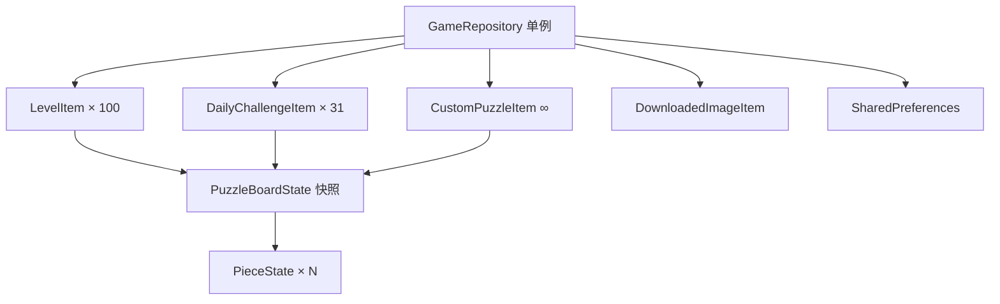
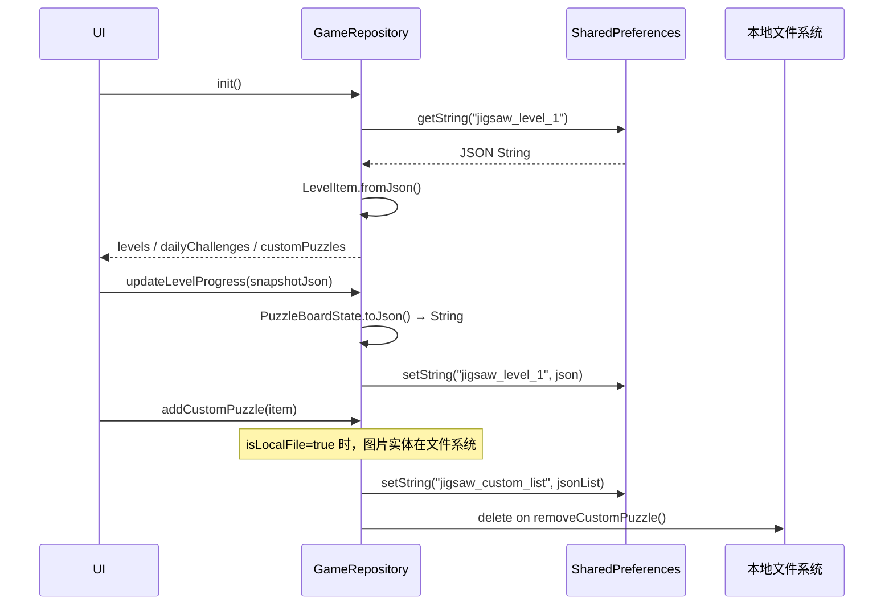

# 拼图游戏 App 数据架构总结

## 概览

数据分为两大层次：**持久化层**（SharedPreferences）和**运行时内存层**（Dart 对象），通过 `GameRepository` 单例统一管理，序列化格式全部为 JSON。

---

## 一、数据模型体系

---

## 二、各数据模型详解

### 1. `LevelItem` — 主线关卡

**文件**：[`level_item.dart`](file:///c:/Home/Projects/jigsawpuzzle/lib/data/models/level_item.dart)

| 字段 | 类型 | 说明 |
|------|------|------|
| `id` | `String` | 格式 `"level_1"` ~ `"level_100"` |
| `index` | `int` | 关卡编号 1~100 |
| `title` | `String` | 显示标题，如 `"第 1 关"` |
| `assetPath` | `String` | 内置图片资源路径 |
| `difficulty` | `PuzzleDifficulty` | 行列数（序列化为 `rows`/`cols`） |
| `isUnlocked` | `bool` | 是否解锁 |
| `isCompleted` | `bool` | 是否完成 |
| `progressPercent` | `int` | 进度 0~100 |
| `stars` | `int` | 星级 0~3 |
| `bestTimeSeconds` | `int` | 最优完成时间（秒） |
| `savedSnapshotJson` | `String?` | 中途存档快照（JSON 字符串） |
| `completedPieceCounts` | `List<int>` | 每次完成时的碎片数，用于标记难度通关记录 |

**难度分级**（100关线性递增）：
- 第 1~10 关：4×4 = 16 块
- 第 11~25 关：5×5 = 25 块
- 第 26~50 关：6×6 = 36 块
- 第 51~75 关：8×8 = 64 块
- 第 76~90 关：10×10 = 100 块
- 第 91~100 关：15×15 = 225 块

---

### 2. `DailyChallengeItem` — 每日挑战

**文件**：[`daily_challenge.dart`](file:///c:/Home/Projects/jigsawpuzzle/lib/data/models/daily_challenge.dart)

| 字段 | 类型 | 说明 |
|------|------|------|
| `id` | `String` | 格式 `"daily_2026-08-26"` |
| `date` | `String` | `"YYYY-MM-DD"` 格式 |
| `dayNumber` | `int` | 本月第几天 1~31 |
| `title` | `String` | 图片标题 |
| `author` | `String` | 图片作者 |
| `assetPath` | `String` | 本地兜底资源路径 |
| `difficulty` | `PuzzleDifficulty` | 按天数规律变化 |
| `isCompleted`/`progressPercent`/`bestTimeSeconds`/`savedSnapshotJson`/`completedPieceCounts` | 同上 | 进度字段同 LevelItem |

**数据来源**：[`bing_daily_data.dart`](file:///c:/Home/Projects/jigsawpuzzle/lib/data/bing_daily_data.dart) 中预埋的 31 条 `BingDailyItem` 静态数据，难度按日期奇偶规律分配（4×4 / 6×6 / 8×8 交替）。

---

### 3. `CustomPuzzleItem` — 自定义拼图（UGC）

**文件**：[`custom_puzzle_item.dart`](file:///c:/Home/Projects/jigsawpuzzle/lib/data/models/custom_puzzle_item.dart)

| 字段 | 类型 | 说明 |
|------|------|------|
| `id` | `String` | 唯一 ID |
| `title` | `String` | 用户自定义标题 |
| `imagePathOrUrl` | `String` | 本地文件路径 或 网络 URL |
| `isLocalFile` | `bool` | 区分本地/在线图片 |
| `difficulty` | `PuzzleDifficulty` | 用户选择的难度 |
| `createdAt` | `DateTime?` | 创建时间，ISO 8601 格式存储 |
| `sourceType` | `String` | `'gallery'`/`'online'`/`'preset'` |
| `sourcePlatform` | `String` | `'本地相册'`/`'Unsplash'`/`'Pixabay'`/`'官方预置'` 等 |
| `sourceUrl` | `String?` | 原始网络图片 URL |
| 进度字段 | 同上 | 同 LevelItem |

---

### 4. `DownloadedImageItem` — 网络图片下载记录

**文件**：[`downloaded_image_item.dart`](file:///c:/Home/Projects/jigsawpuzzle/lib/data/models/downloaded_image_item.dart)

| 字段 | 类型 | 说明 |
|------|------|------|
| `id` | `String` | UUID 格式 |
| `localPath` | `String` | 已下载到本地的文件路径 |
| `sourcePlatform` | `String` | 来源平台名称 |
| `sourceUrl` | `String` | 原始下载 URL |
| `width` / `height` | `int` | 图片尺寸（像素） |
| `fileSizeBytes` | `int` | 文件字节大小 |
| `downloadedAt` | `DateTime` | 下载时间，ISO 8601 存储 |

---

### 5. `PuzzleBoardState` + `PieceState` — 游戏内快照

**文件**：[`puzzle_state.dart`](file:///c:/Home/Projects/jigsawpuzzle/lib/logic/models/puzzle_state.dart)

这是游戏中途存档的核心结构，以 JSON 字符串形式嵌入到上面各条目的 `savedSnapshotJson` 字段。

**`PuzzleBoardState` 字段：**

| 字段 | 类型 | 说明 |
|------|------|------|
| `version` | `int` | 固定为 `2`，用于向后兼容 |
| `levelId` | `String` | 关联的关卡 ID |
| `seed` | `int` | 随机种子（用于复现拼图形状） |
| `rows` / `cols` | `int` | 网格行列数 |
| `rotationEnabled` | `bool` | 是否开启旋转模式 |
| `elapsedSeconds` | `int` | 已用时间（秒） |
| `hintsUsed` | `int` | 使用提示次数 |
| `pieces` | `List<PieceState>` | 所有碎片状态列表 |

**`PieceState` 字段（每个碎片）：**

| 字段 | 序列化键 | 说明 |
|------|----------|------|
| `id` | `"id"` | 碎片唯一编号 0 ~ rows×cols-1 |
| `r` | `"r"` | 目标行坐标 |
| `c` | `"c"` | 目标列坐标 |
| `nx` | `"nx"` | 当前归一化 X 坐标（相对棋盘宽） |
| `ny` | `"ny"` | 当前归一化 Y 坐标（相对棋盘高） |
| `clusterId` | `"g"` | 合并群组 ID（相邻拼接的碎片共享） |
| `rot` | `"rot"` | 旋转角度（0=0°, 1=90°, 2=180°, 3=270°） |

---

### 6. `PuzzleDifficulty` — 难度配置

**文件**：[`puzzle_model.dart`](file:///c:/Home/Projects/jigsawpuzzle/lib/logic/puzzle_model.dart)

纯配置对象，不单独持久化，通过 `rows`/`cols` 两个整数序列化/反序列化：

- 支持 5 种宽高比：1:1 / 2:3 / 3:2 / 3:4 / 4:3
- 每种宽高比下有 4~7 个难度档位（16块 → 300块）
- 从 `PuzzleDifficulty.presets` 静态列表匹配恢复

---

## 三、持久化方式

**存储后端**：`SharedPreferences`（KV 存储）

| Key 模式 | Value 类型 | 说明 |
|----------|-----------|------|
| `jigsaw_level_{N}` | `String` (JSON) | 第 N 关的 `LevelItem` 完整 JSON |
| `jigsaw_daily_{YYYY-MM-DD}` | `String` (JSON) | 指定日期的 `DailyChallengeItem` JSON |
| `jigsaw_custom_list` | `String` (JSON Array) | 所有 `CustomPuzzleItem` 的 JSON 数组 |
| `jigsaw_setting_sound` | `bool` | 音效开关 |
| `jigsaw_setting_haptic` | `bool` | 震动开关 |
| `jigsaw_setting_grid_preview` | `bool` | 网格参考线开关 |
| `jigsaw_setting_piece_scatter_mode` | `String` | `'tray'`（托盘模式）或 `'tabletop'`（桌面散落）|
| `jigsaw_setting_selected_background` | `String` | 选中的背景图 asset 路径 |
| `jigsaw_stat_total_completed` | `int` | 总完成关卡数 |
| `jigsaw_stat_total_pieces_snapped` | `int` | 总拼合碎片数 |
| `jigsaw_stat_total_play_time` | `int` | 总游戏时长（秒） |

> [!NOTE]
> 关卡和每日挑战各自独立存储（每条一个 Key），自定义拼图则整体存为一个 JSON 数组。

---

## 四、数据流示意

---

## 五、静态资源（Assets）

- **背景图**：`assets/bg/tile_000.webp` ~ `tile_011.webp`（12 张 WebP）
- **拼图图片**：`assets/images/sample_*.jpg/webp`（内置样图）
- 用户自定义图片存储在设备**本地文件系统**（非 assets），路径记录在 `CustomPuzzleItem.imagePathOrUrl`

---

## 六、设计特点小结

| 特点 | 说明 |
|------|------|
| **单例 Repository** | `GameRepository.instance` 全局唯一，持有三类数据的内存列表 |
| **不可变模型** | 所有模型用 `copyWith` 模式更新，不直接修改字段 |
| **嵌套快照** | 游戏中途存档以 JSON String 嵌套在关卡记录里，完成后清空 |
| **completedPieceCounts** | 记录每次通关的碎片数，支持同一关卡多难度完成状态 |
| **向后兼容** | `fromJson` 都有默认值兜底，`PieceState` 支持旧版键名 `clusterId` |
