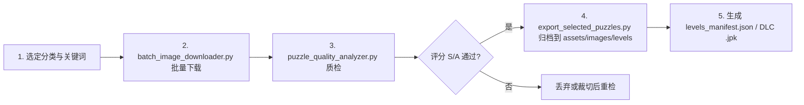

# 拼图游戏素材图片批量获取方案：免费分类图库与自动化下载指南

> **文档状态**：已落地 / 可执行  
> **面向模块**：`assets/images/levels/` 素材扩充、`scripts/batch_image_downloader.py` 自动化管线、`scripts/puzzle_quality_analyzer.py` 质检  
> **创建日期**：2026-08-25  
> **关联设计**：`docs/puzzle-content-storage-and-expansion-design.md`, `docs/online-image-picker-and-source-tracking-design.md`

---

## 1. 需求与目标

为拼图游戏按 **动物 / 植物 / 建筑 / 风光 / 动漫插画** 等分类批量获取高质量免费可商用图片，要求：
1. 分类清晰，支持按关键词/主题批量拉取
2. 免费可商用、无需署名或仅需轻量署名，适合内嵌到 App `assets/` 或云端 DLC
3. 支持 API / 工具自动化批量下载，而非手工单张另存
4. 图片分辨率 ≥ 1920px，适配拼图切片与 `puzzle_quality_analyzer.py` 质检

---

## 2. 免费分类图库推荐（按优先级排序）

### 2.1 核心推荐（满足批量 + 分类 + 商用）

| # | 网站 | 地址 | 分类覆盖 | 许可 | 批量能力 | 备注 |
|---|------|------|----------|------|----------|------|
| 1 | **Pixabay** | `https://pixabay.com/zh/` | 动物/植物/建筑/风光/插画/背景，最全，支持中文搜索 | Pixabay Content License，免费商用无需署名，不可原图转售 | ★★★★★ 官方 API `https://pixabay.com/api/docs/`，`per_page` 200，支持 `category`、`q`、`image_type`、`orientation`、`min_width` 过滤 | **首选**。分类标签最准，已做多尺寸分级（`largeImageURL` 1280 / `imageURL` 原图）|
| 2 | **Pexels** | `https://www.pexels.com/zh-cn/` | 动物/自然/城市/建筑/风光/花卉，精选集质量高 | Pexels License，免费商用无需署名 | ★★★★★ 官方 API `https://www.pexels.com/api/`，`/v1/search?query=&per_page=80`，需 `Authorization` Header | 风光和建筑大片多，适合 `landscape`/`architecture` |
| 3 | **Unsplash** | `https://unsplash.com/` | Topics/Collections：Animals, Plants, Architecture, Nature, Travel, Wallpapers | Unsplash License，免费商用无需署名 | ★★★★☆ 官方 API `https://unsplash.com/developers`，`/search/photos?query=`，限流 50次/小时（免费）| 4K+ 超清，适合 `featured` 精选 |
| 4 | **Wikimedia Commons** | `https://commons.wikimedia.org/` | `Category:Animals / Plants / Architecture / Landscapes` 分类树最细，可精确到物种/建筑 | CC0 / CC-BY / CC-BY-SA（单张需确认） | ★★★★☆ `action=query&generator=categorymembers` API + `gallery-dl` | 适合学术精确分类，需脚本过滤 CC0 |
| 5 | **Openverse** | `https://search.openverse.engineering/` | 聚合 6亿+ CC 图片，支持按 `category` + `license` 过滤 | CC0/CC-BY 等，可筛选 `commercial` | ★★★★☆ 官方 API `https://api.openverse.engineering/v1/images/` | 用来兜底查 CC0 零风险图 |

### 2.2 备选/补充

| 网站 | 特点 | 许可 |
|------|------|------|
| StockSnap.io `https://stocksnap.io/` | CC0，每周精选，分类：Animals/Nature/City | CC0 |
| Burst (Shopify) `https://burst.shopify.com/` | 电商/生活类图多 | Shopify License 免费商用 |
| Foodiesfeed / Picjumbo | 垂直细分（美食/城市） | 免费商用 |

> **规避**：百度图片、花瓣、千图网等无明确许可的站点，不可直接打包进 App。

### 2.3 分类关键词映射（本项目 `levels_manifest.json` 对应）

| 本项目分类 `id` | 推荐英文搜索关键词（API `q`/`query`） | 对应图库 Topics |
|---|---|---|
| `animals` | `animals, cute animals, wildlife, pets, cats dogs birds` | Pixabay `animals` / Pexels `animals` / Unsplash `Animals` |
| `plants` | `plants, flowers, forest, garden, macro flowers` | Pixabay `nature`+`flowers` / Unsplash `Plants` |
| `architecture` | `architecture, cityscape, building, castle, modern architecture` | Pixabay `buildings` / Unsplash `Architecture` |
| `landscape` | `landscape, mountains, sea, sunset, nature landscape` | Pixabay `nature` / Unsplash `Nature` |
| `anime` | 建议 Pixabay `illustration` + `anime illustration`，或 Unsplash 搜 `illustration`；二次元建议另用 Pixiv 免费 + 自有插画 | Pixabay `illustration` |
| `featured` | 各分类 Top 热门 + `editors_choice=true` (Pixabay) | Pexels `curated` / Unsplash ` Editorial` |

---

## 3. 批量下载方法（3 种，按推荐度排序）

### 方法 A：API + Python 脚本（最推荐，自动化、可追溯）

**优势**：可按分类自动建文件夹、过滤分辨率、去重、限流、记录来源 URL 与许可，便于后续 `puzzle_quality_analyzer.py` 质检与 `levels_manifest.json` 生成。

**前置**：免费注册获取 Key
- Pixabay: `https://pixabay.com/api/docs/` → 注册后 `https://pixabay.com/accounts/` 复制 Key
- Pexels: `https://www.pexels.com/api/` → Create API Key
- Unsplash: `https://unsplash.com/developers` → Create App（免费 50 req/h）
- Openverse: 无需 Key

**脚本**：`scripts/batch_image_downloader.py`（本方案已落地）

```powershell
# 1. 安装依赖
pip install requests pillow tqdm

# 2. 配置 Key（任选其一，推荐 Pixabay 起步）
$env:PIXABAY_API_KEY="你的Key"
$env:PEXELS_API_KEY="你的Key"
$env:UNSPLASH_ACCESS_KEY="你的Key"

# 3. 按默认 4 分类各下 50 张到 assets/images/levels/
python scripts/batch_image_downloader.py --source pixabay --per-category 50

# 4. 指定分类与数量
python scripts/batch_image_downloader.py --source pexels --categories animals landscape --per-category 80 --min-width 1920

# 5. 仅预览不下载（检查命中数）
python scripts/batch_image_downloader.py --source pixabay --dry-run --per-category 20
```

脚本特性：
- 自动创建 `assets/images/levels/{animals,plants,architecture,landscape}/`
- 过滤 `min_width` / `orientation` / `image_type=photo`
- 并发下载 + 重试 + 去重（按 `id`/`hash`）
- 生成 `download_manifest.json` 记录 `sourceUrl`、`license`、`author`，对接 `online-image-picker-and-source-tracking-design.md` 的溯源需求
- 下载后可直接跑质检：`python scripts/puzzle_quality_analyzer.py --source assets/images/levels --html temp/report.html`

### 方法 B：浏览器插件（一键批量，无代码）

适合非技术/小批量（100 张内）：

1. 安装插件：`Fatkun Batch Download Image` 或 `Imageye - Image Downloader`（Chrome/Edge 商店）
2. 打开分类搜索页，如 `https://pixabay.com/zh/images/search/风景/` 或 `https://www.pexels.com/zh-cn/search/动物/`
3. 插件自动解析页面所有原图 → 筛选 `宽度 >1920`、`类型 JPG/WebP` → `一键下载` 到本地
4. 按分类页分批下载，手动分到 `animals/` `landscape/` 等目录

> 优点：零配置；缺点：无溯源、无去重、需手工分类。

### 方法 C：命令行工具 gallery-dl / aria2 / wget（适合 WSL/PowerShell 批量）

```powershell
# gallery-dl：支持 Pexels/Pixabay/Unsplash 等 100+ 站点开箱即用
pip install gallery-dl
gallery-dl "https://www.pexels.com/search/animals/" --range 1-100 -D "assets/images/levels/animals"
gallery-dl "https://pixabay.com/zh/images/search/风景/" --range 1-100 -D "assets/images/levels/landscape"

# 已有 URL 列表时用 aria2 高速并发
aria2c -i urls.txt -x 10 -j 20 -d assets/images/levels/plants

# 纯 wget 循环（PowerShell）
Get-Content urls.txt | ForEach-Object { wget $_ -OutFile "assets/images/levels/architecture/$([IO.Path]::GetFileName($_))" }
```

---

## 4. 推荐工作流（与本项目管线打通）



**一步到位命令**：

```powershell
# 下载 4 分类各 50 张（Pixabay）
python scripts/batch_image_downloader.py --source pixabay --per-category 50 --min-width 1920 --out-dir assets/images/levels

# 质检并生成 HTML 报告
python scripts/puzzle_quality_analyzer.py --source assets/images/levels --html temp/batch_download_report.html --json temp/batch_download_report.json

# 交互式挑选 S/A 级后一键归档（示例：仅归档 S+A）
python scripts/export_selected_puzzles.py --source temp/batch_download_report.json --filter-grade S,A --out-dir assets/images/levels
```

---

## 5. 关键注意事项

### 5.1 许可与合规
- Pixabay/Pexels/Unsplash 均允许 **免费商用、无需署名**，但 **不可原图转售**；打包进游戏 App 属于允许的衍生使用
- Wikimedia/Openverse 单张需确认 `license` 字段，脚本已过滤 `cc0`/`by`，`by-sa` 需评估是否可接受
- 建议保留 `download_manifest.json` 中的 `sourceUrl` + `author` + `license`，满足合规溯源

### 5.2 画质与适玩度建议
- **分辨率**：`min_width ≥1920`，`min_height ≥1080`，保证切片后清晰；`puzzle_quality_analyzer.py` 会评估 `max_recommended_grid`（16~225 块）
- **比例**：优先 `horizontal` / `4:3` / `3:2` / `1:1`，竖屏 `9:16` 需裁切
- **避坑**：纯色天空/大面积纯白/虚化背景图 `core_dead_ratio >0.22` 会被判 `F`，脚本已通过 `safesearch` + `editors_choice` 预过滤

### 5.3 限流与效率
- Pixabay 免费限 `10000` 请求/月，`per_page` 设 50~200，分批 `page=1..20` 即可拉上千张
- Pexels 限 `200` 请求/小时，Unsplash 限 `50` 请求/小时，脚本内置 `rate_limit_delay` 与 `retry 3` 次
- 建议首次小批量 `--per-category 20 --dry-run` 验证关键词命中率，再全量

### 5.4 存储与扩展
- 内置关卡走 `assets/images/levels/{category}/` + `assets/data/levels_manifest.json`（见 `puzzle-content-storage-and-expansion-design.md`）
- 海量扩充走云端 DLC `.jpk`（Zip）或 `daily/` Manifest，无需随包体积膨胀

---

## 6. 快速开始清单

- [ ] 注册 Pixabay/Pexels API Key，写入环境变量或 `scripts/.env`
- [ ] `pip install requests pillow tqdm`
- [ ] `python scripts/batch_image_downloader.py --source pixabay --per-category 30 --dry-run`
- [ ] 确认命中后去掉 `--dry-run` 正式下载
- [ ] `python scripts/puzzle_quality_analyzer.py --source assets/images/levels --html temp/report.html` 查看 S/A 级占比
- [ ] 挑图后归档并更新 `levels_manifest.json`

---

## 7. 附录：常用搜索 URL（可直接浏览器打开验证）

- Pixabay 动物：`https://pixabay.com/zh/images/search/动物/?image_type=photo&orientation=horizontal&min_width=1920`
- Pexels 风光：`https://www.pexels.com/zh-cn/search/风景/`
- Unsplash 建筑：`https://unsplash.com/s/photos/architecture`
- Wikimedia 动物分类：`https://commons.wikimedia.org/wiki/Category:Animals`
- Openverse CC0 动物：`https://search.openverse.engineering/search/image?q=animals&license=cc0`
