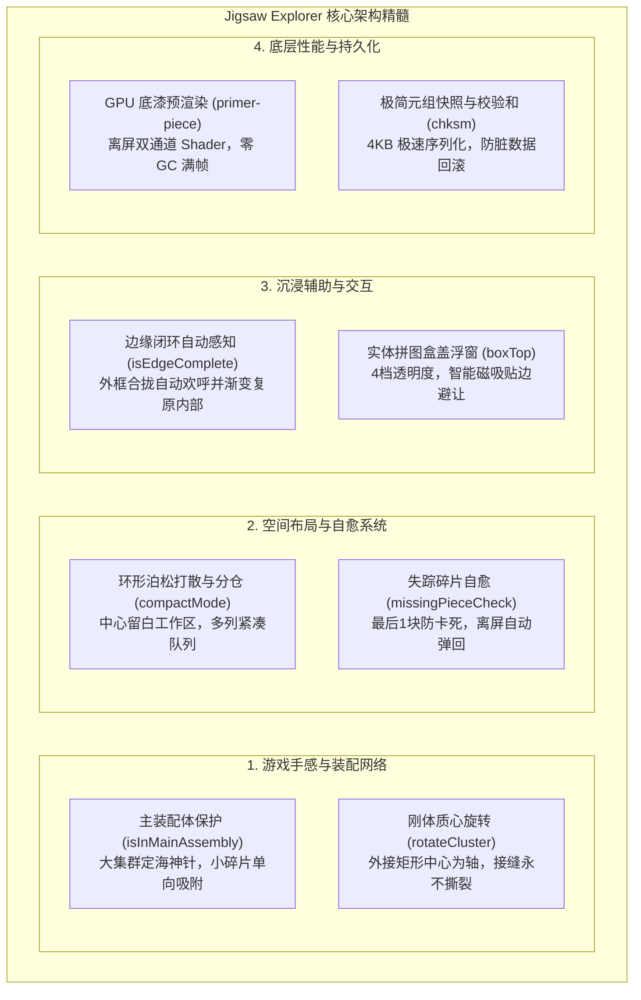

# Jigsaw Explorer 拼图引擎架构深度审计与演进备忘

> **文档标识**：`docs/jigsaw-explorer-architecture-insights-and-future-roadmap.md`  
> **创建日期**：2026-08-25 (GMT+8)  
> **审计对象**：`temp/code/jigex-prog.pretty.js`（Jigsaw Explorer 核心引擎，约 8,911 行前端源码）  
> **文档目标**：系统性提炼商业级经典拼图经过全球数千万用户实战检验的 8 大优秀架构设计、隐藏算法与交互细节，为本项目后续版本迭代提供权威技术路线图。

---

## 1. 架构审计背景

Jigsaw Explorer 是全球公认最流畅、玩家留存最高的 Web/原生拼图游戏之一。其前端引擎在手势手感、大规模切片（500~1000 块）渲染性能、复杂集群网络管理和用户防挫败感机制上沉淀了十余年的精细打磨。

通过对 `temp/code/jigex-prog.pretty.js` 完整源码的逐行逆向与控制流审计，我们总结出其最核心的 **8 项卓越设计与算法精髓**，并为当前基于 Flutter + Flame 的重构项目规划具体的落地演进方案。

---

## 2. 8 大核心优秀设计深度拆解



---

### 2.1 主装配体识别与“定海神针”单向吸附 (`isInMainAssembly`)

#### A. 源码实现原理
引擎内部实时追踪每一个碎片组（`Group / Cluster`）的规模与外框边角块数量：
```javascript
_.Piece.prototype.isInMainAssembly = function() {
    var e = _.Puzzle.curr;
    return this.group && (
        this.group.edgeCount > e.pieces.numEdges / 2 || 
        this.group.length > e.pieces.length / 2
    );
};
```
当某个集群包含的碎片数量超过总数的 **$50\%$**，或者外边缘块数量超过外框总数的一半时，该集群被确立为**「主装配体（Main Assembly）」**。

#### B. 核心体验收益
- **消除反向拉扯违和感**：在普通的吸附算法中，若两组碎片吸附，往往互相平移到中点。但当玩家把一块小碎片拼向已经拼好的半幅主图时，如果反作用力把辛辛苦苦拼好的大半幅拼图拽动偏位，会产生极其强烈的挫败感。
- **单向吸附机制**：主装配体具备最高空间惯性（“定海神针”），永远只让单块或小集群平滑平移吸附对齐到主装配体上，主装配体坐标纹丝不动。
- **工作区基准锚定**：主装配体自动与棋盘网格严格锁定，防止误拖拽将半幅拼图甩出可视屏幕。

---

### 2.2 环形泊松打散与紧凑分仓排布 (`scatter` & `compactMode`)

#### A. 源码实现原理
- **环形泊松外围发散 (`getScatterSequence`)**：
  开局打散并非纯随机在屏幕乱抛，而是以棋盘中心为基准向四周边缘呈梯度环形散开，**保证拼图中央核心工作区永远干净留白**。
- **高密度紧凑模式 (`compactMode`)**：
  当切片规格较大（如 100~400 块）或设备屏幕长宽比受限时，系统启动紧凑模式，计算每块碎片的最小外接矩形与间距：
  $$W_{\text{slot}} = \text{piece.width} + \text{padding}, \quad H_{\text{slot}} = \text{piece.height} + \text{padding}$$
  将未就位碎片自动在桌面外围分仓以多列网格矩阵有序停泊。

#### B. 核心体验收益
彻底解决了传统拼图游戏中，碎片开局相互严重堆叠遮挡成“一团乱麻”、玩家需要花费数分钟手动一块块扒开的痛苦痛点。

---

### 2.3 边缘闭环自动感知与动态复原 (`isEdgeComplete` & `showEdgesOnly`)

#### A. 源码实现原理
```javascript
_.Puzzle.prototype.showEdgesOnly = function(enable, action) {
    var isComplete = this.pieces.isEdgeComplete;
    // ...
};
```
系统不仅提供「仅显示边缘边框块」的过滤功能，同时在碎片网格中实时维护 `isEdgeComplete`（边缘是否已全部归位闭环）。

#### B. 核心体验收益
- **外框合拢自动感知**：玩家通常的解题策略是“先拼外框，再填内部”。当玩家拼完最后一块边缘碎片使外框形成闭环时；
- **智能平滑复原**：无需玩家去顶栏手动寻找并关闭筛选按钮，引擎自动检测到闭环，播放外框金光粒子与轻微音效，并以 `Tween` 动画将所有处于透明度 0 的内部碎片平滑淡入恢复到桌面，仪式感与操作连贯性极佳。

---

### 2.4 “失踪碎片”后台自检与防丢自愈 (`missingPieceCheck`)

#### A. 源码实现原理
```javascript
_.missingPieceCheck = function() {
    var puzzle = _.Puzzle.curr;
    if (puzzle && puzzle.stateVar.val.eq(IN_GAME)) {
        var pieces = puzzle.pieces;
        // 当只剩最后 1~2 块未放入集群时
        if (puzzle.pieces.length - 1 === mainGroup.length) {
            var missing = findUnassembledPiece();
            if (isOutOfBoundsOrHidden(missing)) {
                missing.animateTo(viewportCenter);
            }
        }
    }
};
```

#### B. 核心体验收益
- **根治玩家最抓狂痛点**：在多轮缩放（Zoom In/Out）和平移（Pan）后，最后一块碎片极易因视口裁切被甩出屏幕外，或者被浮动窗口/工具栏遮挡。
- **静默智能自愈**：后台检测到拼图接近完成（$\ge 98\%$）且有碎片处于视口不可见区域时，自动将其柔和弹回当前屏幕正中央，杜绝“找不到最后一块导致无法通关”的恶性体验。

---

### 2.5 实体拼图盒盖参考浮窗 (`boxTop`)

#### A. 源码实现原理
内置仿真实体拼图包装盒盖（Box Top）独立浮动组件：
- **4 档透明度微调**：提供 `[70%, 45%, 25%, 0%]` 四档透明度快速循环切换；
- **智能边缘吸附停泊**：拖动盒盖靠近屏幕任意边缘时，自动施加磁吸吸附贴边，避免遮挡中央拼图操作区；
- **双击瞬时放大**：双击盒盖弹出高清原图，点击背景即刻缩回原位。

#### B. 核心体验收益
相比于单调的背景水印透视，盒盖浮窗为喜欢“对照实物封面拼图”的硬核玩家提供了极具代入感的临摹对照工具。

---

### 2.6 极简定长元组序列化与散列校验和 (`recordsManager` & `chksm`)

#### A. 源码实现原理
- **定长元组格式 (`recTuple`)**：
  不采用冗长 JSON 键值对，而是使用紧凑定长数组记录每块碎片：
  $$\text{PieceTuple} = [\text{id}, \text{nx}, \text{ny}, \text{rot}, \text{hasMoved}, \text{clusterId}]$$
  $500$ 块碎片的完整存档体积小于 **$4\text{KB}$**，大幅降低 I/O 耗时与内存开销。
- **时间与状态校验和 (`chksm`)**：
  $$\text{Checksum} = \sum (\text{id}^2 \cdot 37 + \text{step} \cdot 37^2 + \text{timer} \cdot 37^3) \pmod{2^{31}-1}$$
  每次保存写入校验和。若 LocalStorage 异常损坏或被非预期修改，系统自动防御性恢复至最近的完整有效快照，杜绝因脏数据导致游戏白屏卡死。

---

### 2.7 集群刚体质心旋转算法 (`rotateCluster` / `pivotPiece`)

#### A. 源码实现原理
当旋转一个由多块碎片拼接而成的 Cluster 时：
1. **计算集群几何外接矩形中心（Bounding Box Center）**：
   $$C_x = \frac{\min_{p}(x) + \max_{p}(x + w)}{2}, \quad C_y = \frac{\min_{p}(y) + \max_{p}(y + h)}{2}$$
2. **正交刚体旋转变换矩阵**：
   对集群内每一块碎片 $P_k$，绕质心 $(C_x, C_y)$ 应用顺时针 $90^\circ$ 刚体旋转：
   $$\begin{pmatrix} P_k.x' \\ P_k.y' \end{pmatrix} = \begin{pmatrix} C_x - (P_k.y + P_k.h/2 - C_y) - P_k.w'/2 \\ C_y + (P_k.x + P_k.w/2 - C_x) - P_k.h'/2 \end{pmatrix}$$
3. **动画插值同步**：整个组使用统一的缓动控制器驱动弧度变化。

#### B. 核心体验收益
旋转过程中，所有拼合碎片之间的贝塞尔卡扣接缝**物理上严丝合缝、永不撕裂变形**。

---

### 2.8 GPU 离屏底漆预渲染与抗锯齿管线 (`primer-piece` & 双通道 Shader)

#### A. 源码实现原理
- 在游戏初始化阶段，引擎先在离屏 GPU 纹理上预烘焙单块碎片的贝塞尔封闭剪裁遮罩（Primer Piece）；
- 在渲染循环中，直接使用该预渲染遮罩执行纹理采样（Texture Sampling），同时叠加双通道法向微切线（Bevel Angle）与环境光遮挡（AO）阴影。

#### B. 核心体验收益
避免了在每一帧渲染中重复调用昂贵的 Canvas CPU 贝塞尔 `clipPath` 操作，在 1000 块超大拼图下依然保持 60fps 满帧运行与零 GC 顿挫。

---

## 3. Flutter / Flame 项目落地演进路线图

基于当前项目的技术栈现状，规划以下 3 个阶段的落地演进计划：

| 阶段 | 核心任务 | 涉及模块 | 落地状态 / 预期成果 |
| :--- | :--- | :--- | :--- |
| **Phase 1 (手感质变)** | **主装配体单向吸附 (`isInMainAssembly`)** | `lib/logic/engine/puzzle_engine.dart`<br>`lib/game/jigsaw_puzzle_game.dart` | ✅ **已落地**：吸附合并按规模识别主装配体，仅小碎片单向对齐，大集群坐标静止 |
| **Phase 1 (体验闭环)** | **边缘拼完自动闭环复原 (`isEdgeComplete`)** | `lib/logic/models/puzzle_board_state.dart`<br>`lib/game/jigsaw_puzzle_game.dart` | ✅ **已落地**：`PuzzleBoardState.isEdgeComplete` + 仅看边缘模式下外框闭环自动解除筛选并淡入内部碎片 |
| **Phase 2 (防错自愈)** | **失踪碎片防丢自检 (`missingPieceCheck`)** | `lib/game/jigsaw_puzzle_game.dart` | ✅ **已落地**：剩余未拼碎片 ≤2 时自动巡检视口外碎片并弹回可视区 |
| **Phase 2 (交互升级)** | **实体拼图盒盖浮窗 (`BoxTopOverlay`)** | `lib/widgets/box_top_component.dart`<br>`lib/pages/game_page.dart` | ⏳ 未落地：当前以「底图透视 Ghost + 原图全景眼睛」实现对照参考，BoxTop 浮窗作为后续增强项 |
| **Phase 3 (极限性能)** | **GPU 离屏底漆与预烘焙遮罩 (`PrimerMask`)** | `lib/game/puzzle_piece_component.dart` | ⏳ 未落地：当前命中测试与裁剪为矢量逐帧路径计算，GPU 预烘焙作为 500~1000 块极高性能预留项 |

---

## 4. 总结

Jigsaw Explorer 源码的精髓在于**「极度尊重玩家的直觉认知，用严密的数学与状态机防御机制消灭一切挫败感」**。通过将上述机制系统性引入我们的架构中，将使游戏在手感细腻度、操作顺畅度与健壮性上达到行业顶尖水准。
