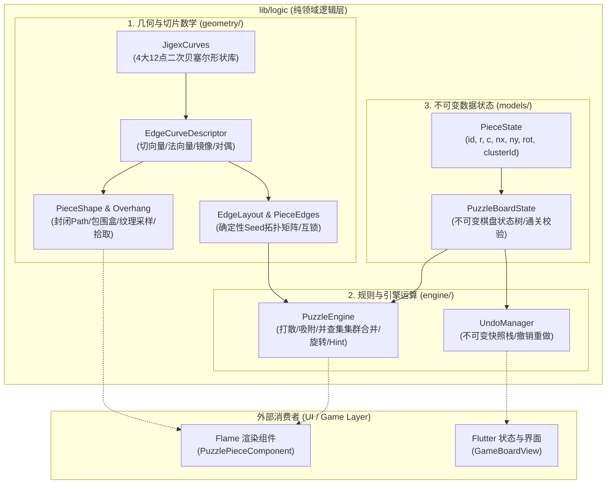
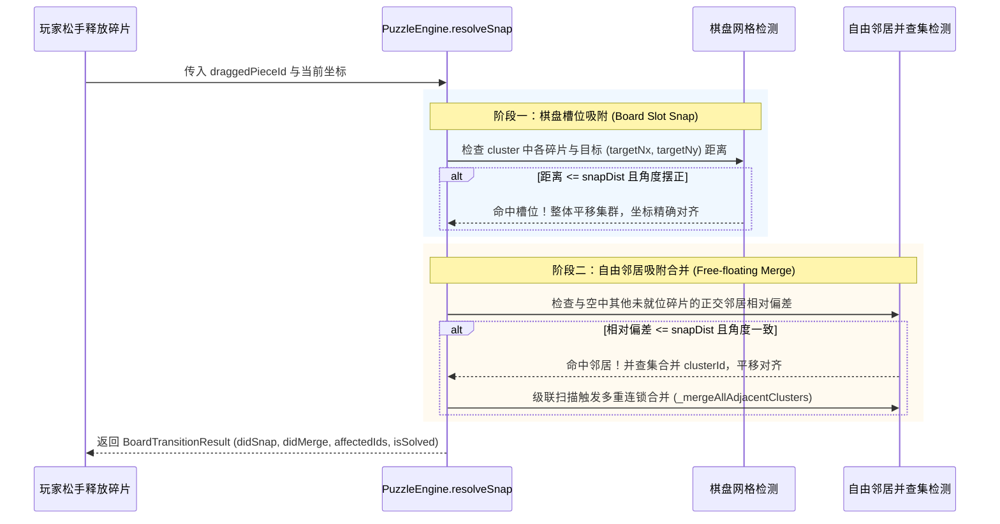

# 拼图核心 Logic 架构与技术实现备忘文档

> **文件标识**：`docs/jigsaw-logic-architecture-and-technology.md`  
> **文档版本**：v1.0.0 (2026-08-24)  
> **模块定位**：`lib/logic/` —— 纯领域逻辑层（Domain Layer），完全解耦于 UI 与渲染引擎。

---

## 1. 架构总览与分层设计

`logic` 模块是拼图游戏的核心数学模型与状态机大脑，遵循**纯领域驱动设计（DDD）**原则。它不依赖任何具体的游戏引擎（如 Flame）或 Flutter Widget 视图，仅依赖基本的 Dart 核心库与 `dart:ui` 基础数学对象（如 `Offset`, `Path`, `Rect`），具备 **100% 独立无头运行能力（Headless Execution）** 与高覆盖率的极速单元测试能力。



---

## 2. 几何与切片数学子系统 (`lib/logic/geometry/`)

### 2.1 经典 12 点二次贝塞尔形状库 (`edge_curve.dart`)

为彻底解决早期参数化公式产生的“细柄蘑菇头/大头针”畸形形态，系统 1:1 完整引入了经过 Jigsaw Explorer 千万用户验证的 **4 大经典模具矩阵**。

每条边由 12 个控制点组成，构成 6 段平滑衔接的二次贝塞尔曲线（`quadraticBezierTo`）：
- 偶数索引 `i = 0, 2, 4, 6, 8, 10` 为**控制点（Control Point）**；
- 奇数索引 `i = 1, 3, 5, 7, 9, 11` 为**锚点（Anchor Point）**。

| 形状枚举 (`EdgeShapeType`) | 视觉特征 | 凸出峰顶深度 (`from`) | 适用场景 |
| :--- | :--- | :--- | :--- |
| **`ball`** | 对称圆球形，球头饱满，颈部收口自然 | `+29.54%` | 标准经典关卡主力形状 |
| **`stub`** | 宽矮粗壮形，基座宽阔平缓 | `+23.48%` | 较小碎片或高密度大网格 |
| **`sock`** | 短袜俏皮歪头形，左右明显不对称 | `+34.46%` | 增加手切拼图的辨识度与趣味性 |
| **`finger`** | 修长手指形，纵向平缓微偏 | `+34.46%` | 平滑细腻的卡扣插拔体验 |

```
归一化坐标定义：
along ∈ [0.0, 1.0] (从起点 0.0 沿边行进到终点 1.0)
from  ∈ [-0.18, +0.35] (垂直边法线，+为外凸 Tab，-为内凹 Blank/颈部内缩)

        ┌───────────── Peak (+0.295) ─────────────┐
       /                                           \
      /  (Ctrl 2)                         (Ctrl 3)  \
     │                                               │
    Anchor 1 (左颈)                                Anchor 3 (右颈)
     \                                               /
      \── Ctrl 1 (-0.098)                 Ctrl 4 ──/
         \                               /
      Anchor 0                        Anchor 4
         │                               │
       起点 (0.0, 0.0) ───────────── 终点 (1.0, 0.0)
```

### 2.2 空间向量变换、镜像对称与双向回溯 (`EdgeCurveDescriptor`)

#### A. 空间向量与法向构建
给定空间起点 $S$ 与终点 $E$，切向量与外法向量计算如下：
$$\vec{u} = \frac{E - S}{\|E - S\|}, \quad \vec{N} = (u_y, -u_x) \quad (\text{顺时针外法线})$$
点空间位置：
$$P = S + \vec{u} \cdot (\text{along} \cdot L) + \vec{N} \cdot (\text{from} \cdot L \cdot \text{sign} \cdot \text{depthScale})$$
其中 $\text{sign} = +1$（Tab 凸出）或 $-1$（Blank 凹进）。

#### B. `bend == false` 水平镜像对称（防飞线核心推导）
当边需要水平镜像翻转时，曲线必须依然**从 $0.0$ 起步平滑行进到 $1.0$**。其 6 段控制点与锚点关于 $\text{along} = 0.5$ 镜像映射公式为：
$$\text{Segment}_s: \begin{cases} \text{Ctrl}_s = 1.0 - P_{10 - 2s}.\text{along} \\ \text{Anchor}_s = \begin{cases} 1.0 - P_{8 - 2s + 1}.\text{along}, & s < 5 \\ 1.0, & s = 5 \end{cases} \end{cases}$$

#### C. `reverse == true` 逆向回溯
当顺时针封闭路径需要从当前笔触位置 $E$ 逆向画回 $S$（如 Bottom 边与 Left 边）：
笔触在 $E(A_5)$，顺次执行：
$$\text{quadraticBezierTo}(C_5, A_4) \to \text{quadraticBezierTo}(C_4, A_3) \to \dots \to \text{quadraticBezierTo}(C_0, S)$$
此映射在几何上 100% 保证顺时针回路的端点完美对齐，零对角线飞线、零毛刺。

### 2.3 包围盒裕量与纹理采样 (`piece_shape.dart`)

```
               ┌───────────────────────────────┐  ▲
               │          Top Tab 凸起          │  │ standardTabRatio = 0.35
    ┌──────────┼───────────────────────────────┼──┼──────────┐
    │          │                               │  │          │
    │ Blank    │                               │  │ Blank    │
    │ 根部外扩 │      Base Cell (W x H)        │  │ 根部外扩 │
    │ (0.15)   │      基础单元格矩形           │  │ (0.15)   │
    │          │                               │  │          │
    └──────────┼───────────────────────────────┼──┴──────────┘
               │         Bottom Tab            │
               └───────────────────────────────┘
```

- **`standardTabRatio = 0.35`**：覆盖 Sock/Finger 最大 $34.46\%$ 的凸出峰顶；
- **`standardBlankRatio = 0.15`**：由于 Jigsaw 卡扣在颈部向内凹陷（$-9.85\%$），邻居凹槽碎片的根部对应会向外微凸（$+9.85\%$）。将 Blank 侧 Overhang 设为 $0.15$，能确保 `srcRect` 完整包含向外微凸部分，**彻底解决四角交汇处的漏底黑色裂缝**；
- **`Flat = 0.0`**：外边框严禁越界采样。

### 2.4 确定性网格拓扑生成 (`edge_layout.dart`)

- **水平分割线矩阵 `_h`**：尺寸 $(rows - 1) \times cols$；
- **垂直分割线矩阵 `_v`**：尺寸 $rows \times (cols - 1)$；
- **公母对偶绑定**：
  - 第 $r$ 行碎片的 Bottom 边与第 $r+1$ 行碎片的 Top 边共享 `_h[r][c]`；
  - 第 $c$ 列碎片的 Right 边与第 $c+1$ 列碎片的 Left 边共享 `_v[r][c]`；
  - 一方为 Tab，另一方为其 `complementary()`（转为 Blank，保持相同的 Shape 和 Bend），从数学源头上杜绝错位。

---

## 3. 规则引擎与运算子系统 (`lib/logic/engine/`)

### 3.1 吸附判定与集群合并流程 (`puzzle_engine.dart`)



#### 关键参数配置依据
- **`defaultSnapRatio = 0.48`**：
  $$\text{snapThreshold} = \min\left(\frac{1}{\text{cols}}, \frac{1}{\text{rows}}\right) \times 0.48$$
  经过多轮玩家手感实验验证，48% 碎片尺寸能够提供极其爽快利落的就位吸附感，同时避免拖动误触相邻槽位。

### 3.2 碎片集群旋转算法 (`rotateCluster`)

当多块碎片已经合并为一个 Cluster 时，点击旋转不能以单片为中心，而必须**以整个集群的几何包围盒中心为轴进行刚体旋转**：
1. 计算集群包围盒中心：
   $$\text{centerNx} = \frac{\min(nx) + \max(nx + w)}{2}, \quad \text{centerNy} = \frac{\min(ny) + \max(ny + h)}{2}$$
2. 对集群内每块碎片应用 90° 顺时针旋转变换矩阵：
   $$\begin{pmatrix} x' \\ y' \end{pmatrix} = \begin{pmatrix} 0 & -1 \\ 1 & 0 \end{pmatrix} \begin{pmatrix} x - \text{centerNx} \\ y - \text{centerNy} \end{pmatrix} = \begin{pmatrix} -(y - \text{centerNy}) \\ x - \text{centerNx} \end{pmatrix}$$
3. 角度累加：`rot = (rot + 1) % 4`。

### 3.3 启发式智能提示算法 (`hintFor`)

提示算法不仅仅是随机找一块碎片，而是模拟真实玩家的解题策略（先拼外框，再拼角块）：
$$\text{Priority} = \text{Corner (角块, 权重 3)} > \text{Border (边框块, 权重 2)} > \text{Center (内部块, 权重 1)}$$

---

## 4. 数据模型与状态管理 (`lib/logic/models/`)

### 4.1 不可变状态树 (`PuzzleBoardState`)

```dart
class PuzzleBoardState {
  final int rows;
  final int cols;
  final int seed;
  final bool rotationEnabled;
  final List<PieceState> pieces;
  final String levelId;

  /// 通关判定：所有碎片均满足归一化坐标误差 <= 0.05 且旋转角度归零
  bool get isSolved => pieces.every((p) => p.isSolved(rows, cols));
}
```

- **不可变设计（Immutability）**：所有状态变更均通过 `copyWith` 生成全新对象，确保快照栈与历史回溯安全无副作用；
- **通关容差（$\epsilon = 0.05$）**：吸附后坐标会被锁定为标准 $targetNx$，浮点容差用于防御极端微小计算误差。

### 4.2 撤销与重做机制 (`UndoManager`)

- **数据结构**：基于 `List<PuzzleBoardState>` 的双向游标栈；
- **容量上限**：`maxHistory = 50` 步，防止长时间游玩导致内存无限制增长；
- **分支裁剪**：发生新移动时，自动清空当前游标之后的全部 Redo 历史。

---

## 5. 质量保证与测试规范

`logic` 模块拥有完备的单元测试保护网，位于 `test/` 目录下：

| 测试文件 | 覆盖模块与测试目标 |
| :--- | :--- |
| [`test/logic/edge_layout_test.dart`](file:///c:/Home/Projects/jigsawpuzzle/test/logic/edge_layout_test.dart) | 验证 Seed 确定性拓扑、外边界平直性、相邻边互锁对偶、顺时针旋转映射 |
| [`test/logic/piece_shape_test.dart`](file:///c:/Home/Projects/jigsawpuzzle/test/logic/piece_shape_test.dart) | 验证 Overhang 裕量分配、fillRect/srcRect 1:1 像素比例、逆向拾取判定 |
| [`test/logic/snap_algorithm_test.dart`](file:///c:/Home/Projects/jigsawpuzzle/test/logic/snap_algorithm_test.dart) | 验证槽位吸附、自由邻居合并、级联连锁合并、通关判定 |
| [`test/logic/undo_manager_test.dart`](file:///c:/Home/Projects/jigsawpuzzle/test/logic/undo_manager_test.dart) | 验证 Undo/Redo 状态回滚、分支裁剪与最大栈深度限制 |
| [`test/generate_cuts_demo_test.dart`](file:///c:/Home/Projects/jigsawpuzzle/test/generate_cuts_demo_test.dart) | 真实切片生成脚本，自动化渲染多种难度切片效果图至 `temp/` 目录 |

---

## 6. 维护与扩展指南

1. **新增自定义卡扣模具**：
   - 在 `EdgeShapeType` 枚举中添加新类型；
   - 在 `JigexCurves` 中定义 12 点（6 段二次贝塞尔）的归一化控制点矩阵；
   - `EdgeCurveDescriptor` 会自动继承切向量、外法向量、镜像翻转与反向绘制能力，无需编写任何额外的渲染代码。
2. **调整吸附手感**：
   - 直接微调 `PuzzleEngine.defaultSnapRatio`（当前为 `0.48`），增大可提供更强的磁吸力，减小可提供更硬核的手动对齐手感。
3. **扩展异形拼图（如六边形/三角形网格）**：
   - 抽象 `EdgeLayout` 接口，定义多边形网格拓扑矩阵，复用 `PieceShape` 的贝塞尔 Path 拼接管线即可无缝接入。
