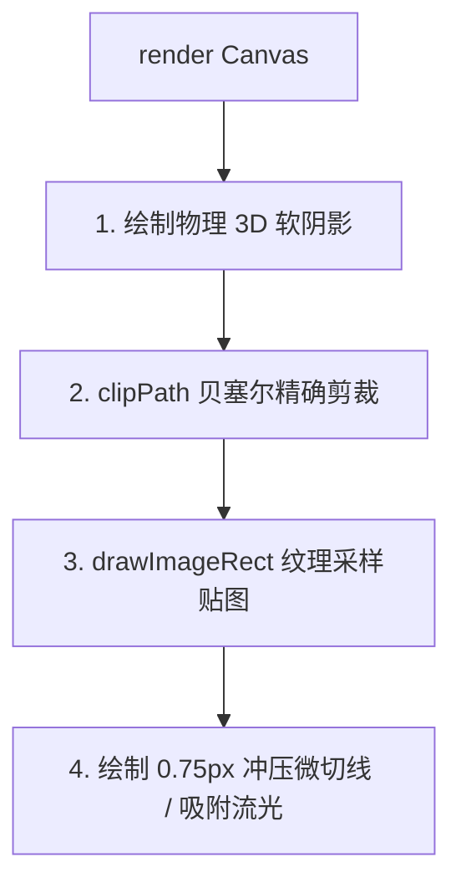

# 拼图切片算法与真实冲压渲染专项设计规范

> **文档标识**：`docs/jigsaw-piece-cutting-and-rendering-design.md`  
> **文档定位**：切片几何（Piece Slicing Geometry）与物理冲压渲染（Authentic Press Rendering）的专项深度设计文档。  
> **最新版本**：v2.0.0 (2026-08-24 重构版)

---

## 一、 背景与演进复盘

### 1.1 初期实现缺陷分析（三次贝塞尔模型）
在初期版本中，切片尝试采用了经典的参数化三次贝塞尔公式（Draradech 模型），在实际运行中暴露出严重的视觉失真（见对比截图 `app.jpg`）：
1. **凸头（Tab）比例畸形**：凸起高度达到了边长的 $50\% \sim 60\%$，且颈部向内收缩过紧，导致碎片呈现“细长柄大头针/细蘑菇头”形态，破坏了碎片主体方形面积；
2. **边缘粗描边脏黑感**：尝试通过绘制粗白高光线和粗黑暗角线来模拟立体感，但在凹孔（Blank）内部法向反转处也画了白线，导致碎片转角处产生类似简陋儿童画的脏黑描边；
3. **角落漏底黑色裂缝**：早期的 Overhang 仅给 Tab 侧计算裕量，忽略了凹槽根部的微小外扩，导致贴图在四角交汇处被矩形截断，露出了棋盘底色黑块。

### 1.2 升级目标与参考标准
1:1 深度吸收专业在线拼图网站（[Jigsaw Explorer](https://www.jigsawexplorer.com/)）的几何模具与渲染精髓：
- **四大黄金模具**：采用经过千万玩家验证的 12 控制点二次贝塞尔曲线矩阵；
- **舒适黄金比例**：凸头深度严格限定在 **$23\% \sim 29\%$**，颈部平缓宽阔，饱满圆润；
- **自然物理冲压切缝**：废弃粗黑粗白描边，采用 $0.75\text{px}$ 细腻半透明深灰微凹切缝与多阶动态软阴影；
- **100% 紧密咬合与零裂缝**：数学保证顺时针/逆时针绝对对称，凹槽根部留足 $15\%$ 采样裕量。

---

## 二、 几何切片数学模型与模具库

### 2.1 12 点二次贝塞尔曲线模型 (Quadratic Bezier Formulation)
每条边缘在归一化坐标系 $[0.0, 1.0] \times [-0.2, 0.4]$ 下由 **12 个控制点**（偶数索引为控制点 Control Point，奇数索引为锚点 Anchor Point）构成 **6 段连续二次贝塞尔曲线**：

```
                段 2 (球头左冠)          段 3 (球头右冠)
                 P4(Ctrl 2)             P6(Ctrl 3)
                     \                 /
                      \    P5 (峰顶)  /
                       \   Anchor 2  /
                        \     ▲     /
                         \    │    /
           P3 (左颈节点)  \   │   /  P7 (右颈节点)
           Anchor 1 ───────┴──┼──┴─────── Anchor 3
          /                   │                   \
         / P2 (Ctrl 1)        │                    \ P8 (Ctrl 4)
        /                     │                     \
    P1 (Anchor 0)             │                    P9 (Anchor 4)
    /                         │                         \
   / P0 (Ctrl 0)              │                          \ P10 (Ctrl 5)
  /                           │                           \
P(0.0, 0.0) ──────────────────┴──────────────────────── P(1.0, 0.0)
起点                                                       终点
```

### 2.2 四大预设模具矩阵 (`JigexCurves`)

#### 1. 经典对称圆球形 (`EdgeShapeType.ball`)
标准经典卡扣，对称圆润，峰顶凸出 $+29.54\%$：
```dart
static const List<CurvePoint> ball = [
  CurvePoint(0.06439, -0.00378), CurvePoint(0.16287, -0.02651), // 段 0: 起点至过渡区
  CurvePoint(0.53409, -0.09848), CurvePoint(0.43181, 0.05681),  // 段 1: 颈部内凹与根部
  CurvePoint(0.26515, 0.28787),  CurvePoint(0.50000, 0.29545),  // 段 2: 大肚外扩至对称峰顶
  CurvePoint(0.71590, 0.28787),  CurvePoint(0.57575, 0.05681),  // 段 3: 右球冠下落至右颈
  CurvePoint(0.51515, -0.07954), CurvePoint(0.76136, -0.01893), // 段 4: 右侧颈部内凹过渡
  CurvePoint(0.90530, 0.01136),  CurvePoint(1.00000, 0.00000),  // 段 5: 收尾至终点
];
```

#### 2. 宽矮粗壮形 (`EdgeShapeType.stub`)
凸起深度仅 $+23.48\%$，基座宽阔平缓，适合大网格小碎片：
```dart
static const List<CurvePoint> stub = [
  CurvePoint(0.09469, 0.00757),  CurvePoint(0.21969, -0.04924),
  CurvePoint(0.39772, -0.11742), CurvePoint(0.37878, 0.01893),
  CurvePoint(0.36363, 0.23484),  CurvePoint(0.61742, 0.15151),
  CurvePoint(0.70833, 0.10984),  CurvePoint(0.61742, -0.01515),
  CurvePoint(0.51893, -0.18181), CurvePoint(0.83712, -0.03030),
  CurvePoint(0.90909, 0.00378),  CurvePoint(1.00000, 0.00000),
];
```

#### 3. 短袜俏皮歪形 (`EdgeShapeType.sock`)
峰顶偏向 $0.5416$，最大深度 $+34.46\%$，呈现不对称手作感：
```dart
static const List<CurvePoint> sock = [
  CurvePoint(0.09469, 0.01136),  CurvePoint(0.22727, -0.03030),
  CurvePoint(0.53787, -0.11742), CurvePoint(0.38257, 0.13257),
  CurvePoint(0.28409, 0.34469),  CurvePoint(0.54166, 0.26893),
  CurvePoint(0.68181, 0.20833),  CurvePoint(0.57575, 0.05681),
  CurvePoint(0.51515, -0.07954), CurvePoint(0.76136, -0.01893),
  CurvePoint(0.90530, 0.01136),  CurvePoint(1.00000, 0.00000),
];
```

#### 4. 修长手指形 (`EdgeShapeType.finger`)
峰顶偏向 $0.4734$，纵向过渡平缓细腻：
```dart
static const List<CurvePoint> finger = [
  CurvePoint(0.04924, 0.00000),  CurvePoint(0.15909, -0.02272),
  CurvePoint(0.54545, -0.06818), CurvePoint(0.41287, 0.12500),
  CurvePoint(0.25378, 0.34469),  CurvePoint(0.47348, 0.27272),
  CurvePoint(0.55303, 0.23863),  CurvePoint(0.54924, 0.12121),
  CurvePoint(0.50000, -0.10984), CurvePoint(0.76136, -0.01893),
  CurvePoint(0.90530, 0.01136),  CurvePoint(1.00000, 0.00000),
];
```

---

## 三、 空间几何变换与严格防飞线证明

### 3.1 局部切向与法向基底
设一条边的起点为 $S(x_s, y_s)$，终点为 $E(x_e, y_e)$，长度 $L = \|E - S\|$：
$$\vec{u} = \frac{E - S}{L}, \quad \vec{N} = (u_y, -u_x)$$
空间中任一点坐标计算公式为：
$$P = S + \vec{u} \cdot (\text{along} \cdot L) + \vec{N} \cdot (\text{from} \cdot L \cdot \text{sign} \cdot \text{depthScale})$$
其中 $\text{sign} = +1$（Tab 凸）或 $-1$（Blank 凹），$\text{depthScale} \in [0.90, 1.00]$。

### 3.2 水平镜像对称映射公式 (`bend == false`)
为使拼图不对称更具趣味性，边支持沿沿边方向水平镜像。
镜像后的曲线必须**依然从 $0.0$ 起步平滑行进至 $1.0$**。其 6 段控制点与锚点计算公式为：
- 控制点：$\text{cpAlong}_s = 1.0 - \text{rawPts}[10 - 2s].\text{along}$
- 锚点：$\text{anchorAlong}_s = \begin{cases} 1.0 - \text{rawPts}[8 - 2s + 1].\text{along}, & s \in [0, 4] \\ 1.0, & s = 5 \end{cases}$

### 3.3 顺时针闭合与逆向回溯 (`reverse == true`)
构建顺时针封闭轮廓时：
- **Top 边**：$S=(0,0) \to E=(W,0)$，$\vec{N}=(0,-1)$，正向追踪（`reverse=false`）；
- **Right 边**：$S=(W,0) \to E=(W,H)$，$\vec{N}=(1,0)$，正向追踪（`reverse=false`）；
- **Bottom 边**：规范定义为 $(0,H) \to (W,H)$，$\vec{N}=(0,1)$。由于笔触在 $(W,H)$，需逆向画回 $(0,H)$，因此启用 `reverse=true`：
  $$\text{quadraticBezierTo}(C_5, A_4) \to \text{quadraticBezierTo}(C_4, A_3) \to \dots \to \text{quadraticBezierTo}(C_0, S)$$
- **Left 边**：规范定义为 $(0,0) \to (0,H)$，$\vec{N}=(-1,0)$。笔触在 $(0,H)$，逆向画回 $(0,0)$，启用 `reverse=true`。

**几何闭合证明**：由于每一段贝塞尔的物理端点在正反向计算中完全恒等，顺时针闭合回路端点重合误差为 0，彻底杜绝了对角线飞线与交叉。

---

## 四、 采样裕量与无缝纹理映射

```
               ┌───────────────────────────────┐  ▲
               │          Top Tab 凸起          │  │ standardTabRatio = 0.35
    ┌──────────┼───────────────────────────────┼──┼──────────┐
    │          │                               │  │          │
    │ Blank    │                               │  │ Blank    │
    │ 根部外扩 │      Base Cell (W x H)        │  │ 根部外扩 │
    │ (0.15)   │      基础单元格矩形           │  │ (0.15)   │
    │          │                               │  │          │
    └──────────┼───────────────────────────────┼──┴──────────┘
               │         Bottom Tab            │
               └───────────────────────────────┘
```

### 4.1 裕量参数设计
- **`standardTabRatio = 0.35`**：覆盖 Sock/Finger 的最大峰顶外凸（$34.46\%$）；
- **`standardBlankRatio = 0.15`**：由于 Tab 边在球头两侧颈部向内凹陷（$-9.85\%$），邻居凹槽碎片在此处会对应向外微凸（$+9.85\%$）。为 Blank 边分配 $0.15$ 的安全采样裕量，确保采样区域完整覆盖外凸根部，**彻底消除四角交界处的漏底黑缝**；
- **`Flat = 0.0`**：外平直边界不向外延伸，防止跨出拼图总图边缘。

### 4.2 像素 1:1 精确采样映射
$$\text{srcRect} = \left[ (c - \text{overhang.left}) \times W_{\text{src}}, \ (r - \text{overhang.top}) \times H_{\text{src}}, \ (1 + \text{left} + \text{right}) \times W_{\text{src}}, \ (1 + \text{top} + \text{bottom}) \times H_{\text{src}} \right]$$
$$\text{fillRect} = \left[ -\text{overhang.left} \times W, \ -\text{overhang.top} \times H, \ (1 + \text{left} + \text{right}) \times W, \ (1 + \text{top} + \text{bottom}) \times H \right]$$
两者在几何比例上严格 1:1，保证任意相邻两块碎片拼合时，原图图案像素级无缝衔接。

---

## 五、 真实物理冲压渲染管线

渲染管线位于 [`PuzzlePieceComponent.render`](file:///c:/Home/Projects/jigsawpuzzle/lib/game/puzzle_piece_component.dart)：



### 5.1 视觉画笔参数配置
1. **静止贴地阴影（Rest Shadow / Ambient Occlusion）**：
   - 位移：$(0, 1.2\text{px})$
   - 模糊：`MaskFilter.blur(BlurStyle.normal, 1.5)`
   - 颜色：`Color(0x28000000)`（$16\%$ 浓度微暗）
   - 作用：模拟纸板贴合底托时的环境光遮挡，赋予碎片薄实体的触感。
2. **拖拽拾起悬浮阴影（Drag Drop Shadow）**：
   - 位移：$(0, 5.0\text{px})$
   - 模糊：`MaskFilter.blur(BlurStyle.normal, 5.5)`
   - 颜色：`Color(0x45000000)`（$27\%$ 浓度软黑）
   - 作用：模拟碎片被手指拿起悬浮在棋盘上方时的光学扩散投影。
3. **物理冲压微切缝（Subtle Press Cutline）**：
   - 线宽：`0.75px`
   - 颜色：`Color(0x35000000)`（$21\%$ 透明度微暗深灰）
   - 作用：替代粗糙的人工黑白高光描边，还原真实刀模冲压在纸板表面形成的微凹切痕。

---

## 六、 自动化测试与切片样本生成

### 6.1 单元测试套件
- [`test/logic/edge_layout_test.dart`](file:///c:/Home/Projects/jigsawpuzzle/test/logic/edge_layout_test.dart)：验证 Seed 确定性拓扑、外边界平直性、相邻边互锁对偶、顺时针旋转映射；
- [`test/logic/piece_shape_test.dart`](file:///c:/Home/Projects/jigsawpuzzle/test/logic/piece_shape_test.dart)：验证 Overhang 裕量、fillRect/srcRect 1:1 像素比例、逆向拾取判定。

### 6.2 切片样本自动化生成脚本
项目提供了独立切片样本生成脚本 [`test/generate_cuts_demo_test.dart`](file:///c:/Home/Projects/jigsawpuzzle/test/generate_cuts_demo_test.dart)，运行 `flutter test test/generate_cuts_demo_test.dart` 可一键将多组高清效果图输出至 `temp/` 目录：
- `temp/sample_cuts_scattered_tabletop.png`：$4 \times 4$ 真实桌面散落效果图；
- `temp/sample_cuts_assembled_6x6.png`：$6 \times 6$ 高密度完整拼合全景切线图（验证严丝合缝与零裂缝）；
- `temp/sample_cuts_closeup_shapes.png`：四大模具（Ball / Stub / Sock / Finger）单块放大特写图。
