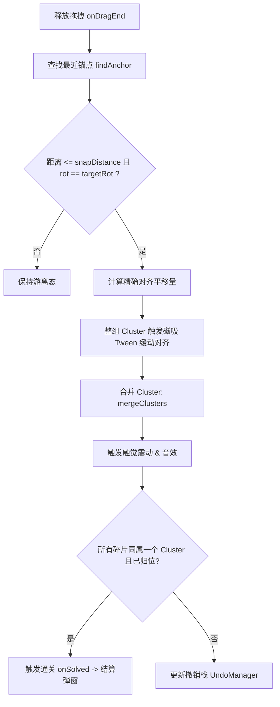

# Flutter 异形拼图游戏 · 工程架构文档

> 本文档**只回答工程技术实现层面**：「怎么做」：技术栈、算法、几何数学、数据结构、跨平台适配、状态管理与测试。
> 产品与业务需求（做什么 / 为什么 / 验收标准）见同目录 `jigsaw-puzzle-game-prd.md`。
> 两份文档同源；本文档严格遵循需求文档中的阶段与功能范围约定。

---

## 1. 技术栈决策

| 分层 | 选型 | 状态 | 决策理由与选型依据 |
|---|---|---|---|
| **UI 表现框架** | Flutter 3.x (Dart 3) | 基线 | 跨 Android / iOS / Windows / Web 一致渲染 |
| **状态管理** | `flutter_riverpod` + `flame_riverpod` | 基线 | 领域状态响应式驱动，桥接 UI 与 Flame 游戏生命周期 |
| **游戏/渲染引擎** | **Flame** (Canvas 抽象 + 2D 组件树) | 基线 | 单画布批量渲染，规避上百 Widget 堆叠的性能与手势穿透瓶颈；自带 Camera、平移缩放视口与组件树 |
| **本地数据库** | **Drift** (基于 SQLite) | Phase 2 | 强类型、编译期 SQL 校验、多平台稳定（含 Web Wasm/IndexedDB 支持）、成熟的 Schema 迁移能力 |
| **轻量 KV 存储** | `shared_preferences` | 基线 | 全局偏好设置、音效/无障碍开关的轻量持久化 |
| **图片采集/网络** | `image_picker` + `dio` | 基线 | 本地相册多选、相机拍摄及每日挑战高清原图流式下载 |

---

## 2. 整体分层架构

系统采用 **「领域纯逻辑 / 游戏渲染引擎 / UI 交互表现」** 严格三层分离架构。领域核心不依赖任何 Flutter UI 或 Flame 引擎代码，保证 100% 可脱机单元测试。

```
┌─────────────────────────────────────────────────────────────┐
│  1. UI 表现层 (Flutter Widget + Riverpod)                   │
│  HomePage / GamePage / GalleryPage / DailyPage / Setting    │
│  - 负责页面路由、弹窗动效、工具栏、音效触发、多语言与无障碍   │
│  - 仅监听 SessionController 暴露的纯数据 State               │
└──────────────────────────────┬──────────────────────────────┘
                               │ 用户意图 (Intent) / 状态订阅
┌──────────────────────────────▼──────────────────────────────┐
│  2. 游戏引擎层 (Flame Game Engine)                          │
│  JigsawPuzzleGame (FlameGame)                               │
│   ├─ CameraComponent & Viewport (缩放/平移视口)             │
│   ├─ TrayComponent (散落碎片托盘收纳区)                     │
│   ├─ PuzzlePieceComponent (单碎片: 局部渲染/拖拽手势/拾取反馈)│
│   └─ GhostOutlineComponent (磁吸虚线高亮层)                 │
│  * 职责: 60fps 实时触控平移、磁吸 Tween 缓动、Canvas 批渲染 │
└──────────────────────────────┬──────────────────────────────┘
                               │ 拖拽释放结算 / 纯函数调用
┌──────────────────────────────▼──────────────────────────────┐
│  3. 领域逻辑与数据层 (Pure Dart, 零 UI/Flame 依赖)           │
│  ├─ 几何切割: EdgeLayout (确定性网格) / PieceShape (贝塞尔路径)│
│  ├─ 纯状态机: PuzzleBoardState / PieceState / UndoManager   │
│  ├─ 纯函数群: resolveSnap() / isSolved() / hintFor()        │
│  └─ 持久化仓储: Drift Database & Repository (Phase 2)       │
└─────────────────────────────────────────────────────────────┘
```

---

## 3. 核心算法：异形切割与拼合几何

### 3.1 任意 $M \times N$ 网格与智能最大化自适应基准矩形

拼图算法内核完全支持任意长宽比图片与任意网格 $M \times N$（行数 $M \ge 2$，列数 $N \ge 2$）：

- **智能棋盘最大化居中排布**：
  - 设游戏工作区可用尺寸为 $W_{\text{avail}} \times H_{\text{avail}}$（扣除底部托盘高度与 Margin）。
  - 原图长宽比 $R_{\text{img}} = \frac{\text{image.width}}{\text{image.height}}$，工作区长宽比 $R_{\text{avail}} = \frac{W_{\text{avail}}}{H_{\text{avail}}}$。
  - **最大化占满策略**：
    $$\begin{cases} \text{boardW} = W_{\text{avail}} \times 0.90, \quad \text{boardH} = \frac{\text{boardW}}{R_{\text{img}}} & (R_{\text{img}} \ge R_{\text{avail}} \text{，图片偏宽/横屏}) \\ \text{boardH} = H_{\text{avail}} \times 0.90, \quad \text{boardW} = \text{boardH} \times R_{\text{img}} & (R_{\text{img}} < R_{\text{avail}} \text{，图片偏高/竖屏/正方形}) \end{cases}$$
  - 单块碎片在屏幕基准尺寸为：
    $$w = \frac{\text{boardW}}{N},\quad h = \frac{\text{boardH}}{M}$$
  - 原图切片对应的像素基准尺寸为：
    $$\text{srcW} = \frac{\text{image.width}}{N},\quad \text{srcH} = \frac{\text{image.height}}{M}$$
  - 当原图或网格为长方形时（$w \neq h$），凹凸 Tab 深度按所在边的物理长度分轴独立计算。

```
       列 0        列 1        列 2        列 (N-1)
    ┌───────────┬───────────┬───────────┬───────────┐
行 0 │  (0, 0)   │  (0, 1)   │  (0, 2)   │  (0, N-1) │  h
    ├───────────┼───────────┼───────────┼───────────┤
行 1 │  (1, 0)   │  (1, 1)   │  (1, 2)   │  (1, N-1) │  h
    ├───────────┼───────────┼───────────┼───────────┤
行 M-1(M-1, 0)  │  (M-1, 1) │  (M-1, 2) │ (M-1, N-1)│  h
    └───────────┴───────────┴───────────┴───────────┘
          w           w           w           w
```

---

### 3.2 确定性切割布局 (EdgeLayout + Seed)

为了保证「相同种子下切割拓扑恒定、存档无需记录复杂轮廓」，采用全局网格随机矩阵：

- **矩阵定义**：
  - 横向边矩阵 `_h[M-1][N]`：描述第 $r$ 行与第 $r+1$ 行之间的水平切线（取值 $+1$ 或 $-1$）。
  - 纵向边矩阵 `_v[M][N-1]`：描述第 $c$ 列与第 $c+1$ 列之间的垂直切线（取值 $+1$ 或 $-1$）。
  - 所有值由 `Random(seed)` 伪随机数发生器一次性初始化生成。

- **单片四边类型推导 (`edgesFor(r, c)`)**：

| 边缘方位 | 推导规则 | 几何语义 |
|---|---|---|
| **Top** | $r = 0 \implies \text{flat}$；否则 `_h[r-1][c] == 1 ? blank : tab` | 顶边 |
| **Bottom** | $r = M-1 \implies \text{flat}$；否则 `_h[r][c] == 1 ? tab : blank` | 底边 |
| **Left** | $c = 0 \implies \text{flat}$；否则 `_v[r][c-1] == 1 ? blank : tab` | 左边 |
| **Right** | $c = N-1 \implies \text{flat}$；否则 `_v[r][c] == 1 ? tab : blank` | 右边 |

> **互补性保证**：第 $(r, c)$ 片的 Bottom 边与第 $(r+1, c)$ 片的 Top 边严格由同一个 `_h[r][c]` 变量推导，天然互为镜像（一凸一凹），杜绝裂缝或重叠。

---

### 3.3 局部坐标系与 Overhang 数学模型 (PieceShape)

#### A. 局部坐标系原点标准
**严格规定：碎片局部坐标系的原点 $(0, 0)$ 恒定设为「基准矩形（Base Cell）的左上角」**。

```
(-overhang.left * w, -overhang.top * h)  ┌──────────────────────────────┐ (fillRect 左上)
                                        │  Top Tab 凸起                │
                      (0, 0) ───────────┼──────────┬───────────────────┤
                                        │          │                   │
                     Left Tab           │ BaseCell │     Right Tab     │
                       凸起             │  (w × h) │       凸起        │
                                        │          │                   │
                                        ├──────────┴───────────────────┤
                                        │  Bottom Tab 凸起             │
                                        └──────────────────────────────┘
                                          ((1+right)*w, (1+bottom)*h) (fillRect 右下)
```

#### B. Overhang 参数化与分轴深度
- 定义标准 Tab 深度比例 $\text{tip} = 0.245$（约为边长的 $1/4$）。
- 各方向外扩比例 `overhang`：
  - `top`: 若顶边为 tab 则为 $\text{tip}$，否则为 $0.0$；
  - `bottom`: 若底边为 tab 则为 $\text{tip}$，否则为 $0.0$；
  - `left`: 若左边为 tab 则为 $\text{tip}$，否则为 $0.0$；
  - `right`: 若右边为 tab 则为 $\text{tip}$，否则为 $0.0$。

#### C. 局部包围盒 (`fillRect`) 与原图采样矩形 (`srcRect`) 精确对齐
为了使 `Canvas.drawImageRect` 完美贴合异形遮罩：

- **局部绘制目标矩形 (`fillRect`)**：
  $$\text{fillRect} = \text{Rect.fromLTWH}(-\text{overhang.left} \cdot w,\; -\text{overhang.top} \cdot h,\; (1 + \text{overhang.left} + \text{overhang.right}) \cdot w,\; (1 + \text{overhang.top} + \text{overhang.bottom}) \cdot h)$$

- **原图像素采样矩形 (`srcRect`)**：
  $$\text{srcRect} = \text{Rect.fromLTWH}((c - \text{overhang.left}) \cdot \text{srcW},\; (r - \text{overhang.top}) \cdot \text{srcH},\; (1 + \text{overhang.left} + \text{overhang.right}) \cdot \text{srcW},\; (1 + \text{overhang.top} + \text{overhang.bottom}) \cdot \text{srcH})$$

> **1:1 映射保证**：`srcRect` 与 `fillRect` 的四个边界通过相同的 `overhang` 参数向外线性扩展，避免任何像素拉伸或纹理错位。

---

### 3.4 长方形碎片 90° 旋转几何与置换矩阵

当碎片启用旋转功能时（朝向 $\text{rot} \in \{0, 1, 2, 3\}$，分别代表顺时针 $0^\circ, 90^\circ, 180^\circ, 270^\circ$）：

#### A. 尺寸互换
当 $w \neq h$ 且碎片旋转 $\text{rot} \in \{1, 3\}$（即 $90^\circ$ 或 $270^\circ$）时，碎片的有效占位尺寸发生长宽置换：
$$w' = (\text{rot} \% 2 == 0) \;?\; w : h,\quad h' = (\text{rot} \% 2 == 0) \;?\; h : w$$

#### B. 边缘置换矩阵（顺时针旋转 $90^\circ$）
碎片顺时针旋转后，四条边的朝向按以下规则置换：
$$\begin{pmatrix} \text{top}' \\ \text{right}' \\ \text{bottom}' \\ \text{left}' \end{pmatrix} = \begin{pmatrix} \text{left} \\ \text{top} \\ \text{right} \\ \text{bottom} \end{pmatrix}$$

#### C. 命中测试逆变换 (Hit-Testing)
世界坐标下的触控点 $P_{\text{world}}$ 判定流程：
1. 计算触控点相对碎片基准锚点的局部偏移量：$P_{\text{local}} = P_{\text{world}} - \text{piece.position}$；
2. 若 $\text{rot} \neq 0$，将 $P_{\text{local}}$ 绕局部中心点做**逆向旋转**：$P_{\text{orig}} = R(-90^\circ \times \text{rot}) \cdot P_{\text{local}}$；
3. 执行纯几何路径命中测试：`shape.path.contains(P_orig)`。

---

### 3.5 吸附、粘连簇 (Cluster) 与通关判定



- **吸附阈值**：$\text{snapDistance} = \min(w, h) \times 0.42$。
- **粘连语义 (Adhere)**：吸附后的碎片形成「碎片组（Cluster）」，支持整组协同拖拽，**不再设置不可再拖的死锁状态**。
- **通关判定**：
  $$\text{isSolved} \iff \left(\forall i, \text{piece}[i].\text{clusterId} == \text{cluster}[0].\text{id}\right) \land \left(\forall i, \|\text{piece}[i].\text{position} - \text{piece}[i].\text{target}\| \le \epsilon\right) \land \left(\forall i, \text{piece}[i].\text{rot} == 0\right)$$

---

### 3.6 撤销 / 重做机制 (Undo/Redo via Pure Snapshot Stack)

放弃脆弱的增量 Action 逆向还原算法，采用**轻量不可变纯状态快照栈**：

```dart
class UndoManager {
  final List<PuzzleBoardState> _undoStack = [];
  final List<PuzzleBoardState> _redoStack = [];
  static const int maxHistory = 30;

  void record(PuzzleBoardState state) {
    _undoStack.add(state);
    if (_undoStack.length > maxHistory) _undoStack.removeAt(0);
    _redoStack.clear();
  }

  PuzzleBoardState? undo(PuzzleBoardState currentState) {
    if (_undoStack.isEmpty) return null;
    _redoStack.add(currentState);
    return _undoStack.removeLast();
  }

  PuzzleBoardState? redo(PuzzleBoardState currentState) {
    if (_redoStack.isEmpty) return null;
    _undoStack.add(currentState);
    return _redoStack.removeLast();
  }
}
```
> **性能保障**：300 块碎片的 `PuzzleBoardState` 在内存中仅约 12KB，30 步历史栈占用内存 $< 400\text{KB}$，具备极高的稳定性和零副作用。

---

### 3.7 底部托盘碎片尺寸归一化与动态缩放过渡数学模型

为彻底解决大网格切片（如 $15 \times 20 = 300$ 块或 $20 \times 20 = 400$ 块）下单片极小导致手指难以辨识和点选的问题，设计托盘尺寸归一化模型：

#### A. 托盘基准归一化尺寸与长宽比锁定
无论棋盘物理尺寸或行列切片数如何变化，托盘中每块碎片按统一的舒适触控基准尺寸展示（设定基准长边 $S_{\text{trayBase}} = 64.0\text{px}$）：
$$\text{trayScale} = \frac{S_{\text{trayBase}}}{\max(w, h)}$$
- 托盘中碎片实际占用尺寸：$(w \cdot \text{trayScale},\; h \cdot \text{trayScale})$，严格保持碎片原本的宽高比，避免拉伸变形；
- 托盘横向步长：$\text{stepX} = w \cdot \text{trayScale} + \text{spacing}$；
- 托盘最大可滚动距离：$\text{minScrollX} = \min(0, \text{trayWidth} - N_{\text{tray}} \cdot \text{stepX} - \text{margin})$。

#### B. 拖拽进出棋盘的动态平滑缩放与逆变换
- **提取进入棋盘**：当玩家在托盘中按住某碎片并开始拖拽时，碎片脱离托盘网格，通过 `ScaleEffect`（缓动时长 $0.15\text{s}$）从 $\text{trayScale}$ 平滑过渡至棋盘物理尺寸 $1.0$；
- **放回托盘**：若玩家释放拖拽后碎片落入托盘区域且未形成吸附，通过 `ScaleEffect` 平滑缩回归一化比例 $\text{trayScale}$ 并重新对齐；
- **命中测试瞬时逆变换**：
  在缩放过渡的任意瞬时，触控点 $P_{\text{local}}$ 做逆缩放计算：
  $$P_{\text{local\_unscaled}} = \left(\frac{P_{\text{local}}.x}{\text{scale}.x},\; \frac{P_{\text{local}}.y}{\text{scale}.y}\right)$$
  确保手指拖拽抓握点与碎片图样之间绝对静止，零跳变与零抖动。

---

### 3.8 3D 立体浮雕边缘与动态悬浮投影渲染管线 (Bevel & Emboss Pipeline)

为了赋予切片真实的物理实体质感，`PuzzlePieceComponent` 采用多层混合渲染管线：

1. **动态悬浮阴影 (Dynamic Drop Shadow)**：
   - **静止状态**：在切片几何路径下方绘制轻微向下偏移 $(0, 1.5\text{px})$ 的深色投影（`Color(0x33000000)`，`MaskFilter.blur(BlurStyle.normal, 2.0)`）；
   - **拖拽悬浮状态**：动态扩大偏移至 $(0, 6.0\text{px})$，模糊半径扩大至 $6.0\text{px}$，营造被手指/光标抓起浮于空中的真实三维空间层次感。
2. **3D 双色浮雕法向切口 (Bevel Edge Shading)**：
   - **顶边/左边光照高光 (Top-Left Highlight)**：以偏移 $(-0.5\text{px}, -0.5\text{px})$ 绘制半透明白色高光（`Color(0x99FFFFFF)`），模拟左上方环境漫反射光照；
   - **底边/右边阴影深色槽 (Bottom-Right Shadow)**：以偏移 $(+0.5\text{px}, +0.5\text{px})$ 绘制半透明黑色深边（`Color(0x66000000)`），营造凹凸咬合的物理厚度与切缝阴影；
   - **主轮廓抗锯齿包边**：使用平滑贝塞尔封闭路径绘制 $1.5\text{px}$ 中性深色平滑线，确保高分辨率与缩放状态下的边缘极其锐利清晰。

---

### 3.9 托盘多模态横向滚动事件路由 (Multi-modal Gesture Routing)

为满足全平台（移动触控、桌面鼠标拖拽、鼠标滚轮）一致的托盘交互体验：
- **鼠标滚轮支持**：`JigsawPuzzleGame` 混入 `ScrollDetector`，在 `onScroll(PointerScrollInfo info)` 中判定光标位于托盘矩形时，直接平移 `scrollTray(-deltaY * 0.8)`；
- **鼠标与触控拖拽支持**：`TrayBackgroundComponent` 捕获托盘背景拖拽事件，结合全局边界阻尼算法保证快速滑动不越界。

---

### 3.10 关卡难度选择器 (`ChooseDifficultySheet`) 四态渲染管线

难度选择器为各难度档位（9 ~ 400 块）提供状态机与差异化视觉管线：

| 状态机条件 | 背景色 (`Color`) | 边框 (`Border`) | 图标与文字色 | 角标 (`Check Badge`) | 动作按钮语义 |
|---|---|---|---|---|---|
| **1. 未通过 + 未选中 (Default)** | `#F0F2F5` (浅灰) | `#E0E0E0` (1.0px) | `black54` / `black87` | 无 | — |
| **2. 已通过 + 未选中 (Passed)** | `#E8F5E9` (浅翡翠绿) | `#81C784` (1.5px) | `#2E7D32` / `#1B5E20` | 绿色 `Icons.check_circle` (14px) | — |
| **3. 未通过 + 选中 (Selected)** | `#2E7D32` (深绿) | `#1B5E20` (2.0px) | `white` / `white` | 无 | 「开始」 |
| **4. 已通过 + 选中 (Passed & Selected)**| `#2E7D32` (深绿) | `#1B5E20` (2.0px) | `white` / `white` | 金色 `Icons.check_circle` (`#FFD54F`) | 「重玩此难度」 |

---

### 3.11 满屏壁纸背景与图层堆叠管线 (Wallpaper & Overlay Pipeline)

游戏界面采用基于 Flutter `Stack` 的五层复合渲染管线：

1. **底图层 (`Layer 0: Wallpaper`)**：`Positioned.fill` 渲染 `Image.asset(selectedBackground, fit: BoxFit.cover)`，自适应窗口与屏幕比例满屏裁剪覆盖。
2. **游戏引擎层 (`Layer 1: Flame GameWidget`)**：`backgroundColor()` 保持 `Color(0x00000000)` 完全透明；棋盘区域绘制半透明暗色底槽。
3. **托盘遮罩层 (`Layer 2: Tray Mask`)**：`TrayBackgroundComponent` 绘制 `Color(0x66000000)` 半透明纯色底板与 `Color(0x33FFFFFF)` 边框，消除壁纸纹理干扰。
4. **原图全景覆盖层 (`Layer 3: Original Image Overlay`)**：点击 AppBar 眼睛图标（`Icons.visibility`）时激活，居中呈现高清原图，点击背景或原图即可切回拼图。
5. **导航与工具栏层 (`Layer 4: AppBar Toolbar`)**：半透明白底悬浮顶栏，提供原图切换（右二）与背景更换（最右）按钮。

---

## 4. 数据模型与持久化体系

### 4.1 存档快照格式 (Snapshot v2 权威规范)

```json
{
  "version": 2,
  "levelId": "builtin_level_01",
  "seed": 104729,
  "rows": 4,
  "cols": 6,
  "imageSource": {
    "type": "asset",
    "path": "assets/images/sample_01.jpg"
  },
  "elapsedSeconds": 45,
  "hintsUsed": 0,
  "rotationEnabled": true,
  "pieces": [
    {
      "id": 0,
      "r": 0,
      "c": 0,
      "nx": 0.1254,
      "ny": 0.3401,
      "g": 0,
      "rot": 1
    }
  ]
}
```

> **坐标系统一规范**：`nx, ny` 采用**棋盘归一化浮点坐标**（相对棋盘左上角宽度与高度的比例 $[0.0, 1.0]$）。渲染时乘当前屏幕实际 `(boardW, boardH)`，彻底解决跨分辨率、横竖屏切换与窗口 Resize 导致的错位问题。

---

### 4.2 结构化数据库设计 (Drift ORM)

Phase 2 采用 Drift 统一管理全平台（Android / iOS / Windows / Web Wasm）持久化数据：

```dart
// 关卡元数据表
class Levels extends Table {
  TextColumn get id => text()();
  TextColumn get type => text()(); // builtin | custom | daily
  TextColumn get imagePath => text()();
  IntColumn get rows => integer()();
  IntColumn get cols => integer()();
  TextColumn get completedPieceCounts => text().withDefault(const Constant('[]'))(); // JSON List<int>
  IntColumn get limitSeconds => integer().nullable()();
  IntColumn get bestTime => integer().nullable()();
  IntColumn get stars => integer().withDefault(const Constant(0))();
  BoolColumn get isUnlocked => boolean().withDefault(const Constant(false))();

  @override
  Set<Column> get primaryKey => {id};
}

// 进行中存档表
class GameSaves extends Table {
  TextColumn get levelId => text()();
  IntColumn get schemaVersion => integer()();
  IntColumn get elapsedSeconds => integer()();
  IntColumn get hintsUsed => integer()();
  TextColumn get snapshotJson => text()();
  DateTimeColumn get updatedAt => dateTime()();

  @override
  Set<Column> get primaryKey => {levelId};
}
```

---

## 5. 跨平台与工程专项优化

### 5.1 响应式与窗口 Resize
- 监听 Flame `onGameResize` 事件。
- 依据新视口计算最优 `_boardRatio` 与居中矩形，所有碎片通过其 `(nx, ny)` 归一化坐标无损线性重映射到新屏幕位置。

### 5.2 图像预降采样管线 (Downsampling Pipeline)
为防止 4K 原图在 300 块切片下导致移动端 GPU 纹理显存过载（OOM），构建内存优化管线：

```dart
Future<ui.Image> loadOptimizedImage(Uint8List bytes, double targetMaxDimensionPx) async {
  final codec = await ui.instantiateImageCodec(
    bytes,
    targetWidth: targetMaxDimensionPx.round(),
  );
  final frame = await codec.getNextFrame();
  return frame.image;
}
```

### 5.3 Web 平台专项适配
- **渲染器要求**：Web 构建强制采用 `--web-renderer canvaskit` 或 `wasm` 模式，确保 `clipPath` 与 Canvas 滤镜具备原生级高帧率。
- **CORS 隔离与网络图代理**：Unsplash 等每日挑战原图由后端代理服务中转，或在 Web 优先读取 Base64/IndexedDB 缓存。

### 5.4 无障碍 (A11y) 在 Flame 中的落地方案
针对 Flame 单 Canvas 无法自动生成 Flutter 语义树的问题：
- 在 `GameWidget` 上方覆盖一层透明的 `SemanticsOverlay`。
- 将已对齐簇与未对齐碎片映射为虚拟语义节点，支持屏幕阅读器朗读「当前选中：第 1 行第 2 列碎片，朝向 90 度」并支持外接键盘方向键导航与空格吸附。

---

## 6. 测试策略与矩阵

| 测试模块 | 测试类型 | 核心验证指标 |
|---|---|---|
| `EdgeLayoutTest` | 纯 Dart 单元测试 | 确定性（同 seed 拓扑恒定）、四向相邻互补镜像（一 tab 一 blank） |
| `PieceShapeTest` | 纯 Dart 几何测试 | 共享边路径采样点重合度误差 $< 0.001\text{px}$、局部包围盒尺寸 |
| `SnapshotRestoreTest`| 纯 Dart 往返测试 | Snapshot v2 序列化 $\to$ 反序列化还原状态、坐标、朝向与簇归属 100% 一致 |
| `SnapAlgorithmTest` | 纯 Dart 算法测试 | 距离阈值内吸附、带朝向校验吸附、整组 Cluster 坐标协同平移 |
| `UndoManagerTest` | 纯 Dart 状态测试 | 连续 30 步状态入栈/撤销/重做幂等性 |

---

## 7. 附录：核心接口速查清单

```dart
// lib/logic/models/puzzle_state.dart
class PieceState {
  final int id;
  final int r, c;
  final double nx, ny; // 棋盘归一化坐标
  final int clusterId;
  final int rot;       // 0, 1, 2, 3

  const PieceState({
    required this.id,
    required this.r,
    required this.c,
    required this.nx,
    required this.ny,
    required this.clusterId,
    this.rot = 0,
  });
}

class PuzzleBoardState {
  final int rows, cols;
  final int seed;
  final bool rotationEnabled;
  final List<PieceState> pieces;

  const PuzzleBoardState({
    required this.rows,
    required this.cols,
    required this.seed,
    required this.rotationEnabled,
    required this.pieces,
  });
}

// lib/data/models/level_item.dart
class LevelItem {
  final String id;
  final int index;
  final String title;
  final String assetPath;
  final PuzzleDifficulty difficulty;
  final bool isUnlocked;
  final bool isCompleted;
  final int progressPercent;
  final int stars;
  final int bestTimeSeconds;
  final String? savedSnapshotJson;
  final List<int> completedPieceCounts; // 各难度独立通关记录

  const LevelItem({
    required this.id,
    required this.index,
    required this.title,
    required this.assetPath,
    required this.difficulty,
    this.isUnlocked = false,
    this.isCompleted = false,
    this.progressPercent = 0,
    this.stars = 0,
    this.bestTimeSeconds = 0,
    this.savedSnapshotJson,
    this.completedPieceCounts = const [],
  });
}

// 纯函数契约
class PuzzleEngine {
  static BoardTransitionResult resolveSnap(
    PuzzleBoardState state,
    int draggedPieceId,
    double snapDistanceRatio,
  );

  static bool isSolved(PuzzleBoardState state);

  static HintResult hintFor(PuzzleBoardState state);
}
```

---

## 8. 附录：开源许可证合规清单

| 依赖库 | 开源许可证 | 商业分发兼容性 |
|---|---|---|
| `flutter` / `flutter_riverpod` | BSD-3-Clause / MIT | 宽松兼容 |
| `flame` / `flame_riverpod` | BSD-3-Clause | 宽松兼容 |
| `drift` / `sqlite3_flutter_libs` | MIT / MIT | 宽松兼容 |
| `image_picker` / `dio` | BSD-3-Clause / MIT | 宽松兼容 |
| `shared_preferences` / `path_provider` | BSD-3-Clause | 宽松兼容 |
