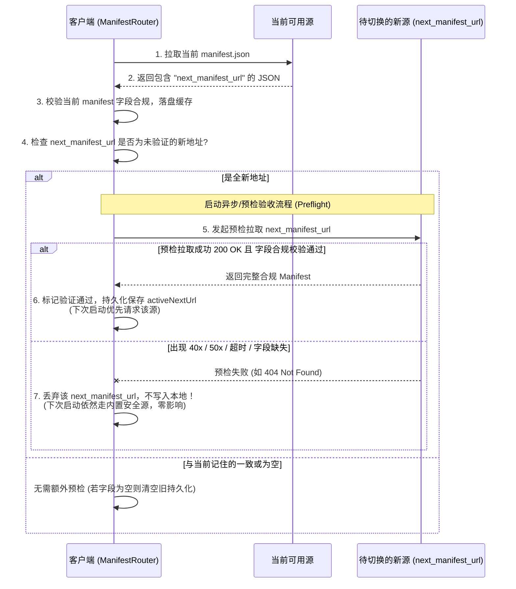

# Manifest 动态引导 (next_manifest_url) 容灾、校验与平滑迁移设计方案

- **文档状态**：待评审 (Draft for Review)
- **创建时间**：2026-09-12 (GMT+8)
- **责任模块**：`lib/logic/content/pipelines/manifest_router.dart` / `RootManifest`
- **目标场景**：支持服务端通过 `manifest.json` 动态下发下一次优先拉取的根清单地址（CDN 切换、域名迁移、动态容灾），同时彻底杜绝配置错误导致 App 瘫痪或启动长耗时阻塞。

---

## 1. 背景与核心挑战

### 1.1 需求背景
目前 App 内置了硬编码的主备根清单地址 `defaultBootstrapUrls`（如 R2 主通道、Gitee 备用、GitHub 备用）。若未来发生 CDN 服务商切换、域名更换、对象存储迁移等运维调整，硬编码 URL 无法动态感知，必须通过发版解决。

因此需要在 `manifest.json` 中预留 `next_manifest_url` 字段：
- 服务端可在需要切换时配置该字段；
- 客户端在获取到该字段后，**下次优先从该 URL 获取 `manifest.json`**；
- 服务端不需要切换时该字段可不配或留空。

### 1.2 隐藏风险与核心挑战
如果盲目实现“读到字段就存本地，下次直接用”，极易引发以下致命隐患：
1. **坏 URL 永久锁死 (Poisoned Lockout)**：若新地址拼写错误、DNS 尚未生效、SSL 证书过期或资源 404，若 App 盲目持久化且作为主要依赖，会导致 App 与更新通道彻底失联。
2. **启动耗时雪崩 (Silent Latency Penalty)**：若某个动态 URL 已失效但未被清理，每次冷启动都会浪费 4~8 秒等待超时，导致秒开体验劣化。
3. **脏数据渗透 (Corrupted Response)**：公共 Wi-Fi 认证页、CDN 错误页返回 HTTP 200 的 HTML，若无完整合规校验，会导致 JSON 序列化崩溃或配置被污染。
4. **短暂波动误杀合规源 (Transient Error Eviction)**：如果服务端偶发 503 或用户自身处于瞬时弱网，直接将配置永久注销可能会导致无法迁移到目标源。

---

## 2. 核心设计原则

为实现**绝对可用、自动自愈、零感回退**，方案严格遵循以下 4 项基本原则：

```
               +----------------------------------------------------+
               |                 客户端发起 Manifest 请求             |
               +----------------------------------------------------+
                                         |
                                         v
         +----------------------------------------------------------------+
         | 候选队列: [已预检验收的 next_manifest_url (若有), ...bootstrapUrls] |
         +----------------------------------------------------------------+
                                         |
             +---------------------------+---------------------------+
             |                                                       |
             v (优先尝试动态源)                                        v (静态托底链)
     [next_manifest_url]                                     [内置 bootstrapUrls]
             |                                                       |
     +-------+-------+                                               |
     | 40x / 数据脏 /| 50x 临时抖动 / 超时                            |
     | 协议非法      | (连续超阈值则熔断)                             |
     v               v                                               |
   【即时剔除】     【本次跳过降级】                                   |
     +-------+-------+                                               |
             |                                                       |
             +-------------------> 自动透明回退 -----------------------+
                                         |
                                         v
                            【拉取成功并执行严格字段合规检验】
                                         |
                                         v
                          【发现新 nextUrl? 发起异步预检】
                                         |
                                 通过后方可持久化
```

1. **静态托底，动态试探 (Static Grounding & Dynamic Probe)**：
   内置的 `bootstrapUrls` 是 App 的生命线基石，**永远不能被丢弃或完全覆盖**。动态下发的 `next_manifest_url` 仅作为第一优先级的“动态探针”，排在内置源之前。
2. **预检验收后方可入库 (Preflight-First Verification)**：
   接收到新的 `next_manifest_url` 时，**绝不直接保存**。必须对该新 URL 进行一次预检拉取并完成合法性合规校验，全部通过才允许写入持久化存储。
3. **统一合规性门禁 (Universal Validation Gate)**：
   不仅针对动态源，所有来源（包括内置 `bootstrapUrls` 及本地磁盘缓存）拉取到的 manifest 必须通过统一的字段合规校验函数。
4. **故障类型精细化分类与差异化处置 (Fine-grained Error Strategy)**：
   对 40x、50x、网络超时、格式非法执行不同级别的降级和剔除策略，兼顾“快速止损”与“弱网防误判”。

---

## 3. 错误分类与剔除/降级处置矩阵

在 HTTP/网络交互中，错误性质完全不同，必须精细区分：

| 错误类型 | 典型场景 | 诊断依据 (Dio / HTTP) | 处置策略 (常规行为) | 对 `next_manifest_url` 的影响 |
| :--- | :--- | :--- | :--- | :--- |
| **40x 永久性客户端错误** | 路径配错 404、鉴权失败 403、参数畸形 400 | `statusCode >= 400 && statusCode < 500` | 立即放弃当前源，轮询下一候选源 | **立即永久剔除**：直接清空本地记录，本次会话不再重试，防止后续启动白耗超时。 |
| **50x 临时性服务端错误** | CDN 回源抖动 502、网关超时 504、服务暂时过载 503 | `statusCode >= 500 && statusCode < 600` | 立即放弃当前源，降级到内置源 | **软失败与熔断**：单次失败只在本次会话跳过；若连续失败达到 2 次则从本地剔除。 |
| **网络超时 / 物理弱网** | 连接超时、读取超时 (4s)、DNS 暂时解析失败、断网 | `DioExceptionType.connectionTimeout`<br/>`DioExceptionType.receiveTimeout`<br/>`SocketException` | 立即超时熔断（单 URL 4s 封顶），切到下一备用源 | **弱网容忍保护**：预检时超时则不采纳；正式拉取时若失败，本次回退，连续 2 次超时才予以剔除。 |
| **数据损坏 / 假 200 劫持** | 公共 Wi-Fi 认证拦截页、CDN 错误 HTML、非 JSON 数据 | `FormatException` / 返回值不是 JSON `Map` | 抛出解析异常，轮询下一源 | **立即永久剔除**：拒绝将脏数据落盘，视该 URL 为无效污染源。 |
| **Schema / 字段合规失败** | 缺失 `mainModule`、版本号异常、不支持的 `schemaVersion` | `validateManifest()` 返回 false | 拒绝采用，轮询下一源 | **立即永久剔除**：配置不兼容或发布残缺，严禁存入缓存。 |

---

## 4. Manifest 统一字段合规校验规范

无论是内置源拉取的配置，还是 `next_manifest_url` 预检拉取的配置，在进入内存 `_cachedManifest` 或写入磁盘缓存前，必须通过 `validateManifest(Map<String, dynamic> json)` 门禁。

### 4.1 校验规则列表
1. **基础格式**：
   - 必须为顶层 `Map<String, dynamic>`；
   - `schemaVersion` 必须在客户端支持的区间内（如当前 `3 <= schemaVersion <= 4`）；
2. **核心模块完整性**：
   - `modules` 必须存在且为 Map；
   - `modules.main` 必须存在，且 `main.url` 非空、`main.version >= 0`；
   - `modules.daily` 必须存在；
3. **URL 协议与格式安全**：
   - 若出现 `next_manifest_url`，其协议必须严格为 `https://`（禁止 `http://` 或本地私有协议）；
   - URL 必须能通过 `Uri.tryParse` 并包含有效的 `host`；
4. **防版本倒退 (Anti-Rollback, 推荐)**：
   - 如果本地已存在有效的磁盘缓存，拉取到的 `updatedAt` 或 `main.version` 若严重落后于本地已有版本（如时间差超过容忍范围），打警告日志防脏缓存回滚。

---

## 5. 详细工作流与生命周期

### 5.1 候选队列组装与拉取 (Resolution Pipeline)
每次触发 `resolveManifest({bool forceRefresh = false})` 时：
1. **内存缓存快速返回**：若非强制刷新且内存已有，直接返回。
2. **组装候选列表**：
   ```dart
   final candidates = <String>[];
   if (_activeNextUrl != null && _isHttpsUrl(_activeNextUrl!)) {
     candidates.add(_activeNextUrl!);
   }
   for (final url in bootstrapUrls) {
     if (!candidates.contains(url)) {
       candidates.add(url);
     }
   }
   ```
3. **依次轮询尝试（单 URL 4s 超时）**：
   - 若遇到 40x 或数据非法：若为 `_activeNextUrl`，**立即清空本地持久化的 nextUrl**；
   - 若遇到 50x 或超时：记录失败计数，本次轮询降级继续尝试下一个内置源；
   - 一旦某个 URL 成功返回且通过**统一字段合规校验**：
     - 作为最新清单采用并落盘 `manifest_cache.json`；
     - 进入 **5.2 节的 nextUrl 联动处理**。
4. **全网故障兜底**：若全部候选源均失败，自动回退到本地旧磁盘缓存，再无则回退离线内置兜底清单。

### 5.2 发现新 nextUrl 时的“预检-入库”机制 (Preflight & Persist)
当从成功拉取的清单中解析出新的 `next_manifest_url`：



**为什么预检机制是不可逾越的安全红线？**
- 避免了“服务端手抖配错了一个 404 URL，导致全部 App 在下次冷启动时被毒害”的系统性灾难。
- 只有新源**真实存在、且内容合法合规**，客户端才建立信任关系并记住它。

### 5.3 废弃与切回机制 (Revocation)
当服务端迁移完毕并稳定运行后：
- 服务端可在新源的 `manifest.json` 中**去掉该字段**（或设为空字符串 `""`）。
- 客户端拉取成功后，检测到 `next_manifest_url` 为空，自动清空本地持久化的 `_activeNextUrl`。
- 此时状态完全复位，客户端优雅回到仅依赖当前 baseUri 与内置源的初始状态。

---

## 6. 关键代码架构与实现规范

### 6.1 `RootManifest` 模型增加合规校验与字段解析
在 `lib/logic/content/models/root_manifest.dart`：

```dart
class RootManifest {
  // ... 其他字段 ...
  final String nextManifestUrl;

  /// 静态合规性校验器：确保 JSON 结构完整可用
  static bool validateJsonStructure(Map<String, dynamic> json) {
    try {
      final schemaVersion = (json['schemaVersion'] as num?)?.toInt();
      // 必须在受支持的版本区间（当前为 3..4）
      if (schemaVersion == null || schemaVersion < 3 || schemaVersion > 4) {
        return false;
      }
      final modules = json['modules'] as Map<String, dynamic>?;
      if (modules == null) return false;

      final main = modules['main'] as Map<String, dynamic>?;
      if (main == null) return false;

      // 主包 url 必须是非空且版本非负
      final mainUrl = main['url']?.toString().trim() ?? '';
      final mainVersion = (main['version'] as num?)?.toInt() ?? -1;
      if (mainUrl.isEmpty || mainVersion < 0) {
        return false;
      }

      // 校验 next_manifest_url 安全性
      final nextUrl = json['next_manifest_url']?.toString().trim();
      if (nextUrl != null && nextUrl.isNotEmpty) {
        if (!nextUrl.startsWith('https://') || Uri.tryParse(nextUrl) == null) {
          return false; // 非 https 或非法 URI 视为合规校验不通过
        }
      }

      return true;
    } catch (_) {
      return false;
    }
  }
}
```

### 6.2 `ManifestRouter` 路由与错误分流处理
在 `lib/logic/content/pipelines/manifest_router.dart`：

```dart
enum ManifestErrorCategory {
  clientError40x,  // 400~499 永久错误 -> 立即剔除
  serverError50x,  // 500~599 临时错误 -> 熔断计数
  networkTimeout,  // 超时/无网 -> 弱网跳过
  invalidContent,  // JSON 损坏/合规校验失败 -> 立即剔除
}

class ManifestRouter {
  String? _activeNextUrl;
  int _nextUrlFailureCount = 0;

  /// 分类异常，决定惩罚策略
  ManifestErrorCategory _classifyError(Object error) {
    if (error is FormatException) return ManifestErrorCategory.invalidContent;
    if (error is DioException) {
      final status = error.response?.statusCode;
      if (status != null) {
        if (status >= 400 && status < 500) return ManifestErrorCategory.clientError40x;
        if (status >= 500 && status < 600) return ManifestErrorCategory.serverError50x;
      }
      if (error.type == DioExceptionType.connectionTimeout ||
          error.type == DioExceptionType.receiveTimeout ||
          error.type == DioExceptionType.connectionError) {
        return ManifestErrorCategory.networkTimeout;
      }
    }
    return ManifestErrorCategory.networkTimeout;
  }

  /// 预检并安全持久化新 nextUrl
  Future<void> _preflightAndVerifyNextUrl(String rawNextUrl) async {
    final nextUrl = rawNextUrl.trim();
    if (nextUrl.isEmpty || nextUrl == _activeNextUrl) return;

    try {
      AppLogger.manifest.info('Preflighting new next_manifest_url: $nextUrl');
      final json = await _httpClient.fetchJson(nextUrl, timeout: const Duration(seconds: 4));
      if (json is Map<String, dynamic> && RootManifest.validateJsonStructure(json)) {
        AppLogger.manifest.info('Preflight successful, adopting active next_manifest_url: $nextUrl');
        _activeNextUrl = nextUrl;
        _nextUrlFailureCount = 0;
        await _persistActiveNextUrl(nextUrl);
      } else {
        AppLogger.manifest.warning('Preflight rejected: invalid manifest structure at $nextUrl');
      }
    } catch (e) {
      AppLogger.manifest.warning('Preflight failed for $nextUrl, ignore it.', e);
      // 预检失败绝不写入持久化
    }
  }

  /// 处理拉取错误并执行熔断/剔除
  void _handleCandidateFailure(String url, Object error) {
    if (url != _activeNextUrl) return; // 内置源由 fallback 机制兜底，不执行持久化剔除

    final category = _classifyError(error);
    AppLogger.manifest.warning('Active next_url failed: category=$category url=$url');

    switch (category) {
      case ManifestErrorCategory.clientError40x:
      case ManifestErrorCategory.invalidContent:
        // 立即永久剔除
        _evictActiveNextUrl('Immediate eviction due to $category');
        break;
      case ManifestErrorCategory.serverError50x:
      case ManifestErrorCategory.networkTimeout:
        _nextUrlFailureCount++;
        if (_nextUrlFailureCount >= 2) {
          _evictActiveNextUrl('Consecutive failures reached limit ($_nextUrlFailureCount)');
        }
        break;
    }
  }

  void _evictActiveNextUrl(String reason) {
    AppLogger.manifest.warning('Evicting active next_manifest_url: $reason');
    _activeNextUrl = null;
    _nextUrlFailureCount = 0;
    _persistActiveNextUrl(''); // 清空持久化存储
  }
}
```

---

## 7. 运维发布与切换操作指南 (Server Runbook)

为了配合客户端的容灾机制，服务端在更换 CDN 或域名时，请务必执行以下标准流程：

1. **第 1 步：新源部署与健康自检**
   - 将新域名的 `manifest.json` 与全部资源包部署上线；
   - 使用 `curl -I https://new-cdn.com/release/manifest.json` 验证其返回 `HTTP 200 OK`，`Content-Type` 为 `application/json`；
   - 使用校验脚本验证新清单的 `mainModule.url` 等关键模块可正常下载。
2. **第 2 步：旧源灰度下发 `next_manifest_url`**
   - 在旧源的 `manifest.json` 中追加：
     ```json
     {
       "schemaVersion": 4,
       "next_manifest_url": "https://new-cdn.com/release/manifest.json",
       ...
     }
     ```
   - 此时老用户在启动后拉取旧源时，会异步发起对新源的预检；预检成功后自动切换为优先从新源获取。
3. **第 3 步：平稳切流与旧源退役**
   - 监控新源 CDN 的访问日志，观察流量逐步转移；
   - 新源稳定后，新源本身的 `next_manifest_url` 可保持指向自己或直接省略该字段；
   - 旧源在完全停机前，建议配置 HTTP 301/302 重定向到新源地址，提供第二层双重保障。

---

## 8. Review 评审要点自查表 (Checklist)

- [ ] **死锁排查**：即使 `next_manifest_url` 是一个完全无法连通的坏 URL，客户端是否依然能在 4 秒内无缝 fallback 到 `defaultBootstrapUrls`？
- [ ] **性能影响**：`next_manifest_url` 预检是否设有时长上限（<=4s）？是否在后台执行而不阻碍首屏渲染？
- [ ] **存储污染**：在预检成功返回 200 且校验字段通过前，本地磁盘或配置中心是否绝不写入新 URL？
- [ ] **错误分流**：遇到 404 是否立即清除该 URL？遇到临时弱网超时是否给予重试容忍空间？
- [ ] **合规门禁**：对返回内容是否进行了严格的 JSON Schema 与 HTTPS 协议校验？
