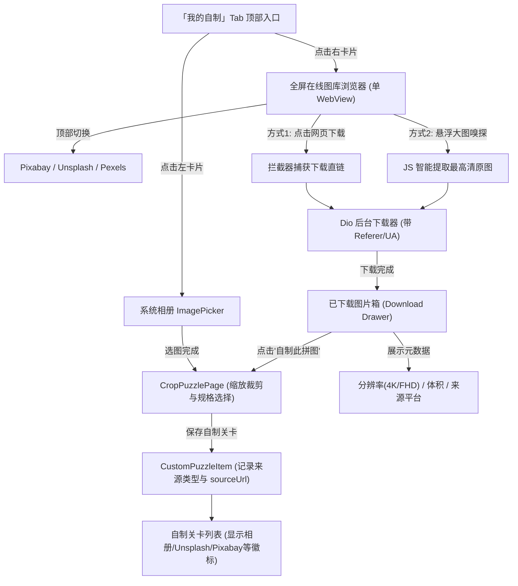

# 在线图库选图与关卡来源追踪设计方案

## 1. 概述与核心目标

为了让用户拥有丰富的高质量拼图素材，本方案在「我的自制」模块中引入**全屏在线免版权图库浏览器（Pixabay / Unsplash / Pexels）**，实现与本地相册选图并行的“双通道自制拼图”体验。

### 核心体验目标：
1. **双通道入口**：【我的自制】Tab 顶部采用左右对称双大卡片（「📷 本地相册导入」与「🌐 在线图库选图」）。
2. **单 WebView 极简内存架构**：通过顶部站点切换栏在同一 WebView 实例中平滑切换 Pixabay、Unsplash、Pexels，彻底避免多 WebView 导致的内存暴涨与卡顿。
3. **批量搜集与下载箱（不打断心流）**：用户搜索关键词时可连续下载多张心仪图片放入「下载箱」，再统一在下载管理面板中查看分辨率、文件大小、来源平台，并挑选进行拼图制作。
4. **关卡全链路来源追踪**：自制关卡完整记录来源（相册/网络平台）及 `sourceUrl`，并在关卡卡片和难度弹窗中展示专属平台徽标。

---

## 2. 整体交互流程与界面架构

### 2.1 整体业务流程图



---

### 2.2 界面布局与线框设计

#### 1. 【我的自制】Tab 顶部双大卡片布局
```
┌────────────────────────────────────────────────────────────┐
│  ┌──────────────────────────┐  ┌─────────────────────────┐ │
│  │ 📷 本地相册导入           │  │ 🌐 在线图库选图         │ │
│  │ ──────────────────────── │  │ ─────────────────────── │ │
│  │ 选用手机相册精彩瞬间     │  │ Pixabay/Unsplash海量图  │ │
│  │ [即刻制作 >]             │  │ [免登录浏览下载 >]      │ │
│  └──────────────────────────┘  └─────────────────────────┘ │
│                                                            │
│  我的自制合辑 (共 6 个关卡)                                  │
│  ┌──────────────────────┐    ┌──────────────────────┐      │
│  │ [🏷️ Unsplash]        │    │ [🏷️ 本地相册]        │      │
│  │     自制拼图缩略图   │    │     自制拼图缩略图   │      │
│  │ 森林清晨 · 64 块     │    │ 家中萌宠 · 36 块     │      │
│  └──────────────────────┘    └──────────────────────┘      │
└────────────────────────────────────────────────────────────┘
```

#### 2. 【在线图库选图】全屏浏览主界面 (Single WebView)
```
┌────────────────────────────────────────────────────────────┐
│  < 返回    [ Pixabay | Unsplash | Pexels ]       📥 已下载(3)│
├────────────────────────────────────────────────────────────┤
│  [==================== 网页加载进度条 60% =================]│
│                                                            │
│                                                            │
│                                                            │
│                    单实例 WebView 主区域                   │
│          （支持手势滑动、关键词搜索、分类筛选等）          │
│                                                            │
│                                                            │
│                                      ┌───────────────────┐ │
│                                      │ 🧩 提取当前页大图 │ │
│                                      └───────────────────┘ │
│                                      ┌───────────────────┐ │
│                                      │ 📥 下载箱 (3) ⚡  │ │
│                                      └───────────────────┘ │
└────────────────────────────────────────────────────────────┘
```

#### 3. 【已下载管理面板】（从底部滑出或点击右上角打开）
```
┌────────────────────────────────────────────────────────────┐
│  📥 已下载图库 (3 张)                     [清空全部]  [关闭 ✕] │
├────────────────────────────────────────────────────────────┤
│  ┌─────────────────────────┐  ┌──────────────────────────┐ │
│  │ ┌─────────────────────┐ │  │ ┌──────────────────────┐ │ │
│  │ │                     │ │  │ │                      │ │ │
│  │ │       高清缩略图    │ │  │ │        高清缩略图    │ │ │
│  │ │                     │ │  │ │                      │ │ │
│  │ └─────────────────────┘ │  │ └──────────────────────┘ │ │
│  │ 🏷️ Unsplash · 4K 高清   │  │ 🏷️ Pixabay · FHD 全高清  │ │
│  │ 📐 3840 × 2160          │  │ 📐 1920 × 1080           │ │
│  │ 💾 3.4 MB · 12:35       │  │ 💾 1.2 MB · 12:38        │ │
│  │ ─────────────────────── │  │ ──────────────────────── │ │
│  │ [🧩 自制此拼图]    [🗑️] │  │ [🧩 自制此拼图]     [🗑️] │ │
│  └─────────────────────────┘  └──────────────────────────┘ │
│                                                            │
│  💡 提示：点击任意图片即可进入缩放裁剪与难度设定页面。      │
└────────────────────────────────────────────────────────────┘
```

---

## 3. 核心技术实现细节与拦截机制

### 3.1 单 WebView 实例与站点平滑切换
- **插件选型**：`webview_flutter: ^4.10.x`。
- **内存优化原则**：
  - 整个页面生命周期内只初始化 1 个 `WebViewController`。
  - 切换站点时仅调用 `controller.loadRequest(Uri.parse(targetSiteUrl))`。
  - 预设 URL：
    - Pixabay: `https://pixabay.com/zh/photos/`
    - Unsplash: `https://unsplash.com/`
    - Pexels: `https://www.pexels.com/zh-cn/`

### 3.2 三层下载拦截与嗅探机制（双保险）

1. **第一层：`NavigationDelegate` 导航拦截**
   - 监听 `onNavigationRequest`：
     - 当 URL 命中图片扩展名（`.jpg`, `.jpeg`, `.png`, `.webp`）或特征下载路径（如 `unsplash.com/photos/.../download`, `pexels.com/.../?dl=1`, `pixabay.com/get/...`）时；
     - 返回 `NavigationDecision.prevent`；
     - 自动触发后台下载管道。
2. **第二层：Android / iOS 原生 `DownloadListener` 拦截**
   - 监听 HTTP `Content-Disposition: attachment` 附件流下载事件；
   - 截获下载 URL 和推荐文件名，交由后台下载器处理。
3. **第三层：JS 智能嗅探（兜底与便捷操作）**
   - 用户在详情页浏览时，点击悬浮的「🧩 提取当前页大图」按钮；
   - 执行轻量 JavaScript，智能按优先级查找高分辨率大图：
     ```javascript
     (function() {
       // 1. 优先提取 meta 原图
       let og = document.querySelector('meta[property="og:image"]');
       if (og && og.content) return og.content;
       // 2. 遍历页面主图中面积最大或包含 srcset 的图片
       let imgs = Array.from(document.querySelectorAll('img'))
                       .filter(img => img.naturalWidth > 600);
       if (imgs.length > 0) {
         imgs.sort((a, b) => (b.naturalWidth * b.naturalHeight) - (a.naturalWidth * a.naturalHeight));
         return imgs[0].currentSrc || imgs[0].src;
       }
       return '';
     })()
     ```

### 3.3 网络下载器与防盗链处理 (`Dio`)
- **防盗链 Headers**：
  - `Referer: <当前 WebView 页面 URL>`
  - `User-Agent: <移动端标准 UserAgent>`
- **下载流与元数据提取**：
  1. 使用 `Dio.download` 下载到应用临时目录 `download_cache/`；
  2. 结合 `dart:ui` 的 `instantiateImageCodec` 快速读取图片的真实像素宽高等元数据；
  3. 计算文件大小（MB/KB），记录 `sourcePlatform` 和 `sourceUrl`。

---

## 4. 关卡数据模型与来源追踪扩展

### 4.1 关卡来源类型枚举与模型扩展

```dart
/// 自制关卡来源类型
enum PuzzleSourceType {
  gallery('相册导入', Icons.photo_library_outlined),
  online('网络图库', Icons.language_outlined),
  preset('官方预置', Icons.extension_outlined);

  final String label;
  final IconData icon;
  const PuzzleSourceType(this.label, this.icon);
}

/// 已下载图片模型
class DownloadedImageItem {
  final String id;
  final String localPath;
  final String sourcePlatform; // 'Unsplash' | 'Pixabay' | 'Pexels'
  final String sourceUrl;
  final int width;
  final int height;
  final int fileSizeBytes;
  final DateTime downloadedAt;

  String get resolutionLabel => '$width × $height';
  String get fileSizeLabel => '${(fileSizeBytes / (1024 * 1024)).toStringAsFixed(1)} MB';
}
```

### 4.2 `CustomPuzzleItem` 模型升级与向前兼容

在 `CustomPuzzleItem` 中增加来源追踪字段：
```dart
class CustomPuzzleItem {
  final String id;
  final String title;
  final String imagePathOrUrl;
  final bool isLocalFile;
  final PuzzleDifficulty difficulty;
  final DateTime? createdAt;
  
  // 新增来源追踪字段
  final String sourceType;      // 'gallery' | 'online' | 'preset'
  final String sourcePlatform;  // '本地相册' | 'Unsplash' | 'Pixabay' | 'Pexels'
  final String? sourceUrl;      // 网络原始URL 或 本地标识

  // ... 序列化与反序列化（向下兼容历史老数据）
}
```

- **向下兼容策略**：
  - 读取旧版本存档时，若 `sourceType` 缺失：
    - 若 `imagePathOrUrl` 包含 `assets/` -> 标记为 `preset`；
    - 否则默认归类为 `gallery`（本地相册导入）。
  - 老关卡在升级后仍能平滑运行，不会崩溃。

---

## 5. 异常处理与边界场景应对

| 边界场景 | 应对策略与优化手段 |
| :--- | :--- |
| **重复点击下载同一张图** | 在下载前比对 `sourceUrl`，若已存在于已下载列表中，弹出轻提示“该图片已在下载箱中”，避免重复消耗流量和存储。 |
| **超高清大图（如 8K/RAW）导致解码 OOM** | 在下载与裁剪前，若图片超长边大于 4096px，在生成拼图切片时按比例约束至 2048px 标准画质，保证低端机运行流畅。 |
| **网络波动/下载中断** | 下载过程中展示进度条与取消按钮；下载失败时给出明确的“重试”与错误提示，不破坏 WebView 浏览状态。 |
| **缓存文件占用空间膨胀** | 提供「一键清空下载箱」功能，自动删除 `download_cache/` 临时图片。已制作成功的关卡保存在独立的 `custom_puzzles/` 中，不受清空影响。 |
| **图库网页广告或 APP 推广条遮挡** | WebView 页面加载完成后注入轻量 CSS：`#app-banner, .mobile-app-banner { display: none !important; }`，净化界面。 |

---

## 6. 实施路线图

1. **第一阶段：数据模型与底层支持**
   - 升级 `CustomPuzzleItem` 增加 `sourceType`、`sourcePlatform`、`sourceUrl` 字段与向下兼容；
   - 封装 `DownloadedImageManager`（负责下载图片缓存、元数据解析、持久化记录）。
2. **第二阶段：全屏图库浏览器页面**
   - 添加 `webview_flutter` 依赖；
   - 实现 `OnlineImagePickerPage`（单 WebView 架构、站点切换栏、下载拦截器、JS 提取器、下载箱徽标）。
3. **第三阶段：已下载抽屉与制作串联**
   - 实现 `DownloadedDrawerSheet`（展示分辨率、体积、来源标签）；
   - 对接 `CropPuzzlePage` 裁剪流程，保存时写入完整来源元数据。
4. **第四阶段：【我的自制】Tab 改造与平台徽标展示**
   - 顶部改造为左右对称双大卡片；
   - 关卡网格卡片和难度弹窗增加相册/网络平台徽标展示。
