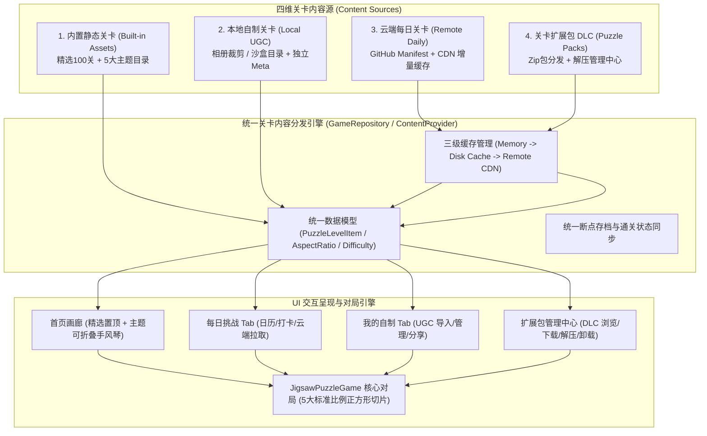
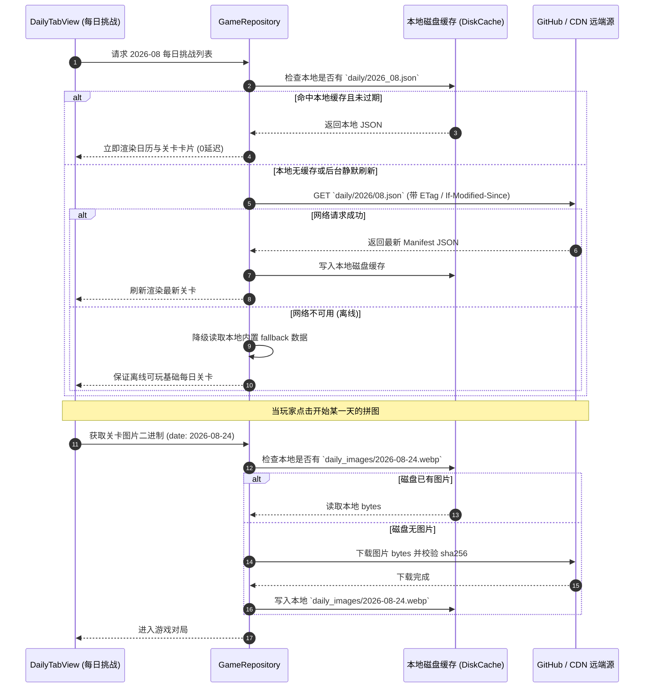

# 拼图关卡内容体系、存储架构与扩展包系统设计方案

> **文档状态**：方案设计 / 评审中  
> **面向模块**：资源分包、UGC 数据存储、云端每日关卡分发、扩展包 (DLC) 商店与本地管理  
> **创建日期**：2026-08-24  

---

## 1. 整体架构全景图

整个拼图游戏的内容数据流与存储系统划分为 **四层内容源**，统一汇聚至 **统一关卡运行时调度引擎 (Unified Puzzle Content Provider)**：



---

## 2. 内置关卡与静态资源分目录、分组规划

### 2.1 目录组织结构
将当前所有散落在 `assets/images/` 的图片按职责分目录重构，杜绝单一目录混乱堆放：

```
assets/
├── data/
│   ├── levels_manifest.json          # 内置关卡全局清单索引
│   └── categories.json               # 分组分类元数据（图标、名称、排序）
└── images/
    ├── backgrounds/                  # 全局背景壁纸
    │   ├── bg_000_canvas.webp
    │   ├── bg_001_wood_light.webp
    │   ├── bg_002_wood_dark.webp
    │   └── ...
    └── levels/                       # 内置关卡图库（按分类分目录）
        ├── featured/                 # 精选主线关卡（100 关）
        │   ├── level_001.webp
        │   ├── level_002.webp
        │   └── ... level_100.webp
        ├── animals/                  # 萌宠生灵主题
        │   ├── animal_001.webp
        │   └── ...
        ├── plants/                   # 植物花卉主题
        │   ├── plant_001.webp
        │   └── ...
        ├── architecture/             # 城市建筑名胜
        │   ├── arch_001.webp
        │   └── ...
        ├── landscape/                # 自然壮美风光
        │   ├── land_001.webp
        │   └── ...
        └── anime/                    # 二次元插画主题
            ├── anime_001.webp
            └── ...
```

### 2.2 关卡 Manifest 配置规范 (`assets/data/levels_manifest.json`)
采用轻量 JSON 统一配置，解耦代码写死循环，方便随时新增关卡与配置：

```json
{
  "version": 1,
  "categories": [
    {
      "id": "featured",
      "title": "🌟 精选主线",
      "subtitle": "经典必玩 · 官方 100 关挑战",
      "defaultExpanded": true,
      "isFeatured": true,
      "levelsCount": 100
    },
    {
      "id": "animals",
      "title": "🐾 萌宠生灵",
      "subtitle": "温顺治愈的动物世界",
      "defaultExpanded": false,
      "levelsCount": 30
    },
    {
      "id": "landscape",
      "title": "🌄 自然风光",
      "subtitle": "大自然的鬼斧神工与四季之美",
      "defaultExpanded": false,
      "levelsCount": 30
    },
    {
      "id": "architecture",
      "title": "🏛️ 建筑名胜",
      "subtitle": "人类文明的宏伟遗迹与现代都市",
      "defaultExpanded": false,
      "levelsCount": 20
    },
    {
      "id": "plants",
      "title": "🌿 植物与花卉",
      "subtitle": "微风中盛放的静谧花园",
      "defaultExpanded": false,
      "levelsCount": 20
    },
    {
      "id": "anime",
      "title": "🎨 二次元与插画",
      "subtitle": "精美二次元、概念设定与幻想插画",
      "defaultExpanded": false,
      "levelsCount": 20
    }
  ],
  "levels": [
    {
      "id": "featured_001",
      "category": "featured",
      "index": 1,
      "title": "初夏晨光微曦的花园",
      "assetPath": "assets/images/levels/featured/level_001.webp",
      "aspectRatio": "1:1",
      "defaultRows": 4,
      "defaultCols": 4
    }
  ]
}
```

### 2.3 首页 UI 折叠手风琴 (Collapsible Group Accordion) 设计
- **结构**：
  - **头部胶囊筛选**（全部 / 进行中 / 已完成）；
  - **第一组（置顶默认展开）**：`🌟 精选主线 (100关)`，展示关卡完成度进度条（如 `已通关 42/100 · 42%`）；
  - **后续常用分组（可独立折叠/展开）**：每个分组展示头部条（图标 + 分组名称 + 关卡统计徽章 + 展开/折叠箭头），点击展开/收起；
  - **网格渲染**：分组内网格复用响应式网格（窄屏 2 列，宽屏 3~6 列，1:1 正方形卡片）。

---

## 3. UGC 自制关卡本地沙盒存储与元数据架构

### 3.1 存储目录规范
自制拼图从过去单一平铺目录升级为 **独立沙盒包结构**，防止文件名冲突并支持一键打包导出：

```
[App Documents Directory]/
└── custom_puzzles/
    ├── index.json                    # 快速列表索引清单（仅含标题、封面路径、创建时间）
    └── items/
        ├── ugc_1787548651000/        # 单关卡独立目录（以时间戳或UUID命名）
        │   ├── image.png             # 裁剪后的标准比例高清原图
        │   ├── thumb.webp            # 256x256 快速渲染缩略图
        │   └── meta.json             # 关卡完整元数据
        └── ugc_1787548923000/
            ├── image.png
            ├── thumb.webp
            └── meta.json
```

### 3.2 单关卡元数据规范 (`meta.json`)
```json
{
  "id": "ugc_1787548651000",
  "version": 1,
  "title": "我的爱犬照片",
  "createdAt": "2026-08-24T15:20:00.000Z",
  "updatedAt": "2026-08-24T15:20:00.000Z",
  "aspectRatio": "1:1",
  "imageWidth": 1080,
  "imageHeight": 1080,
  "defaultRows": 4,
  "defaultCols": 4,
  "completedPieceCounts": [16, 36],
  "bestTimeMs": 83000,
  "userTags": ["宠物", "自拍"],
  "sourceFileName": "IMG_20260824_152000.jpg"
}
```

### 3.3 容错与恢复机制
- **双重索引机制**：读取时优先加载 `custom_puzzles/index.json`（毫秒级瞬时启动）；
- **自动灾备重建**：若 `index.json` 损坏或丢失，系统在后台并发扫描 `items/*/meta.json`，全自动重建 `index.json`，数据永不丢失；
- **清理级联**：删除关卡时直接递归删除整个 `items/ugc_xxx/` 目录，不残留垃圾文件。

---

## 4. 网络关卡（每日挑战）云端分发与缓存架构

### 4.1 云端静态托管方案 (GitHub Pages / CDN)
无需维护动态后端服务器，利用 GitHub Repository / Pages / Releases 配合 jsDelivr / Cloudflare 提供高可用静态托管：

```
[GitHub Repo: jigsaw-puzzle-content]
└── daily/
    ├── manifest.json                 # 每日关卡总清单（最新月度目录与版本号）
    ├── 2026/
    │   ├── 08.json                   # 2026年8月每日挑战明细
    │   └── 09.json                   # 2026年9月每日挑战明细
    └── images/
        ├── 2026-08-01.webp
        ├── 2026-08-02.webp
        └── ...
```

### 4.2 云端月度 Manifest 格式规范 (`2026/08.json`)
```json
{
  "year": 2026,
  "month": 8,
  "version": 2,
  "baseUrl": "https://raw.githubusercontent.com/.../daily/images/",
  "mirrorUrls": [
    "https://cdn.jsdelivr.net/gh/.../daily/images/"
  ],
  "challenges": [
    {
      "date": "2026-08-24",
      "dayNumber": 24,
      "title": "中世纪古堡与阿尔卑斯山麓",
      "author": "Bing Wallpaper",
      "location": "新天鹅堡, 德国",
      "imageName": "2026-08-24.webp",
      "imageSha256": "e3b0c44298fc1c149afbf4c8996fb92427ae41e4649b934ca495991b7852b855",
      "fileSize": 348200,
      "aspectRatio": "3:2",
      "defaultRows": 4,
      "defaultCols": 6,
      "fallbackAsset": "assets/images/levels/featured/level_004.webp"
    }
  ]
}
```

### 4.3 客户端三级缓存与离线优先时序



---

## 5. 关卡扩展包 (DLC / Puzzle Packs) 系统设计

### 5.1 扩展包文件标准格式 (`.jpk` / Jigsaw Pack)
扩展包基于标准 Zip 容器打包，文件扩展名为 `.jpk`：

```
cyberpunk_city_vol1.jpk (Zip 压缩包)
├── pack.json                         # 扩展包核心配置元数据
├── cover.webp                        # 扩展包宣传封面图 (800x450, 16:9)
├── icon.webp                         # 扩展包小图标 (128x128)
└── levels/                           # 扩展包包含的所有关卡图片与元数据
    ├── 01/
    │   ├── image.webp                # 关卡高清原图 (标准 5 种比例之一)
    │   ├── thumb.webp                # 关卡缩略图
    │   └── meta.json                 # 关卡名称、默认难度等
    ├── 02/
    │   ├── image.webp
    │   ├── thumb.webp
    │   └── meta.json
    └── ...
```

#### `pack.json` 规范定义
```json
{
  "packId": "pack_cyberpunk_2026_01",
  "version": 1,
  "name": "未来赛博都市 · 霓虹幻夜",
  "description": "穿梭于流光溢彩的摩天楼群与雨夜街道，体验未来科技视觉盛宴。",
  "author": "Official Studio",
  "levelCount": 20,
  "totalDownloadSize": 18450000,
  "minAppVersion": "1.0.0",
  "tags": ["科幻", "赛博朋克", "城市夜景"],
  "createdAt": "2026-08-24"
}
```

### 5.2 云端扩展包清单 (`packs/manifest.json`)
```json
{
  "version": 1,
  "packs": [
    {
      "packId": "pack_world_heritage_01",
      "name": "世界文化遗产巡礼",
      "description": "带你领略金字塔、泰姬陵与长城的壮丽史诗。",
      "author": "National Geographic",
      "coverUrl": "https://.../packs/world_heritage/cover.webp",
      "downloadUrl": "https://.../packs/world_heritage.jpk",
      "sha256": "4a7d...391e",
      "fileSize": 16200000,
      "levelCount": 15,
      "isFree": true
    }
  ]
}
```

### 5.3 客户端扩展包管理中心 (Pack Management Center) UI

#### 1. 扩展包画廊视图 (Pack Store / Library)
- **展示形式**：横向或双列大卡片（16:9 封面大图 + 主题名称 + 关卡数量徽章 + 体积大小）；
- **状态指示器**：
  - **未下载**：显示「📥 获取 (16.2 MB)」按钮；
  - **下载中**：显示带百分比的环形/线性进度条「`正在下载 45% (7.3MB / 16.2MB)`」及取消按钮；
  - **已安装**：显示「🎮 浏览关卡 (已通关 3/15)」按钮，右上角提供「更多设置 (更新/卸载)」菜单；
- **磁盘空间管理**：顶部展示「已用扩展包存储：48.5 MB · [一键清理全部已通关扩展包]」。

#### 2. 包内关卡画廊视图 (Pack Detail & Level Grid)
- 点击已安装扩展包卡片进入：
  - 顶部 Hero 动效大封面与包简介；
  - 下方呈现自适应关卡网格（2~5 列）；
  - 点击任意关卡弹出熟悉的 `ChooseDifficultySheet` 选择正方形切片难度开玩！

---

## 6. 分阶段实施路线图 (Phased Implementation Plan)

### 阶段一：内置关卡分目录规范化与首页折叠手风琴（建议优先实施）
1. 重构 `assets/images/levels/` 子目录结构与壁纸目录；
2. 编写 `assets/data/levels_manifest.json` 索引配置；
3. 升级 `HomePage` 关卡网格为 **置顶精选 100 关 + 可折叠展开的主题分组列表**；
4. 跑通全量单元测试与布局测试。

### 阶段二：UGC 自制关卡独立沙盒包重构
1. 升级 `CropPuzzlePage` 与 `GameRepository`，保存至 `custom_puzzles/items/ugc_xxx/`；
2. 生成 256x256 快速缩略图与独立 `meta.json`；
3. 编写 `index.json` 自动灾备扫描与重建机制；
4. 提供 UGC 关卡导出为单文件分享的底层准备。

### 阶段三：GitHub 云端每日关卡 Manifest 动态同步
1. 制定 GitHub 每日挑战仓库的 JSON 规范与静态 CDN 备份链；
2. 实现客户端 `DailyChallengeService`，支持三级缓存（内存/磁盘/远端）与后台静默增量拉取；
3. 增强断网状态下的优雅离线降级与重试机制。

### 阶段四：扩展包 (DLC) 下载与管理系统
1. 实现 `.jpk` (Zip) 格式打包、下载、断点续传、SHA256 校验与本地解压管道；
2. 新增「扩展包商店与本地包管理中心」UI 页面；
3. 实现包内关卡浏览与本地磁盘空间一键卸载管理。

---

## 7. 方案总结与核心优势

| 维度 | 改造前现状 | 本方案设计 | 带来的收益 |
| :--- | :--- | :--- | :--- |
| **内置关卡** | `assets/images/` 散放，代码写死循环 | 分类子目录 + `levels_manifest.json` 静态索引 | 资产井井有条，新增/调整关卡零代码改动 |
| **首页 UI** | 单一平铺列表，无法分组展示 | 置顶精选 100 关 + 5 大主题可折叠手风琴 | 层次分明，视觉清晰，查找快速 |
| **自制关卡** | 平铺单目录，依赖单一 SharedPreferences | 独立沙盒包 (`items/ugc_xxx/` + `meta.json`) | 隔离防冲突，具备自动灾备重建与打包分享能力 |
| **每日关卡** | 本地写死 31 天样例数据 | GitHub Manifest + CDN 增量缓存与动态拉取 | 零发版每日推新，离线优先秒开 |
| **内容扩充** | 仅随 App 发版增加关卡 | 完整 DLC `.jpk` 扩展包商店与管理中心 | 随时引入海量主题包，按需下载不占包体空间 |
