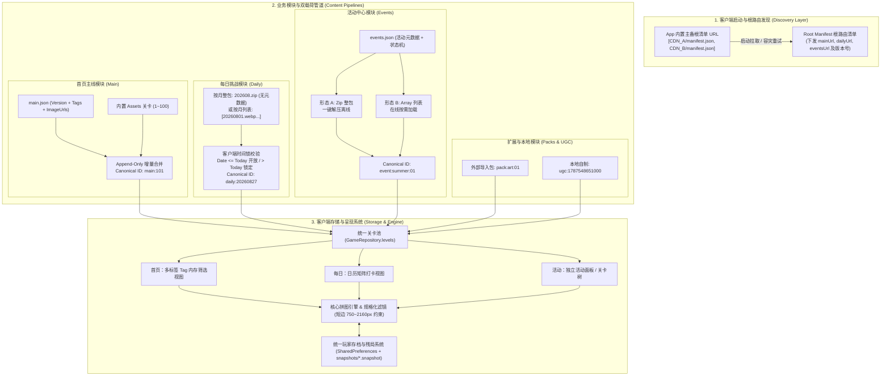

# 拼图关卡内容体系、存储架构与扩展包系统设计规范 (v3 极简动态推导与路由版)

> **文档状态**：已完整落地实现并集成 (v3 生产落地版)
> **实现工程**：`lib/logic/content/` (根路由清单、增量主线、每日时间锁、活动状态机)、`lib/pages/tabs/` (主页/每日/活动/自制 4-Tab 矩阵)
> **面向模块**：Root Manifest 根路由、首页主线 (Main)、每日挑战 (Daily)、活动中心 (Events)、关卡扩展包 (Zip / 文件夹)、本地 UGC、统一存档与残局隔离
> **修订日期**：2026-08-27（v3 落地验证版）
>
> **版本核心演进原则**：
> 1. **根清单路由解耦 (Root Manifest Discovery)**：App 仅内置极简根清单 URL（主备容灾），各业务模块（首页/每日/活动）的 CDN 访问端点由服务端动态下发，杜绝客户端发版硬编码。
> 2. **图片即关卡，零/极简元数据 (Zero Metadata Philosophy)**：关卡文件名即 ID，去除死板的手工 title/id 冗余，全局通过 `{模块}:{上下文}:{文件名}` 动态推导 Canonical ID；长宽比、网格切片、缩略图全由运行时推导。
> 3. **多维标签化分类 (Tag-based Taxonomy)**：首页摒弃死板物理目录分类，全面推行多标签（Tags）筛选体系，一套关卡池支持多维度灵活过滤。
> 4. **二元数据载荷自由切换 (Array vs. Zip)**：支持“轻量流式清单 (Array)”与“整包离线交付 (Zip)”两种模式，兼顾常态更新与大型专题活动。
> 5. **每日挑战时间锁 (Daily Time-lock)**：每日关卡按月交付，依据 `YYYYMMDD` 文件名自推导，客户端依据系统时间动态施加时间锁（`date <= today` 开放，`date > today` 锁闭防剧透）。
> 6. **活动状态机与软下线 (Event Lifecycle & Auto-GC)**：活动列表通过 `status`（`upcoming / active / outdated / disabled`）状态机管控生命周期，下线时由客户端自动垃圾回收本地磁盘缓存。
> 7. **内容只读与存档彻底隔离**：关卡图片与元数据完全只读；玩家通关数据按 Canonical ID 索引管理，残局快照按需单文件落盘。

---

## 1. 整体架构全景图



---

## 2. 统一关卡主键：全局 Canonical ID 动态合成法则

系统**不依赖服务端在 JSON 中手动编写 `id`**，所有关卡进入客户端内存与本地落盘时，统一通过 **`{模块前缀}:{上下文/分组}:{纯文件名(无后缀)}`** 自动推导，确保跨端一致、绝对防冲突、语义清晰：

| 关卡源类型 | 规范格式 (Pattern) | 实例推导 (Example) | 规则与用途 |
| :--- | :--- | :--- | :--- |
| **首页内置关卡** | `main:{序号}` | `main:001` ~ `main:100` | 打包在 Assets 中，按文件名自动映射 |
| **首页云端热更** | `main:{序号}` | `main:101`, `main:102` | 从远端图片文件名或 URL 提取数字序号 |
| **每日挑战** | `daily:{YYYYMMDD}` | `daily:20260827` | 直接从文件名 `20260827.webp` 提取日期，全局天然唯一 |
| **限时活动** | `event:{eventId}:{文件名}` | `event:cyberpunk:01_rain` | 活动 ID + 包内图片文件名，活动间绝不冲突 |
| **导入关卡包 (DLC)**| `pack:{packId}:{文件名}` | `pack:world_art:mona_lisa` | 包名 + 内部文件名 |
| **UGC 自制拼图** | `ugc:{时间戳或哈希}` | `ugc:1787548651000` | 本地私有图片，时间戳唯一命名 |

---

## 3. 根清单路由体系 (Root Manifest)

App 客户端代码内部**只内置主备 2~3 个根清单的静态 URL**（如主 CDN、GitHub Pages 备用镜像、Cloudflare Workers 等），不再硬编码任何具体业务模块的 URL。

### 3.1 服务端根清单规范 (`manifest.json`)
```json
{
  "schemaVersion": 3,
  "updatedAt": "2026-08-27T06:00:00Z",
  "appConfig": {
    "minAppVersion": "1.0.0",
    "notice": ""
  },
  "modules": {
    "main": {
      "url": "https://cdn.example.com/puzzle/main.json",
      "version": 105
    },
    "daily": {
      "currentMonth": "202608",
      "zipUrlPattern": "https://cdn.example.com/puzzle/daily/{YYYYMM}.zip",
      "listUrlPattern": "https://cdn.example.com/puzzle/daily/{YYYYMM}.json",
      "version": 20260827
    },
    "events": {
      "url": "https://cdn.example.com/puzzle/events.json",
      "version": 12
    }
  }
}
```

### 3.2 客户端发现与容灾流程
1. **主备轮询**：客户端优先请求主 URL，若超时（如 3 秒）或返回 5xx，自动无缝重试备用 URL；
2. **本地落盘**：请求成功后将 `manifest.json` 缓存至本地 `[App Support]/manifest_cache.json`；
3. **离线回退**：若完全无网络且无缓存，回退至 App 打包时内置的 `assets/data/manifest_default.json`。

---

## 4. 三大业务模块数据格式与运作规范

### 4.1 首页主线模块 (Main)：多标签 + 增量流式更新

首页主线关卡面向海量持续推新，采用 **“版本号驱动 + 全量极简 JSON + ID 增量 Upsert + 图片按需懒加载”** 机制。

#### (1) 服务端格式规范 (`main.json`)
首页关卡仅需提供图片 URL 与分类 Tags，**无需提供 id 和 title**（客户端自动从文件名推导 `main:101`，标题默认展示为 `#101`）：
```json
{
  "version": 105,
  "levels": [
    {
      "url": "https://cdn.example.com/main/101.webp",
      "tags": ["landscape", "aurora", "snow"]
    },
    {
      "url": "https://cdn.example.com/main/102.webp",
      "tags": ["animal", "cat", "cute"]
    },
    {
      "url": "https://cdn.example.com/main/103.webp",
      "tags": ["art", "oil_painting", "landscape"]
    }
  ]
}
```

#### (2) 标签化分类 (Tags) 运作机制
*   **多维命中**：关卡不再受限于单一文件夹或单一类别。例如 `103.webp` 同时拥有 `art` 和 `landscape` 标签，在“艺术”和“风景”两个 Tab 下都会被筛选出来。
*   **UI 过滤逻辑**：
    *   顶部 Tab 栏展示：`全部` | `萌宠` (`animal`) | `风光` (`landscape`) | `艺术` (`art`) 等；
    *   过滤公式：`currentTag == 'all' || level.tags.contains(currentTag)`。

#### (3) 客户端本地存储与增量合并
*   **本地存储路径**：
    *   元数据缓存：`[App Support]/main_levels_cache.json`
    *   已下载原图：`[App Documents]/levels/main/main_101.webp`
*   **增量合并逻辑**：
    *   客户端对比 `main.version`，若有更新，拉取 `main.json`；
    *   以推导出的 `main:101` 为主键，与本地已有的关卡进行 `Upsert`（插入新增关卡，保留本地已有的通关进度和下载标记）；
    *   图片不在同步时批量下载，而是在玩家点击关卡或进入画廊视图时进行**按需下载并持久化缓存**。

---

### 4.2 每日挑战模块 (Daily)：按月交付 + 零元数据 + 客户端时间锁

每日挑战具有强烈的按天递进与防剧透特性，服务端**彻底取消单独的 JSON 元数据**，完全基于 `YYYYMMDD` 文件名推导。

#### (1) 服务端交付支持的两种形态

##### 形态 A：按月整包 Zip (推荐首选)
*   **CDN 结构**：`https://cdn.example.com/puzzle/daily/202608.zip`
*   **Zip 内部文件结构**（纯图片，无配置文件）：
    ```
    202608.zip
    ├── 20260801.webp
    ├── 20260802.webp
    ├── ...
    ├── 20260827.webp
    └── 20260831.webp
    ```

##### 形态 B：按月图片列表 Array (降级/在线备用)
若使用单图列表形式，服务端清单仅包含当月 URL 数组：
```json
[
  "https://cdn.example.com/daily/20260801.webp",
  "https://cdn.example.com/daily/20260802.webp",
  "https://cdn.example.com/daily/20260827.webp"
]
```

#### (2) 客户端本地存储结构
Zip 下载后直接解压至专属月份目录：
```
[App Documents]/daily/
├── 202607/                          # 上月归档
│   ├── 20260701.webp
│   └── ...
└── 202608/                          # 当月目录
    ├── 20260801.webp
    ├── 20260827.webp
    └── 20260831.webp
```

#### (3) 客户端扫描与时间锁 (Time-lock) 机制
```dart
// 伪代码：解析每日挑战关卡
final fileRegex = RegExp(r'^(\d{4})(\d{2})(\d{2})\.(webp|jpg|png)$');
final todayStr = DateFormat('yyyyMMdd').format(DateTime.now()); // 如 "20260827"

for (final file in directory.listSync()) {
  final match = fileRegex.firstMatch(path.basename(file.path));
  if (match != null) {
    final dateStr = '${match.group(1)}${match.group(2)}${match.group(3)}';
    final canonicalId = 'daily:$dateStr';
    final isLocked = dateStr.compareTo(todayStr) > 0; // 未来日期加锁
    
    // 生成运行时关卡项
    yield DailyLevelItem(
      id: canonicalId,
      date: dateStr,
      localPath: file.path,
      isTimeLocked: isLocked, // true: UI 展示时间锁图标，禁止进入游戏且模糊/屏蔽底图
    );
  }
}
```
*   **体验收益**：一个月只下载一次 Zip（约 5~10MB），整月离线可用；同时未来日期由于时间锁限制，杜绝玩家提前看到剧透图。

---

### 4.3 活动中心模块 (Events)：独立主题包 + 状态机生命周期 + 懒落地保证离线

活动是高度自包含的独立专题。活动自身需要面向玩家的介绍元数据，但**活动内部的关卡图片不需要单独配置 ID**；网络 `array` 关卡可视即经 `LevelImageResolver` 后台落盘到 `network_levels/` 再生成缩略，保证见缩略必可玩（`docs/network-level-lazy-download-plan-20260902.md`）。

#### (1) 服务端活动列表规范 (`events.json`)
支持 `type: "zip"`（整包）与 `type: "array"`（列表）双模式：
```json
[
  {
    "id": "cyberpunk_2026",
    "title": "未来赛博都市 · 霓虹幻夜",
    "desc": "穿梭于流光溢彩的摩天楼群与雨夜街道，挑战 12 张限定高清拼图。",
    "coverUrl": "https://cdn.example.com/events/cyberpunk_cover.webp",
    "status": "active",
    "type": "zip",
    "zipUrl": "https://cdn.example.com/events/cyberpunk_2026.zip",
    "zipSha256": "8f3b2a...",
    "sizeBytes": 24500000,
    "startTime": "2026-08-01T00:00:00Z",
    "endTime": "2026-09-01T00:00:00Z",
    "displayOrder": 1
  },
  {
    "id": "classic_art",
    "title": "卢浮宫名画特辑",
    "desc": "精选世界传世油画名作",
    "coverUrl": "https://cdn.example.com/events/art_cover.webp",
    "status": "active",
    "type": "array",
    "levels": [
      "https://cdn.example.com/events/art/01_mona_lisa.webp",
      "https://cdn.example.com/events/art/02_starry_night.webp"
    ],
    "startTime": "2026-08-15T00:00:00Z",
    "endTime": "2026-09-15T00:00:00Z",
    "displayOrder": 2
  },
  {
    "id": "summer_2025",
    "status": "disabled"
  }
]
```

#### (2) 活动生命周期状态机与客户端行为定义

| 状态 (`status`) | 含义与业务场景 | 客户端 UI 展示 | 本地缓存与磁盘管理行为 |
| :--- | :--- | :--- | :--- |
| **`upcoming`** | 活动预告 (未开始) | 卡片置灰，显示“距离开始还有 X 天”倒计时 | 可选在 Wi-Fi 下静默预下载 Zip |
| **`active`** | 活动进行中 | 正常高亮显示，支持下载与游玩 | 保存在 `[App Documents]/events/<eventId>/` |
| **`outdated`** | 活动已结束 (往期回顾) | 移至“往期活动”Tab，只读回顾已通关关卡 | 保留本地解压数据，允许玩家在设置中手动清理 |
| **`disabled`** | **活动彻底下架/废弃** | **客户端完全隐藏该活动入口** | **触发自动垃圾回收 (Auto-GC)**：客户端在后台自动删除本地对应的解压目录及 Zip，释放存储空间 |

#### (3) 活动包内关卡解析
*   若为 **Zip 模式**：客户端解压至 `[App Documents]/events/{eventId}/`，遍历目录下所有图片文件，排序后生成 `event:{eventId}:{文件名}`（如 `event:cyberpunk_2026:01_rain`）；
*   若为 **Array 模式**：可视时 `LazyLevelImage` 经 `LevelImageResolver` 下载到 `network_levels/net_<hash>.jpg` 再转本地 `PuzzleLevelItem(isLocalFile:true)`，与 `Zip` 同享 `AppCachedImageProvider` 缩略链路，离线可玩。

---

## 5. 扩展包 (DLC) 与本地自制 (UGC)

### 5.1 外部导入关卡包 (Packs)
*   **导入形式**：用户通过系统分享或文件选择器导入 `.zip` 压缩包或文件夹；
*   **存储路径**：解压至 `[App Documents]/packs/{packId}/`；
*   **Canonical ID**：`pack:{packId}:{文件名}`；
*   **极简原则**：纯图片即可成包，若包内有 `pack.json` 则读取自定义标题与作者，若无则直接以 zip 文件名作为包名。

### 5.2 本地 UGC 自制拼图
*   **存储路径**：`[App Documents]/custom_puzzles/ugc_{timestamp}.png`；
*   **Canonical ID**：`ugc:{timestamp}`；
*   **元数据**：保存在本地轻量数据库或 `custom_puzzles.json` 中。

---

## 6. 客户端全局存储目录规范树

```
[App Sandbox]
├── assets/                                      # 只读打包资源 (Assets)
│   ├── data/
│   │   ├── manifest_default.json                # 默认根路由兜底
│   │   └── tags.json                            # 默认标签多语言定义 (tag -> 显示名称)
│   └── images/levels/featured/                  # 内置 1~100 关
│       ├── level_001.webp (映射为 main:001)
│       └── ...
│
├── [App Support Directory]/                     # 内部配置与系统快照 (用户不可见)
│   ├── manifest_cache.json                      # 缓存的 Root Manifest
│   ├── main_levels_cache.json                   # 缓存的首页关卡元数据
│   ├── events_cache.json                        # 缓存的活动列表
│   ├── thumbnail_cache/                         # 缩略图三级缓存 L2 磁盘
│   │   └── thumb_<fnv63>_<dim>.jpg (360/720 两档，FNV63 掩码)
│   └── snapshots/                               # 对局断点残局快照 (独立文件)
│       ├── main_101.snapshot
│       └── daily_20260827.snapshot
│
└── [App Documents Directory]/                   # 用户数据与大型关卡内容库
    ├── levels/                                  # 首页按需下载的图片
    │   └── main/
    │       ├── 101.webp
    │       └── 102.webp
    ├── network_levels/                          # 网络关卡懒落地（Array 关卡单次下载，见缩略必可玩）
    │   └── net_<fnv63>.jpg
    ├── daily/                                   # 每日挑战月度沙盒
    │   ├── 202607/ (已归档月份图片)
    │   └── 202608/ (当月图片: 20260801.webp...)
    ├── events/                                  # 活动解压沙盒
    │   ├── cyberpunk_2026/ (01.webp, 02.webp...)
    │   └── classic_art/
    ├── packs/                                   # 用户导入的 DLC 关卡包
    │   └── world_art/
    └── custom_puzzles/                          # 本地 UGC 图片
        └── ugc_1787548651000.png
```

---

## 7. 玩家存档与残局快照系统

### 7.1 通关进度与打卡记录 (SharedPreferences / SQLite)
统一以 **Canonical ID** 作为主键索引，结构极度扁平：
```json
{
  "main:001": {
    "isCompleted": true,
    "completedPieceCounts": [16, 64],
    "bestTimeSeconds": 75,
    "stars": 3
  },
  "daily:20260827": {
    "isCompleted": true,
    "completedPieceCounts": [36],
    "bestTimeSeconds": 142
  },
  "event:cyberpunk_2026:01": {
    "isCompleted": false,
    "hasSnapshot": true
  }
}
```

### 7.2 对局断点残局快照 (Snapshot Isolation)
*   **独立存储**：`[App Support]/snapshots/<sanitized_canonical_id>.snapshot`；
*   **生命周期**：进入对局加载 -> 每放置若干碎片异步写入 -> 通关结算瞬间执行 `deleteFile` 彻底销毁；
*   **解耦收益**：主存档永不膨胀，单个对局崩溃或损坏不影响全局进度。

---

## 8. 非规范图片健壮性处理机制 (对齐架构 §3.13)

在用户导入 Zip 包、相册自制或下载网络资源时，运行时引擎统一执行安全规整：

| 异常情况 | 判定标准 | 系统处理策略 |
| :--- | :--- | :--- |
| **低分辨率小图** | **短边 $\min(W, H) < 750\text{px}$** | **直接拦截并跳过**。杜绝切片后单片像素 $< 30\text{px}$ 导致的模糊马赛克。 |
| **标准高清图** | $750\text{px} \le \text{短边} \le 2160\text{px}$ | **100% 原图无损导入**，不进行二次压缩。 |
| **超大高分图 (4K/8K)**| 短边 $\min(W, H) > 2160\text{px}$ | **等比缩放至短边 2160px 黄金上限**，由 `Isolate.run` 异步重采样，显存压制在 20MB 内防 OOM。 |
| **极端比例图** | 宽高比 $> 1.8$ 或 $< 0.55$ | 自动居中安全裁剪至最接近的标准比例（`1:1` / `2:3` / `3:2` / `3:4` / `4:3`）。 |
| **动图 / 坏图** | GIF / Header 损坏 | GIF 仅取首帧静态图；坏图自动丢弃并弹窗提示跳过。 |

---

## 9. 统一运行时核心数据模型 (Dart Models)

```dart
/// 统一关卡运行时模型
class PuzzleLevelItem {
  const PuzzleLevelItem({
    required this.id,                     // Canonical ID (如 "main:101", "daily:20260827", "event:summer:01")
    required this.imagePathOrUrl,         // 本地绝对路径、Asset 路径或远端 URL
    required this.isLocalFile,            // 是否本地已就绪 (可直接无网开玩)
    this.title,                           // 展示标题 (可选，若无则 UI 依据 ID 格式化)
    this.order = 0,                       // 排序权重
    this.tags = const [],                 // 核心：多标签列表
    this.sourceModule = 'main',           // 'main' | 'daily' | 'events' | 'pack' | 'ugc'
    this.eventId,                         // 所属活动 ID (可选)
    this.dailyDate,                       // 所属每日日期 YYYYMMDD (可选)
    this.isTimeLocked = false,            // 是否受每日时间锁限制
    // --- 动态注入的存档数据 ---
    this.isUnlocked = false,
    this.isCompleted = false,
    this.completedPieceCounts = const [],
    this.bestTimeSeconds = 0,
    this.hasSavedSnapshot = false,
  });

  final String id;
  final String imagePathOrUrl;
  final bool isLocalFile;
  final String? title;
  final int order;
  final List<String> tags;
  final String sourceModule;
  final String? eventId;
  final String? dailyDate;
  final bool isTimeLocked;

  final bool isUnlocked;
  final bool isCompleted;
  final List<int> completedPieceCounts;
  final int bestTimeSeconds;
  final bool hasSavedSnapshot;

  /// UI 展示标题快捷推导
  String get displayTitle {
    if (title != null && title!.isNotEmpty) return title!;
    if (id.startsWith('main:')) return '#${id.substring(5)}';
    if (id.startsWith('daily:')) return '${id.substring(6, 10)}-${id.substring(10, 12)}-${id.substring(12, 14)}';
    return id.split(':').last;
  }
}

/// 活动列表项模型
class PuzzleEventItem {
  const PuzzleEventItem({
    required this.id,
    required this.title,
    required this.status,                // 'upcoming' | 'active' | 'outdated' | 'disabled'
    required this.type,                  // 'zip' | 'array'
    this.desc = '',
    this.coverUrl,
    this.zipUrl,
    this.zipSha256,
    this.levels = const [],
    this.startTime,
    this.endTime,
    this.displayOrder = 0,
  });

  final String id;
  final String title;
  final String status;
  final String type;
  final String desc;
  final String? coverUrl;
  final String? zipUrl;
  final String? zipSha256;
  final List<String> levels;
  final DateTime? startTime;
  final DateTime? endTime;
  final int displayOrder;

  bool get isActive => status == 'active';
  bool get isDisabled => status == 'disabled';
  bool get isOutdated => status == 'outdated';
}
```

---

## 10. 实施与迁移路线图

1. **第一阶段：模型重构与 Canonical ID 规范对齐**
   - 升级 `PuzzleLevelItem` 模型，实现 `{模块}:{上下文}:{文件名}` 动态推导生成器；
   - 兼容现有 `level_1` 旧存档，平滑迁移映射到 `main:001`。
2. **第二阶段：根清单与首页多标签改造**
   - 接入 Root Manifest 主备请求与缓存；
   - 首页接入 `main.json`，实现基于 `tags` 的前端 Tab 内存过滤与 Append-Only 合并。
3. **第三阶段：每日挑战月度 Zip 与时间锁**
   - 实现 `YYYYMM.zip` 下载与解压至 `daily/YYYYMM/` 目录；
   - 编写基于文件名正则的时间锁过滤器，对接日历 UI。
4. **第四阶段：活动中心双模式与 Auto-GC**
   - 接入 `events.json` 状态机；
   - 实现 Zip 整包解压与 Array 在线加载；
   - 接入 `status: "disabled"` 时的客户端本地目录自动垃圾清理。
