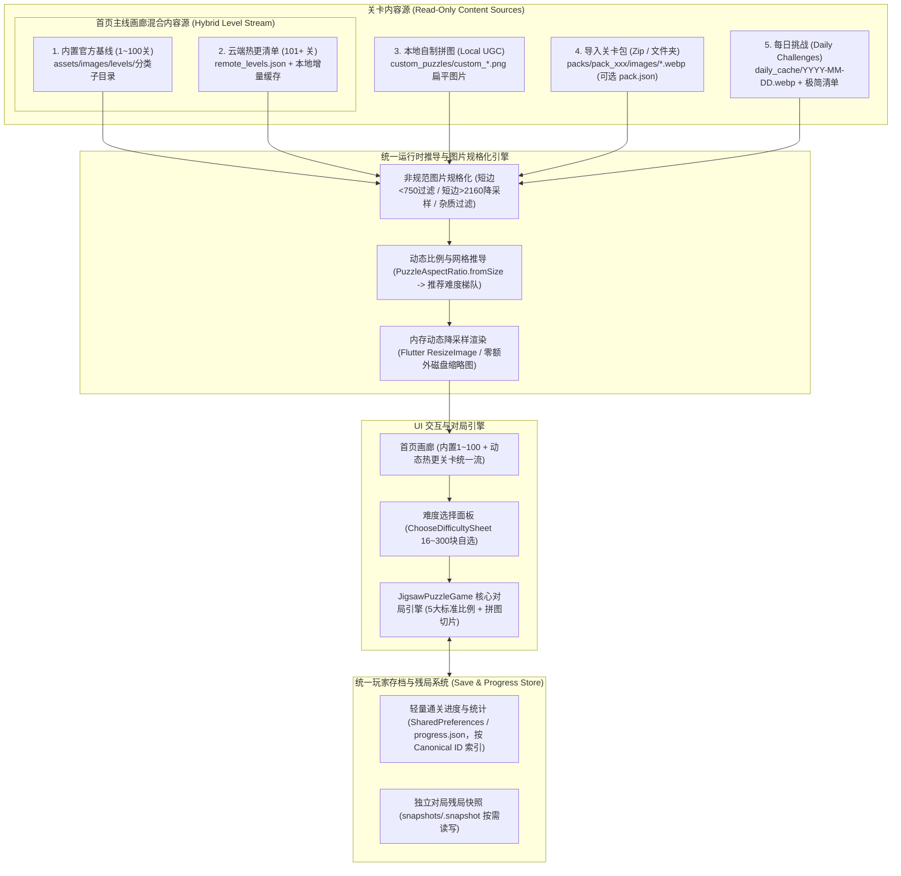

# 拼图关卡内容体系、存储架构与扩展包系统设计规范 (v2 极简实用版)

> **文档状态**：方案设计 / 评审通过
> **面向模块**：内置关卡、云端动态热更新、UGC 数据存储、扩展包 (Zip / 文件夹) 导入、非规范图片规格化与存档隔离
> **修订日期**：2026-08-26（v2 极简重构版）
>
> **版本修订核心原则**：
> 1. **图片即关卡**：一个图片文件就是一个关卡，所有可由图片像素计算的数据（长宽比、网格行列、缩略图）全部交给运行时动态推导，**禁止硬编码静态存储**。
> 2. **内容与存档彻底分离**：关卡图片只读；玩家动态通关记录、最佳用时与断点残局快照集中独立管理，**绝不混入关卡包**。
> 3. **命名空间 Canonical ID**：采用语义化全局唯一 ID（如 `builtin:featured_001`, `remote:featured_101`）替代无序 UUID，兼顾防冲突、可预测性与顺序链条。
> 4. **首页混合持续更新**：首页关卡支持“内置基线 (1~100) + 云端增量 Manifest (101+)”三层合并管线，支持无需发版自动追加新关卡。
> 5. **健壮容错**：严格对齐架构文档 §3.13 标准，低清图（短边 $< 750\text{px}$）直接过滤，超大图（短边 $> 2160\text{px}$）施加 4K 黄金上限约束。

---

## 1. 整体架构全景图

整个拼图游戏的内容数据流与存储系统划分为 **只读内容源（含动态混合）** 与 **独立玩家存档系统**：



---

## 2. 关卡唯一标识符设计：命名空间 Canonical ID vs UUID

### 2.1 为什么不推荐纯随机 UUID？
- **无序且丢失语义**：UUID（如 `8f9b2c3d-e4a1-4b72-...`）无法体现分类、关卡序号与归属包，排查日志、断点追踪和本地文件命名极度不便；
- **难以保证分布式多端一致**：如果远端更新发布了一批新关卡，使用命名空间 ID 可以让所有客户端拉取到完全相同、可预测的唯一标识，方便版本对齐与云端热更去重。

### 2.2 命名空间全局规范 ID（Namespaced Canonical ID）

系统统一采用 **`{namespace}:{category}_{seq_or_hash}`** 格式作为关卡全局主键：

| 关卡源类型 | Canonical ID 示例 | 来源说明与规则 |
| :--- | :--- | :--- |
| **内置主线关卡** | `builtin:featured_001` ~ `builtin:featured_100` | 打包在 Assets 中，序号稳定，向后兼容旧 `level_1` 存档映射 |
| **云端主线热更新** | `remote:featured_101`, `remote:animal_031` | 云端 Manifest 动态追加，自动续接在对应分类尾部 |
| **导入关卡包 (DLC)**| `pack:cyberpunk_2026:01`, `pack:world_art:05` | `{pack_id}:{image_filename}` 组合，保证不同包之间绝不冲突 |
| **UGC 自制拼图** | `ugc:custom_1787548651000` | 时间戳/哈希命名，玩家本地私有 |
| **每日挑战关卡** | `daily:2026-08-26` | 按自然日期全局唯一映射 |

---

## 3. 首页主线画廊：内置 + 云端增量混合更新架构

首页关卡绝不仅限于出厂内置的 100 关，而是支持**在线不发版持续推新**。

```
 ┌─────────────────────────────────────────────────────────────┐
 │ 1. 基础内置层 (Base Assets)                                  │
 │    • assets/images/levels/featured/level_001~100.webp       │
 │    • order: 1 ~ 100 (零网络延迟秒开)                         │
 └──────────────────────────────┬──────────────────────────────┘
                                │ (合并 Union)
                                ▼
 ┌─────────────────────────────────────────────────────────────┐
 │ 2. 本地已下载增量缓存 (Disk Cache)                          │
 │    • [App Support]/remote_levels_cache.json                 │
 │    • [App Support]/remote_levels_images/<id>.webp           │
 └──────────────────────────────┬──────────────────────────────┘
                                │ (静默拉取 Delta Fetch)
                                ▼
 ┌─────────────────────────────────────────────────────────────┐
 │ 3. 云端最新清单 (Remote Manifest)                           │
 │    • GET https://cdn.example.com/levels/manifest_v1.json    │
 │    • 包含最新发布的 101, 102... 关卡元数据与图片下载地址      │
 └──────────────────────────────┬──────────────────────────────┘
                                │
                                ▼
 ┌─────────────────────────────────────────────────────────────┐
 │ 统一去重与排序管道 (GameRepository.levels)                   │
 │    • 去重规则: Map<String, LevelItem> 以 Canonical ID 为键    │
 │    • 排序规则: 按 order 升序自然排列 (1..100, 101, 102...)   │
 └─────────────────────────────────────────────────────────────┘
```

### 3.1 云端增量关卡清单格式 (`remote_levels.json`)
云端仅需维护一个极简静态 JSON 文件：
```json
[
  {
    "id": "remote:featured_101",
    "title": "极光下的静谧雪原",
    "category": "featured",
    "order": 101,
    "imageUrl": "https://cdn.example.com/levels/featured_101.webp",
    "publishedAt": "2026-09-01T00:00:00Z"
  },
  {
    "id": "remote:featured_102",
    "title": "金色秋日的落叶大道",
    "category": "featured",
    "order": 102,
    "imageUrl": "https://cdn.example.com/levels/featured_102.webp",
    "publishedAt": "2026-09-08T00:00:00Z"
  }
]
```

### 3.2 混合关卡合并与通关解锁逻辑
1. **数据合并 (Merge Pipeline)**：
   - 启动时：先加载内置 100 关 + 本地缓存的增量关卡，UI 瞬间呈现；
   - 后台静默：请求 CDN `remote_levels.json`，若有新增 `order > 100` 的条目，写入本地缓存并增量刷新 UI；
   - 图片按需下载：玩家点击未缓存的远端关卡时，自动下载至本地磁盘后进入对局。
2. **通关解锁机制 (Unlock Progression)**：
   - **链式顺序解锁**：通关 `order = N` 的关卡后，系统自动解锁 `order = N + 1` 关卡（无论该关卡是内置还是云端新推的）；
   - **新关尝鲜标记**：云端关卡若带有 `"defaultUnlocked": true`，即使用户尚未通关前面关卡，也可直接开玩。

---

## 4. 四类关卡源极简存储规范

### 4.1 内置官方关卡 (Built-in Assets)
- **目录结构**：
  ```
  assets/
  ├── data/categories.json             # 分类定义（仅定义 ID、展示名称、图标）
  └── images/levels/
      ├── featured/                    # 主线（level_001.webp ~ level_100.webp）
      ├── animals/                     # 萌宠生灵
      ├── landscape/                   # 自然风光
      └── architecture/                # 建筑名胜
  ```

---

### 4.2 本地自制拼图 (Local UGC)
- **存储原则**：扁平图片单文件存储，无嵌套沙盒。
- **目录结构**：
  ```
  [App Documents]/custom_puzzles/
  ├── custom_1787548651000.png
  └── custom_1787548923000.png
  ```
- **元数据管理**：在 `GameRepository` 列表中集中记录 `{ id, title, sourcePlatform, sourceUrl, createdAt }`。

---

### 4.3 关卡扩展包 (Zip 压缩包 / 本地文件夹导入)
- **核心理念**：**纯图片集合即关卡包**。
- **目录规范**：
  ```
  cyberpunk_city.zip (或 cyberpunk_city 文件夹)
  ├── pack.json                        # 【完全可选】包全局信息；若无则自动以 zip 文件名作为包名
  ├── 01_霓虹雨夜.webp
  ├── 02_摩天巨厦.jpg
  └── 03_飞空飞艇.png
  ```
- **可选 `pack.json`（仅含展示糖）**：
  ```json
  {
    "name": "未来赛博都市 · 霓虹幻夜",
    "description": "穿梭于流光溢彩的摩天楼群与雨夜街道。",
    "author": "Official Studio"
  }
  ```

---

### 4.4 每日挑战 (Daily Challenges)
- **云端清单 (`daily_manifest.json`)**：
  ```json
  [
    {
      "date": "2026-08-26",
      "title": "中世纪古堡与阿尔卑斯山麓",
      "author": "Bing Wallpaper",
      "imageUrl": "https://cdn.example.com/daily/2026-08-26.webp"
    }
  ]
  ```
- **本地缓存**：下载后存为 `daily_cache/2026-08-26.webp`；离线自动回退到本地内置 30 天数据集。

---

## 5. 非规范图片健壮性处理机制 (对齐架构 §3.13 标准)

在用户导入 Zip 包、相册批量入库或下载远端图片时，系统必须严格遵循架构文档 §3.13 的物理切片安全基准：

```
 用户输入源 (Zip / 文件夹 / 相册批量 / 网络 URL)
                    │
                    ▼
 ┌─────────────────────────────────────────────────────────────┐
 │ 1. 杂质文件过滤与格式校验                                    │
 │    • 白名单过滤: 仅允许 .jpg / .jpeg / .png / .webp          │
 │    • 自动丢弃: .DS_Store, Thumbs.db, .txt, .json 等杂质文件  │
 │    • 坏图容错: 尝试 instantiateImageCodec 解码, 失败则跳过   │
 └──────────────────────────────┬──────────────────────────────┘
                                │
                                ▼
 ┌─────────────────────────────────────────────────────────────┐
 │ 2. 低分辨率硬性过滤门槛 (严格对齐 §3.13 安全切片基准)        │
 │    • 过滤规则: 短边 min(W, H) < 750px 直接忽略, 拒绝导入     │
 │    • 核心原因: 保证在最高 225~300 块难度大切片下，单片物理   │
 │      像素远高于 30px 安全基准线，杜绝马赛克模糊              │
 │    • 统计反馈: 导入完成提示 "已成功导入 M 张, 忽略 N 张低清图"│
 └──────────────────────────────┬──────────────────────────────┘
                                │
                                ▼
 ┌─────────────────────────────────────────────────────────────┐
 │ 3. 超大分辨率短边 2160 黄金上限约束 (对齐 §3.13)            │
 │    • 上限规则: 短边 min(W, H) > 2160px 时执行等比缩放约束    │
 │      (1:1 最大 2160×2160, 2:3 最大 2160×3240, 3:4 最大 2160×2880)
 │    • 收益: 1080P~2K 高清原图 100% 保持无损物理尺寸; 超大图   │
 │      (4K/8K) 显存严格压制在 15~25MB 安全区间，彻底杜绝 OOM   │
 └──────────────────────────────┬──────────────────────────────┘
                                │
                                ▼
 ┌─────────────────────────────────────────────────────────────┐
 │ 4. 长宽比自适应与极端比例居中裁切                           │
 │    • 标准范围 [0.6 ~ 1.7]: 自动通过 PuzzleAspectRatio.fromSize│
 │      吸附到 1:1 / 2:3 / 3:2 / 3:4 / 4:3 五大标准比例        │
 │    • 极端超宽 (r > 1.8) / 极端超长 (r < 0.55):              │
 │      安全居中裁切至最接近的标准比例 (保证切片基础格为正方形) │
 └──────────────────────────────┬──────────────────────────────┘
                                │
                                ▼
                     规格化关卡图片 (用于游戏对局)
```

### 5.1 规格化与过滤具体规则表

| 异常情况 | 判定标准 | 系统处理策略 |
| :--- | :--- | :--- |
| **低分辨率小图** | **短边 $\min(W, H) < 750\text{px}$** | **直接忽略，拒绝导入**。弹出汇总提示（“已跳过 $N$ 张低分辨率图片”），确保所有关卡切片后碎片单片像素 $\ge 30\text{px}$。 |
| **1080P ~ 2K 标准高清图** | $750\text{px} \le \text{短边} \le 2160\text{px}$ | **100% 原图无损导入**，不进行任何重采样或尺寸压制。 |
| **超大高分图 (4K/8K/20MB+)** | 短边 $\min(W, H) > 2160\text{px}$ | 按**短边 2160px 上限等比缩放约束**（对齐架构 §3.13），后台线程由 `Isolate.run` 执行高质量缩放并保存为 WebP，解压显存控制在 15~25MB。 |
| **极端超宽图 (如 21:9 全景)** | 宽高比 $r = W/H > 1.8$ | 自动进行居中安全裁剪至 `16:9` / `4:3` / `3:2` 最接近标准比例。 |
| **极端超长图 (如 1:3 竖长图)**| 宽高比 $r = W/H < 0.55$ | 自动进行居中安全裁剪至 `2:3` / `3:4` 标准竖屏比例。 |
| **动图 (GIF / 动效 WebP)** | 帧数 $> 1$ | 仅解码提取首帧（Frame 0）作为静态拼图底图。 |
| **损坏图片 / 假图片** | 解码 Header 失败或抛出异常 | 忽略该文件，导入统计提示“已跳过 $N$ 张无效图片”，不中断压缩包其余图片导入。 |

---

## 6. 玩家存档与残局快照系统设计

### 6.1 通关进度与成就数据
- **存储位置**：`SharedPreferences`，统一以 **Canonical ID** 作为索引 Key。
- **数据结构**：
  ```json
  {
    "builtin:featured_001": {
      "isCompleted": true,
      "completedPieceCounts": [16, 64],
      "bestTimeSeconds": 83,
      "stars": 3
    },
    "remote:featured_101": {
      "isCompleted": false,
      "progressPercent": 45
    }
  }
  ```

### 6.2 对局断点残局快照 (Snapshot) 独立落盘
- **独立落盘方案**：
  - 残局文件存为：`[App Support]/snapshots/<sanitized_canonical_id>.snapshot`
  - 对局中：每放置 5 块碎片或切换后台时异步写入单个 `.snapshot` 文件；
  - 通关结算时：立即删除该关卡对应的 `.snapshot` 文件；
  - 进度元数据中仅保存 `hasSavedSnapshot: true` 标记，极度轻量且杜绝主存档膨胀。

---

## 7. 统一关卡数据模型 (Dart Model)

```dart
/// 统一关卡运行时模型（适用于内置、云端热更、自制、扩展包、每日挑战）
class PuzzleLevelItem {
  const PuzzleLevelItem({
    required this.id,                     // Canonical ID (如 "builtin:featured_001", "remote:featured_101")
    required this.title,                  // 展示标题
    required this.imagePathOrUrl,         // 本地路径、Asset 路径或远端 URL
    required this.isLocalFile,            // 是否本地已存在文件
    this.order = 0,                       // 全局排序权重 (1..100 为内置，101+ 为热更)
    this.category = 'featured',           // 分类主题
    this.packId,                          // 扩展包 ID (可选)
    this.author,                          // 作者 (可选)
    this.createdAt,                       // 创建时间
    this.isUnlocked = false,              // 是否解锁
    this.isCompleted = false,             // 是否已通关任意难度
    this.completedPieceCounts = const [], // 已通关的难度块数列表 (如 [16, 36])
    this.bestTimeSeconds = 0,             // 最佳耗时 (秒)
    this.stars = 0,                       // 星级 (0~3)
    this.hasSavedSnapshot = false,        // 是否有未完成的残局快照
  });

  final String id;
  final String title;
  final String imagePathOrUrl;
  final bool isLocalFile;
  final int order;
  final String category;
  final String? packId;
  final String? author;
  final DateTime? createdAt;
  final bool isUnlocked;
  final bool isCompleted;
  final List<int> completedPieceCounts;
  final int bestTimeSeconds;
  final int stars;
  final bool hasSavedSnapshot;
}
```

---

## 8. 实施路线图

### 阶段一：Canonical ID 规范化与旧数据向后兼容
1. 将 `LevelItem.id` 从 `level_1` 规范化为 `builtin:featured_001`，`GameRepository` 自动兼容读取旧版存档并透明平移；
2. 内置图片整理归入 `assets/images/levels/` 分类子目录。

### 阶段二：关卡包 (Zip / 文件夹) 导入与非规范图片过滤
1. 实现 Zip 解压与本地文件夹导入管道，生成 `pack:{pack_id}:{seq}` 关卡；
2. 接入非规范图片过滤（短边 $< 750\text{px}$ 拦截，短边 $> 2160\text{px}$ 等比降采样）。

### 阶段三：残局快照独立文件落盘
1. 将 `savedSnapshotJson` 从全局 SharedPreferences 剥离为单文件存储。

### 阶段四：首页云端热更 Manifest 与增量同步
1. 制定 `remote_levels.json` CDN 托管规范；
2. 实现三层合并管道（内置 1~100 ∪ 本地缓存 ∪ 远端增量），支持主线关卡无限在线扩展。
