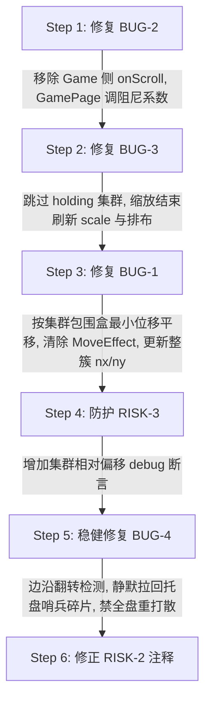

# 拼图核心触摸手势审查综合分析与修复方案

> 日期：2026-09-25  
> 审查依据：[`docs/puzzle-core-touch-code-review-20260925-qwm.md`](file:///c:/Home/Projects/jigsawpuzzle/docs/puzzle-core-touch-code-review-20260925-qwm.md) 与 二审实证复核反馈  
> 审查范围：`lib/game/jigsaw_puzzle_game.dart`、`lib/game/puzzle_piece_component.dart`、`lib/pages/game_page.dart`、`lib/logic/engine/puzzle_engine.dart`

---

## 〇、v2 修订（2026-09-25，实施前复核）

本节由实施方动工前逐条对照代码（含 flame 1.38.0 源码、现有测试、项目规则）复核后并入，补充原方案遗漏的落地细节；正文中被 v2 覆盖的条目已就地标注【v2】。原文档已备份至 `temp/backups/puzzle-core-touch-review-synthesis-and-fix-plan-20260925.md.bak-before-v2-revision`。

### v2 修订清单

| # | 位置 | 修订内容 | 原因 |
| :--- | :--- | :--- | :--- |
| V1 | BUG-2 阻尼 | 阻尼取 **1.6**（而非 1.2~1.4） | 两处当前都是 `*0.8`，托盘主体今天实际速度就是 1.6；1.6 才是"与现状等价"，1.2~1.4 是主观降速 |
| V2 | BUG-2 轴优先序 | 统一为"取 \|dx\|、\|dy\| 较大者" | GamePage 是 dx 优先，游戏侧是 dy 优先；只留一路会改变斜向/触摸板对角线手势口径 |
| V3 | BUG-3 刷新时机 | 刷新调用放在 `zoomAt` 末尾与 `_syncResizeTransform` 步骤 5/6 之后，**不得**放进 `_updateBoardTransform` | `_syncResizeTransform` 在步骤 4 就调用 `_updateBoardTransform`，此时 shape/尺寸还是旧的（步骤 5 才刷新） |
| V4 | BUG-3 兜底光标 | 由"主片位置 + 归一化锚点"反推光标，不用缓存光标 | `updateHoldingPiecePosition` 自带托盘脱离分支，旧光标 + resize 后的新 `trayPosition` 可能误判"拖出托盘" |
| V5 | BUG-3 步骤 6 | `freeComponents` 过滤同时排除 holding 集群 | 同一类逐片 mover，口径需一致（它以 state `nx/ny` 判定，常见情况不命中，属加固） |
| V6 | BUG-1 集群处理 | ①按 clusterId 聚合、**每簇只处理一次**；②跳过含已就位（`isSolved`/`isLocked`）成员的簇；③只移除 `MoveEffect`（勿用 `clearActiveEffects` 连 `ScaleEffect` 一起清）；④"整簇全部可见"几何不可行时的退化策略需明确定义 | ① 避免同簇反复拉扯/次序依赖；② 整簇平移不得搬走已植入碎片；③ 保住缩放动画；④ 竖排 2 片可能高于安全区 |
| V7 | BUG-4 初始化 | `_lastIsTabletop` 必须在 `onLoad` 初始化 | 否则首次 resize 会被当成"翻转边沿" |
| V8 | BUG-4 状态收尾 | 静默拉回必须**同时**清 `comp.isInTray` 与 state `inTray`、并重写 `nx/ny`，随后刷新可见性/优先级 | 只清标志或只改坐标都会留下托盘语义（优先级 10、被 pullback 永久跳过、下次 resize 又摆回哨兵位） |
| V9 | RISK-3 断言口径 | 只对 `_boardState` 断言；跳过 `inTray` 碎片与单成员簇；做成可开关字段 | 位置动画进行中会误报；托盘碎片不参与棋盘网格 |
| V10 | 待确认行为 | tray→tabletop 反向翻转时，桌面散落碎片会被逐片 clamp 回棋盘（不是收进托盘），玩家会看到"碎片瞬移、托盘清空" | 原方案只覆盖了 tabletop→tray 方向的搁浅修复 |

### 明确定义的退化策略（V6④）

整簇平移的位移取"把**越界最严重成员**放回就近完整可见位置"所需向量（与原实现的目标位置公式完全一致）；若簇内多个成员需求方向冲突、或整簇无法同时塞进安全区，则**优先保证越界最严重成员完整可见**（其余成员允许伸出视口，与拖拽限位"允许簇成员伸出视口"的设计一致）。

### 〇.1 v3 修订（2026-09-25 追加：**取消运行时模式翻转**）

**决策**：`isTabletop` 改为**只取设置值**（`scatterMode == 'tabletop'`），彻底删除"按视口 450 阈值翻转模式"的机制；小窗口的可玩性改由桌面端**最小窗口尺寸**兜底。因此 V7、V8、V10 三项作废（对应代码在实施完成后已删除），V9 的不变量自检保留。

**依据**：翻转本身是问题的根源，两个方向的状态迁移都不自洽——

| 迁移方向 | 后果 |
| :--- | :--- |
| `tabletop → tray`（窗口同时 ≤450x450） | 托盘哨兵碎片（`ny >= 2.0`）失去托盘容器 → 永久搁浅在视口外（BUG-4）；即便修好搁浅，散落在桌面四周的碎片也会被逐片 clamp 到小棋盘上、托盘却是空的（V10） |
| `tray → tabletop`（放大回去） | 需专门的重散落/救援逻辑，且来回跨阈值拖动会反复搬运游离碎片（原方案"风险 A/B"） |

**落地方式**：
1. `lib/game/jigsaw_puzzle_game.dart`：`bool get isTabletop => scatterMode == 'tabletop';`；删除 `_lastIsTabletop`、`_collectStrandedTrayPieceIds()`、`_rescueStrandedTrayPieces()` 与 `onGameResize` 的边沿检测；步骤 6 的越界收拢恢复原判据（`isInTray` 早退、clamp 不再改写 `inTray`）——模式固定后"桌面模式下存在托盘语义碎片"这一混合态已不可达。
2. `lib/main.dart`：新增 `window_manager` 依赖，桌面端（Windows/macOS/Linux）在 `main()` 中设置最小窗口尺寸 `kDesktopMinWindowSize = Size(800, 600)`；移动端全屏不适用。项目同时构建 Android 与 Windows，web 目标本就无法编译（全仓 35 处 `dart:io`），故直接 import 该插件无额外风险。

**附带收益**：快照 `extra['scatterMode']` 现在恒等于设置值，`_applyBoardState` 的 `needsRealign` 只会在"玩家真的改了设置"时触发，语义比原先（尺寸翻转也会写进快照）更干净。

**新增回归测试**：`模式仅由设置决定：tabletop 模式下窗口缩小到极小也不发生模式翻转（V10 回归）`——断言缩小到 400x400、再放大回 1280x800 全程 `isTabletop` 保持 true、全场无 `isInTray` 碎片、无网格不变量违约；托盘模式同理。

---

## 一、综合结论与实证概述

经两轮代码逐行核查与调用链实证，初代审查文档中提出的 **4 个 BUG 机制均真实存在**，但原报告在影响范围、破坏持续性及触发条件上存在数处“推论过强”与“遗漏关键深层缺陷”的问题；同时，原报告给出的简略修复方向若照抄落地，会直接引发动画竞态打架、坐标错位固化、手感骤降及窗口缩放全盘洗牌等新的次生缺陷。

综合两轮审查结论：
1. **BUG-1（`missingPieceCheck` 单片撬动）**：机制真实，是不变量唯一的破坏点；但属于结算残局路径，且具备被后续拖拽重新排布并刷写的**可自愈性**，非“永久不可逆损坏”。修复时需解决与 `MoveToEffect` 动画的覆盖冲突，并确保整簇原子平移与 `_boardState` 状态同步。
2. **BUG-2（托盘滚轮双路径重复）**：机制真实，且**实际缺陷比原报告更严重**——原报告遗漏了游戏侧使用了全局屏幕坐标（`info.eventPosition.global`），导致游戏层判定与画布相差约 58px，出现“托盘上方 58px 区域边滚托盘边缩放棋盘”的恶性手势冲突。必须且只能删除游戏侧逻辑，并微调 GamePage 滚动阻尼系数以补偿速度。
3. **BUG-3（持片缩放集群撕裂）**：机制真实，在 click-to-pick（单击抓取悬停）模式下表现尤为明显。修复必须采用“跳过 holding 集群”方案，严禁采用统一置 `isDragging` 的备选方案；且跳过后必须在缩放结束时触发一次整簇位置与 scale 刷新。
4. **BUG-4（tabletop 模式翻转碎片搁浅）**：机制真实，但触发条件苛刻（需宽高**双向同时 $\le 450$**），且仅当碎片经历过“扫把整理”（写入了 $ny \ge 2.0$ 哨兵值）或读档时才会发生真正失踪。修复严禁在 resize 中触发全盘重散落，需做边沿状态检测并采取静默拉回收容策略。

---

## 二、BUG 深度剖析、推论修正与次生风险防范

### BUG-1【中】`missingPieceCheck` 撬单块成员破坏不变量

#### 1. 机制核验与可达性
- **代码位置**：[`lib/game/jigsaw_puzzle_game.dart#L2751-L2810`](file:///c:/Home/Projects/jigsawpuzzle/lib/game/jigsaw_puzzle_game.dart#L2751-L2810)
- **实证路径**：全仓仅在 [`_applySnapResult#L1999`](file:///c:/Home/Projects/jigsawpuzzle/lib/game/jigsaw_puzzle_game.dart#L1999) 结算吸附成功后调用。
- **可达性确立**：当未归位碎片 $\le 2$ 时，若这 2 片已拼合为一个集群；拖拽限位仅约束主片中心（[`_dragCenterSafeBounds#L1221`](file:///c:/Home/Projects/jigsawpuzzle/lib/game/jigsaw_puzzle_game.dart#L1221)，边距 8px），越界判据只要超出半个可视宽（`L2774-2778`）。若相邻 2 片集群被推至屏边，非主片中心约为 $8 - \text{单格宽}$，只要单格宽 $> 16\text{px}$ 即判出界，进入单块 clamp 分支（`L2795-2807`），仅单片位置与该片 `nx/ny` 被覆写。

#### 2. 原报告推论修正（实事求是）
- **修正 1：视觉撕裂具有非持久性与状态暗病特征**  
  在 `_applySnapResult` 中，刚吸附成功的碎片在 `L1989-1991` 被挂上了缓动位移动画 [`comp.animateTo(...)`](file:///c:/Home/Projects/jigsawpuzzle/lib/game/puzzle_piece_component.dart#L474)（产生 `MoveToEffect`）。`missingPieceCheck` 在同一帧立即执行 `comp.position.setFrom(safeTarget)`。但在下一帧 Flame 更新时，`MoveToEffect` 会继续按照插值将组件物理位置拉向对齐位置。**视觉撕裂不一定会立刻持久呈现，但底层状态 `_boardState.nx/ny` 已经被单片篡改**，使数据模型失去网格对齐，在下一次缩放或快照恢复时才彻底暴露。
- **修正 2：“永远无法锁定/永久偏离”定性过强**  
  一旦玩家后续再次拖动该集群的任意未锁定成员，[`updateHoldingPiecePosition#L1306-L1310`](file:///c:/Home/Projects/jigsawpuzzle/lib/game/jigsaw_puzzle_game.dart#L1306-L1310) 会根据 `relCol/relRow` 重新将全簇拉回精确网格排列；松手时 [`handlePieceDragEnd#L2076-L2095`](file:///c:/Home/Projects/jigsawpuzzle/lib/game/jigsaw_puzzle_game.dart#L2076-L2095) 会利用真实屏幕坐标刷写所有棋盘碎片的 `nx/ny`，**状态能够自愈**。该 BUG 的核心危害是：在自愈前，若因错位导致集群一部分被锁定而另一部分未锁定，玩家可通过拖动未锁定成员将已锁定的碎片拖离槽位，击穿设计承诺。

#### 3. 修复方案与次生缺陷防范
- **实施方案**：
  1. 收集 `unsolved` 碎片按 `clusterId` 分组；
  2. 若集群任一成员越界，以越界成员为准计算出将其拉回安全区所需的**最小平移向量 $(\Delta x, \Delta y)$**；
  3. 跳过包含 `comp.isDragging || comp == _holdingPiece` 的集群；
  4. 平移时清除簇内成员的正在运行动画：`comp.clearActiveEffects()`；
  5. 对簇内所有成员整体施加平移，并同步更新 `_boardState.pieces` 中该簇所有成员的 `nx/ny`。
- 【v2/V6】上述第 1~5 条的补充约束（实施时逐条落实）：
  1. **每簇只处理一次**（按 clusterId 聚合后一次算位移），避免同簇成员互相"拉回"造成次序依赖；
  2. 跳过**簇内含已就位成员**（`isSolved` 或 `isLocked`）的簇——整簇平移不得把已植入碎片搬离槽位
     （撕裂残态才会出现该组合，正常不变量下不可达）；
  3. 第 4 条改为**仅移除 `MoveEffect`**（`removeAll(children.whereType<MoveEffect>())`），
     不要用 `clearActiveEffects()` 把 `ScaleEffect` 一起清掉；
  4. 位移取"越界最严重成员"的目标差量；若簇内需求方向冲突或整簇塞不进安全区，
     按 §〇"明确定义的退化策略"处理（保证最严重成员完整可见）。
- **次生风险规避**：严禁照抄 `_pullbackOutOfBoundsClustersAndPieces` 中针对超大集群的 48px 退化截断逻辑；
  残局防丢优先保证越界成员完整可见（整簇可见在极端窗口/长条棋盘下可能几何不可行，见 V6④）。

---

### BUG-2【低-中】托盘滚轮双路径重复滚动与坐标漂移

#### 1. 机制核验与深层缺陷实证
- **代码位置**：[`lib/pages/game_page.dart#L986-L1005`](file:///c:/Home/Projects/jigsawpuzzle/lib/pages/game_page.dart#L986-L1005) 与 [`lib/game/jigsaw_puzzle_game.dart#L1155-L1166`](file:///c:/Home/Projects/jigsawpuzzle/lib/game/jigsaw_puzzle_game.dart#L1155-L1166)
- **深层坐标错位实证**：
  - Flame 侧 `onScroll` 获取的是 `info.eventPosition.global`，即 Flutter 窗口全屏全局坐标；
  - 托盘位置 `trayPosition` 是以 `GameWidget` 画布为原点的局部坐标；
  - `GameWidget` 上方存在 `AppBar` + `_buildProgressLine`，高约 58px；
  - **三段式手势错乱表现**：
    - **托盘上方 58px 区域**：游戏侧提前误判落在托盘中，调用 `scrollTray`；而 `GamePage` 判定处于棋盘，调用 `zoomAt` $\to$ **一边滚动托盘一边缩放棋盘**；
    - **托盘主体区域**：两处同时判定命中 $\to$ **1.6 倍速双重滚动**；
    - **托盘底部 58px 区域**：游戏侧全局坐标超出 `trayPosition.y + traySize.y` 漏判，仅 GamePage 命中 $\to$ **单倍速滚动**。

#### 2. 修复方案与次生缺陷防范
- **实施方案**：
  1. 从 `JigsawPuzzleGame` 中彻底移除 `with ScrollDetector` mixin 及 `onScroll` 方法；
  2. 所有滚轮事件统一由 `GamePage._onPointerSignal` 独立分发；
  3. 补齐 `GamePage` 的托盘命中上下界校验：`mousePos.dy >= trayPos.y && mousePos.dy <= trayPos.y + traySize.y`；
  4. 【v2/V1】阻尼系数取 **`delta * 1.6`**：两处当前都是 `0.8`，托盘主体今日实际速度即 1.6，1.6 与现状等价；
     1.2~1.4 属主观降速（比现状慢 25%），若确需降速应作为独立手感项单独评审。
  5. 【v2/V2】轴优先序统一为"取 `|dx|`、`|dy|` 较大者"：GamePage 现为 dx 优先、游戏侧为 dy 优先，
     只留一路会改变斜向/触摸板对角线手势的取值口径。
- **次生风险规避**：严禁反向删除 GamePage 分支而保留游戏侧，否则 58px 错位将成为不可逆的硬伤。

---

### BUG-3【低-中】持有碎片期间滚轮缩放导致集群撕裂

#### 1. 机制核验
- **代码位置**：[`lib/pages/game_page.dart#L1000-L1003`](file:///c:/Home/Projects/jigsawpuzzle/lib/pages/game_page.dart#L1000-L1003) $\to$ [`lib/game/jigsaw_puzzle_game.dart#L1689-L1699`](file:///c:/Home/Projects/jigsawpuzzle/lib/game/jigsaw_puzzle_game.dart#L1689-L1699)（`_updateBoardTransform`）与 [`L508-L511`](file:///c:/Home/Projects/jigsawpuzzle/lib/game/jigsaw_puzzle_game.dart#L508-L511)（`_syncResizeTransform`）
- **现象复现**：拖拽/抓取时仅主片被置为 `isDragging = true`。滚轮缩放触发 `_updateBoardTransform` 时，附属片因未被标记而被视为静态棋盘碎片，强行被重置回旧的归一化坐标 `_normalizedToScreen(pState.nx, pState.ny)`。
- 在 click-to-pick（单击拾取悬停）模式下，抓取集群后若仅滚动滚轮不动鼠标，撕裂将持续可见。

#### 2. 方案甄选与次生缺陷防范
- **方案决策**：**坚决不能采用“给所有集群成员统一置 `isDragging = true`”的备选方案**。
  - 原因：`isDragging` 会在 [`PuzzlePieceComponent.render#L225`](file:///c:/Home/Projects/jigsawpuzzle/lib/game/puzzle_piece_component.dart#L225) 触发 3D 抬升阴影与厚度渲染，并在 [`exportBoardState#L2442`](file:///c:/Home/Projects/jigsawpuzzle/lib/game/jigsaw_puzzle_game.dart#L2442) 中改变快照导出的过滤语义，牵涉面太宽。
- **实施方案**：
  1. 在 `_updateBoardTransform` 与 `_syncResizeTransform` 中，跳过条件扩展为：
     `if (comp.isDragging || (holdingClusterId != null && comp.clusterId == holdingClusterId)) continue;`
  2. **关键补丁**：仅跳过会导致手持集群的 scale 与放大后的棋盘脱节。必须在 `zoomAt` 和 `_syncResizeTransform` 执行完毕后，若 `_holdingPiece != null`，立即调用一次 `updateHoldingPiecePosition(cursor)`，强制将手持集群各碎片的 scale 刷新为最新 `_zoom`，并按新尺寸重排相对网格偏移。
     【v2/V3】调用点必须落在 `zoomAt` 末尾与 `_syncResizeTransform` 的**步骤 5/6 之后**；
     `_updateBoardTransform` 在 resize 的步骤 4 就被调用（此时碎片 shape/基础尺寸仍是旧的，步骤 5 才刷新），**不得**把刷新放进它里面。
  3. 【v2/V4】不缓存光标：`cursor` 由"主片当前位置 + 归一化锚点"反推（与 `handlePieceDragEnd` 同源）。
     原因：`updateHoldingPiecePosition` 自带"托盘中向上拖出"分支，缓存旧光标 + resize 后的新 `trayPosition` 可能误判脱离托盘并触发 `_realignTrayPieces`。
  4. 【v2/V5】`_syncResizeTransform` 步骤 6 的 `freeComponents` 过滤一并排除 holding 集群成员（口径加固）。

---

### BUG-4【低】tabletop 模式运行中翻转导致托盘碎片搁浅失踪

#### 1. 机制核验与边界厘清
- **代码位置**：[`lib/game/jigsaw_puzzle_game.dart#L241-L242`](file:///c:/Home/Projects/jigsawpuzzle/lib/game/jigsaw_puzzle_game.dart#L241-L242)
  ```dart
  bool get isTabletop => scatterMode == 'tabletop' && (size.x > 450.0 || size.y > 450.0);
  ```
- **触发条件厘清**：由于使用的是 `||` 运算符，模式翻转为 `false`（降级托盘）必须满足**宽与高同时 $\le 450\text{px}$**。常规手机竖屏（如 360×780，高 > 450）恒为 true，仅在桌面端窗口被拖动为巴掌大方窗时可达。
- **搁浅前提厘清**：若玩家只是在小窗口下把碎片拖入托盘（`L2026-L2034`），其 `nx/ny` 仍是棋盘坐标，翻回桌面时只是跳回棋盘（状态不一致但不失踪）；真正发生永久搁浅的，是调用过“扫把整理”（`organizeTray` 写入 $ny \ge 2.0$ 哨兵值）或托盘模式读档恢复的碎片。

#### 2. 修复方案与次生缺陷防范（高风险规避）
- **高风险警告**：严禁在 `_syncResizeTransform` 中检测到模式翻转就粗暴调用全量重散落（类似 `_applyBoardState` 或 `organizeTray`）。
  - **风险 A（窗口缩放震荡卡死）**：桌面端拖动窗口边框经过 450 临界线时，每秒数十次 resize，若反复重散落会导致 CPU 峰值、动画打断、界面剧烈震荡；
  - **风险 B（冲掉玩家桌面布局）**：玩家此前在桌面摆好的半成品拼图会被强制重新打乱洗牌。
- **稳健实施方案**：
  1. 维护 `bool _lastIsTabletop`，仅在**状态边沿翻转**（`!_lastIsTabletop && isTabletop`）时做处理；
     【v2/V7】`_lastIsTabletop` 必须在 `onLoad` 初始化，否则首次 resize 会被误判为翻转边沿。
  2. **保护已有布局，仅做托盘哨兵碎片静默拉回**：
     当翻转至 `isTabletop == true` 时，仅筛选出全场 `comp.isInTray == true` 或处于哨兵区域（`pState.ny >= 2.0`）的碎片，将其 `isInTray` 置为 `false`，并就近分配到可见桌面区域（或可用空闲 slot），不打扰玩家已经摆在桌面上的其他碎片；
     【v2/V8】必须**同时**清 `comp.isInTray` 与 state `inTray`、并重写该片 `nx/ny`，最后刷新可见性与优先级；
     否则该片仍带托盘语义（优先级 10、被 pullback 永久跳过、下次 resize 又按 `ny = 2.0` 摆回哨兵位）。
     落位复用既有的 `_getTabletopScatterSlots(totalPieces)` + `_buildScatterAssignment(...)`（与 `_applyBoardState` 的桌面重散落同源）。
  3. 在 `_syncResizeTransform` 步骤 6 的越界收拢中，桌面模式下取消 `p.isInTray` 的早退跳过保护；
     并在两处 clamp 分支同步 `comp.isInTray = false` 与 `inTray: false`（只改坐标会留下托盘语义）。
- 【v2/V10】待确认行为：反方向（tray→tabletop）翻转时，桌面散落碎片的 `nx/ny` 多在 `[0,1]` 之外，
  会被步骤 6 逐片 clamp 回棋盘（而非收进桌面四周槽位），玩家会看到"碎片瞬移、托盘清空"。
  本次实施仅保证"不搁浅、不丢片"，该观感问题留待需求方确认是否接受。

---

## 三、设计风险评估（RISK 1~3）

| 编号 | 风险性质 | 真实性与现状 | 处理建议 |
| :--- | :--- | :--- | :--- |
| **RISK-1** | 旋转半成品 | **真实**。全仓无 `canvas.rotate`，但 `containsLocalPoint` 已逆旋转计算。目前 `rotationEnabled` 恒为 false，无暴露入口，暂不触发。 | 保持现状。待未来排期实现“旋转难度”新功能时，统一实现旋转画布、切光照与纹理采样管线。 |
| **RISK-2** | 吸附各向异性 | **真实**。标量欧氏阈值在非正方形棋盘映射为屏幕椭圆，注释宣称“像素半径恒定”不准确。 | **不修改核心算法**（避免破坏现有数学模型与用例测试），仅修正代码中的错误注释。 |
| **RISK-3** | 集群网格偏移无防护 | **真实**。底层强依赖该不变量但缺乏防御。 | **在关键出口增加 Debug 断言**：在吸附结算出口与状态同步处，断言同一集群成员间的坐标差精确等于网格偏移（放行托盘哨兵值）。release 模式零开销。【v2/V9】只对 `_boardState` 断言（不对组件位置）；跳过 `inTray` 碎片与单成员簇；做成可开关字段（`assertClusterGridInvariant`）便于排障时临时关闭。 |

---

## 四、分步落地实施路线图

按照“改动风险由低到高、每步均可单独编译测试验证”的原则组织落地：



### 详细步骤说明：
1. **Step 1（BUG-2）**：修改 `jigsaw_puzzle_game.dart`（移除 `ScrollDetector` 与 `onScroll`）与 `game_page.dart`（阻尼 `0.8 -> 1.6`，补齐上下界、统一轴优先序）。验证托盘滚动与棋盘缩放互斥。
2. **Step 2（BUG-3）**：修改 `_updateBoardTransform` 与 `_syncResizeTransform`，增加 holding 集群跳过（含步骤 6 过滤），缩放/尺寸变化结束调用 `_refreshHoldingClusterLayout()`。验证 click-to-pick 缩放无撕裂、尺寸一致。
3. **Step 3（BUG-1）**：重构 `missingPieceCheck` 为集群原子平移（每簇一次、跳过含已就位成员的簇、只清 `MoveEffect`），同步整簇 `_boardState`。编写针对残局出界的测试用例。
4. **Step 4（RISK-3）**：在状态关键变更点后加入可开关的集群网格偏移 debug 自检。
5. **Step 5（BUG-4）**：在 `onLoad` 记录 `_lastIsTabletop`，在 `onGameResize` 做边沿翻转检测，把托盘哨兵碎片静默转为桌面散落（清标志 + 重写 `nx/ny`）；步骤 6 桌面模式取消 `isInTray` 早退并同步清标志。验证极小窗口来回拖动边框无抖动、无失踪。
6. **Step 6（RISK-2）**：修正 `effectiveSnapDistance` 注释。
7. **全量验证**：执行 `dart format`（仅改动文件）、`flutter analyze` 与 `flutter test`，确保全绿无警告。

实施结果与偏差记录见 [`docs/puzzle-core-touch-fix-implementation-20260925.md`](file:///c:/Home/Projects/jigsawpuzzle/docs/puzzle-core-touch-fix-implementation-20260925.md)；
变更摘要见 [`docs/CHANGES-20260925.md`](file:///c:/Home/Projects/jigsawpuzzle/docs/CHANGES-20260925.md)。
