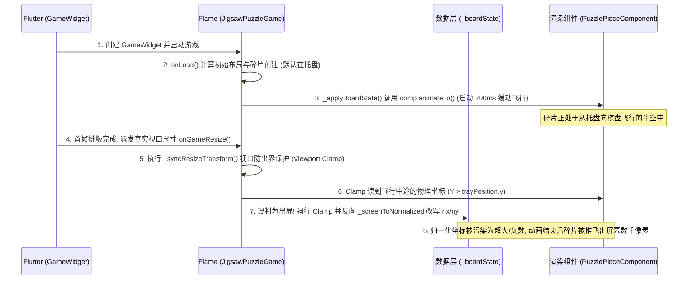

# 拼图残局快照恢复坐标漂移根因与平滑淡入方案设计

> **文档状态**：已就绪 / 实施中  
> **创建日期**：2026-08-30 (GMT+8)  
> **涉及模块**：`lib/game/jigsaw_puzzle_game.dart`、`lib/pages/game_page.dart`

---

## 一、问题背景与复现路径

### 1.1 缺陷现象
在拼图局内开启“只显示边缘碎片”（Edge Filter）并吸附若干边缘碎片后，将几个碎片从托盘拖拽至棋盘中央未吸附处自由落位。退出游戏保存残局快照后，再次点击“继续游玩”进入游戏：
- 自由摆放在棋盘中央的几个碎片**不在退出时的位置，直接消失在视野内（被抛飞到屏幕可视区域之外数千像素处）**；
- 点击“扫把”（一键整理托盘）后，这几个碎片从屏幕外部高速飞回托盘。

---

## 二、根本原因深度剖析（Root Cause Analysis）

### 2.1 时序竞争（Race Condition）
1. 快照恢复时，`_applyBoardState` 对棋盘上的碎片调用了带 200ms 缓动的插值动画 `comp.animateTo(targetPos)`；
2. Flutter 引擎在完成外层 AppBar / SafeArea 测量后，向 GameWidget 分发真实尺寸并触发 `onGameResize()`；
3. `onGameResize()` 内部调用了 `_syncResizeTransform()`。此时碎片才刚刚启动飞行动画，`comp.position` 仍停留在托盘区域（`Y > trayPosition.y`）。

### 2.2 视口收拢保护（Viewport Clamp）误伤合法棋盘碎片
1. `_syncResizeTransform()` 读取了动画飞行中途的临时物理坐标，误将其判定为“超出托盘上方安全边界（`safeMaxY`）的游离碎片”；
2. Clamp 逻辑不仅强制篡改了组件当前物理坐标，还**反向调用 `_screenToNormalized` 重新计算并回写了 `_boardState.pieces` 中的 `nx, ny`**；
3. 这次反向改写破坏了快照中的正确数学归一化坐标，导致碎片在后续帧渲染中被乘到了屏幕可视区域外数千像素处。

---

## 三、系统整改与修复方案

### 3.1 底层引擎：快照恢复原子瞬移就位与静默状态同步（`jigsaw_puzzle_game.dart`）
- 在 `_applyBoardState(newState)` 恢复快照时：
  - 对棋盘上的碎片直接采用同步瞬移设置：`comp.position.setFrom(targetScreenPos)`，并调用 `comp.clearActiveEffects()` 清除动画队列；
  - 托盘重排同样使用同步瞬移：`_realignTrayPieces(animate: false)`；
  - `updatePiecesStateAndPriorities({bool triggerGlow = false})`：读档恢复和初始加载时静默对齐（`triggerGlow: false`），杜绝误触发 380ms 绿色流光吸附反馈特效；
  - 保证在 `0ms` 瞬间所有物理坐标与快照数据 100% 对应，彻底消除飞行中间态与绿框闪烁。

### 3.2 视口自适应：精准保护棋盘内部碎片（`jigsaw_puzzle_game.dart`）
- 在 `_syncResizeTransform()` 中：
  - 严格区分“棋盘内部碎片”与“桌面散落碎片”；
  - 处于合法棋盘范围（`-0.05 <= nx <= 1.05 && -0.05 <= ny <= 1.05`）的碎片，随棋盘矩阵自适应变换，**绝对禁止被托盘顶部安全线 Clamp 挤压，绝对禁止反向污染 `nx, ny`**；
  - 只有在桌面散落模式（Tabletop）下真正被扔在视口外部的游离碎片，才在窗口缩小时做防出界收拢。

### 3.3 视图层：AppBar 以下全屏柔和淡入（`game_page.dart`）
- 在 `GamePage` 中，为 `GameWidget` 外层包裹 `AnimatedOpacity`：
  - 初始 `_gameFadeIn = false`（`opacity: 0.0`）；
  - 在 `_initGame()` 完成并挂载首帧（`addPostFrameCallback`）后，平滑过渡至 `opacity: 1.0`（耗时 300ms，`Curves.easeOutCubic` 曲线）；
  - 遮盖底层瞬移就位过程，呈现极具现代质感的平滑浮现效果。

---

## 四、验证与回归计划
1. **单测覆盖**：运行全量 `flutter test`，确保 140 个自动化测试全部通过；
2. **静态分析**：运行 `flutter analyze`，确保 0 issues；
3. **编译检查**：运行 `flutter build windows --debug` 确保编译通过；
4. **场景复测**：
   - 开启边缘筛选 → 吸附数块 → 中间自由散落数块 → 退出游戏 → 再次点击继续游玩；
   - 验证散落碎片是否 100% 精确保留在退出时的位置，已拼好碎片静默就位无绿框闪烁，且页面呈现 300ms 优雅淡入。
