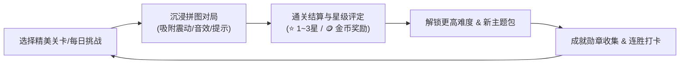

# 异形拼图 (Jigsaw Puzzle) UI/UX 深度审查与整体设计系统方案

> **文件版本**：v1.0  
> **审查日期**：2026-09-01  
> **状态**：正式审查报告与设计规范  
> **目标**：对标全球主流商业精品拼图游戏（如 *Jigsaw Puzzles by Easybrain*、*Magic Jigsaw Puzzles*、*Art Puzzle*），从色彩、排版、动效、信息架构与交互体验全方位重塑，打造具备商业化公开发布水准的精品休闲游戏。

---

## 目录

1. [商业化定位与全局视觉基调](#一-商业化定位与全局视觉基调)
2. [主色调与色彩系统整体规划（Design Tokens）](#二-主色调与色彩系统整体规划design-tokens)
3. [全局组件规范（UI Component Guidelines）](#三-全局组件规范ui-component-guidelines)
4. [实机截图逐屏诊断与重构方案](#四-实机截图逐屏诊断与重构方案)
   - 4.1 主页与关卡选择 (Home & Levels)
   - 4.2 难度选择与继续游戏弹窗 (Difficulty & Resume Dialog)
   - 4.3 核心拼图对局界面 (In-Game Experience - 核心战役)
   - 4.4 每日挑战与活动专区 (Daily & Events)
   - 4.5 成就与数据统计 (Achievements & Profile)
   - 4.6 自制拼图专区 (Custom Puzzles)
   - 4.7 游戏设置与全局菜单 (Settings & Menu)
5. [UX 体验与游戏化闭环（Gamification & Retention）](#五-ux-体验与游戏化闭环gamification--retention)
6. [技术与实施路线图（P0 ~ P3 Roadmap）](#六-技术与实施路线图p0--p3-roadmap)

---

## 一、 商业化定位与全局视觉基调

### 1.1 为什么当前版本“看起来像工具/偏简陋”？
* **色彩过于功能化**：当前界面大面积使用草绿色（Material 3 默认种子派生色）拼接纯白底，给人的第一印象是**办公记账、健康管理或文件工具**，缺乏休闲游戏的“沉浸感”、“愉悦感”和“高级质感”。
* **原生组件破坏游戏氛围**：底部频繁跳出 Android 默认黑底白字 `SnackBar`（如解锁提示），系统级粗糙感直接打破了游戏世界的包装。
* **封面内容被粗暴遮挡**：关卡中心贴大绿勾、自制图片正中贴大播放按钮，严重遮挡了精美高清壁纸的核心视觉区域。
* **局内操作视认性差**：拼图碎片在底部托盘中紧密重叠挤压，遮挡卡榫形状，玩家难以辨别；冷色织物背景对比度不足。

### 1.2 商业化拼图游戏的视觉核心原则
1. **以“图”为本（Content is King）**：拼图游戏的灵魂是高质量的高清图片。UI 必须克制、通透、高级，充当“画框”与“托盘”，不能喧宾夺主。
2. **轻奢微光与温润质感（Warm & Polished）**：采用暖白/暖木/轻拟物质感，搭配细腻圆角、弥散光晕与金色高光，营造治愈、舒适的沉浸氛围。
3. **一致且严谨的视觉层级（Visual Hierarchy）**：统一图标规范（拒绝 3D 图标与线框图标混搭）、统一卡片圆角、统一资产与奖励表达（金币金、星星橙、成就金）。

---

## 二、 主色调与色彩系统整体规划（Design Tokens）

为了避免应用内“各个页面颜色混杂、各玩各的”，必须建立一套**全局统一、兼顾所有页面**的调色板（Palette）。

### 2.1 主色调建议方案对比

| 方案 | 风格定义 | 主色 (Primary) | 辅助/背景色 (Surface) | 适用人群与气质 | 商业标杆对标 | 推荐度 |
| :--- | :--- | :--- | :--- | :--- | :--- | :--- |
| **方案 A<br>(强烈推荐)** | **暖阳琥珀与轻奢木纹**<br>(Warm Amber & Wood) | **活力暖金 / 琥珀橙**<br>`#FF9800` ~ `#F57C00`<br>(深层 `#E65100`) | **暖米白底 / 橡木暖灰**<br>Surface: `#FBF9F5`<br>Card: `#FFFFFF`<br>Bar: `#FFF3E0` | 全年龄段通吃，温暖治愈，长时间玩眼部极度舒适，游戏感极强 | *Everyday Jigsaw*, *Woodoku*, *Royal Match* | ⭐⭐⭐⭐⭐<br>**(首选推荐)** |
| **方案 B** | **深邃靛蓝与星空紫**<br>(Deep Indigo & Violet) | **星空靛蓝 / 幻彩紫**<br>`#5C6BC0` ~ `#3F51B5`<br>(强调 `#7E57C2`) | **极简冷灰 / 瓷白**<br>Surface: `#F5F6FA`<br>Card: `#FFFFFF`<br>Bar: `#EDE7F6` | 年轻、现代、艺术感强，适合画廊与唯美艺术风格 | *Art Puzzle*, *I Love Hue* | ⭐⭐⭐⭐ |
| **方案 C** | **治愈薄荷与莫兰迪鼠尾草**<br>(Sage & Mint Forest) | **高级莫兰迪绿**<br>`#388E3C` ~ `#2E7D32`<br>(非荧光绿，带灰度) | **羊皮浅米绿**<br>Surface: `#F4F7F4`<br>Card: `#FFFFFF`<br>Bar: `#E8F0E8` | 清新森系、自然主义，但需大幅降低绿色的高光饱和度 | *Monument Valley*, *Two Dots* | ⭐⭐⭐ |

---

### 2.2 推荐方案 A（暖阳琥珀与轻奢金）全局色彩体系


#### 具体 Token 映射表：

```dart
// 建议建立全局主题常数 AppPalette
class AppPalette {
  // 品牌与主交互 (Primary)
  static const Color primary = Color(0xFFFF8F00);        // 暖阳琥珀金
  static const Color primaryDark = Color(0xFFE65100);    // 深橙 (按下态/渐变终点)
  static const Color primaryLight = Color(0xFFFFF3E0);   // 浅橙容器背景
  
  // 游戏资产与奖励 (Asset & Coins)
  static const Color coinGold = Color(0xFFFFB300);       // 金币黄
  static const Color starActive = Color(0xFFFFC107);     // 点亮星星色
  static const Color starInactive = Color(0xFFE0E0E0);   // 未点亮星星浅灰
  
  // 全局背景与卡片 (Surfaces)
  static const Color pageBackground = Color(0xFFF9F7F2); // 柔和米黄白底 (不刺眼)
  static const Color cardSurface = Color(0xFFFFFFFF);   // 卡片纯白
  static const Color cardBorder = Color(0xFFEFE9DC);    // 精致温和边框
  static const Color overlayScrim = Color(0x66000000);  // 弹窗半透明遮罩
  
  // 中性文字与辅助 (Text & Neutral)
  static const Color textPrimary = Color(0xFF2C2824);   // 深炭褐 (比纯黑更温润)
  static const Color textSecondary = Color(0xFF7C7468); // 暖中灰 (副标题/描述)
  static const Color textHint = Color(0xFFB5ADA0);      // 浅灰占位符
  
  // 功能状态色 (Semantic)
  static const Color success = Color(0xFF43A047);       // 拼对/通关成功绿
  static const Color warning = Color(0xFFFF7043);       // 警示/提示橙
  static const Color locked = Color(0xFF9E9E9E);        // 未解锁置灰
}
```

---

## 三、 全局组件规范（UI Component Guidelines）

### 3.1 顶部导航栏 (AppBar) 与玩家资产栏
- **告别单调大色块**：AppBar 背景采用**柔和半透明磨砂（Glassmorphism）或与页面背景同色微渐变**（ScrolledUnderElevation 设为 0，微阴影），去掉生硬的纯草绿长条。
- **整合玩家资产 HUD**：
  - 顶部左侧：游戏 Logo + 标题（如 `异形拼图`，字体圆润加粗）；
  - 顶部右侧：
    - `[ 🪙 120 + ]`（金币胶囊卡片，点击可去商城/素材库）；
    - `[ ⭐ 36 ]`（星级总数卡片）；
    - `[ 🏆 成就 ]`、`[ ⚙️ 更多 ]`。

### 3.2 底部导航栏 (Bottom Navigation Bar)
- **采用悬浮式轻阴影底栏（Floating Island Bar）**：
  - 背景为纯白 `#FFFFFF`，带有 `0 -4px 16px rgba(0,0,0,0.05)` 的弥散阴影；
  - 选中态：图标有轻微弹性缩放动画（Scale 1.0 ➔ 1.15），背景搭配浅橙微胶囊；
  - 图标设计：统一采用同一种视觉风格（如全部采用 Phosphor DuoTone 或统一圆润拟 3D 风格，严禁风格割裂）。

### 3.3 游戏内专属浮层提示 (Game Toast / In-Game Banner)
- **严禁使用 Android 原生黑底 SnackBar**；
- **重构为顶部下落式 HUD 气泡 / 悬浮胶囊**：
  - 样式：圆角 `R=24`，背景为深炭褐带微金边，包含左侧金色徽章图标 + 精致提示文字（如：“🔑 再获得 2 张 3 星图即可解锁 进阶 Hard”）；
  - 持续时间 2 秒，平滑从顶部滑入并渐隐，不遮挡屏幕底部主要按钮。

---

## 四、 实机截图逐屏诊断与重构方案

### 4.1 主页与关卡选择 (Home & Levels) - 诊断图 1、7

```
【当前主页痛点】
┌────────────────────────────────────────────────┐
│ [🧩 主页]                        [🏆] [⚙️]    │ ◄ 浅绿大底栏，无金币/资产
├────────────────────────────────────────────────┤
│ ┌────────────────────────────────────────────┐ │
│ │ ✨ 9月1日 · 今日挑战          [🐯 缩略图] │ │ ◄ 深蓝卡片孤立突兀
│ └────────────────────────────────────────────┘ │
│ [ 全部关卡 ] [ 新手(9-16) ] [ 进阶(24-36) ] [大│ ◄ 大师文字截断！
│ [全部] [萌宠] [风光] [飞鸟] [艺术] [建筑] ...  │ ◄ 双层筛选占屏幕1/3
├────────────────────────────────────────────────┤
│ ┌──────────────┐ ┌──────────────┐              │
│ │  #1   [🧩25] │ │  #2    [9%]  │              │
│ │     [✔]      │ │              │              │ ◄ 中心巨大绿勾挡住猫脸！
│ │  🌟☆☆        │ │ ───────────  │              │ ◄ 锁定关卡全黑白像遗照
│ └──────────────┘ └──────────────┘              │
└────────────────────────────────────────────────┘
```

#### 优化重构要点：
1. **精简双层筛选**：
   - 将顶部双层 Chip 简化为**单行水平滑动分类 Tab**（全部 | 萌宠 | 风光 | 飞鸟 | 艺术 | 建筑）；
   - 难度筛选不在首页强行过滤，而是在玩家点击任意封面后，在弹出的“难度选择器”中自由切换（对齐主流做法，解放首页空间）。
2. **今日挑战卡片升级**：
   - 采用暖金渐变卡片，左侧带有“今日挑战 · 9月1日”+ 倒计时 `⏳ 04:22:10` + 首通奖励 `🪙+50` 徽章；右侧大图加金色圆角边框。
3. **关卡封面卡片（Level Card）大修**：
   - **通关态**：移除正中央大绿勾！改为在卡片**右下角悬浮 3 颗金色立体星星（⭐⭐⭐）+ 半透明金边角标**；
   - **进行中**：卡片底部半透明磨砂条，显示 `已拼 9% · 54块` 与平滑绿色微进度条；
   - **锁定态**：保持原图轻度虚化（Blur 4px）+ 稍微压暗（30%），卡片中心放置一个立体金属小锁 + `10⭐ 解锁`，保留视觉吸引力。

---

### 4.2 难度选择与继续游戏弹窗 (Difficulty & Resume Dialog) - 诊断图 2、3、4

#### 1. 关卡难度选择弹窗 (Difficulty Sheet) - 图 3、4
* **当前优点**：支持切图网格叠加预览（Cut Mesh Preview）和耗时预估，非常专业！
* **改进方案**：
  * **标签信息整合**：将“3:2 横屏”、“普通 Medium”、“12 × 8 (96 块)”、“预计 12~18 分钟”整合为网格预览图下方的一条紧凑徽章条，增加视觉清爽感；
  * **难度卡片升级**：
    * 卡片增加难度梯度色彩微区分（24块-清新绿、54块-晴空蓝、96块-活力橙、150块-炫彩紫、216块-大师红）；
    * 选中时带有**外发光光晕（BoxShadow Glow）**与上浮缩放（Scale 1.05x）；
    * 锁定卡片下方明确标注解锁要求（如“⭐ 需 10 颗星解锁”），且支持点击卡片时触发轻触震动并弹出气泡提示。

#### 2. 继续/恢复弹窗 (Continue Dialog) - 图 2
* **当前痛点**：“选择‘继续’将恢复到上次退出时的位置”使用了黄色 Warning 条，带有警告报错意味，给用户造成心理压力；
* **改进方案**：
  * 将 Warning 条去掉，改为温暖的提示文案：“上次拼到一半啦，继续加油！”；
  * 居中展示当前已拼进度的局部拼图缩略图；
  * 按钮升级：左侧“重新开始”改为浅灰底/圆角描边按钮，右侧“继续游戏”为全宽大暖橙主行动按钮（带微呼吸光效）。

---

### 4.3 核心拼图对局界面 (In-Game Experience - 核心战役) - 诊断图 12

```
【当前局内痛点与重构对比】

【当前截图 12 痛点】                 【重构后高品质商业对局】
┌───────────────────────────┐      ┌───────────────────────────┐
│ ← 第1关      [⛶][💡][☷][🧹]│      │ ← 第1关 02:15  [已拼 12/96]│ ◄ 增加实时计时与计数
│                   [🖼][👁] │      │               [💡 2][👁]  │ ◄ 精简辅助工具栏
├───────────────────────────┤      ├───────────────────────────┤
│                           │      │  ┌─────────────────────┐  │
│                           │      │  │ . . . . . . . . . . │  │ ◄ 暖木纹/羊皮纸质感桌面
│      🧩         🧩        │      │  │     🧩      🧩      │  │ ◄ 目标框带立体微内阴影
│          🧩 🧩            │      │  │          🧩🧩       │  │
│                           │      │  └─────────────────────┘  │
│                           │      │                           │
├───────────────────────────┤      ├───────────────────────────┤
│┌─────────────────────────┐│      │  ◀ [🧩] [🧩] [🧩] [🧩] ▶ │ ◄ 碎片等距无遮挡平铺！
││🧩🧩🧩🧩🧩🧩             ││      │    [ 全 部 ]  [ 边 框 ]   │ ◄ 底部托盘分类快捷切换
│└─────────────────────────┘│      └───────────────────────────┘
└───────────────────────────┘
```

#### 关键体验提升方案：
1. **底部碎片托盘（Tray）视认性革命**：
   - **绝对禁止碎片互相叠压**：碎片横向单行等距平铺（或支持双行紧凑平铺），碎片之间留有 8~12px 安全间距，完整露出每一个卡榫和边缘特征；
   - **托盘分类切换器**：托盘上方提供微型切换标签：`[ 全部碎片 ]`、`[ 仅边框块 (18) ]`、`[ 仅中心块 (78) ]`。点击“仅边框”时，非边框碎片平滑向右滑出收起，极大幅度降低初学者门槛；
   - **托盘滑动边缘**：左右两侧加入 16px 渐隐渐变遮罩（Fade Mask），提示玩家托盘可横向滚动。
2. **拖拽微交互（Drag & Drop Micro-interactions）**：
   - **防手指遮挡**：当手指按住碎片拖出托盘的一瞬间，碎片应立即产生 **`向上偏移 30px` + `缩放 1.1x` + `投射 8px 弥散下投影`**，确保玩家手指不会挡住碎片底部的卡榫和落点对齐线；
   - **吸附正反馈**：当碎片拖到正确位置附近进入磁吸范围时，播放清脆的“咔哒”（Snap Wooden/Glass）音效，并伴随一次清脆的 Haptic 反馈（`HapticFeedback.mediumImpact`），同时边缘产生一道 0.2s 的金色微光闪烁。
3. **桌面背景质感**：
   - 默认背景切换为“暖色橡木木纹（Warm Oak）”或“柔和浅米亚麻（Soft Sand Linen）”，提高拼图碎片与桌面边缘的对比度；
   - 允许玩家在局内右上角通过画盘图标随时切换 4 款精选壁纸。

---

### 4.4 每日挑战与活动专区 (Daily & Events) - 诊断图 9、10

#### 1. 每日挑战 (Daily Challenge) - 图 9
* **当前痛点**：单张大卡片纵向罗列，翻找 30 天历史非常笨重；
* **改进方案**：
  * **顶部保留今日专属挑战大卡片**（倒计时、连胜天数 🔥、双倍金币标记）；
  * **历史挑战改用“月历签到盘（Calendar Grid View）”**：
    * 类似日历小方格，已通关的日期盖上精致的**金色拼图戳印（Golden Stamp）**；
    * 错过的日期显示灰显可补玩（或消耗 10 金币补签）；
    * 当月全勤可解锁“当月专属限定拼图”大宝箱。

#### 2. 活动专区 (Events) - 图 10
* **当前痛点**：图文严重不符（赛博都市配狐狸图）；缺乏限时紧张感与活动目标感；
* **改进方案**：
  * **修复图文数据匹配**：确保主题包与封面图片语义严格一致；
  * **增加活动收集进度条**：例如“未来赛博都市：已收集 3/6 幅作品，集齐解锁【霓虹赛博专属桌面背景】”；
  * **增加活动倒计时与活动角标**：卡片右上角带醒目的 `🔥 仅剩 2 天 18 小时` 倒计时药丸。

---

### 4.5 成就与数据统计 (Achievements & Profile) - 诊断图 5、6

* **当前痛点**：顶部 6 个数据白块像后台监控台；成就列表图标全是千篇一律的黄色小奖杯。
* **重构方案**：
  1. **顶部改造成“玩家荣誉名片”**：
     - 展示玩家当前拼图头衔（如：Lv.3 资深拼手 ➔ 进阶构图家 ➔ 宗师）；
     - 用弧形环状进度条展示成就总解锁率（如 `12/25 (48%)`）；
     - 将 6 项统计数据精简提炼为横向滑动的 4 组精致胶囊数据（总星数 ⭐、通关数 🖼️、已拼碎片 🧩、总时长 ⏱️）。
  2. **成就徽章个性化设计**：
     - 为每个成就配置独特的彩色矢量图标：
       - “夜猫子”：深蓝夜空 + 月亮与猫猫；
       - “疾风拼手”：金色风翼 + 闪电时钟；
       - “初露锋芒”：破土嫩芽 + 铜质勋章；
     - 达成可领取状态时，按钮显示为**跳动的金色宝箱/金币按钮**，点击领取后触发**金币飞向右上角金币栏的粒子飞行动画**。

---

### 4.6 自制拼图专区 (Custom Puzzles) - 诊断图 11

* **当前痛点**：顶部 4 个入口是平淡的 2x2 线框卡片；自制关卡列表正中央贴了大大的绿色播放按钮，挡住了用户自己选的家庭照/宠物照。
* **改进方案**：
  1. **入口区重构**：将“相册选图”、“导入关卡包”合并为顶部一个醒目的**大号毛玻璃新建卡片（“+ 制作全新拼图”）**，副入口“在线图库/素材包”作为次级横向胶囊排列；
  2. **卡片去遮挡**：
     - 移除中心绿色药丸按钮！完整展现用户照片；
     - 点击卡片整体直接弹出难度选择或进入游戏；
     - 卡片右下角用半透明小角标展示“🧩 54块 · 80%”，右上角支持小垃圾桶/更多管理按钮。

---

### 4.7 游戏设置与全局菜单 (Settings & Menu) - 诊断图 7、8

* **当前痛点**：设置项像普通手机系统设置；右上角点击齿轮弹出的菜单是系统自带白底菜单。
* **改进方案**：
  - **设置弹窗卡片化**：将音效、触感震动、网格预览等常用开关分组放在圆角卡片内，开关控件统一使用全局主色（暖橙）；
  - **右上角更多菜单**：菜单背景使用圆润毛玻璃卡片（BorderRadius: 16），选项图标带有彩色圆底（如导入关卡用蓝色圆底，玩法手册用紫色圆底），提升菜单趣味性。

---

## 五、 UX 体验与游戏化闭环（Gamification & Retention）

一个合格的商业化游戏不仅要“好看”，更要通过严密的 **激励循环（Core Loop）** 让玩家产生持续游玩的动力：



### 5.1 结算弹窗（Victory Screen / Level Complete Dialog）设计
当前缺少一个具有**仪式感**的通关大结算弹窗。通关时应包含：
1. **通关大图展示**：无网格线的完整高清大图浮现，伴随礼花/金粉粒子炸裂特效；
2. **星级评定动画**：按用时和提示使用情况依次点亮 1~3 颗大金星（伴随清脆的“叮！叮！叮！”三连音效）；
3. **奖励结算**：`+30 🪙` 金币翻滚递增动画；
4. **一键操作**：`[ 保存高清壁纸到相册 ]`、`[ 下一关 ]`、`[ 分享战绩 ]`。

---

## 六、 技术与实施路线图（P0 ~ P3 Roadmap）

为保证代码改动安全、可控且渐进式交付，建议按照以下优先级分步实施：

### 阶段一：P0 核心视觉基调与局内手感打磨（1~2 天）
* [ ] **建立全局设计系统 Token**：在 `lib/theme/` 建立 `app_palette.dart` 与统一 `ThemeData`（将临时浅草绿替换为暖阳琥珀/轻奢暖色体系）；
* [ ] **重构全局提示条**：封装 `GameToast` / `GameHud`，全面替换底层原生 Android 黑底 `SnackBar`；
* [ ] **局内碎片托盘重构**：消除重叠挤压，实现等距无遮挡平铺、左右渐隐遮罩、托盘“全部/边框块”一键筛选；
* [ ] **拖拽微交互优化**：增加手指向上 30px 偏移防遮挡与拖起微放大投影。

### 阶段二：P1 首页关卡卡片与弹窗去遮挡（2 天）
* [ ] **首页关卡卡片视觉重构**：移除关卡中央大绿勾，改用右下角立体金星（⭐⭐⭐）与优雅进度条；
* [ ] **解决文字截断与筛选精简**：修复“大师 (48-...”文字截断，精简顶部双层筛选为单层分类栏；
* [ ] **自制关卡页面去遮挡**：移除图片中心大播放按钮，优化 2x2 快捷入口质感；
* [ ] **难度选择弹窗抛光**：强化选中发光效果与锁定条件的友好提示。

### 阶段三：P2 游戏化与正向激励系统强化（2~3 天）
* [ ] **通关大结算弹窗（Victory Screen）**：实现星级依次点亮、金币递增动画与保存壁纸功能；
* [ ] **每日挑战月历视图**：由大卡片列表升级为月历打卡盖章网格；
* [ ] **成就勋章墙个性化**：配置独立成就矢量图标，实现领取金币飞行动画；
* [ ] **活动页面数据与图文纠偏**：修正文案与配图不符问题，增加限时倒计时条。

---

## 七、 总结

通过本次 UI/UX 审查与全套设计系统方案的实施，应用将彻底告别“简陋工具软件”的原型感，跃升为一款**色彩温润舒适、交互细节精致、游玩手感丝滑、具备强烈探索与收集欲望**的商业级休闲拼图大作，完全具备在 App Store / Google Play / 国内各大主流应用市场上架公开发布的精品品质。
