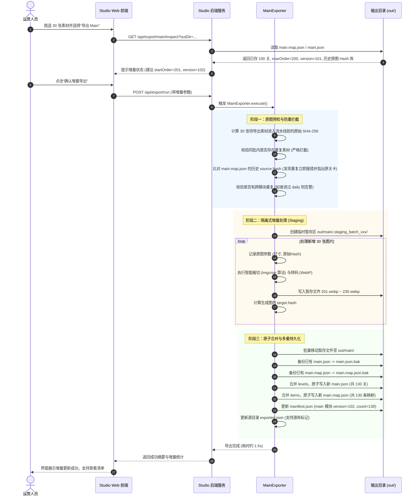

# Main 主线关卡增量导出与映射账本架构设计 (main.json & main.map.json)

> **文档版本**：v1.0.0  
> **创建日期**：2026-09-05  
> **状态**：方案草案 / 待审阅  
> **适用范围**：Studio 资产管理平台、Main 导出器、Flutter 客户端同步管线、运维部署脚本  
> ⚠️ **状态：规划 / 未实施**——文中 `/api/export/main/inspect`、`/api/export/run`（第二阶段）等端点尚未在 `server.py` 落地。请以 `studio-server-architecture-and-api-20260908.md` + 当前源码为准，避免按图索骥。  

---

## 1. 业务背景与核心挑战

在拼图游戏的内容资产体系中，集合类型具有两类完全不同的生命周期与分发特征：

1. **不可变归档集合 (Immutable Bundles)**：
   * **Daily（每日关卡）**：按月（如 `202609`）归档打包，每月包含固定 28~31 张拼图，生成 ZIP/目录发布后即冻结；
   * **Event（限时活动）** / **Collection（合集）**：按活动 ID 或合集 ID 打包（如 `easter2026`、`animals_v1`），内容固定，发布后不可变。
2. **动态单调递增长列表 (Dynamic Append-Only Stream)**：
   * **Main（主线关卡）**：属于长期持续扩充的关卡流。运营可能首期上线 100 关，后续每周或每月增量追加 30~50 关；
   * **客户端消费契约**：客户端（Flutter `MainContentPipeline`）以“版本号自增 + Append-Only Upsert”方式同步。远端部署的 `main.json` **必须始终包含游戏上线以来的历史全量关卡 + 本次新增关卡**。若仅导出新增的几十关，新下载或重装游戏的玩家将丢失所有历史关卡。

### 核心痛点与风险分析

1. **加工导致的 Hash 漂移（防重失效隐患）**：
   素材原图进入导出流水线时，通常需要经过**智能裁切（去虚化边、主体感知 2:3/1:1 裁切）**与**格式转码（WebP 85% 有损压缩）**。转码后的文件 Hash 会彻底改变。如果去重逻辑比对的是目标文件的 Hash，则下一次挑选原图素材时，根本无法识别该原图此前是否已导出过，导致**防重完全失效，产生孪生关卡**。
2. **序号与版本需人工心算（易冲突、易覆盖）**：
   每次导出若依赖人工填写起始序号（如 `startOrder = 101`），一旦忘记更改或计算错误，就会导致新图片覆盖旧图片文件；
3. **跨设备/跨人员协作时的元数据断层**：
   若账本仅保存在本地素材源目录中，一旦更换电脑或多名运营协作，新环境因缺乏历史账本而无法感知已有素材的导出状态；
4. **客诉与线上运维反查困难**：
   线上第 150 关若出现裁切不当或版权争议，若缺乏映射，运营无法从上万张素材原图中定位对应的原始源文件及当时所用的裁切参数。

---

## 2. 总体架构：双文件发布与部署隔离契约

为了彻底解决上述问题，系统在导出主线关卡时，在目标输出目录（`out/`）中同时生成两份职责清晰、权限隔离的文件：

```
out/
├── main/                           <-- 实际分发的图片资产 (按序号命名)
│   ├── 101.webp                    <-- 首批历史关卡图片
│   ├── ...
│   ├── 200.webp
│   ├── 201.webp                    <-- 本次增量追加的图片 (零冗余转码)
│   └── 230.webp
├── main.json                       <-- [公开] 客户端与 CDN 消费的轻量全量关卡清单
├── main.map.json                   <-- [私有] 内部映射与溯源全量账本 (Deploy 忽略)
└── manifest.json                   <-- 模块版本清单 (记录 main 的 version 与 count)
```

### 两份文件的职责与边界

| 维度 | `main.json` (公开分发文件) | `main.map.json` (内部映射账本) |
| :--- | :--- | :--- |
| **受众** | Flutter App 客户端、CDN 静态服务器、玩家 | Studio 导出器、运营后台、运维管理、审计工具 |
| **发布策略** | **必须部署** 至 CDN / Web 服务器 | **严禁同步** 至生产公网（Deploy 脚本显式忽略） |
| **数据体量** | 极度精简（仅必要字段，控制网络开销） | 详尽完整（包含原始 Hash、尺寸、相对路径、裁切参数） |
| **生命周期** | 增量追加，保持全量清单 | 增量累加，保持全生命周期映射链 |
| **敏感度** | 公开数据，无源资产路径 | 私密数据，包含内部源文件组织结构与哈希 |

---

## 3. 数据规范与 Schema 设计

### 3.1 `main.json`（客户端消费清单）

保持与客户端 `MainContentPipeline.dart` 的极简轻量契约：

```json
{
  "version": 102,
  "count": 130,
  "updatedAt": "2026-09-05T20:50:00Z",
  "levels": [
    {
      "order": 101,
      "url": "https://cdn.example.com/puzzles/main/101.webp",
      "tags": ["nature", "animal"],
      "hash": "8f481e19485..."
    },
    ...
    {
      "order": 201,
      "url": "https://cdn.example.com/puzzles/main/201.webp",
      "tags": ["landscape"],
      "hash": "3a7b9c12def..."
    }
  ]
}
```

> **优化点**：在每个 level 中可选提供 `hash`（目标 WebP 图片的 SHA-256），以便客户端未来支持精准的单关图片热更与缓存失效校验。

### 3.2 `main.map.json`（内部映射账本）

记录原图到输出产物的不可逆推导事实链：

```json
{
  "version": "1.0.0",
  "module": "main",
  "updatedAt": "2026-09-05T20:50:00Z",
  "totalCount": 130,
  "maxOrder": 230,
  "latestVersion": 102,
  "batches": [
    {
      "batchId": "batch_20260901_001",
      "version": 101,
      "startOrder": 101,
      "endOrder": 200,
      "count": 100,
      "exportedAt": "2026-09-01T10:00:00Z"
    },
    {
      "batchId": "batch_20260905_002",
      "version": 102,
      "startOrder": 201,
      "endOrder": 230,
      "count": 30,
      "exportedAt": "2026-09-05T20:50:00Z"
    }
  ],
  "items": [
    {
      "order": 101,
      "source": {
        "hash": "e3b0c44298fc1c149afbf4c8996fb92427ae41e4649b934ca495991b7852b855",
        "path": "animals/wild_fox_01.jpg",
        "fileName": "wild_fox_01.jpg",
        "fileSize": 2481902,
        "width": 3840,
        "height": 2400
      },
      "pipeline": {
        "cropApplied": true,
        "cropMode": "smart",
        "aspect": "2:3",
        "cropBox": [120, 80, 1800, 2600],
        "scaleShortEdge": 1600,
        "format": "webp",
        "quality": 85
      },
      "target": {
        "file": "main/101.webp",
        "hash": "8f481e19485e92...",
        "fileSize": 312048,
        "url": "https://cdn.example.com/puzzles/main/101.webp"
      },
      "tags": ["nature", "animal"],
      "batchId": "batch_20260901_001",
      "version": 101,
      "exportedAt": "2026-09-01T10:00:00Z"
    },
    ...
  ]
}
```

---

## 4. 核心工作流：基于原图 Hash 的防重与增量导出



---

## 5. 关键技术细节与防御机制

### 5.1 为什么必须基于“原文件”进行查重？

* **哈希离散性**：图片经过有损 WebP 压缩、不同库版本（Pillow / libwebp）的算法迭代、或者微调 1 像素的裁切窗口，目标文件的二进制 Hash 就会发生不可逆的雪崩式变化。
* **唯一真实身份**：摄影师或运营从版权网站下载的原始大图文件，其进入加工流程之前的 SHA-256 是全生命周期的唯一锚点。
* **映射闭环**：
  * 在源目录下记录：`source_hash -> { target: main/201.webp, order: 201 }`；
  * 在输出目录下记录：`main.map.json` 中的 `source.hash`；
  * 无论是选材防重还是换机恢复，均以此 Hash 为唯一基准。

### 5.2 序号断号与空洞处理策略

* **增量自动对齐**：系统默认以 `max(existing_orders) + 1` 作为新批次的初始序号，确保序号绝对连续递增（`101 -> 102 -> ... -> 200 -> 201`）；
* **空洞容忍与校验**：
  * 客户端使用 `_levelsMap[id]` 存储，排序依靠 `order.compareTo()`，即使出现空洞（如 101, 102, 105）也不会崩溃；
  * 但为了最佳用户体验，Studio 在导出前若检测到用户手动指定了非连续序号，将给出警告提示：“检测到关卡序号存在空洞（跳过了 201~205），建议使用连续序号”。

### 5.3 单关修补与图片热更机制 (Level Patching)

如果不是追加关卡，而是美工对已有的第 45 关进行了**重制调色或高清水印替换**：
* **问题**：客户端原有逻辑为“本地已存在 `main/045.webp` 则跳过下载”，直接覆盖同名文件会导致老玩家无法感知更新；
* **解决**：
  1. `main.json` 的关卡条目中增加 `hash` 字段（目标文件的 WebP Hash）或采用带版本签名的 URL（如 `main/045.webp?v=102`）；
  2. 客户端升级检测：当关卡已存在但 `level.hash` 与本地缓存文件的 hash 不一致时，主动清除本地旧缓存并重新下载；
  3. `main.map.json` 中完整记录该关卡的历史修改记录（修订版本号、更新时间）。

### 5.4 事务性与异常回滚机制 (Crash-Safe)

增量导出涉及批量文件转码与多个 JSON 的同步覆写，严防中途崩溃产生孤儿文件与脏数据：
1. **暂存隔离**：所有新转码图片先写入 `out/main/.staging_<timestamp>/` 临时目录；
2. **校验通过后提交**：转码全部成功后，原子移动至 `out/main/`；
3. **文件写入原子性**：
   * 所有 JSON 写入均遵循 `写入 .tmp -> 备份现有文件为 .bak -> atomic rename` 标准三部曲；
4. **回滚机制**：若转码过程抛出任何异常，系统立即自动清理 `.staging_*` 暂存目录，原 `main.json` 与 `main.map.json` 保持 100% 原始状态不变。

---

## 6. 运维部署规范 (Deploy Contract)

`main.map.json` 包含了开发与资产团队的内部源素材路径、加工参数与原始哈希，属于**内部资产元数据**，不应暴露于公开互联网，也不需要分发给客户端。

在将 `out/` 目录同步/发布至 CDN、对象存储（S3/OSS）或生产 Web 服务器时，部署脚本必须遵循以下过滤规则：

### 部署排除示例

#### 1. Rclone 同步示例
```bash
rclone sync ./out remote:my-puzzle-cdn/puzzles \
  --exclude "*.map.json" \
  --exclude "*.bak" \
  --exclude "*.tmp*" \
  --exclude ".staging_**"
```

#### 2. Rsync 同步示例
```bash
rsync -avz --delete ./out/ user@cdn-server:/var/www/puzzles/ \
  --exclude="*.map.json" \
  --exclude="*.bak" \
  --exclude="*.tmp*"
```

#### 3. 阿里云 OSS / 腾讯云 COS 上传配置
在上传脚本中，排除 `**/*.map.json` 文件，仅分发 `main/` 目录、`main.json` 和 `manifest.json`。

---

## 7. Web Studio 交互原型设计

### 7.1 导出弹窗的主线模式增强展示

当运营在 Studio 界面选择【主线关卡 (Main)】类型时，前端自动探测并渲染如下状态面板：

```
┌────────────────────────────────────────────────────────────────────────┐
│ 📌 主线关卡状态探测: [目标目录: out/]                                   │
│ • 当前主线总关卡数: 100 关 (序号范围: 101 ~ 200, 当前版本: v101)        │
│ • 映射账本状态: main.map.json 正常对齐                                 │
├────────────────────────────────────────────────────────────────────────┤
│ 导出模式选择:                                                          │
│   (●) 增量追加 (推荐)      ( ) 全量重置/覆盖                            │
│                                                                        │
│ 增量导出规划:                                                          │
│ • 本次待导出素材: 30 张图片                                            │
│ • 起始序号: [ 201 ] (系统根据历史最大序号 200 自动续接)                 │
│ • 发布版本号: [ 102 ] (留空则自动由 v101 递增至 v102)                   │
│ • 导出后总状态: 总关卡将增至 130 关 (序号 101 ~ 230)                     │
├────────────────────────────────────────────────────────────────────────┤
│ 防重检查:                                                              │
│  [✓] 自动比对 main.map.json (排除历史已使用原图)                         │
│  [✓] 自动比对 exported.json (排除跨包已使用原图)                         │
│  [✓] 严禁同批次重复素材                                                │
└────────────────────────────────────────────────────────────────────────┘
```

### 7.2 素材库“反查线上关卡”功能

运营在主面板的搜索框中，不仅支持按文件名、标签过滤，还支持：
* 输入线上关卡号（如 `#201` 或 `order:201`），界面高亮展示对应的素材原图；
* 点击素材卡片时，详情弹窗展示其【导出履历】：
  * 状态：已导出为主线第 201 关（版本 v102，导出时间 2026-09-05）；
  * 线上产物：`main/201.webp`；
  * 加工参数：居中裁切 (2:3) + WebP 85%。

---

## 8. 实施路径与落地计划

1. **第一阶段：核心数据层改造**
   * 在 `studio/core/` 中新增 `main_map_manager.py`，专门负责 `main.map.json` 的解析、校验、合并与原子持久化；
   * 改造 `studio/exporters/main_exporter.py`：实现“预检原图 Hash -> 暂存转码 -> 清单追加合并 -> 双文件原子写入”闭环。
2. **第二阶段：服务端状态感知端点**
   * 在 `studio/server.py` 新增 `/api/export/main/inspect` 接口，入参为 `outDir`，返回当前主线的关卡总数、最大序号、当前版本号及历史原图哈希集合。
3. **第三阶段：Web 前端交互适配**
   * 在 `studio/static/index.html` 与 `app.js` 中接入探测接口，动态计算并展示增量提示；
   * 增加增量/全量切换逻辑与默认保护。
4. **第四阶段：质量与兼容性验证**
   * 编写单元测试（`test_main_incremental.py`）：覆盖首批 100 关导出、增量追加 30 关、原图重复拦截、异常回滚测试；
   * 运行 Flutter 客户端 `MainContentPipeline` 测试，验证客户端同步与 Append-Only Upsert 完全兼容。
