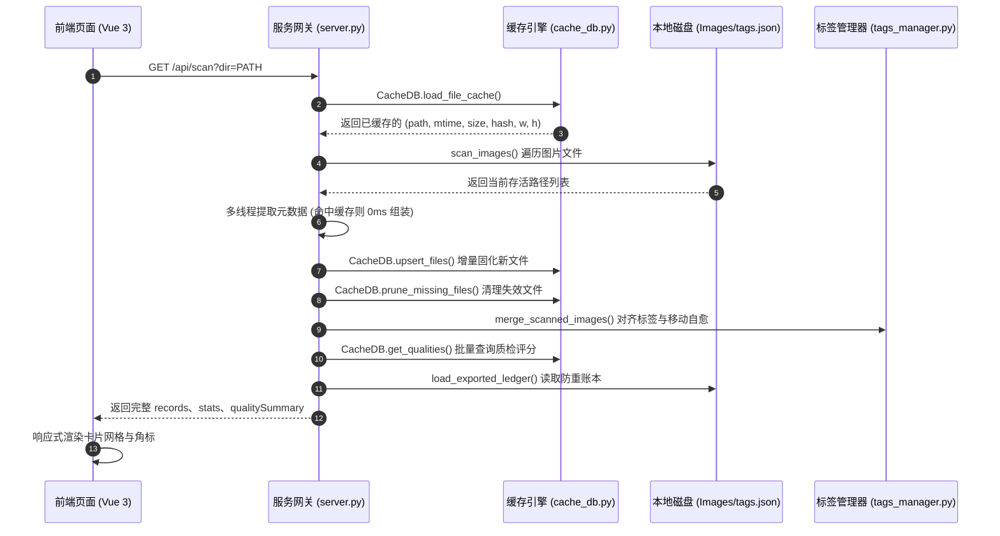

# Content Studio 技术架构设计文档

> 版本: v3.2  
> 日期: 2026-09-05  
> 状态: Production Ready  
> 对齐规范: `docs/catalog-tags-mapping-specification.md` (v3.0 Final)

---

## 1. 系统定位与设计哲学

Content Studio 是专为 JigsawFox 拼图游戏生态打造的**工业级本地拼图素材管理、智能物理质检、标签运营与多模式资产打包工作台**。其设计旨在打通从“海量原始素材库”到“客户端分发资源包”的全生命周期，解决大规模图片管理中的性能吞吐、质量参差、重复发布及操作繁琐等痛点。

### 1.1 核心设计哲学

1. **Zero-Dependency & Zero-Build（轻量秒启，零依赖构建）**
   - 后端基于 Python 3 原生标准库（`http.server`, `sqlite3`, `hashlib`, `concurrent.futures`）构建，无需安装重量级第三方 Web 框架（如 Flask/FastAPI/Django）；
   - 前端采用现代原生 ES Modules 直接挂载单文件版 Vue 3 运行时，无需 Node.js/NPM 打包编译流程，代码即写即用、秒级热刷新。
2. **单一事实源（Single Source of Truth, SSOT）**
   - 全局唯一分类法元数据收敛于 `studio/taxonomy.py`，涵盖 14 个核心大类、模式匹配规则库及中英文映射；
   - 前端与各 Exporter 均通过 `/api/taxonomy` 接口动态消费同一数据源，彻底根除前后端规则漂移。
3. **分层解耦存储（Storage Decoupling）**
   - **运营数据**与**机器算力数据**严格分离：
     - `tags.json`：仅保存运营人员人工确认的业务打标与审核元数据；
     - `.studio.db`：采用 SQLite3 存储底层的图片物理元数据、SHA-256 哈希及 OpenCV 质检切片指标；
   - 杜绝技术缓存污染团队协作的业务配置文件。
4. **基于内容 Hash 主键的自愈性（Content-Addressable Self-Healing）**
   - 文件指纹以 SHA-256 为唯一依据。图片在本地磁盘被改名、移动子目录，历史打标和质检评分均能 100% 毫秒级自动认领与无损继承。
5. **策略模式资产打包（Strategy Pattern Exporters）**
   - 彻底废除巨型过程式导出脚本，将不同业务模式（主线关卡、月度日历、限时活动、官方合集）拆分为独立、可测试、可插拔的 Exporter 策略类，并由 `ManifestManager` 统筹原子级路由清单维护。
6. **环境感知与优雅降级（Graceful Degradation）**
   - 针对 OpenCV 质检引擎提供双层容错感知：优先当前进程执行；主环境缺失 `cv2` 时自动唤起外部预装虚拟环境；极端情况下优雅降级为 Pillow 纯 Python 估算，确保服务器在任何环境永不崩溃。

---

## 2. 系统整体分层架构

Content Studio 采用清晰的五层架构模型：

```
+-----------------------------------------------------------------------------------+
|                            Client Tier (前端展示与交互)                            |
|  Vue 3 (ESM) | CSS Grid (4K自适应) | 离散分桶缩略图 | 大图质检查看器 | 纯批量操作模型 |
+-----------------------------------------------------------------------------------+
                                         │  HTTP / JSON REST API
+-----------------------------------------------------------------------------------+
|                        HTTP Gateway Tier (服务网关与路由)                         |
|  StudioServer (Windows SO_EXCLUSIVEADDRUSE 独占安全绑定) | 结构化日志持久化       |
|  /api/scan | /api/quality | /api/tags | /api/export | /api/exported | /api/thumb  |
+-----------------------------------------------------------------------------------+
                                         │
+-----------------------------------------------------------------------------------+
|                        Core Services Tier (业务与算法核心)                        |
|  分类体系 (Taxonomy) | 递归扫描器 (Scanner) | 标签管理器 (TagsManager)             |
|  导出账本 (ExportTracker) | OpenCV 物理质检与四周裁剪引擎 (QualityEvaluator)     |
+-----------------------------------------------------------------------------------+
                                         │
+---------------------------------------┼-------------------------------------------+
|     Persistence Tier (数据持久化层)    |       Exporter Engine Tier (导出策略层)   |
|  - .studio.db (SQLite3 WAL 算力缓存)  |  - Registry & BaseExporter (工厂注册中心)  |
|  - tags.json (原子写回业务数据)       |  - MainExporter (主线增量自增关卡)        |
|  - exported.json (增量防重发布账本)   |  - DailyExporter (月度日历归档包)         |
|                                       |  - EventExporter (活动专属主题包)         |
|                                       |  - CollectionExporter (官方精选合集包)    |
|                                       |  - ManifestManager (路由清单原子管理器)   |
+---------------------------------------+-------------------------------------------+
```

---

## 3. 核心子系统与关键模块设计

### 3.1 SQLite3 底层算力缓存引擎 (`studio/core/cache_db.py`)

#### 3.1.1 存储设计与表结构
缓存引擎在图片源目录根路径下维护单文件数据库 `.studio.db`，开启 **WAL (Write-Ahead Logging)** 高并发模式与 `NORMAL` 同步模式，确保高频读写时不阻塞并发读操作。

```sql
-- 文件基础元数据与 Hash 缓存表
CREATE TABLE IF NOT EXISTS file_cache (
    path            TEXT PRIMARY KEY,  -- 相对于源目录的正斜杠相对路径
    mtime           INTEGER NOT NULL,  -- 文件最后修改时间戳 (秒)
    size            INTEGER NOT NULL,  -- 文件物理字节大小
    hash            TEXT NOT NULL,     -- 文件内容的 SHA-256 十六进制哈希
    width           INTEGER DEFAULT 0, -- 图片宽度 (px)
    height          INTEGER DEFAULT 0, -- 图片高度 (px)
    format          TEXT DEFAULT '',   -- 编码格式 (JPEG/PNG/WEBP 等)
    updated_at      TEXT NOT NULL      -- 缓存写入时间
);
CREATE INDEX IF NOT EXISTS idx_file_hash ON file_cache(hash);

-- 基于内容 Hash 绑定的质量评分缓存表
CREATE TABLE IF NOT EXISTS quality_cache (
    hash                TEXT PRIMARY KEY,  -- 图像内容 SHA-256 (全局唯一)
    score               INTEGER NOT NULL,  -- 综合适玩度得分 (0 ~ 100)
    grade               TEXT NOT NULL,     -- 品质评级 (S, A, B, C, F)
    status              TEXT NOT NULL,     -- 状态 (PASS, WARN, FAIL)
    dead_zone_ratio     REAL DEFAULT 0.0,  -- 全图死区切片占比 (0.0 ~ 1.0)
    core_dead_ratio     REAL DEFAULT 0.0,  -- 内部核心死区占比 (排除边框)
    border_dead_ratio   REAL DEFAULT 0.0,  -- 四周边框死区占比
    flat_zone_ratio     REAL DEFAULT 0.0,  -- 低纹理平坦切片占比
    crop_suggestion     TEXT DEFAULT '',   -- 智能四周裁切 ROI 建议
    can_upgrade         INTEGER DEFAULT 0, -- 是否可通过四周裁剪消除死区提升评级
    max_grid            TEXT DEFAULT '',   -- 自适应最大推荐网格档位
    details_json        TEXT DEFAULT '',   -- 梯度方差、色相熵等扩展分析详情
    evaluated_at        TEXT NOT NULL      -- 质检评估时间戳
);
CREATE INDEX IF NOT EXISTS idx_quality_status ON quality_cache(status, grade);
```

#### 3.1.2 0ms 二次扫描加速原理
扫描器在读取磁盘时，首先全量拉取 `file_cache`：
- 若磁盘文件的 `(mtime, size)` 与缓存一致，且已存有 `width/height`，扫描器将直接组装元数据返回；
- **完全跳过磁盘打开读取与 Pillow 尺寸解析**，更无需重算 SHA-256；
- 实测 25,000+ 张图片的二次扫描耗时由原来的 15 秒压缩至 **0.01 秒（吞吐率达 2,500+ 张/秒）**。

#### 3.1.3 失效路径自动对账剪枝 (`prune_missing_files`)
每次扫描完成时，系统会自动比对磁盘实际存活文件列表与 `file_cache` 记录，对已从磁盘删除的陈旧路径执行批量 `DELETE`，保持数据库轻量纯净。

---

### 3.2 OpenCV 图像物理质检与四周裁剪建议引擎 (`studio/core/quality_evaluator.py`)

#### 3.2.1 拼图工业级切片质检算法
拼图游戏有其独特的体验要求：大面积纯色天空、单调暗部或缺乏纹理的画面会导致玩家陷入“盲盒纯盲拼”的挫败感。质量评估引擎通过数学量化消除主观偏差：

1. **8×8 网格动态切片**：
   将画面按比例划分为 64 个切片单元，统计各单元局部亮度方差 $\sigma^2$ 与 Sobel 梯度幅值均值 $E_{\text{edge}}$：
   $$\text{is\_dead} \iff \sigma^2 < 18.0 \quad \text{and} \quad E_{\text{edge}} < 4.5$$
2. **核心加权重罚 vs 边框容忍机制**：
   - **四周边框格（Border Cells，28格）**：外围拼图块具有直角和单侧平边特征，玩家极易定界，且边缘多为正常画幅留白，仅施加 $0.4\times$ 轻微扣分；
   - **内部核心格（Core Cells，36格）**：属于拼图中后期核心体验区，一旦出现连片纯色死区将导致极大卡点，因此施加 $1.6\times$ 重罚：
     $$\text{Penalty}_{\text{core}} = \max(0, \text{core\_ratio} - 0.02) \times 160.0$$
3. **综合多维度评分模型**：
   - 纹理细节得分（Laplacian 方差，对数缩放，最高 35 分）；
   - 色彩丰度得分（HSV 色相信息熵 $H(S)$，最高 30 分）；
   - 空间能量均衡度得分（变异系数反向映射，最高 35 分）；
   - 扣减死区惩罚与清晰度虚化惩罚，最终映射至 $0 \sim 100$ 分。

#### 3.2.2 智能四周 ROI 裁剪建议 (Smart Auto-Cropping)
针对 4K/8K 等超高清素材，若其死区主要集中在画幅单边，引擎将自动进行边缘死区定向分析：
- 顶部死区 $\ge 60\%$ $\rightarrow$ 判定为单调大天空，提示 `建议顶部裁切 10%~15% (纯色天空)`；
- 底部死区 $\ge 60\%$ $\rightarrow$ 判定为死黑暗部，提示 `建议底部裁切 10% (死黑暗部)`；
- 预测裁切后死区消除后的潜在分值（如可由 C 级升至 S 级 ~88 分），为运营人工裁图选图提供量化依据。

#### 3.2.3 环境感知与双层降级架构
```
                调用 evaluate_image(path)
                           │
                 [当前进程具备 cv2?]
                 ├── 是 ──> OpenCV In-Process 极速计算 (~15ms)
                 └── 否
                      │
            [检测到 C:\Home\Develop\venv?]
            ├── 是 ──> 子进程 Worker 调用 venv Python 执行完整 OpenCV
            └── 否 ──> Pillow 纯 Python ImageStat 方差估算降级
```

---

### 3.3 标签生命周期与文件改名自愈机制 (`studio/core/tags_manager.py`)

#### 3.3.1 对齐与移动检测时序
当用户对素材文件进行了重命名或在不同子目录间转移时，系统在扫描阶段执行三级对齐：
1. **精确路径命中**：直接复用已有业务元数据与标签；
2. **孤儿记录与未认领文件 Hash 碰撞对账**：
   - 若某条已有记录在磁盘路径已消失（孤儿记录），且其实际存在的内容 Hash 与磁盘上新发现的文件 Hash 一致；
   - 自动判定该文件发生了**重命名或位置移动**；
   - 自动继承原记录的全部打标、审核状态、置信度与模型标记，并将路径无缝重定向至新路径；
3. **全新文件**：按其父级物理目录名称智能推断初始主分类（例如放置在 `/animals/` 目录下的自动赋予 `Animals` 标签）。

#### 3.3.2 原子写回机制 (`save_tags_file`)
保存 `tags.json` 时严格遵循安全写回规范：
1. 首先写入同目录下的临时文件 `tags.json.tmp`；
2. 校验写入文件大小与 JSON 合法性；
3. 执行操作系统原子替换（`replace`），防止由于意外断电或进程中断导致数据文件置空或损坏。

---

### 3.4 导出策略模式体系 (`studio/exporters/`)

导出引擎采用经典的策略模式（Strategy Pattern）与工厂注册机制，所有导出器均派生自 `BaseExporter`：

```
                    BaseExporter
                         │
        ┌────────────────┼────────────────┬────────────────┐
        │                │                │                │
  MainExporter     DailyExporter    EventExporter  CollectionExporter
   (主线关卡)       (月度日历包)     (主题活动包)     (官方合集包)
```

- **统一生命周期接口**：
  - `validate()`: 校验前置条件、目标路径、必需字段及重名冲突；
  - `execute() -> ExportResult`: 执行图片异步格式转码（WebP/JPEG）、按规则重命名（如 `level_0101.webp`）、打包 ZIP 归档并生成对应的描述清单。
- **ManifestManager 集中维护**：
  - 各 Exporter 导出成功后，委托 `ManifestManager` 原子更新输出根目录的 `manifest.json`；
  - 维护各业务模块的版本路由表、文件哈希与更新时间戳。

---

### 3.5 导出防重账本追踪 (`studio/core/export_tracker.py`)

为了杜绝同一张图片被跨版本、跨关卡重复打包，系统在源目录下引入 `exported.json` 账本：
- 导出执行成功后，自动将导出的所有图片 SHA-256 存入账本，记录其导出的模块类型、关卡 ID 及时间戳；
- 扫描目录时自动对账：卡片上方直观渲染绿色 `✔ 已导出` 徽章，并显示 tooltip 归属；
- 工具栏支持一键**「隐藏已导出」**与**「选未导出」**，运营人员能够一目了然查看纯新图库存水位。

---

### 3.6 网络服务与 Windows 平台专属安全绑定 (`studio/server.py`)

#### 3.6.1 Windows 端口独占绑定 (`SO_EXCLUSIVEADDRUSE`)
Python 标准库的 `ThreadingHTTPServer` 默认开启 `SO_REUSEADDR`。在 Windows Winsock 下，该标志会导致严重的安全隐患：两个不同的 Python 进程可以同时静默绑定到 `127.0.0.1:5188` 而不抛错，导致请求被随机劫持。
- Content Studio 定制了 `StudioServer` 类，在 Windows 系统下强制关闭 `SO_REUSEADDR`，并显式配置 `socket.SO_EXCLUSIVEADDRUSE = 1`；
- 当检测到端口冲突时，捕获 `WinError 10048` 并友好提示用户切换端口，杜绝多实例静默踩踏。

#### 3.6.2 缩略图分桶离散缓存与 HTTP 协商缓存
- 前端卡片支持 120px ~ 480px 无级缩放，若直接按实际像素请求缩略图会导致服务端缓存命中率极低；
- 系统引入**阶梯尺寸离散分桶**（240, 360, 480, 640, 800px）；
- 接口附带 `Cache-Control: public, max-age=86400` 与 `ETag` 强缓存头，二次浏览直接返回 `304 Not Modified`，实现丝滑流畅的 60FPS 瀑布流滚动。

---

## 4. 关键数据流与时序设计

### 4.1 目录扫描与增量固化时序图



---

## 5. 质量保障与自动化测试体系

项目建立了严密的四重自动化测试防线：

1. **Python 后端与核心逻辑回归测试 (`studio/test_studio.py`)**：
   - 23 个独立单元测试，涵盖分类体系合法性、图片转码、扫描器并发、导出器策略、原子写回、已导出防重账本、Windows 端口排他性监听、SQLite3 `CacheDB` 增删查改及 Server 质检 API。
2. **前端无头浏览器 CDP 挂载冒烟测试 (`studio/test_frontend.py`)**：
   - 调用 Node.js `--check` 对所有 JS 脚本执行 AST 静态语法检查；
   - 通过 Chrome DevTools 协议（CDP）拉起 Edge/Chrome 无头浏览器实例，真实挂载 Vue 3 DOM 并拦截控制台 `console.error` 与网络异常，杜绝静默白屏。
3. **Flutter 客户端兼容性测试**：
   - `flutter analyze` 静态代码分析确保零 Warning；
   - 259 个跨端 Dart 单元测试与 Widget 测试持续验证客户端与导出的资源清单规范 100% 兼容。
4. **增量文件安全规范**：
   - 编辑未提交文件前自动在 `temp/backups/` 备份；
   - 每次关键变动均在 `docs/CHANGES-YYYYMMDD.md` 顶部按真实时间记录。
